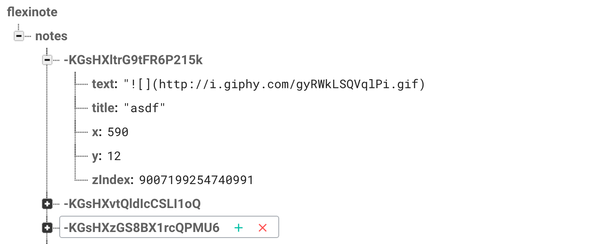

## React Notes + BAAS

Now that we have a working stand-alone app, we should connect it to backend to make it cool and collaborative. We need persistent storage to enable our notes to not go away on reload and to synchronize the notes across different instances of the app.

One way to add persistent storage is to use a backend as a service (BAAS) platform. Firebase is one such platform that provides a JSON based database ([Firebase Realtime Database](https://firebase.google.com/docs/database/)) that has some nice realtime properties. For instance you can subscribe to change events on collections of objects. Can we use Firebase with our React app?  You bet!


### Reminder of specs


* React + Firebase App:
  * Create a note:
    * can either be a single title input + create button
    * or a modal if you prefer with all fields
  * Delete a note
  * Move a note in x, y
    * optionally in z
  * Edit a note
  * **Persists all changes to Firebase in realtime**
  * **Updates based on Firebase events**


## Firebase


{: .fancy .small}


🚀 Create an account and new project at [firebase.google.com](https://firebase.google.com/).

You'll need to install firebase command line tools also:

```bash
npm install -g firebase-tools
```

Note: `-g` installs globally rather than in your project, so we're installing a command `firebase` to be available in your shell at anytime.

🚀 While we are at it let's add the firebase js library to your project:

```bash
npm install --save firebase
```

🚀 Now go to your project overview page

You'll need to grab the `config` part:

```javascript
// Set the configuration for your app
// TODO: Replace with your project's config object
var config = {
  apiKey: '<your-api-key>',
  authDomain: '<your-auth-domain>',
  databaseURL: '<your-database-url>',
  storageBucket: '<your-storage-bucket>'
};
firebase.initializeApp(config);

// Get a reference to the database service
const database = firebase.database();
```

Now the question is where shall we put all the various firebase related stuff?  How about a module of its own!

🚀 Create a file,  `firebasedb.js` in your `src/` directory. And since we're using npm to fetch the firebase SDK for us, just do `import firebase from 'firebase';` and you're all set to go!

My recommendation is to put all your firebase functions in this file and export them.  We briefly talked about ES6 modules.  Easiest way to make this module is to simply export every public function:

```javascript
export function fetchNotes(callback) { /* ... */ }
```

Hey, what's this `fetchNotes` function?!  Just something that might help!

You may also be wondering about the `apiKey` and putting that directly in your code.  That is indeed not ideal, however!  Our app is a frontend only app, we may be starting `webpack-dev-server` with `npm start` but our app is just some javascript that runs in the browser.  Which means we can't use environment variables or anything like that!   However, note that they key we have above is just an API key. This identifies our app to firebase but it doesn't necessary grant it any privileges.  We'll see shortly that Firebase actually wants users to be authenticated, and you will have control over what data is read/write access to your data.

Once you are ready to use these new functions you can just import it wherever you need it:

```javascript
import * as firebasedb from '../firebasedb'
// to get firebasedb.fetchNotes etc...
```


## Data Structure

Firebase stores everything as JSON — in fact the whole thing can be thought of as a JSON tree.  This works pretty well with how we've been thinking of our notes app data-structures.   Everything we needed we stored in a Map, which essentially is a javascript object called notes, with individual notes underneath it stored by key.  We created our own key but now Firebase will just handle all the data storage for us.   All we need to do is figure out how.


Here's what our data might look like in firebase:

{: .fancy .small}


## Authentication


By default Firebase only allows authenticated users access to the realtime database, so if we tried to read or write anything right now it would fail!

For now we aren't going to use authentication, but you can configure your app permissions to allow public read/write while testing.

🚀 Configure your Database rules to allow Public access [here](https://firebase.google.com/docs/database/security/quickstart#sample-rules)

Note: it is extra credit to add authentication for users to your app and not just allow anybody to post notes.


## Reading From Firebase

Firebase's realtime database is based on subscribing to events!  This should sound familiar.

In our case, since we are storing the full state of our notes in a top level notes state object, we should subscribe to the on value change Firebase event on all of notes.  This isn't always the best, in most cases you actually want to subscribe to things lower down in the tree.  For our app with a single board of notes though, we might as well subscribe to all the displayed notes.

Here's some [documentation](https://firebase.google.com/docs/database/web/retrieve-data#value_events).

What we'll want to do is at some point early on subscribe to `value` events on some top level key.  You can use `notes` for now, but if you want to do the extra credit of multiple boards and authentication, this would be unique for the particular *noteboard*.

```javascript
firebase.database().ref('notes').on('value', function(snapshot) {
  //
});
```

In our React App where is the right place to initiate retrieving values?

If you thought `componentDidMount()` you are exactly right!

🚀 Add a call from your App's `componentDidMount` method to a method in your firebase module. This method should take a callback as an argument!  This callback is critical as it is where you will take the results (the `snapshot`) and run `setState` in *App* with the results!

Your `componentDidMount()` function might look something like this:

```js
firebasedb.fetchNotes(notes => {
  this.setState({ notes: Immutable.Map(notes) });
});
```


To summarize,  your *App* will subscribe to `value` events on a Firebase database reference (`ref`). Whenever a note is updated in Firebase it will trigger the callback you provided.  Your callback will take this `snapshot` of data and set your normal React `notes` state to the new notes object!   Nice, immutable, and should just be a seamless retrofit.


## Writing Data To Firebase


We have a few methods so far that set state:

* create new note
* update note
* delete note


We've been using Immutable.js methods for our state changes, but now we need to push our note state up to Firebase rather than just dealing with it locally.   What we are going to do is instead of running `setState` on our local App component `notes` state,  we are instead going to just push our changes up to Firebase.  Then Firebase will essentially return a new notes state for us via the stuff we did above.  

Let's write these functions in our firebase module to do these ops.

Here are the docs for [saving data in Firebase](https://firebase.google.com/docs/database/web/save-data).

The basic idea is that we get our database reference like above (we could save the reference globally within our firebase module also), and then either we `push` a new note onto it,  or we use `update` to change some fields, or we call `remove` on it.

Since we already have access to the `id` which is the `key` for each object in our `notes` reference.  It should be as simple as:

```javascript
firebase.database().ref('notes').child(id).remove(); // update similarly
// push doesn't take an id, but returns a new auto-generated one
```


## That's Pretty Much It

Test it out!  Open multiple browsers and see how adding and moving notes in one instantly reflects in the other.  Pretty cool.  Now try some extra credit!  Since HW3 is broken up into 2 parts, you have twice the potential extra credit!  So up to 20% of the total.

### To Turn In

1. GitHub repository URL to your firebase branch
1. your working domain name URL deployed on surge.sh or firebaseapp.com
  * deploy only the firebase branch, no need to have both branches hosted.
1. App should have all the requirements from [Part 1](../hw3p1#to-turn-in) with the addition of:
  * Persists data to Firebase
  * Updates from changes in Firebase


### Extra Credit

* Support multiple note boards. This could be implemented by adding route handling to your App where http://localhost:8080/boards/:id would load the particular board references by the id in the url.
* Add in authentication with Firebase Users. We haven't covered authentication but Firebase provides a [nice auth api](https://firebase.google.com/docs/auth/).
* Allow users to sign-up and then create and manage multiple boards!  Can show list of boards as dropdown or as a meta-board of clickable notes!
* Live editing -- showing which user is editing which note!
