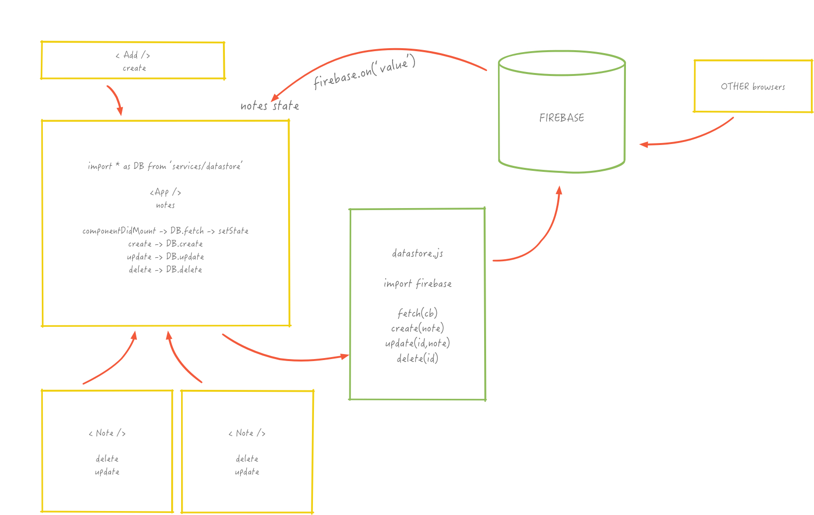
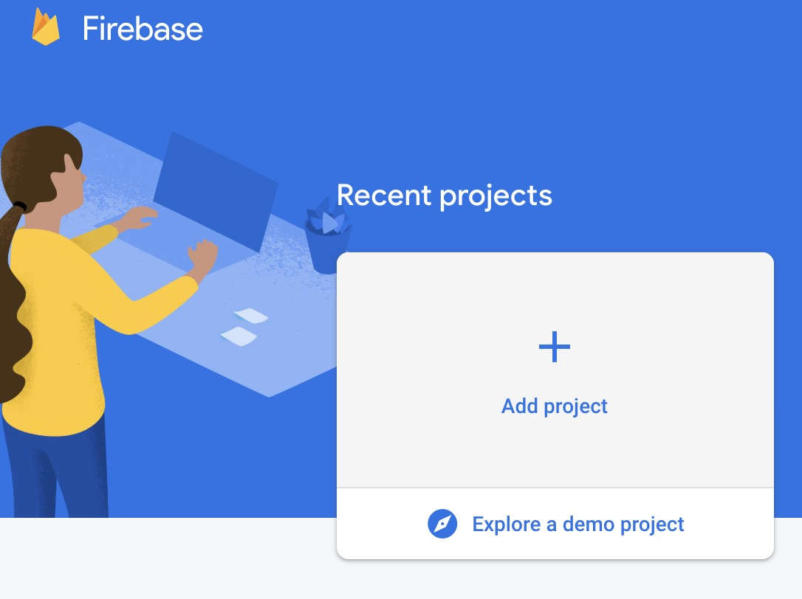
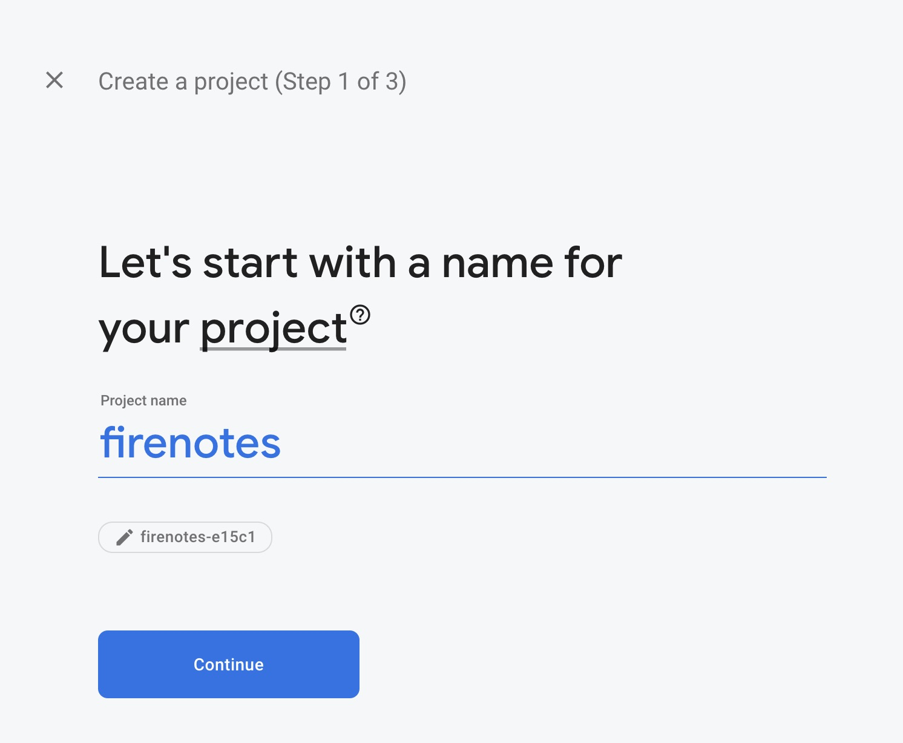
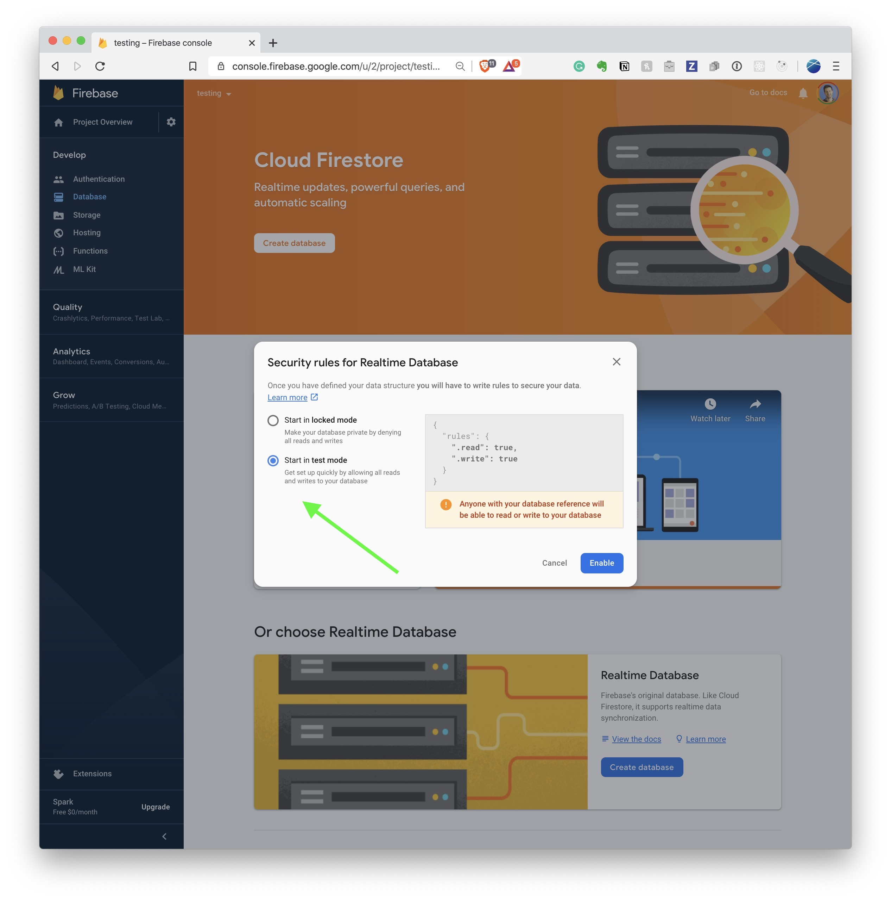

## React Notes


Where we dive deeper into React and construct a realtime collaborative post-it note app with React!

<video loop autoplay mute controls>
  <source src="http://res.cloudinary.com/dali-lab/video/upload/ac_none,w_800,h_510/v1546203223/cs52/live-notes-1080p.webm" type="video/webm"/>
  <source src="http://res.cloudinary.com/dali-lab/video/upload/ac_none,w_800,h_510/v1546203223/cs52/live-notes-1080p.mp4" type="video/mp4"/>
  <source src="http://res.cloudinary.com/dali-lab/video/upload/ac_none,w_800,h_510/v1546203223/cs52/live-notes-1080p.ogv" type="video/ogg"/>
  Your browser does not support HTML5 video tags
</video>


### Part 1

We will start with a version of the app that does not have a backend,  it'll use state for notes but if you refresh the page all your hard work will disappear — and it'll only work in one browser window.

### Part 2

Then we will add in Firebase for persistent storage. Firebase is a backend as a service (BAAS). It provides a simple JSON data store ([Firebase Realtime Database](https://firebase.google.com/docs/database/)) that has some nice realtime properties. You can subscribe to change events on collections of objects, this is perfect to use with React!

This will involve a small bit of refactoring, but will demonstrate how you can prototype frontend and then add in server side later. 

In this version your notes will persist and will synchronize in real-time so multiple people can collaborate.

## Let's Start

🚀 To start grab the github classroom link to start a new repository.  Then you'll pull in your webpack+babel+eslint starter code like so:

```bash
#make sure you are in your project directory
git remote add starter your-starterpack-github-url
git pull starter main  # you may need --allow-unrelated-histories
```

```bash
# also don't forget to run:
npm install #to fetch all your webpack dependencies
```


## What are we building?!


{: .fancy }

A post it note style app where users can add notes, move them around, edit them, and delete them. This React app will use Firebase as it's backend to store collections of notes.  The position of notes will also be stored, so people in multiple browsers can edit and arrange them in realtime. The notes themselves will support markdown notation and editing.

For Part 1 the app will store state in memory only and won't use Firebase yet. But here are the overall specs of the full project.


### Minimal Functional Specs

* Notes App:
  * Add a note:
    * can either be a single title input + create button
    * or a modal if you prefer with all fields
  * Delete a note
  * Move a note in x, y
    * optionally in z *(zIndex)*
  * Edit a note:
    * title, content
  * Notes:
    * have title and content
    * display with some formatting
  * Persists all changes to Firebase in realtime
  * Updates based on Firebase events
  * is at least as stylish as these mockups

*Note: you are welcome to use CSS frameworks to help with styling (but be careful as the JS that comes with some of them does not play nice with react).*


### Plan


Ok, so what's the plan?

You tell me!

🚀 Sketch out the React components you will need.  You probably need a general *App* component to wrap everything, a *Note* component, a component for adding notes (say a text input bar similar to *SearchBar*!), and potentially other components.

🚀 Now that you've sketched out your components lets get started on a few of them.


Here's a good article on [Thinking in React](https://facebook.github.io/react/docs/thinking-in-react.html).


## App Component

The skeleton for this is already in the starter.  Does it need to be a smart component?   It depends on how you organize your components, but you could do something similar to SA4 where the *App* component holds most of the state.

Here is a test note that I used to start with with the minimal set of fields:

```javascript
{
  title: 'testing',
  text: 'I is a note',
  x: 400,
  y: 12,
  zIndex: 26,
}
```


## Immutable JS

{: .tiny}


Before we go on, we should talk about [Immutable.js](https://facebook.github.io/immutable-js/).  And immutable data structures in general!

We've discussed how mutable data structures can be dangerous and unpleasant — data changing without you knowing about, etc.  React is built around the idea that state in particular should be immutable.  You have **new** states, but you don't alter existing state.  As we dig deeper into react and functional programming we'll see the insistence on **pure** functions and immutable data more and more.

For this assignment we're going to play with a library for making our state immutable and easier to work with at the same time.

There are several reasons for this:

* in Part 2 we'll be handing over state to Firebase
  * so we are going to structure our data to make that easier / more similar to how firebase works.
* if you don't make sure it is immutable, you might accidentally mutate it — `this.setState({foo: this.state.foo++})` even for a tiny moment,  the old state was modified before it was reassigned which can cause all sorts of bugs.
* cleaner api

Feel free to peruse the Immutable.js [docs](https://facebook.github.io/immutable-js/) for more info on how and why it is cool.

🚀 Install Immutable.js

```javascript
npm install immutable

// import { Map } from 'immutable';
// remember ^ is deconstrution - importing 1 key from a dictionary
```

Here is what I recommend you do for your *App* component state initialization:

```javascript
// in App constructor
  this.state = {
    notes: Map(),
  };
```

You might ask, why not make notes a list?

Good question! We are going to use an immutable map for a couple of reasons:

* this will make deletion and updating quicker as *O(1)* hashmap lookups rather than linear list traversal
* a dictionary/hashmap/object is the format that Firebase will give us later so it will make refactoring our code in Part 2 much easier
* the API for Immutable.js is a pleasure to work with and will make our code cleaner!
* later when we start really using a lot of app state, we'll need immutable to save us from making mistakes


## Notes State


Our main state object (note you may have additional components that have local state for things like editing or driven fields) is going to be an `Immutable.Map` that looks something like this:

```javascript
{
  id: {
    title: '',
    text: '',
    x: 0,
    y: 0,
    zIndex:0,
  },
  id2: { ... },
}
```

An object with unique note `id`s for the keys and note objects as values.  Since `id` is not inside of the note object this will require a couple of workarounds, but in general is a common way of storing things in a JSON.  You are welcome to duplicate the `id` inside of the note object also if you find that easier.

In Part 2 we will be getting something like this from Firebase:

{:  .tiny }

But for now let's worry about our own state — We'll do Firebase later.

Wait, but where do the unique note `id`s come from?  Eventually they'll be generated by Firebase or our own database, but for now we can just use an integer counter.  This is [not good practice](https://medium.com/@robinpokorny/index-as-a-key-is-an-anti-pattern-e0349aece318?source=linkShare-6b351af67702-1488669847) because if you have clashes in keys you can and will get weird behavior as react can't tell the elements apart. Again - once we move to using a database unique keys will be generated for us. Here's a good explanation of why [unique and unchanging keys are necessary](https://stackoverflow.com/questions/28329382/understanding-unique-keys-for-array-children-in-react-js#answer-43892905).


## Immutable JS & You

Here's some tips about dealing with a few different cases and how Immutable.js is going to help us.

We'll be using the Map type, which gives us a hashmap as you would expect, except that all the functions on it return a new cloned Map with the changes rather than mutating the original. The docs for this are [here](https://immutable-js.github.io/immutable-js/docs/#/Map)


**Deletions**:

Immutable.js provides a [`delete`](https://immutable-js.github.io/immutable-js/docs/#/Map/delete) method that takes an ID and spits back a new Map. Here's an example of using it for setting a new notes state on deletion of a note.

```javascript
//note the parens which are shorthand for return
this.setState(prevState => ({
  notes: prevState.notes.delete(id),
}));
```

*Note: in the above we are using function setState rather than object setState. We are passing in an arrow notation function which is called with previous state and it returns new state. This is [often preferred](https://medium.freecodecamp.org/functional-setstate-is-the-future-of-react-374f30401b6b) for clarity and consistency.*

If we were to do this with a plain array we might do `find` or a loop, or best case a `filter` like so: `this.states.notes.filter( note => { note.id !== id })`. For now we'll use Immutable.js though.


**Additions**:

Immutable.js provides a nice [`set`](https://immutable-js.github.io/immutable-js/docs/#/Map/set) method that returns a new Map with the new key inserted / set (can override existing keys).

```javascript
this.setState(prevState => ({
  notes: prevState.notes.set(id, note),
}));
```

If we were to do this with a plain array it wouldn't be too bad, something like `[...this.state.notes, newNote]`, but if we were to do this with a javascript object, we'd first need to clone the object, which can get tricky for nested objects.

Here is how you could shallow clone an object:

```javascript
// newNote = { title: '', etc }
const newNotes = {...this.state.notes, newNoteID: newNote};
```

Confused?  This uses spread notation to copy out all the top level keys from the previous notes into the new `{}` object!  However, it only does the top level properties, so each nested object is still a reference rather than clone.  Deep cloning is hard and slow if you are doing it manually.  Immutable.js makes it speedy and clean!

Great, now that you know how to clone an object we'll do that for updating a note!

**Updates**:

Immutable.js provides an [`update`](https://facebook.github.io/immutable-js/docs/#/Map/update) method, but there is a slight trick to it.  It expects a function that will update the passed in value.  Now that we know how to take an object and merge properties on it we can use that as our update function:

```javascript
this.setState(prevState => ({
  notes: prevState.notes.update(id, (prevNote) => { return {...prevNote, ...newNoteProperties},
}));
```

### More Immutable

If you are iterating through your Map (yup it is iterable), you might find that you need to extract both the key (the id) and the value (the note).  

Immutable.js has a nice [`entrySeq()`](https://facebook.github.io/immutable-js/docs/#/Map/entrySeq) method that allows you to do just that. It returns a list of tuples `[id, note]` so you can use the array function [map](https://developer.mozilla.org/en-US/docs/Web/JavaScript/Reference/Global_Objects/Array/map) over that and return the instantiation of a note component for instance.

```javascript
notes.entrySeq().map(([id, note]) => {
  // perhaps you might return some jsx here :-)
  // <Note id={id} note={note} ... for instance maybe
});
```

*Note: if we were mapping over a regular array as you may sometimes want, remember that `entrySeq` only pertains to Immutable.js map objects, not regular JS objects/arrays.*

## Note Component

You will probably need a *Note* component.  What might a *Note* do?

* A Note:
  * displays title
  * displays content
  * is draggable
  * is editable
  * is deletable


{: .fancy .tiny }


## Displaying Title and Content

Is left as an exercise for the reader. 😡

### Dragging

Dragging is a bit tricky, but you can simplify your life by using a component from the onlines.  I recommend [react-draggable](https://github.com/mzabriskie/react-draggable). *(remember we are using `npm` for package dependencies)*

The basic idea is that you would import this new component just like you have been with your own components and then it has some props that you pass into it for configuration.

Here is an example:

```html
  <Draggable
    handle=".class-of-note-mover-element"
    grid={[25, 25]}
    defaultPosition={ {x: 20, y: 20} }
    position={ {x: onYou_X, y: onYou_Y, width: onYou_width, height: onYou_height} } 
    onStart={this.handleStartDrag}
    onDrag={this.handleDrag}
    onStop={this.handleStopDrag}
  >
    <div>
      YOUR ACTUAL NOTE HERE
      title, content, drag handle etc
    </div>
  </Draggable>
```

The way to use this component is to wrap whatever JSX you want in your *Note* render method in `<Draggable>`.

Note the 3 callbacks.  `handleStart`, `handleDrag`, `handleStop`.   You would use these to drive the position of the note.  You'll want the position to be part of the note object as eventually we will synchronize using a cloud component.  You may find that you only need to implement `handleDrag`.

In particular, Draggable will call the function **you** provide to `onDrag` with two arguments, let's call them `(e, data)`.  Just to save you some digging, `data` will have x and y components so you can extract them and use them for your `note.position` state.

Here's a potential component hierarchy you could end up with:

```html
<Note>
  <Draggable>
    <div><!--note display stuff--></div>
  </Draggable>
<Note>
  <Draggable>
    <div><!--note display stuff--></div>
  </Draggable>
</Note>
```

Note:  this is not how any of your render methods would be, this is just an illustration of how the output might appear to help conceptualize where *Draggable* fits into the picture.


## Delete

Delete is fairly straightforward, you would have some clickable element assigned a callback that would be passed up to trigger a delete. I used some [font-awesome free webfont css](https://fontawesome.com/start) icons. *Note: alternatively you can use [react-fontawesome](https://github.com/FortAwesome/react-fontawesome)*

```html
<i onClick={this.handleDeleteClick} className="fa fa-trash-o" />
```

### Accessibility 

If you tried the line above you may have found that you got a bunch of [a11y](https://www.a11yproject.com/) errors. These are errors related to accessibility, trying to help developers create code that is compatible with various accessibility technologies such as screen readers. The errors here in particular are:

* [no static element interactions](https://github.com/jsx-eslint/eslint-plugin-jsx-a11y/blob/master/docs/rules/no-static-element-interactions.md) if you have an `onClick` you need to also specify the `role` for click. Is it a button? A link? Other? There is no way for accessibility tools to determine from the generic element type what the purpose of the click is.
* [interactive supports focus](https://github.com/jsx-eslint/eslint-plugin-jsx-a11y/blob/master/docs/rules/interactive-supports-focus.md) specifies that clickable elements must be able to be tab-able to. 
* [control has associated label](https://github.com/jsx-eslint/eslint-plugin-jsx-a11y/blob/master/docs/rules/label-has-associated-control.md)

Please read these and fix the code based on what you find. You'll be guided through adding in several attributes to annotate interactive elements in such a way that screen readers can understand how to present them.

## Edit


There are several ways to implement this.  You could have a button that opens up a modal, or you could do in-place editing, switching out the display JSX for an editing box.

Here's some tips!  For in-place, I would recommend having a boolean in your local component state, something like `isEditing` and then in your render function simply switch out which you are displaying based on that state.  

Here is a common pattern for having clean and readable `render()` functions:

```javascript
renderSomeSection() {
  if (this.state.isEditing)
  {
    return <div>editing!</div>
  } else {
    return <div>the usual stuff</div>
  }
}

render() {
  return (
    <div>
      {this.renderSomeSection()}
    </div>
  );
}

```

{: .fancy .tiny }


### Markdown

For markdown support in the main text portion of the note, you can use the [react-markdown](https://github.com/remarkjs/react-markdown) package.

```javascript
import ReactMarkdown from 'react-markdown'

// then just use something like this where you need it!
  <ReactMarkdown>{this.props.note.text || ''}</ReactMarkdown>
```
Once you have this working you can test with some markdown syntax!

```javascript
{
 0: {
   title: 'testing',
   text: '',
   x: 400,
   y: 12,
   zIndex: 10,
 },
 1: {
   title: 'headings',
   text: '# large ',
   x: 300,
   y: 300,
   zIndex: 20,
 }
}
```


### Editable Textarea

If you want your text area expandable here's a nice module:  [react-textarea-autosize](https://github.com/andreypopp/react-textarea-autosize).  Quite easy — so you don't have to expand the textarea as you type.


## Part 1 testing

Ok, at this point you should have an app where you can add notes, move them around, edit them, but when you reload the page it all disappears.  Test it out, make sure it all works before you move on!  


# Part 2

{:  .large}


Now that we have a working stand-alone app, we should connect it to backend to make it cool and collaborative. We need persistent storage to enable our notes to not go away on reload and to synchronize the notes across different instances of the app.

One way to add persistent storage is to use a backend as a service (BAAS) platform. Firebase is one such platform that provides a JSON based database ([Firebase Realtime Database](https://firebase.google.com/docs/database/)) that has some nice realtime properties. For instance you can subscribe to change events on collections of objects. Can we use Firebase with our React app?  You bet!

*Note: we'll be using Firebase Realtime Database for this rather than the newer Cloud Firestore, although both would work for our purposes.*


### Reminder of specs


* Notes App:
  * Add a note:
    * can either be a single title input + create button
    * or a modal if you prefer with all fields
  * Delete a note
  * Move a note in x, y
    * optionally in z *(zIndex)*
  * Edit a note
    * title, content
  * Notes:
    * have title and content
    * display with some formatting
  * **Persists all changes to Firebase in realtime**
  * **Updates based on Firebase events**


## Firebase


{: .fancy .small}


🚀 Create an account and new project at [firebase.google.com](https://firebase.google.com/).

{: .fancy .medium}

{: .fancy .medium}


🚀 Enable Realtime Database with public access

{: .medium}

{:  .medium}

By default Firebase only allows authenticated users access to the realtime database, so if we tried to read or write anything right now it would fail!

For now we aren't going to use authentication, but you can configure your app permissions to allow public read/write while testing.

You can see other [sample rules](https://firebase.google.com/docs/database/security/quickstart#sample-rules), but for now public is what we will use.

Note: it is extra credit to add authentication for users to your app and not just allow anybody to post notes.


🚀 Let's add the firebase js library to your project:

```bash
npm install firebase
```

🚀 Now go to your *Project Overview* page -> *Add Firebase To Your App*

You'll need to grab the `config` part that looks something like (grab the whole object):

```javascript
// Set the configuration for your app
// TODO: Replace with your project's config object
var config = {
  apiKey: '<your-api-key>',
  authDomain: '<your-auth-domain>',
  databaseURL: '<your-database-url>',
  storageBucket: '<your-storage-bucket>'
  projectId: '<your-project-id>'
};
firebase.initializeApp(config);

// Get a reference to the database service
const database = firebase.database();
```

Now the question is where shall we put all the various firebase related stuff?  How about an es6 [module](https://www.sitepoint.com/understanding-es6-modules/) of its own!  The idea here is to create a wrapper module with several helpful functions that talk to firebase for us. Think of this as making your own little library of firebase related methods - fact we'll just abstract it out into something we'll consider our datastore.

🚀 Create a file,  `datastore.js` in a `src/services` directory. And since we're using `npm` to fetch the firebase SDK for us, just do `import firebase from 'firebase';` and you're all set to go!

My recommendation is to put all your firebase functions in this file and export them.  We briefly talked about ES6 modules.  Easiest way to make this module is to simply export every public function:

```javascript
export function fetchNotes(callback) { 
  //do something here
  //callback() when done
}
```

Hey, what's this `fetchNotes` function?!  Just something that might help!

You may also be wondering about the `apiKey` and putting that directly in your code.  That is indeed not ideal.  However, our app is a frontend only app, we may be starting `webpack-dev-server` with `npm start` but our app is just some javascript that runs in the browser.  Which means we can't use environment variables or anything like that!  Also, note that the key we have above is just an API key. This identifies our app to firebase but it doesn't necessary grant it any privileges.  We'll see shortly that Firebase actually wants users to be authenticated, and you will have control over what data is read/write access to your data if you did that.

Once you are ready to use these new functions you can just import it wherever you need it. In particular you would want to import these functions in your top level component where you have your note state related callbacks.

```javascript
import * as db from './services/datastore';
// to get db.fetchNotes etc...
```

*Note: if the linter complains about using default just add the other functions you'll probably need here. Like `updateNote`, etc.*

## Data Structure

Firebase stores everything as JSON — in fact the whole thing can be thought of as a JSON tree.  This works pretty well with how we've already been thinking of our notes app data-structures.   Everything we needed we stored in a Map, which essentially is a javascript object called notes, with individual notes underneath it stored by key.  We created our own key but now Firebase will just handle all the data storage for us. All we need to do is figure out how.


Here's what our data might look like in firebase:

{: .fancy .small}


## Reading From Firebase

Firebase's realtime database is based on subscribing to events!  This should sound familiar.

In our case, since we are storing the full state of our notes in a top level notes state object, we should subscribe to the on value change Firebase event on all of notes.  This isn't always the best, in most cases you actually want to subscribe to things lower down in the tree.  For our app with a single board of notes though, we might as well subscribe to all the displayed notes.

Here's some [documentation](https://firebase.google.com/docs/database/web/retrieve-data#value_events).

What we'll want to do is at some point early on subscribe to `value` events on some top level key.  You can use `notes` for now, but if you want to do the extra credit of multiple boards and authentication, this would be unique for the particular *noteboard*.

```javascript
firebase.database().ref('notes').on('value', function(snapshot) {
  const newNoteState = snapshot.val();
  // do something with new note state
});
```

In our React App where is the right place to initiate retrieving values?

If you thought `componentDidMount()` you are exactly right!

🚀 Add a call from your `App` `componentDidMount` method to a method in your datastore module. This method should take a callback as an argument!  This callback is critical as it is where you will take the results (the `snapshot`) and run `setState` in *App* with the results!

Your `componentDidMount()` function might look something like this:

```js
firebasedb.fetchNotes(notes => {
  this.setState({ notes: Immutable.Map(notes) });
});
```


To summarize,  your *App* will subscribe to `value` events on a Firebase database reference (`ref`). Whenever a note is updated in Firebase it will trigger the callback you provided.  Your callback will take this `snapshot` of data and set your React `notes` state to the new notes object!  Nice, immutable, and should just be a seamless retrofit.


## Writing Data To Firebase

We have a few methods so far that set state:

* create new note
* update note
* delete note

We've been using Immutable.js methods for our state changes, but now we need to push our note state up to Firebase rather than dealing with it locally.   What we are going to do is instead of running `setState` on our local App component `notes` state,  we are instead going to just push our changes up to Firebase!  Then Firebase will essentially return a new notes state for us via the stuff we did above.

Let's write these functions in our firebase module to do these ops.

Here are the docs for [saving data in Firebase](https://firebase.google.com/docs/database/web/save-data).

The basic idea is that we get our database reference like above (we could save the reference globally within our firebase module also), and then either we `push` a new note onto it,  or we use `update` to change some fields, or we call `remove` on it.

Since we already have access to the `id` which is the `key` for each object in our `notes` reference.  It should be as simple as:

```javascript
firebase.database().ref('notes').child(id).remove(); // update similarly
// ref('notes').push(newNote) doesn't take an id, but returns a new auto-generated one
```

## That's Pretty Much It

Test it out!  Open multiple browsers and see how adding and moving notes in one instantly reflects in the other.  Pretty cool!  Now try some extra credit!


### To Turn In

1. Canvas submission of GitHub repository URL **and** your deployed url (this makes us happier when grading).
1. App should have all the [minimal functional specs](#minimal-functional-specs)
  * have at least an App and Note component
  * ability to add notes to board
  * Notes should:
    * display title
    * display content
    * be draggable
    * be editable
    * be deletable
  * App should have at least the minimal styling of the mockups
1. your repo should include a README.md file with:
  * a couple sentence description about what you did
  * and what worked / didn't work
  * any extra credit attempted


### Extra Credit
*always mention your extra credit in the README.md file*

* Some method of note organization such as show-all.
* Come up with a way to deal with zIndex sorting:
  * when you drag your note does it go above or behind?
  * can you pop your note to the front when it is dragged?
  * reorder zIndex in other ways
* Resizable notes
* Undo feature
* Support multiple note boards. This could be implemented by adding route handling to your App where http://localhost:8080/boards/:id would load the particular board references by the id in the url.
* Add in authentication with Firebase Users. We haven't covered authentication but Firebase provides a [nice auth api](https://firebase.google.com/docs/auth/).
* Allow users to sign-up and then create and manage multiple boards!  Can show list of boards as dropdown or as a meta-board of clickable notes!
* Live editing -- showing which user is editing which note!
* Other!
