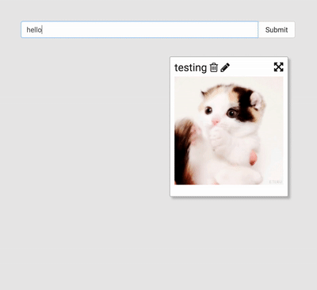
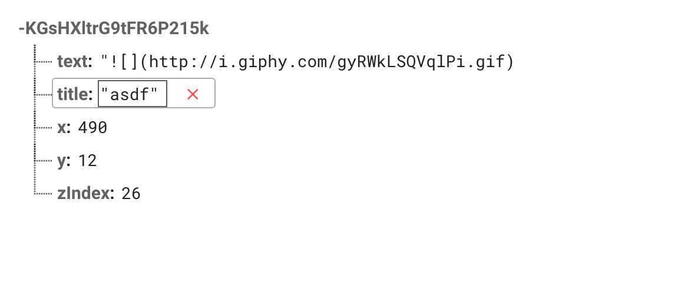

## All The React


Where we dive deeper into React and construct a realtime collaborative post-it note app with React!

{: .fancy .tiny}


### Part 1

We will start with a version of the app that does not have a backend,  it'll use state for notes but if you refresh the page all your hard work will disappear.

### Part 2 (later)

Then we will add in Firebase for persistent storage. Firebase is a backend as a service (BAAS). It provides a simple JSON data store ([Firebase Realtime Database](https://firebase.google.com/docs/database/)) that has some nice realtime properties. You can subscribe to change events on collections of objects,  this is perfect to use with React! We will talk about this in more detail when the time is right!


## Let's Start

🚀 To start you can clone [js-react-starter](https://github.com/dartmouth-cs52/js-react-starter). This is just the js-starter-workshop solution with a few added libraries and presets for React, you could also start from what you ended up with in SA4 if you preferred.  Remember to set up a separate personal github remote repo for this, and a separate hosting so that you don't overwrite your previous assignments.

```bash
# also don't forget to run:
npm install #to fetch all your webpack dependencies
```


## What are we building?!


{: .fancy }

A post it note style app where users can add notes, move them around, edit them, and delete them. This React app will use Firebase as it's backend to store collections of notes.  The position of notes will also be stored, so people in multiple browsers can edit and arrange them in realtime. The notes themselves will support markdown notation and editing.

For Part 1 the app will store state in memory only and won't use Firebase yet. But here are the overall specs of the full project.


### Minimal Functional Specs:

* Notes App:
  * Add a note:
    * can either be a single title input + create button
    * or a modal if you prefer with all fields
  * Delete a note
  * Move a note in x, y
    * optionally in z *(zIndex)*
  * Edit a note
  * Notes:
    * have title and content
    * display with some formatting
  * P2: Persists all changes to Firebase in realtime
  * P2: Updates based on Firebase events


### Plan


Ok, so what's the plan?

You tell me!

🚀 Sketch out the React components you will need.  You probably need a general *App* component to wrap everything, a *Note* component, a component for adding notes (say a text input bar similar to *SearchBar*!), and potentially other components.

🚀 Now that you've sketched out your components lets get started on a few of them.


Here's a good article on [Thinking in React](https://facebook.github.io/react/docs/thinking-in-react.html).


## App Component

The skeleton for this is already in the starter.  Does it need to be a smart component?   It depends on how you organize your components, but you could do something similar to SA4 where the *App* component holds most of the state.

Here is a test note that I used to start with with the minimal set of fields:

```javascript
{
  title: 'testing',
  text: 'I is a note',
  x: 400,
  y: 12,
  zIndex: 26,
}
```


## Immutable JS

{: .tiny}


Before we go on, we should talk about [Immutable.js](https://facebook.github.io/immutable-js/).  And immutable data structures in general!

We've discussed how mutable data structures can be dangerous and unpleasant — data changing without you knowing about, etc.  React is built around the idea that state in particular should be immutable.  You have **new** states, but you don't alter existing state.  As we dig deeper into react and functional programming we'll see the insistence on **pure** functions and immutable data more and more.

For this assignment we're going to play with a library for making our state immutable and easier to work with at the same time.

There are several reasons for this:

* in Part 2 we'll be handing over state to Firebase
  * so we are going to structure our data to make that easier
* if you don't make sure it is immutable, you might accidentally mutate it — `this.setState({foo: this.state.foo++})`f or a tiny moment,  the old state was modified before it was reassigned.
* cleaner api

Feel free to peruse the Immutable.js [docs](https://facebook.github.io/immutable-js/) for more info on how and why it is cool.

🚀 Install Immutable.js

```javascript
npm install --save immutable

// import Immutable from 'immutable';
```


Here is what I recommend you do for your *App* component state initialization:

```javascript
// in App constructor
  this.state = {
    notes: Immutable.Map(),
    //...
  };
```

You might ask, why not make notes a list?

Good question! We are going to use an immutable map for a couple of reasons:

* this will make deletion and updating quicker as *O(1)* hashmap lookups rather than linear list traversal
* a dictionary/hashmap/object is the format that Firebase will give us later so it will make refactoring our code in Part 2 much easier
* the API for Immutable.js is a pleasure to work with and will make our code cleaner!


## Notes State


Our main state object (note you may have additional components that have local state for things like editing or driven fields) is going to be an Immutable.Map that looks something like this:

```javascript
{
  id: {
    title: '',
    text: '',
    x: 0,
    y: 0,
    zIndex:0,
  },
  id2: { ... },
}
```

An object with unique note `id`s for the keys and note objects as values.  Since `id` is not inside of the note object this will require a couple of workarounds, but in general is a common way of storing things in a JSON.  You are welcome to duplicate the `id` inside of the note object also if you find that easier.

In Part 2 we will be getting something like this from Firebase:

{: .fancy .tiny }

But for now let's worry about our own state — We'll do Firebase later.

Wait, but where do the unique note `id`s come from?  Eventually they'll be generated by Firebase, but for now you could just number them as you create them.


## Immutable JS & You

Here's some tips about dealing with a few different cases and how Immutable.js is going to help us.

We'll be using the Map type, which gives us a hashmap as you would expect, except that all the functions on it return a new cloned Map with the changes rather than mutating the original. The docs for this are [here](https://facebook.github.io/immutable-js/docs/#/Map)


**Deletions**:

Immutable.js provides a [`delete`](https://facebook.github.io/immutable-js/docs/#/Map/delete) method that takes an ID and spits back a new Map. Here's an example of using it for setting a new notes state on deletion of a note.

```javascript
this.setState({
  notes: this.state.notes.delete(id),
});
```

If we were to do this with a plain array we might do `find` or a loop, or best case a `filter` like so: `this.states.notes.filter( note => { note.id !== id })`, please use Immutable.js.


**Additions**:

Immutable.js provides a nice [`set`](https://facebook.github.io/immutable-js/docs/#/Map/set) method that returns a new Map with the new key inserted / set (can override existing keys).

```javascript
this.setState({
  notes: this.state.notes.set(id, note),
});
```

If we were to do this with a plain array it wouldn't be too bad, something like `[...this.state.notes, newNote]`, but if we were to do this with a javascript object, we'd first need to clone the object, that gets tricky.

BTW: here is how you would shallow clone an object in es6:

```javascript
const newNotes = Object.assign({}, this.state.notes, newNote);
```

Confused?  This takes an empty object `{}` assigns the properties from `this.states.notes` to it, and also merges in the properties from `newNote`.  However it only does the top level properties, so each nested object is still a reference rather than clone.  Deep cloning is hard and slow if you are doing it manually.  Immutable.js makes it speedy and clean!


Great, now that you know how to clone an object we'll do that for updating a note!

**Updates**:

Immutable.js provides an [`update`](https://facebook.github.io/immutable-js/docs/#/Map/update) method, but there is a slight trick to it.  It expects a function that will update the passed in value.  Now that we know how to take an object and merrge properties on it we can use that as our update function:

```javascript
this.setState({
  notes: this.state.notes.update(id, (n) => { return Object.assign({}, n, fields); }),
});
```

### More Immutable

If you are iterating through your Map (yup it is iterable), you might find that you need to extract both the key (the id) and the value (the note).  

Immutable.js has a nice [`entrySeq()`](https://facebook.github.io/immutable-js/docs/#/Map/entrySeq) method that allows you to do just that.

```javascript
notes.entrySeq().map(([id, note]) => {
  // perhaps you might return some jsx here :-)
  // <Note id={id} note={note} ... for instance maybe
});
```


## Note Component

You will probably need a *Note* component.  What does a *Note* do?

* A Note:
  * displays title
  * displays content
  * is draggable
  * is editable
  * is deletable


{: .fancy .tiny }


## Displaying Title and Content

Is left as an exercise for the reader. 😄

### Dragging

Dragging is a bit tricky, but you can simplify your life by using a component from the onlines.  I recommend [react-draggable](https://github.com/mzabriskie/react-draggable).   

The basic idea is that you would import this new component just like you have been with your own components and then it has some props that you pass into it for configuration.

Here is an example:

```html
  <Draggable
    handle=".note-mover"
    grid={[25, 25]}
    defaultPosition={ {x: 20, y: 20} }
    position={position}
    onStart={this.onStartDrag}
    onDrag={this.onDrag}
    onStop={this.onStopDrag}
  >
    <div>
      YOUR ACTUAL NOTE HERE
      title, content, drag handle etc
    </div>
  </Draggable>
```

The way to use this component is to wrap whatever JSX you want in your *Note* render method in `<Draggable>`.

Note the 3 callbacks.  `onStart`, `onDrag`, `onStop`.   You would use these to drive the position of the note.  You'll want the position to be part of the note object as eventually we will synchronize using a cloud component.  

In particular, Draggable will call onDrag with two arguments, let's call them `(e, ui)`.  Just to save you some digging, `ui` will have x and y components so you can extract them and use them for your `note.position` state.

Here's a potential component hierarchy you could end up with:

```html
<Note>
  <Draggable>
    <div><!--note display stuff--></div>
  </Draggable>
<Note>
  <Draggable>
    <div><!--note display stuff--></div>
  </Draggable>
</Note>
```

Note:  this is not how any of your render methods would be, this is just an illustration of how the output might appear to help conceptualize where *Draggable* fits into the picture.


## Delete

Delete is fairly straightforward, you would have some clickable element assigned a callback that would be passed up to trigger a delete. I used some font-awesome icons:

```html
<i onClick={this.onDeleteClick} className="fa fa-trash-o" />
```

## Edit


There are several ways to implement this.   You could have a button that opens up a modal, or you could do in-place editing,  switching out the display JSX for an editing box.

Here's some tips!  For in-place, I would recommend having a boolean in your local component state, something like `isEditing` and then in your render function simply switch out which you are displaying based on that state.  

Since login inside of the render function directly can be messy here is a common pattern:

```javascript
renderSomeSection() {
  if (this.state.isEditing)
  {
    return <div>editing!</div>
  } else {
    return <div>the usual stuff</div>
  }
}

render() {
  return (
    <div>
      {this.renderSomeSection()}
    </div>
  );
}

```

{: .fancy .tiny }


### Markdown

For markdown support in the main text portion of the note, just use the [marked](https://github.com/chjj/marked) package.

There's a tiny trick for this in React, so I'll just show it here:

```javascript
// don't forget to import marked from 'marked'

<div className="noteBody" dangerouslySetInnerHTML={{ __html: marked(this.props.note.text || '') }} />
```

The idea being that React typically wants to protect you from just setting arbitrary html to the output of some function, but there is an override. Remember even though `div` it is a standard html element in React it is also a component.  The component has a prop `dangerouslySetInnerHTML`  which will set the contents to whatever you pass into it.

Once you have this working you can test with some markdown syntax!

```javascript
{
  id: 0,
  title: 'testing',
  text: '',
  x: 400,
  y: 12,
  zIndex: 10,
},
{
  id: 1,
  title: 'headings',
  text: '# large ',
  x: 300,
  y: 300,
  zIndex: 20,
}
```


### Editable Textarea

If you want your text area expandable here's a nice module:  [react-textarea-autosize](https://github.com/andreypopp/react-textarea-autosize).  Quite easy — so you don't have to expand the textarea as you type.


## To Turn In

1. GitHub repository URL (should be public so we can see it)
1. your app url hosted somewhere (github pages or surge.sh)
1. App should:
  * have at least an App and Note component
  * ability to add notes to board
1. Notes should:
    * display title
    * display content
    * be draggable
    * be editable
    * be deletable
1. your repo should include a README.md file with:
  * a couple sentence description about what you did
  * and what worked / didn't work
  * any extra credit attempted

### Extra Credit

* Make your notes extra pretty
* Snap to grid / organize
* Come up with a way to deal with zIndex sorting:
  * when you drag your note does it go above or behind
  * can you pop your note to the front when it is dragged
  * reorder zIndex in other ways
* Resizable notes
* Undo feature
* Other!
