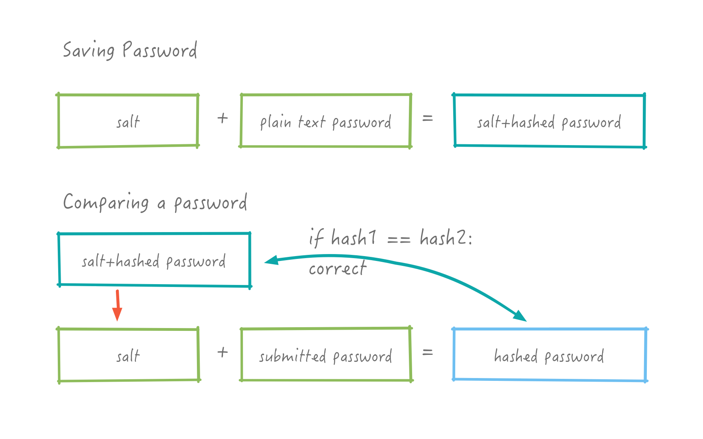
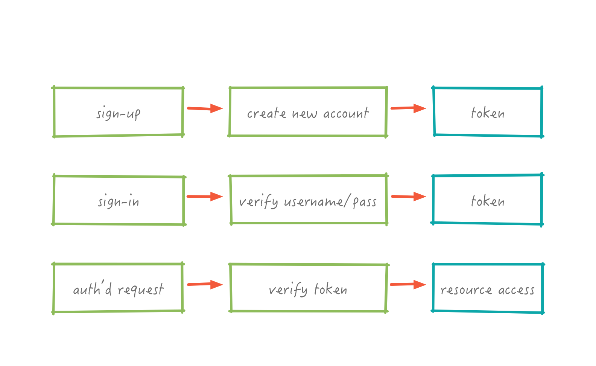
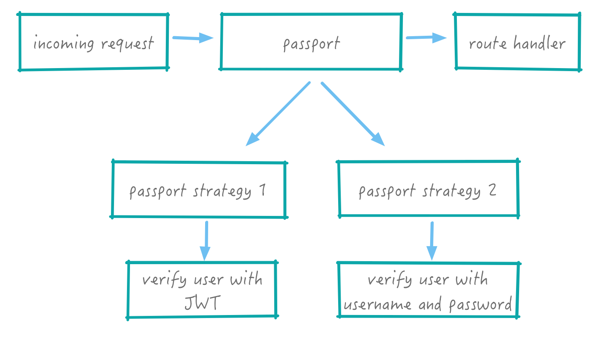
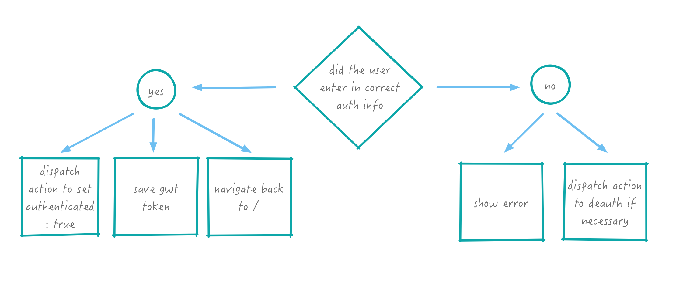

## Blog: Authentication


For this assignment we are going to build an [express](https://expressjs.com/) and [mongodb](https://www.mongodb.com/) CRUD api server for our react+redux blog frontend. This will finally bring our stack all the way down to the database. In this part we're going to be adding in Authentication!

## Assignment At a Glance

* Part 2:
  * Authentication: We'll extend both our frontend and our backend to support authentication and users!

On the frontend we'll want to add a place for users to sign in.  We'll create a `/signin`, `/signup`, and `/signout` routes and add a way to restrict access to certain routes based on authentication.   We'll do this by designing our own higher order component, similarly to how the redux `connect` method works.

On the api server,  we're going to also add `/signin` and `/signup` routes that will connect to a new User model and Controller.  We will also use [Passport.js](http://passportjs.org/) to make JWT's for us.  


## Some Setup

We'll just continue working on the same code from Lab5 part1.

We're going to do a new thing with our git repos. We're going to `tag` a certain revision so you'll know where you started on part 2.

🚀 Go into your Lab5 directory and run:

```bash
git tag v1
git push origin --tags
```

🚀 Go into your Lab4 directory and run:

```bash
git tag v1
git push origin --tags
```

Great, now you can always remember where you veered off course and made this terrible decision to add authentication to your lovely blog.

You will end up with 3 server urls at the end of this: A surge url for loading the frontend, a herokuapp url for the api server, and a mLabs mongo databaase url (which we won't need to actually know but heroku will automatically help connect to).  

We'll be working on both the api server and frontend app.

## Secret Key

For signing our JWT's on the **server side** we'll need a secret key.  Might as well set that up now.

We'll need to create an `AUTH_SECRET` environment variable with some long random string (any characters).

Use the [`dotenv`](https://www.npmjs.com/package/dotenv) module to import it into your code. IE. Save `AUTH_SECRET="somerweklhjhdf9879av8v928cjka asdflkaj889"` into a `.env` file that you do not add to git (add .env to your .gitignore file).

Then in your code wherever you need the secret you can use:

```javascript
import dotenv from 'dotenv';
dotenv.config({ silent: true });

// and then the secret is usable this way:
process.env.AUTH_SECRET
```

Note: during deployment for Heroku you'll need to add `AUTH_SECRET` to your config variables in Settings!

## API Server Auth support

Let's start adding authentication support to the api server.

### User Model

To start with, we want to add Users. This means we'll need a User model.

🚀 You know models from P1, oh yes you do.  Create a `models/user_model.js` file.  It will be set up identically to your Post model (ie. copy and refactor), but with the following fields:

```javascript
email: { type: String, unique: true, lowercase: true },
password: { type: String } //, select: false },
```  

For now we won't store anything else in the User model, but you may eventually want to add to this. `select: false` makes it so the password isn't returned in queries by default.

Might as well add in:

```javascript
UserSchema.set('toJSON', {
  virtuals: true,
});
```

This provides a mapping to `id` from `_id`, since you might need that later if you want to link to users.

####  Salt + Hash

Remember how we planned on saving our passwords?

{: .medium .fancy }

Now we get to implement that!

🚀 We're going to use the [`bcryptjs`](https://github.com/dcodeIO/bcrypt.js) module for this. So you should `yarn add bcryptjs` now and import it.

#### Saving Salt+Hash

For saving the password,  we're going to need a utilize a mongoose [pre save hook](http://mongoosejs.com/docs/middleware.html#pre). This is a bit tricky.   We define a function that will be called when the User object is saved.  It will then take the plain text password and generate a salt and hash the password and save the salt+hash instead.

The general syntax for the pre-save hook is:

```javascript
yourModelSchema.pre('save', function beforeyYourModelSave(next) {

  // this is a reference to our model
  // the function runs in some other context so DO NOT bind it
  const model = this;


  //TODO: do stuff here

  // when done run the next callback with no arguments
  // call next with an error if you encounter one
  // return next();

});
```

For the [`bcryptjs`](https://github.com/dcodeIO/bcrypt.js) part what we'll want to do first is generate a salt and then use that salt to hash our password.  Take a look at the docs, there's a few ways to do it. `10` (the default) is fine for the number of rounds.

🚀 use the above to parts to construct a method for:  `userSchema.pre('save', function beforeUserSave(next) {`.  Don't forget that you'll need to set `user` to `this` at the top.


🚀 Generate a salt and then hash `user.password` with the salt.

🚀 Set the user.password to the hash and `return next()` which will allow the hook to proceed.

```js
// overwrite plain text password with encrypted password
user.password = hash;
return next();
```

But wait, won't this update every single time we save the user?  Yes, that might not be ideal if later we want to add in new fields and such!

Luckily, you can add a check to see if the  `password` field is being updated or not at the top:

```javascript
// only hash the password if it has been modified (or is new)
if (!user.isModified('password')) return next();
```
Great, now we've got the first part down, how about comparing.

#### Comparing Salt+Hash

This will be a little different. We want to add a method to our model to support comparing.  It is possible to [add methods to a schema](http://mongoosejs.com/docs/guide.html#methods) in Mongoose.

🚀 We need to add a method that takes a `candidatePassword` and a callback.  The callback arguments are `(error, result)` so you just have to make sure to return `(null, result)`.

```javascript
//  note use of named function rather than arrow notation
//  this arrow notation is lexically scoped and prevents binding scope, which mongoose relies on
UserSchema.methods.comparePassword = function comparePassword(candidatePassword, callback) {

  //return callback(null, comparisonResult) for success
  // or callback(error) in the error case

};
```

This is slightly adapted for es6 from stackoverflow [mongoose-password-hashing](http://stackoverflow.com/questions/14588032/mongoose-password-hashing).


### User Controller

Let's add an new User controller!  

🚀 Create a `controllers/user_controller.js`.

To encode and decode our JWT's we're going to use the [`jwt-simple`](https://github.com/hokaccha/node-jwt-simple). Go ahead and yarn add it and import it: `import jwt from 'jwt-simple';`

🚀 Also import our new User model and dotenv!

The controller has functions that we call for express routes. We are going to add 2 new routes `/signin` and `/signup`, so lets create function headers for those:


```javascript

export const signin = (req, res, next) => {
}

export const signup = (req, res, next) => {
}
```

When we generate a new JWT we need to simply encode a particular bit of json.  This json has particular recommended fields which we'll use. We'll use `sub` for the userid and `iat` for the issued at timestamp.  We'll just create a helper function for this:

```javascript
// encodes a new token for a user object
function tokenForUser(user) {
  const timestamp = new Date().getTime();
  return jwt.encode({ sub: user.id, iat: timestamp }, process.env.AUTH_SECRET);
}
```

What should our two methods do?

{: .small .fancy }

For `signin`, once we have verified username/password we can just generate a new token. We're going to do the verification with a passport middleware, so our `signin` function will already be protected -- all it has to do is return a new token.

```javascript
res.send({ token: tokenForUser(req.user) });
```

For `signup`, it will be a bit more complicated. We need to create a new User object and save it, but first we need to verify that the user doesn't already exist in the system (check their email address).

First, let's grab email and password and check them (this is inside the `signup` function):

```javascript
const email = req.body.email;
const password = req.body.password;

if (!email || !password) {
  return res.status(422).send('You must provide email and password');
}

// 🚀 TODO:
// here you should do a mongo query to find if a user already exists with this email.
// if user exists then return an error. If not, use the User model to create a new user.
// Save the new User object
// this is similar to how you created a Post
// and then return a token same as you did in in signin
```

We're doing an early return here with an error status and an error message.  You don't have to implement displaying these now, but this is one way to implement server side validation. Note the 422 is a status code, there are [lots of different status codes](http://www.restpatterns.org/HTTP_Status_Codes) to choose from, but is usually up to your client to interpret anyway.

Ok, now we have our controller and model done.  We need one more module. A module that will provide passport authentication services to the rest of the app.

### Passport Service

{: .tiny .fancy }


We're going to use more npm modules! Yay!

```bash
yarn add passport passport-local passport-jwt
```

We'll be using [Passport.js](http://passportjs.org/) to provide authentication services.  Passport gives us multiple authentication "strategies".  We'll use `passport-local` for authenticating with username and password, and `passport-jwt` for using JWT's.


{: .small .fancy }


🚀 Create a directory and file: `services/passport.js`.

```javascript
//lets import some stuff
import passport from 'passport';
import LocalStrategy from 'passport-local';
import { Strategy as JwtStrategy, ExtractJwt } from 'passport-jwt';

// and import User
import User from '../models/user_model';

// options for local strategy, we'll use email AS the username
// not have separate ones
const localOptions = { usernameField: 'email' };

// options for jwt strategy
// we'll pass in the jwt in an `authorization` header
// so passport can find it there
const jwtOptions = {
  jwtFromRequest: ExtractJwt.fromHeader('authorization'),
  secretOrKey: process.env.AUTH_SECRET,
};


// username + password authentication strategy
const localLogin = new LocalStrategy(localOptions, (email, password, done) => {
  // should find user by email and check password
});

const jwtLogin = new JwtStrategy(jwtOptions, (payload, done) => {
  //is called with confirmed jwt we just need to confirm that user exits
});

// Tell passport to use this strategy
passport.use(jwtLogin);
passport.use(localLogin);


export const requireAuth = passport.authenticate('jwt', { session: false });
export const requireSignin = passport.authenticate('local', { session: false });

```

For `localLogin` we need to run the `comparePassword` function that we wrote earlier. Here's the `localLogin` function in the interest of time:

```javascript
const localLogin = new LocalStrategy(localOptions, (email, password, done) => {
  // Verify this email and password, call done with the user
  // if it is the correct email and password
  // otherwise, call done with false
  User.findOne({ email }, (err, user) => {
    if (err) { return done(err); }

    if (!user) { return done(null, false); }

    // compare passwords - is `password` equal to user.password?
    user.comparePassword(password, (err, isMatch) => {
      if (err) {
        done(err);
      } else if (!isMatch) {
        done(null, false);
      } else {
        done(null, user);
      }
    });
  });
});
```

Read through the above, make sense?


For `jwtLogin`, we are given the payload of the passed in JWT. We need to check the userid and return the found user.  Want to give this one a shot?

```javascript
const jwtLogin = new JwtStrategy(jwtOptions, (payload, done) => {
  // See if the user ID in the payload exists in our database
  // If it does, call 'done' with that other
  // otherwise, call done without a user object
  User.findById(payload.sub, (err, user) => {
    if (err) {
      done(err, false);
    } else if (user) {
      done(null, user);
    } else {
      done(null, false);
    }
  });
});
```

Note, that many mongoose functions return a null object rather than an error — hence we have to check that.  `done` is the callback and has the form `done(error, value)` as is fairly common with some JS libraries.

How does this all fit together?

### Authentication Routes

Now that we have all the required parts, we are ready to tie it all together with Routes!  

🚀 Edit your `router.js` file:

```javascript
// our imports as usual
import * as UserController from './controllers/user_controller';
import { requireAuth, requireSignin } from './services/passport';
```

🚀 Let's add in the `/signin` route.  Note the `requireSignin`. This is the passport middleware. It makes this route protected by the password+username strategy we defined in our passport.js file. Only once the user is authenticated via that method, will it allow the `UserController.signin` function to run.

```javascript
router.post('/signin', requireSignin, UserController.signin);
```

🚀 And add in the `/signup` route.

```javascript
router.post('/signup', UserController.signup);
```

Both of these are POSTs so from our frontend we will need to pass them data.

🚀 What other routes should be we protect?  For now let's use `requireAuth` to protect `createPost`, `updatePost`, and `deletePost`. As easy as:  `.post(requireAuth, Posts.createPost)`

Try a `curl`  post to create a new post, you should get an unauthorized error!

Let's get a JWT we could use:

```bash

# try to signup
curl -X POST -H "Content-Type: application/json" -d '{"email": "test@test.com","password": "password"}' "http://localhost:9090/api/signup"

# then try to signin
curl -X POST -H "Content-Type: application/json" -d '{"email": "test@test.com","password": "password"}' "http://localhost:9090/api/signin"

# try posting!
curl -X POST -H "Content-Type: application/json" -H "Authorization: JUST_THE_LONG_TOKEN_STRING" -d '{"title": "test","tags": "sometag","content": "this is a test post"}' "http://localhost:9090/api/posts"

```

Done!  You now have an API server that supports authentication. This is fairly rudimentary, but you can expand on this. For instance you can make sure that a user can only update their own posts (just save the userID along with the post).  Within `post_controller.js` for any route that is protected by `requireAuth` you will now have a `req.user` object.  Nice!

🚀 Might as well just add in recording who the author is with each post now.  Edit your `post_model.js` file and add in this field to your schema:  `author: { type: Schema.Types.ObjectId, ref: 'User' },`.  We are saying that the author field is now a reference to a User.   We can later get this value automatically filled for us or can use the id to look up the author using [`populate`](http://mongoosejs.com/docs/populate.html).

🚀 Don't forget to update your controller to utilize this new field.

Now when you make new posts, here's what your mongo database entry will look like:

```javascript
{ "_id" : ObjectId("57a94e206ec5eae238e359f8"), "author" : ObjectId("57a94813e4c55bb432fc3a4d"), "content" : "this is a test post", "tags" : "words", "title" : "first post MORE TESTING", "__v" : 0 }
```

You can also have arrays of objectIds.  This might come in handy if you are trying to model other types of relationships. But it might also be that if your relationships between objects are getting complex you need to rethink how you are storing things.


##  Frontend Authentication

Ok,  so now we should update our frontend to support authentication too right?  YES!

### Frontend Auth Summary

1. Add in new authentication actions and reducer
1. Add in `/signin`, and `/signup` routes
  * these routes will need associated components
1. Modify NavBar with links and signout functionality
1. Create a new higher order component to allow us to require auth on any frontend components

### Actions

{: .small .fancy }


🚀 Add in 3 new action types:

```javascript
AUTH_USER: 'AUTH_USER',
DEAUTH_USER: 'DEAUTH_USER',
AUTH_ERROR: 'AUTH_ERROR',
```

We'll need 4 ActionCreators in your `actions/index.js` file.

```javascript

export function signinUser({ email, password }, history) {
  // takes in an object with email and password (minimal user object)
  // returns a thunk method that takes dispatch as an argument (just like our create post method really)
  // does an axios.post on the /signin endpoint
  // on success does:
  //  dispatch({ type: ActionTypes.AUTH_USER });
  //  localStorage.setItem('token', response.data.token);
  // on error should dispatch(authError(`Sign In Failed: ${error.response.data}`));
}


export function signupUser({ email, password }, history) {
  // takes in an object with email and password (minimal user object)
  // returns a thunk method that takes dispatch as an argument (just like our create post method really)
  // does an axios.post on the /signup endpoint (only difference from above)
  // on success does:
  //  dispatch({ type: ActionTypes.AUTH_USER });
  //  localStorage.setItem('token', response.data.token);
  // on error should dispatch(authError(`Sign Up Failed: ${error.response.data}`));
}


// deletes token from localstorage
// and deauths
export function signoutUser(history) {
  return (dispatch) => {
    localStorage.removeItem('token');
    dispatch({ type: ActionTypes.DEAUTH_USER });
    history.push('/');
  };
}

// trigger to deauth if there is error
// can also use in your error reducer if you have one to display an error message
export function authError(error) {
  return {
    type: ActionTypes.AUTH_ERROR,
    message: error,
  };
}

```

Most important difference in the above `signupUser` and `signinUser` ActionCreators is that they take the token that is in the response and put it in `localStorage`.  We'll be able to access this whenever we load up our site, so we'll remain logged in without having to reauthenticate every time.

### Authorization Header

We'll need to add an Authorization Header to some of the existing axios API calls. For each of `deletePost`, `createPost`, `updatePost` you'll need to modify the axios call to pass in headers.  Here's what the `createPost` one will look like:

```javascript
axios.post(`${ROOT_URL}/posts`, post, { headers: { authorization: localStorage.getItem('token') } })
```

Note, the headers are in a config object being passed in as a third argument to axios.

### On First Load

🚀 In your main `index.js` file you should add a check for token if you want it loaded on first start or reload:

```javascript
const token = localStorage.getItem('token');
if (token) {
  store.dispatch({ type: ActionTypes.AUTH_USER });
}
```

This will set our state as authenticated if there is a token available that was previously saved.  You can debug this in your *Application* -> *Local Storage* Chrome inspector tab.


### Reducer

🚀 Create a new reducer `reducers/auth-reducer.js`.  Add it into your `reducers/index.js` with the key `auth`.  

Your reducer should for now have the default state of `{ authenticated: false }`.  Which means your state to access for if someone is authenticated is simply `state.auth.authenticated`.  We're making this a dictionary now because you might want to add more things, such as the user object here later.

Given the three actions we might get:

* AUTH_USER:  authenticated: true
* DEAUTH_USER:  authenticated: false
* AUTH_ERROR: authenticated: false


### Components

Ok, finally we're ready for the `SignIn` and `SignUp` components.

* SignIn — A Redux connected component that has access to the `signinUser` ActionCreator.  Simple form with username and password.
* SignUp — A Redux connected component that has access to the `signupUser` ActionCreator.  Simple form with whatever fields you want a user to have.


🚀 Create these components. You can base them off of your New component pretty easily. Feel free to create one single component for this with different buttons triggering the signup / signin if you prefer that UX.

🚀 Add Routes to these components in your `routes.js` file.


### NavBar

For SignOut simply make NavBar a connected component that has access to the `signoutUser` ActionCreator.  That ActionCreator can do a `history.push` to '/' on signout. You can just have a signout button that triggers this ActionCreator. Additionally add Links to `/signin` and `/signout`.

`mapStateToProps` and use the `state.auth.authenticated` to only show the signout button if a user is logged in, and signup/signout otherwise.


### Authorized Component

One last thing.  Right now an unauthenticated user can access the Add a post functionality. They will get an error (if you implemented an error action+reducer+component) or just a submit button that doesn't work.  Let's make that page protected so that if the user isn't authenticated they will be prompted to log in. Rather than adding checks into each of our components, we are going to create a higher order component.  How might you go about doing this?

How about wrapping a component in a wrapper function.  The function would take the component we want to require authentication as an argument, and then simply return a new component with the passed-in component mounted inside it.

🚀 Create a new container component `requireAuth.js`.

It should be a class based redux connected component.  Make it very bare bones, it will have 3 lifecycle methods:  `componentWillMount`, `componentWillUpdate`, `render`.

🚀 Create the above 3 methods and leave them blank for now with render just returning an empty div.  

🚀 Create the `mapStateToProps` function and map `authenticated` to `state.auth.authenticated`. We won't need any actions inside this component so disregard `mapDispatchToProps`.


Now we'll wrap it all in a function!

```javascript
export default function (ComposedComponent) {
  class RequireAuth extends Component {
    //your various component lifecycle methods
  }

  //mapStateToProps

  return connect(mapStateToProps, null)(RequireAuth);
}
```

Note, we've moved the `export default` to the wrapper function instead.

Wait, what is `ComposedComponent`?  That is what we will now add to our render function.

🚀 Your render can simply return: `<ComposedComponent {...this.props} />`

🚀 Now let's fill in `componentWillMount`.  This will be pretty simple, all it needs to do is check if not `this.props.authenticated` and then redirect to `/signin` with: `this.props.history.push('/signin');`.

🚀 `componentWillUpdate` should be pretty similar except that it gets called with the props that will be passed in for the next render like so `componentWillUpdate(nextProps)`, so you just need to check `!nextProps.authenticated` instead.


Done! Now in your `routes.js` you can import `RequireAuth` and for instance protect the `New` path like so:
`<Route path="posts/new" component={RequireAuth(New)} />`


## Lastly

Extend the User Model to store the username in addition to email, and add in support for that everywhere.  Display the Author Name along with every post. You are welcome to either duplicate the name and store it directly as a field in the Post model, or look it up by reference.  Note: `name` is a reserved word in JS and can cause problems if you reassign object.name, so call your field something other than name.

The best time/place to have access to the User object is actually right when you create the post on the api side.  Since that route is an authenticated route, passport adds the user object to the request.  So in your create post method in your post controller you would have access to: `req.user`.   If the user object has a name field that should be available there.

There are 2 ways to associate the user with the post.  You can save a `ref` to the whole user object (which you started to set up when you added author as an ObjectID type field). If you do that, then later when you retrieve the user you need to use [`populate`](http://mongoosejs.com/docs/populate.html) to fill in the object. Or you could add a `username` field to post and assign that.  Using a reference and populating on retrieval is the better way,  you can even select which field specifically to populate so you aren't sending the whole user object if you don't want to.


## P2 Complete

Test it all out and make sure all the parts still work!

Commit, tag both your Lab5 and Lab4 repos with `v2`, and push your tags! Deploy everything. At this point you don't need any help with that.


## To Turn In

1. github url to your repo
1. url to your heroku app instance for testing
1. surge url for your blog app that uses your new API server and has authentication!
1. your app should:
  * have users sign-in, sign-up, sign-out
  * not allow people to access /posts/new when not logged in
  * have a user model that stores username, salt+hashed password, and name
1. your repos should include a README.md file with:
  * a couple sentence description about what you did
  * and what worked / didn’t work
  * any extra credit attempted


## Extra Credit

* so you now have users, what can you do with users? so many things!
* if you didn't add error message handling before you should do it now (error state in store, error reducer, error action, error component)
* add more pages and content to your app, how about a profile page for each user (add in /user frontend route and api endpoints)
* extend the permissions system so that users can only edit their own posts
* add a live preview to the main content editing (a parallel view that renders the markdown as you edit it).
* add in commenting system, authenticated users can comment on posts
* add search functionality (advanced, [tips](https://www.compose.com/articles/full-text-search-with-mongodb-and-node-js/))
* add images to posts (advanced, [s3](http://www.benrlodge.com/blog/post/image-uploading-with-reactjs-nodejs-and-aws-s3))
* add auto-complete to tags (advanced, store tags separately, query tags api endpoint as you type)
* suggest other, this is your time to make this your own.
