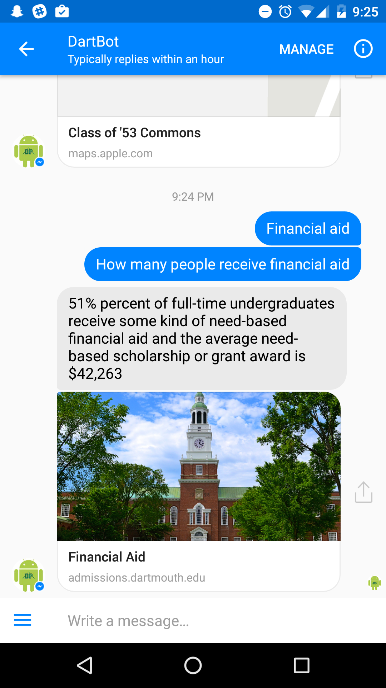
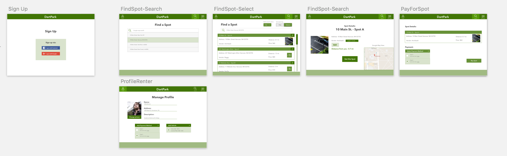
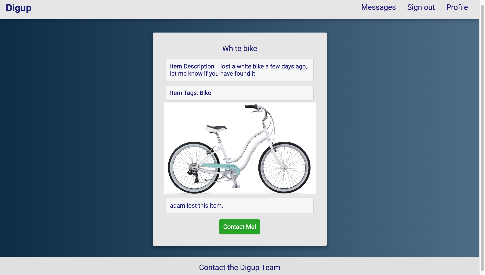
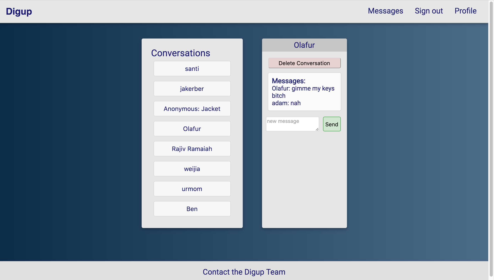
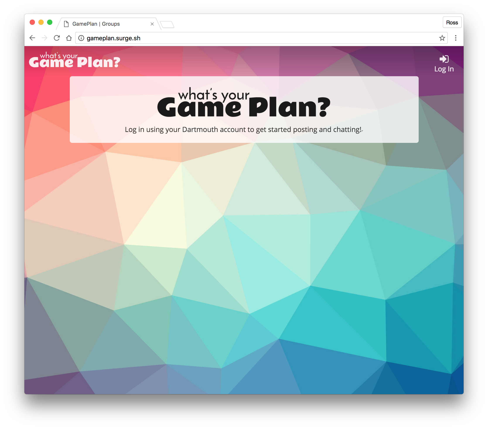
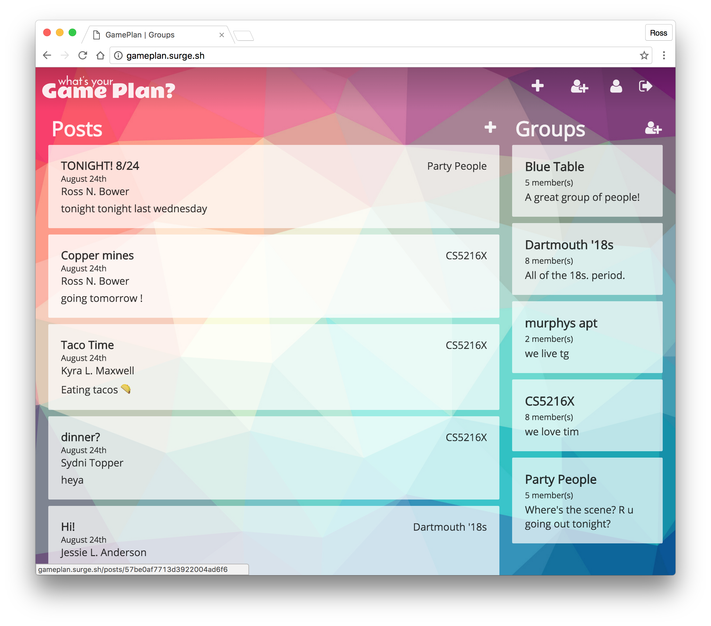
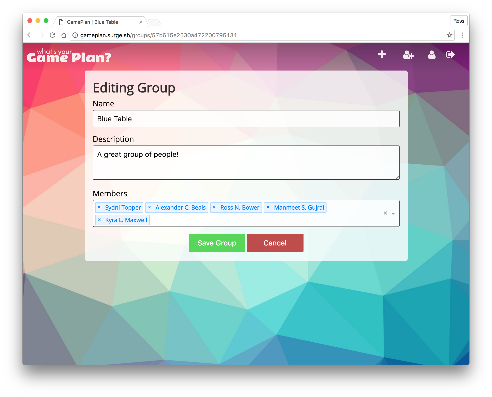
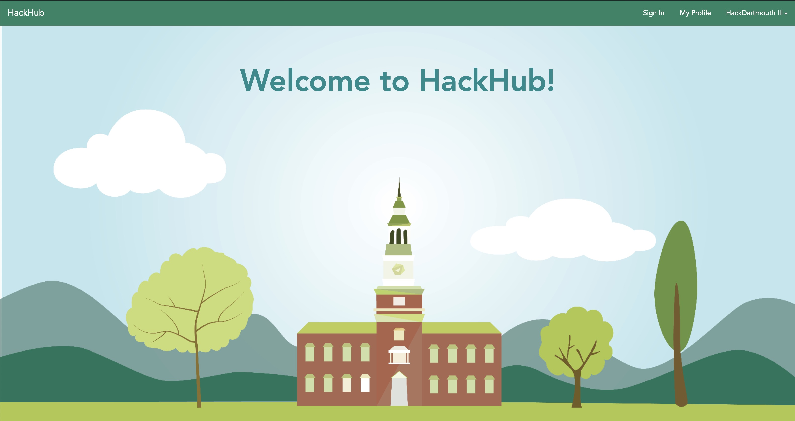
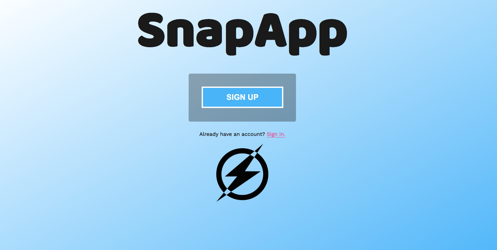
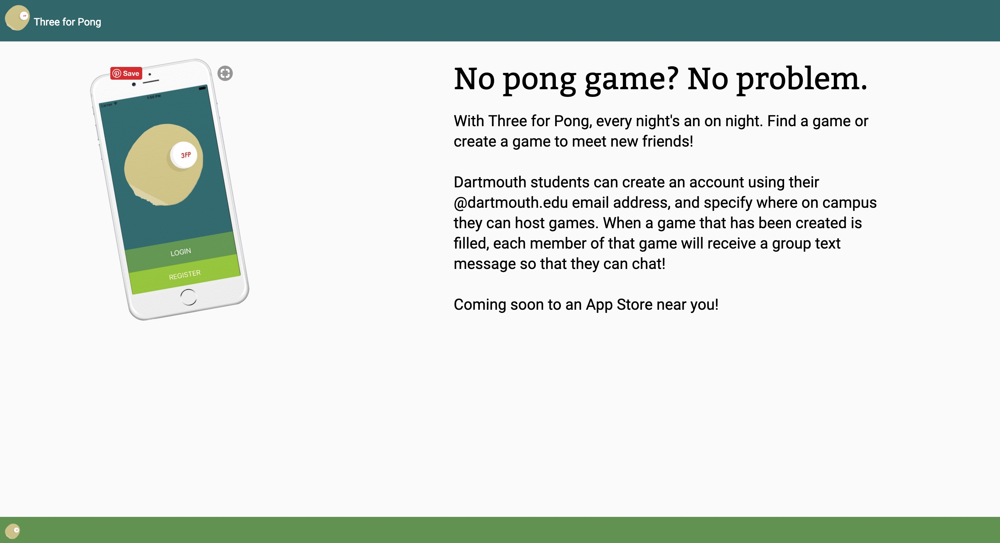

# DartBot #

> DartBot: The Virtual Tour Guide that include a user-facing Web App and Mobile App, Facebook Messaging Bot, and an admin-facing Web App. The Messenger Bot provides users with information on different locations on campus and answers to queries. The user side of the Web App gives an overview of information found on a tour. The Admin side provides an administrator with analytics on the user's interactions with the bot and with the ability to edit any of the information on the tour. 
>
> {: .small .fancy}
> {: .small .fancy}
>

# DartPark #

> DartPark is an application that allows users to buy and sell parking spots in and around Dartmouth’s campus. The front end provides a simple, user-friendly interface where renters can search for and buy parking spots based on location, and vendors can list spots with a location, description, and price. The app implements a Google Search Box API, which matches a search query with available locations, and also allows for messaging between renters and vendors. Additionally, payment is supported with the Braintree payment API.
>
> {: .large .fancy}
>

# DigUp #

> DigUp is Dartmouth’s first lost and found listing website designed to help users recover lost items. Over our time at Dartmouth, many of us have personally experienced or witnessed those around us lose expensive, often devastatingly personal, articles including jackets, car keys, and bikes. Based off the necessity and the goodwill of student hearts here at Dartmouth, our team plans to create a web application that expedites the lost&found process and return lost items in an efficient and organized fashion, all the while preserving anonymity (if desired). With the implementation of DigUp within the Dartmouth sphere, victims of forgetfulness seeking aid and those looking to complete their one good deed for the day are now able to integrate their objectives with the benefits going to both parties. Especially with the hectic influx of incoming freshman, outgoing seniors, and in between off-termers, our website would ameliorate the stress and reduce the anxiety of accidentally losing a valuable heirloom during the vulnerable transitioning phase and provide all students with a sense of ease knowing that DigUp is working around the clock to watch their backs.
>
> {: .medium .fancy}
> {: .medium .fancy}
>

# GamePlan #

> GamePlan is a web application to facilitate group planning and coordination of events. The app strives to encourage users to step outside their comfort zones and do things they normally never take the time to do! Users can create or be added to groups of other members, and then post event ideas to any groups that they are part of. When a user “likes” a post, they are put in a group chat with all other people who have liked that post, so they can easily communicate about planning this event.
>
> {: .medium }
> {: .medium }
> {: .medium }
>

# HackHub #

> HackHub is a platform for organizing communication at a hackathon event. Hackers, recruiters, and organizers can all find HackHub useful. Hackers can keep track of the hackathon schedule, receive announcements (notified by text), view profiles of other hackers, and explore recruiters’ opportunities. Recruiters can promote their job opportunities and explore talent, and organizers can keep track of sponsors and run their event smoothly with control over all features of HackHub. HackHub’s dynamic nature in serving all of these users will streamline the hectic nature of a hackathon for all involved.
>
> {: .medium .fancy}
>

# SnapApp #

> SnapApp is a web application that allows users to send "captionable" pictures to other users that will disappear after they are seen by the receiving user. Think of Snapchat but in your web browser, allowing you to communicate with your friends and family from your computer whenever it is open and in front of you instead of having to get your phone out, unlock it, and search for Snapchat to get the job done. SnapApp's smooth interface and speed makes it great for messing with your friends when you need a break from studying or your phone is too far out of your reach. You can find the current version at https://snap.surge.sh/.
>
> {: .medium .fancy}
> {: .medium .fancy}
>

# ThreeForPong #

> Three for Pong is a platform that allows students to find pong games anonymously. By connecting students, we will reduce pong wait times and foster potential friendships.
>
> {: .medium .fancy}
>

