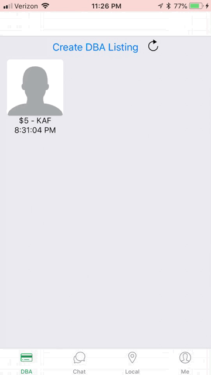
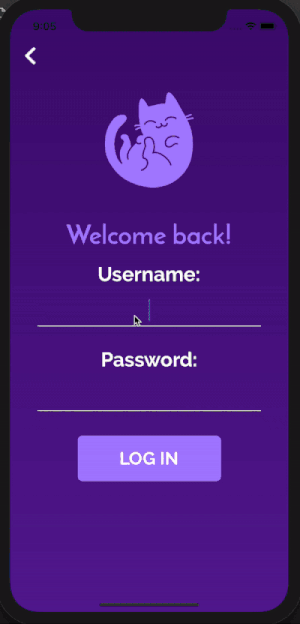
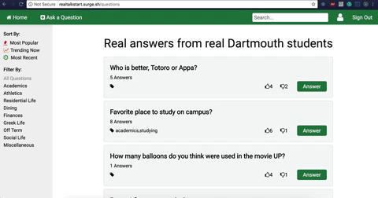

# DartCare #

> DartCare is a platform that connects babysitters with parents and guardians needing care in the Dartmouth Community. All users are authenticated Dartmouth students or faculty and staff members.
>
> * [online](http://dartcare.surge.sh)
>
> {: .medium .fancy}
>

# DBAid #

> DBAid is an app designed to optimize the use of DBA at Dartmouth College. Users can post a listing for a certain amount of DBA that they are willing to donate at a specific dining hall. Other users can spawn a chat based on that listing and communicate about making the transaction.
>
> * react-native mobile app currently not on app store
>
> {: .tiny .fancy}
>

# GoodGame #

> This is an App made for pick-up basketball lovers at Dartmouth College and around the world to help them find available courts and people who they want to play with, the games which match the most to their expectations and gamify their games. We implemented create/join/edit/delete a game, map view, and the post-game evaluation.
>
> * react-native mobile app currently not on app store
>
> {: .tiny .fancy}
> {: .tiny .fancy}
>

# LeftOnRead #

> Have you ever wanted to see who your top 5 most texted friends are? Or maybe how often you have said the word "tacos"? Or how many texts you sent last Christmas? Left On Read provides you the platform to quickly and effortlessly analyze your texts and discover new insights about yourself, your contacts and your relationships. With comprehensive analytical tools, beautiful and intuitive visuals, and agile filtering options, we give you complete control to manipulate and examine your data, your way. Daily texting history, top 5 words, sentiment analysis, and so much more - all available at your fingertips. We don't tell the story. We let your data tell the story.
>
> * [online](https://leftonread.me/) //ongoing project!
>
> {: .medium .fancy}
> {: .medium .fancy}
>

# Memur #

{: .tiny }

> Memur is an anonymous, community meme-sharing platform. Users can post and scroll through memes posted by members within a 5 mile radius and react to memes by up-voting or down-voting. The main feed can be sorted by "Dank" memes, or the most popular memes ranked by up-votes, or my most recent. A user can also upload their own memes to the feed for area and view his or her personal meme statistics and rankings.
>
> * [app store](https://apps.apple.com/us/app/memur/id1494848119?ls=1)>
> {: .tiny .fancy}
>

# WorkBench #

> Workbench is a research platform that allows professors and researchers to post tasks - both small and big - with an attached reward. Anyone around the world can sign-up for an account to attempt a solution and potentially collect the bounty. The goal of this project is to connect intelligent and motivated people throughout the world with relevant research, and to allow professors and researchers to find solutions to problems they need completed.
>
> * [online](http://work-bench.surge.sh)
> * [invision mockup](https://invis.io/DCIKH4E7UV5)
>
> {: .medium .fancy}
>

# Purrpl #

> Purrpl is a self-care app that helps you track your wellness and encourage your friends.
>
> * react-native mobile app currently not on app store
>
> {: .medium .fancy}
> 

# RealTalk #

> RealTalk is a space for prospective and current students of Dartmouth to ask questions and get real answers from current students. We believe that this website will be particularly helpful for prospective and new students with little prior connection to Dartmouth who come from areas where Dartmouth-related resources may be scarce (e.g. parts of Iowa). User-authentication will not be required to view the question and answers, but a user will need to sign in/up to post new content or edit existing content. Users will only be able to edit their own content, though they can up-vote or down-vote other people's content.
>
> * [online](http://realtalkdart.surge.sh/)
>
> {: .medium .fancy}
>

# @now #

> @Now is a web app that allows Dartmouth students to create short job offerings and have other students take the offers at that moment. This can be used for anything from looking for someone to stand in the kaf line or trying to get a student to tutor you and help with some homework.
>
> * [online](http://at-now.surge.sh)
>
> {: .medium .fancy}
>

# Blip #

>The best feature of social media platforms is sharing and saving moments from your life - but there is increasing pressure to make that life seem perfect to impress the people who follow you. Blip is different. No followers. No likes. Just friends and fun things your friends want you to see. The core functionality is a camera that allows people to combine multiple short videos into a compilation, and a feed to view the clips your friends have shared.
>
> * react-native mobile app currently not on app store
>
