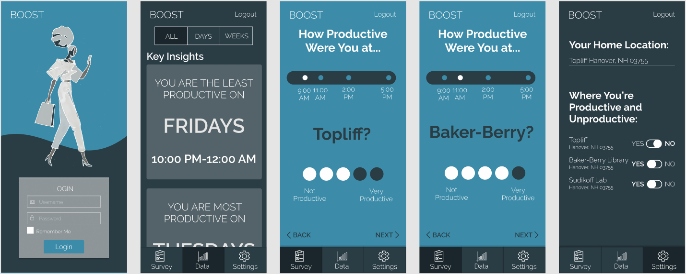
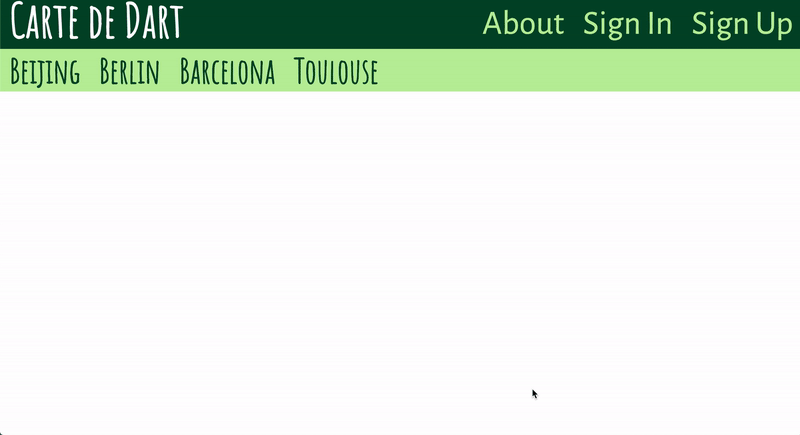
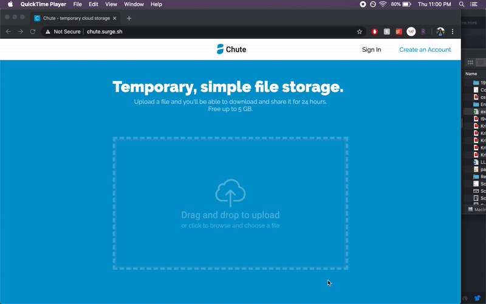
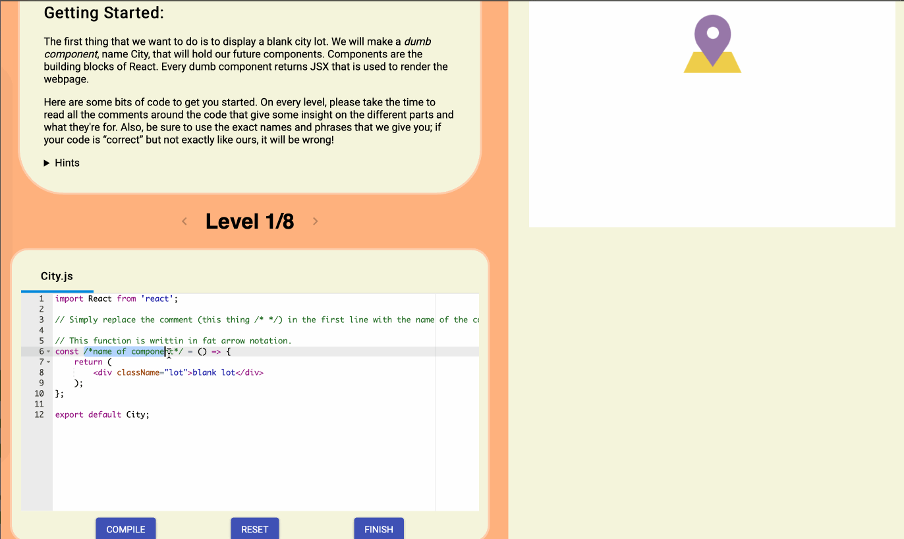
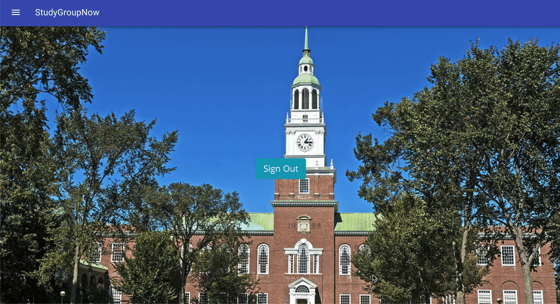
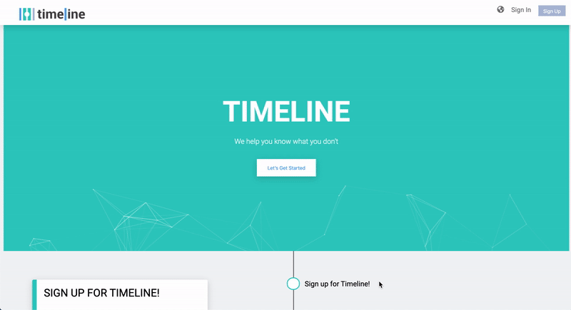
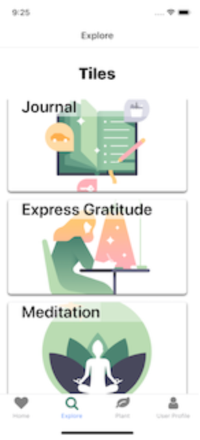
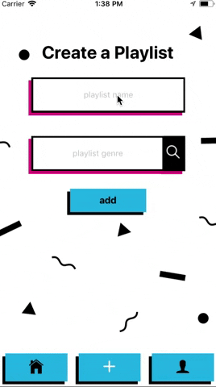
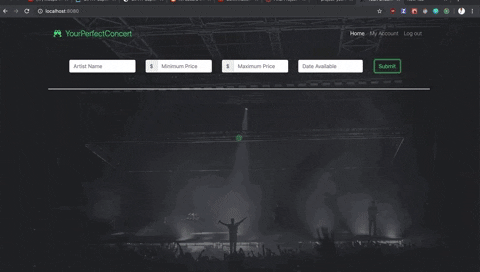

# Boost #

> Boost helps you plan your days so you can reach your goals
>
> * [online](https://project-boost.surge.sh/)
>
> {: .medium .fancy}
>

# Busking #

> A decentralized platform that empowers street performers to publicize their musical events. This democratizes information so that more people can support up-and-coming artists in their region.
>
> * [online](https://busking.surge.sh)
>
> {: .medium .fancy}
>

# Carte de Dart #

> Carte de Dart is a web app that enables Dartmouth students to get real Dartmouth reviews and advice for their Dartmouth-specific study abroad programs and for the cities in which those programs take place. Our site allows students who have been abroad or who have traveled to these cities to leave reviews, advice and add to our crowdsourced list of best activities, restaurants, sites and miscellaneous tips. This site is the go-to for Dartmouth study abroad advice.
>
> * [online](http://carte-de-dart.surge.sh)
>
> {: .medium .fancy}
>

# Chute #

> Chute is a temporary file uploading service that uses Amazon S3 to store files.
>
> * [online](http://chute.surge.sh)
>
> {: .medium .fancy}
>

# Gut Busters #

> In a world where there weren't enough fun games, the Gut Busters team set off to build a game that is fun. Like, it's FUN. Seriously. The Quiplash-like game with more a user input —— and therefore more fun!
>
> * [online](http://gut-busters.surge.sh/)
>
> {: .medium .fancy}
>

# PassOn #

> PassOn exists as a social bartering app and subsists on the belief that we all have an innate desire to both learn and share. Learn how to yoyo from a competition-oriented professional, have an hour-long lesson with top-notch musician, hone your tennis abilities with a skilled player: through expensing or trading skills, social interaction, and learning can be combined into one holistic experience.
>
> * react-native mobile app currently not on app store
>
>

# React City #

> The idea of the project is to design and build a game that helps complete beginners to React learn the basics of components/props/state and everything related to editing, passing them down.
>
> * [online](react-game-cs52-19s.surge.sh)
>
> {: .medium .fancy}
>

# StudyGroupNow #

> It's Uber for study groups! Join and post local study groups by classes in common and study styles.
>
> * [online](studygroupnow.surge.sh)
>
> {: .medium .fancy}
>

# TheaterMade #

> This project is a crowdfunding platform for theater. Users can raise money, invest, and find support for their projects while also connecting with other members of the theater community across the country. It currently displays data from the backend server hosted on Heroku.
>
> * [online](http://theatermade.surge.sh/)
>
> {: .medium .fancy}
>

# Timeline #

> Timeline allows you to visualize big life possibilities - think college, trade school, the army, etc - and create self-curated timelines of your future, exposing you and others to options in life you wouldn't have otherwise known about.
>
> * [online](http://lifetime.surge.sh/)
>
> {: .medium .fancy}
>

# Totem: A Way Back to I #

> "Totem: A way back to I" is a react-native application created to help people remind themselves of good times, goals, and their overall well-being.
>
> * react-native mobile app currently not on app store
>
> {: .medium .fancy}
>

# TrustedReviews #

> Trusted Reviews is a review-posting platform that offers a secure database of customer reviews and testimonials. Registered users can add to, view, and vote on a filterable/searchable list of product reviews. Retailers can access these reviews through a secure API that embeds a product summary (with its rating average and a link to the full set of reviews) within their websites.
>
> * [online](http://trustedreviews.surge.sh/)
>
> {: .medium .fancy}
>

# Vibes #

> Vibes mobile app for creating location-based collaborative playlists.
>
> * react-native mobile app currently not on app store
>
> {: .medium .fancy}
>

# VibeDiner #

> VibeDiner (previously known as IndieVest) is an app that facilitates musical collaboration. Users can build profiles and post their current projects to attract other artists. Users can scroll through these projects and filter them by relevant tags. If interested, users chat with each other and create.
>
> * [online](http://vibediner.surge.sh/)
>
> {: .medium .fancy}
>

# YourPerfectConcert #

> YourPerfectConcert is a website designed to help users find the perfect artists for any musical events that they are hosting. Whether you are a concert hall booking agent or a campus event coordinator, this website allows you to find the perfect artists given the specific criteria that you need.
>
> * [online](https://your-perfect-concert.surge.sh/)
>
> {: .medium .fancy}
>
