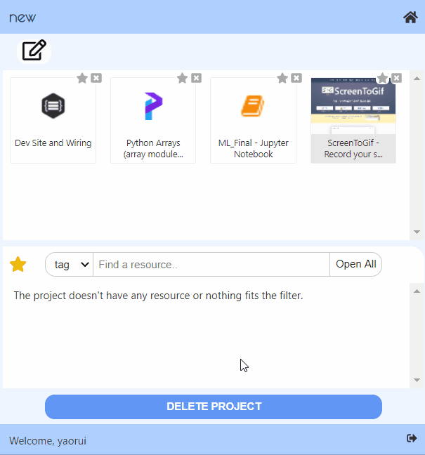
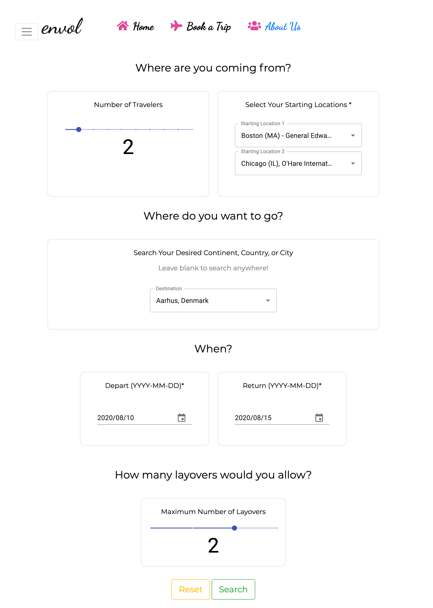
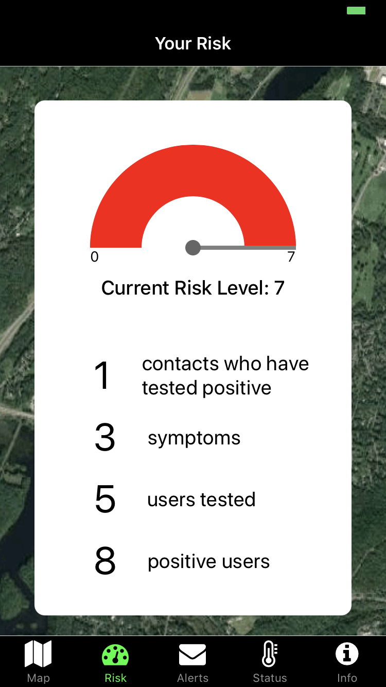
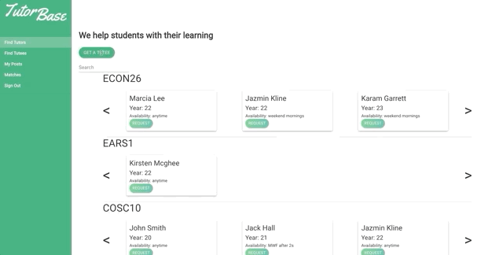

# 2 Many Tabz #

> organize your browser, organize your life
>
> * [project details](https://www.notion.so/dalilab/2ManyTabz-4997a52397df4faead35b37f49a506c1)
>
> {: .medium .fancy}
>

# Envol #

> The easiest way to book group trips and find the cheapest destination for all!
>
> * [online](http://envol.surge.sh/)
> * [project details](https://www.notion.so/dalilab/envol-802bf32e18f24f728ec396ded6dd20b8)
>
> {: .medium .fancy}
>

# GreenTrace #

> Staying One Step Ahead of COVID-19 at Dartmouth
>
> * [project details](https://www.notion.so/dalilab/GreenTrace-c611f42d72824f94aa5818d9d6d272a8)
>
> {: .small .fancy}
> {: .small .fancy}
>

# Iminsi: The First All-African News App #

> No more western media bias. Read reliable news from Africa like a local.
>
> * [project details](https://www.notion.so/dalilab/Iminsi-The-First-All-African-News-App-3a0c68a6c8b8490fb5644751f4f1e53b)
>
> {: .small .fancy}
> {: .small .fancy}
>

# Immunotask #

> Employment for COVID-19 immune individuals
>
> * [online](https://immunotask.surge.sh/)
> * [project details](https://www.notion.so/dalilab/Immunotask-28954e286a4e41dc99ba51a24e675e2b)
>
> {: .medium .fancy}
>

# Magnuson Center Campus Ventures #

> Connecting Dartmouth students to startup opportunities in the Upper Valley and around the country
>
> * [online](http://cs52-mcv.surge.sh/)
> * [project details](https://www.notion.so/dalilab/Magnuson-Center-Campus-Ventures-fa075140aad647b491b6d1e452b45f6d)
>
> {: .medium .fancy}
>

# OnRepeat #

> Share the songs you love to leave onRepeat with friends
>
> * [project details](https://www.notion.so/dalilab/onRepeat-9d30f047b85c4802a8ff84308f050ca8)
>
> 

    <video loop autoplay muted class="medium fancy">
    <source src="http://res.cloudinary.com/dali-lab/video/upload/ac_none,w_560,h_315,c_scale/v1546203223/cs52/OnRepeat.webm" type="video/webm"/>
    <source src="http://res.cloudinary.com/dali-lab/video/upload/ac_none,w_560,h_315,c_scale/v1546203223/cs52/OnRepeat.mp4" type="video/mp4"/>
    <source src="http://res.cloudinary.com/dali-lab/video/upload/ac_none,w_560,h_315,c_scale/v1546203223/cs52/OnRepeat.ogv" type="video/ogg"/>
    Your browser does not support HTML5 video tags
    </video>
> 

>

# Resistance Online #

> Play Resistance and connect with friends!
>
> * [online](http://cs52-online-multiplayer-game.surge.sh/)
> * [project details](https://www.notion.so/dalilab/Resistance-Online-2bfedc64debc4813b1f63abc345702c7)
>
> {: .medium .fancy}
>

# Tempo #

> Control the tempo as you achieve your fitness goals. Follow link and scan QR code to open in expo
>
> * [project details](https://www.notion.so/dalilab/Tempo-1c2c9aba143944bdaaf2f8d64d8b8410)
>
> {: .small .fancy}
> {: .small .fancy}
>

# TutorBase #

> An Easier Bridge Between Dartmouth's Tutors and Students
>
> * [online](https://tutorbase.surge.sh/)
> * [project details](https://www.notion.so/dalilab/TutorBase-244dd896400449db887dc85bf925dea9)
>
> {: .small .fancy}
> {: .small .fancy}
>

# Varify (Know the News) #

> Develop an informed, holistic perspective
>
> * [online](http://knowthenews.surge.sh/)
> * [project details](https://www.notion.so/dalilab/Varify-Know-the-News-3b4ac5f636c846b58dc280e07bab9e1c)
> * [extension](https://chrome.google.com/webstore/detail/denggifplbggoleagckomiilhcoeofka/publish-accepted?authuser=0&hl=en)
>
> 

    <video loop autoplay muted class="medium fancy">
    <source src="http://res.cloudinary.com/dali-lab/video/upload/ac_none,w_560,h_315,c_scale/v1546203223/cs52/varify1.webm" type="video/webm"/>
    <source src="http://res.cloudinary.com/dali-lab/video/upload/ac_none,w_560,h_315,c_scale/v1546203223/cs52/varify1.mp4" type="video/mp4"/>
    <source src="http://res.cloudinary.com/dali-lab/video/upload/ac_none,w_560,h_315,c_scale/v1546203223/cs52/varify1.ogv" type="video/ogg"/>
    Your browser does not support HTML5 video tags
    </video>
> 

> 

    <video loop autoplay muted class="medium fancy">
    <source src="http://res.cloudinary.com/dali-lab/video/upload/ac_none,w_560,h_315,c_scale/v1546203223/cs52/varify2.webm" type="video/webm"/>
    <source src="http://res.cloudinary.com/dali-lab/video/upload/ac_none,w_560,h_315,c_scale/v1546203223/cs52/varify2.mp4" type="video/mp4"/>
    <source src="http://res.cloudinary.com/dali-lab/video/upload/ac_none,w_560,h_315,c_scale/v1546203223/cs52/varify2.ogv" type="video/ogg"/>
    Your browser does not support HTML5 video tags
    </video>
> 

>

# Who's Down #

> Who's Down is the premiere platform to connect event creators and event seekers. View events by geographic locality, filter by your interest, and meet new people with common interests. Who's Down— spontaneity organized.
>
> * [project details](https://www.notion.so/dalilab/Who-s-Down-b56e4cca93f64a4cbaf9f034b1cd0fdd)
>
> {: .small .fancy}
>

