# AptiTune #

> A new and interactive way to become the musician you’ve always wanted to be!
> There's **badges** to win, **stats** to see, and **quizzes** to test your knowledge. Learn all about sheet music in a **fun and new way**.
>
> * [project details](https://www.notion.so/dalilab/AptiTune-9fc0cc6cc20f468c98fc33d45ff9dd14)
> * [project link](https://aptitune.surge.sh/)
> * [figma prototype](https://www.figma.com/proto/efjV436w16YzGi7U2IRCK2/Prototype?node-id=219%3A64&scaling=contain&page-id=0%3A1)
>
> 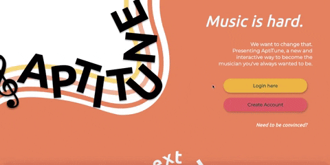{: .medium .fancy}
> 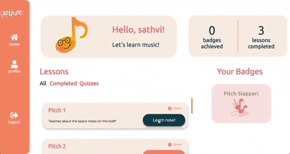{: .medium .fancy}
>

# @now #

> The study time organizer you didn't know you needed! Canvas to google calendar integration that allows you to schedule a recommended time for your work at ease!
>
> * [project details](https://www.notion.so/dalilab/now-0d286fc46e8f4c6f8e1d0476ffe0e0f4)
> * [figma prototype](https://www.figma.com/proto/vGRUCAJzRkJcQtdlSeCO7L/Mockups?scaling=min-zoom&page-id=0%3A1&node-id=12%3A150)
>
> 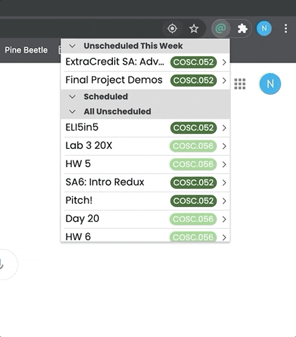{: .small .fancy}
> 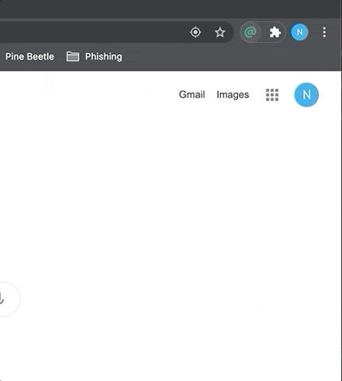{: .small .fancy}
>

# Impermanotes #

> Impermanotes is a no-pressure environment with customizeable UI themes to talk about all those feelings. We know you've got words. We're here to help.
>
> * [project details](https://www.notion.so/dalilab/Impermanotes-60565f0fbc0b4be2b533b63402f6fe2c)
> * [project link](https://impermanotes.netlify.app/)
> * [figma prototype](https://www.figma.com/proto/kIzVW0aQQrmH8jttequcEN/HaiPals?node-id=1%3A2&scaling=min-zoom&page-id=0%3A1)
>
> 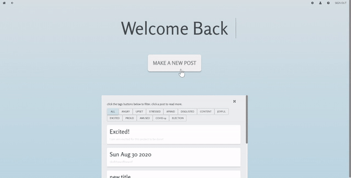{: .medium .fancy}
> 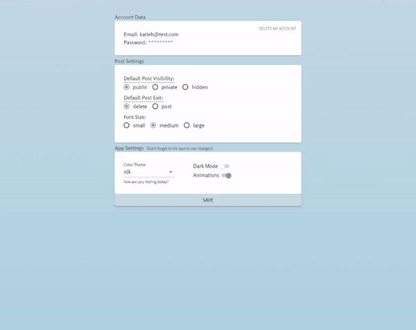{: .medium .fancy}
>

# OpenStata #

> A free online replication of the basic functionality of the proprietary statistical software Stata, combined with free tutorials and sample datasets to get anyone started with learning it.
>
> * [project details](https://www.notion.so/dalilab/OpenStata-e1cf77376a4149b0be6c2809e5a5d714)
> * [project link](https://open-stata.netlify.app/)
> * [figma prototype](https://www.figma.com/proto/0RzbsCFGztu4T7azoqFvcy/Mockup?node-id=92%3A228&scaling=min-zoom&page-id=1%3A2)
>
> 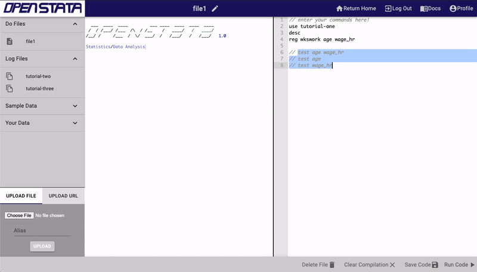{: .medium .fancy}
> 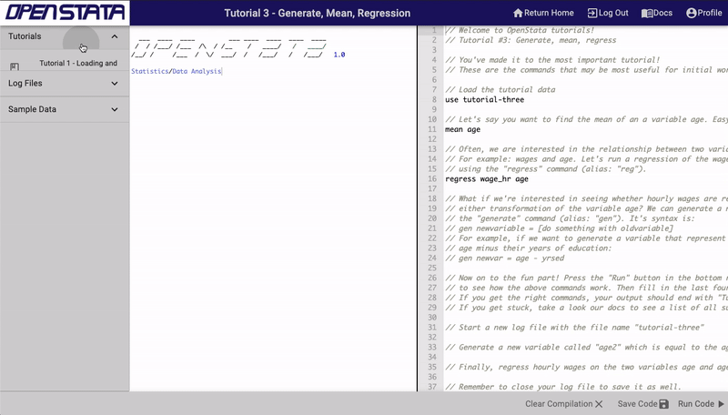{: .medium .fancy}
>

# SubLit #

> SubLit is a platform where students can post listings and students looking to sublet can find places. They can then chat in the web app to discuss a sublet agreement.
>
> * [project details](https://www.notion.so/dalilab/SubLit-14e86cadcc894969b4a945657ddb7c03)
> * [project link](http://sublit.surge.sh/)
> * [figma prototype](https://www.figma.com/proto/xH6wIAhqhJZIGep7K3wlRe/SubLit-Colors-Official?node-id=21%3A45&scaling=min-zoom&page-id=12%3A2)
>
> 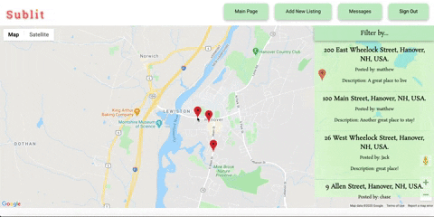{: .medium .fancy}
> 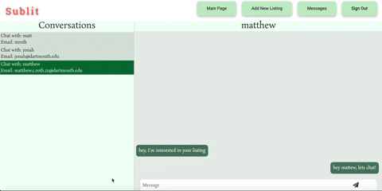{: .medium .fancy}
>

# TLDR #

> A webapp in which users can upload audio recordings of themselves reading articles, and other users can pay for to listen to that audio. This will allow users to listen in the car, while working out, etc. Will also help dyslexic and dysgraphic people.
>
> * [project details](https://www.notion.so/dalilab/TLDR-f741272a6c254fad9a66eb7bb4ea982f)
> * [project link](https://tldr.surge.sh/)
> * [figma prototype](https://www.figma.com/proto/48jSNARsG29gv6xTLaYx5j/TLDR-Designs?node-id=13%3A4&scaling=min-zoom&page-id=0%3A1)
>
> 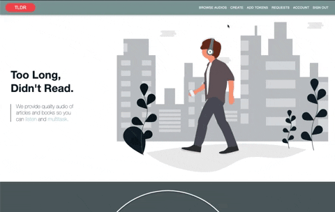{: .medium .fancy}
> 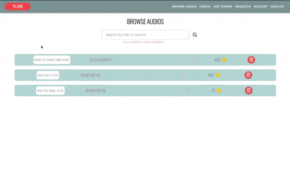{: .medium .fancy}
>

# TouchTheFire #

> Quarantine has caused us all to miss out on many of the Dartmouth traditions that we love, and has prevented us from seeing all of our friends. TouchTheFire is a fast-paced multiplayer browser game based on Dartmouth traditions that offers a platform for students around the world to interact and have fun.
>
> * [project details](https://www.notion.so/dalilab/TouchTheFire-694ba3cd6fba40cc9de9be3168b58c49)
> * [project link](http://touch-the-fire.surge.sh/)
> * [figma prototype](https://www.figma.com/proto/NYXJshUJ5rrsdHEr0mKjZ0/Connections?scaling=min-zoom&page-id=0%3A1&node-id=39%3A42)
>
> 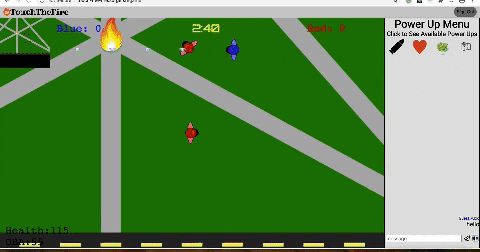{: .medium .fancy}
> 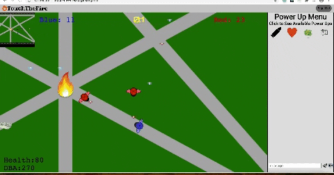{: .medium .fancy}
>

# TuneTracker #

> A web application that provides access to a user's Spotify listening data, allowing them to gain some insight about the artists and tracks that they've listened to most often, and how their listening behavior has changed over time. It was inspired by Spotify Wrapped - the deep dive into your listening history that Spotify provides at the end of each year.
>
> * [project link](http://tunetracker.surge.sh/)
>
> 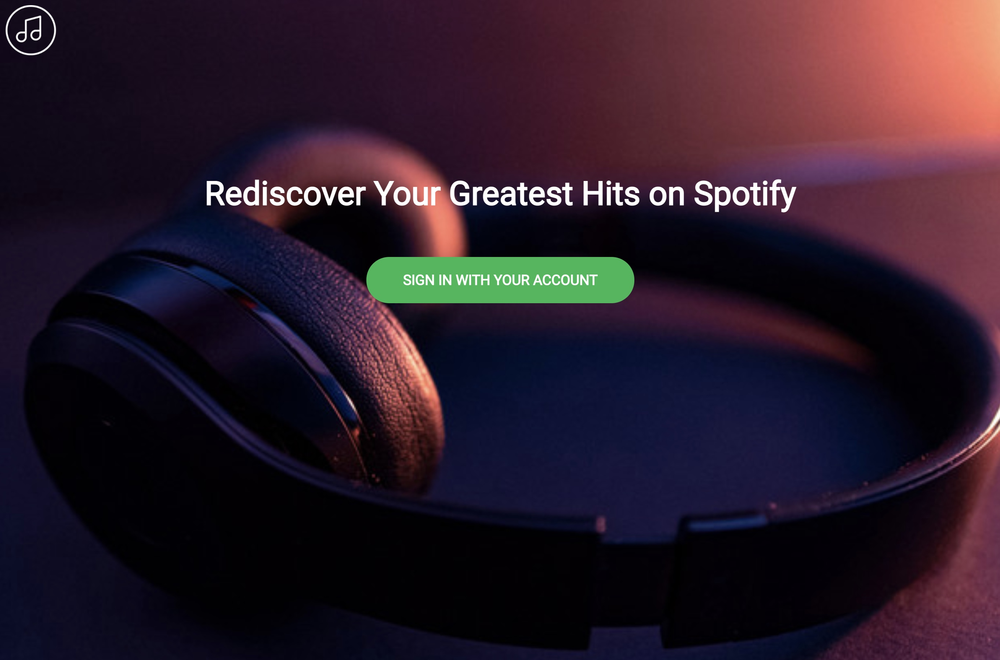{: .medium .fancy}
>

