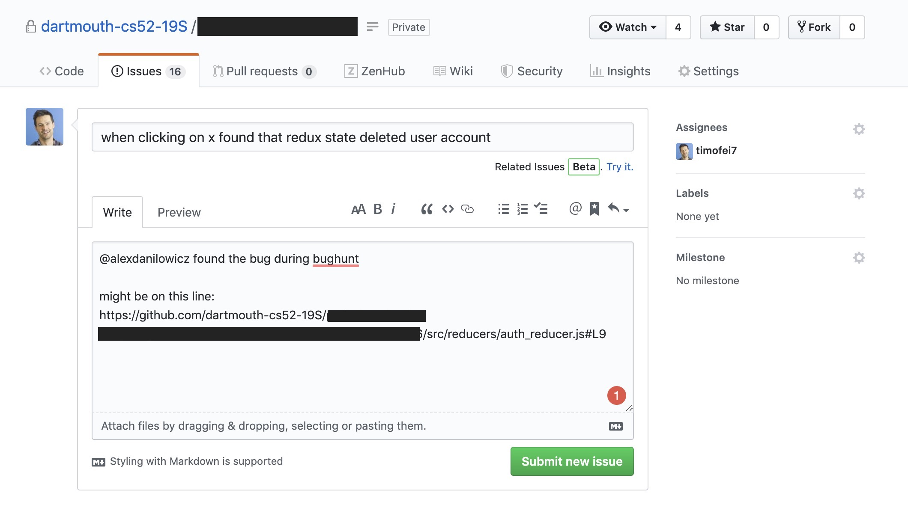
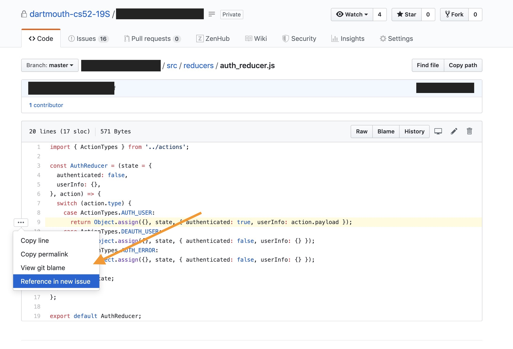
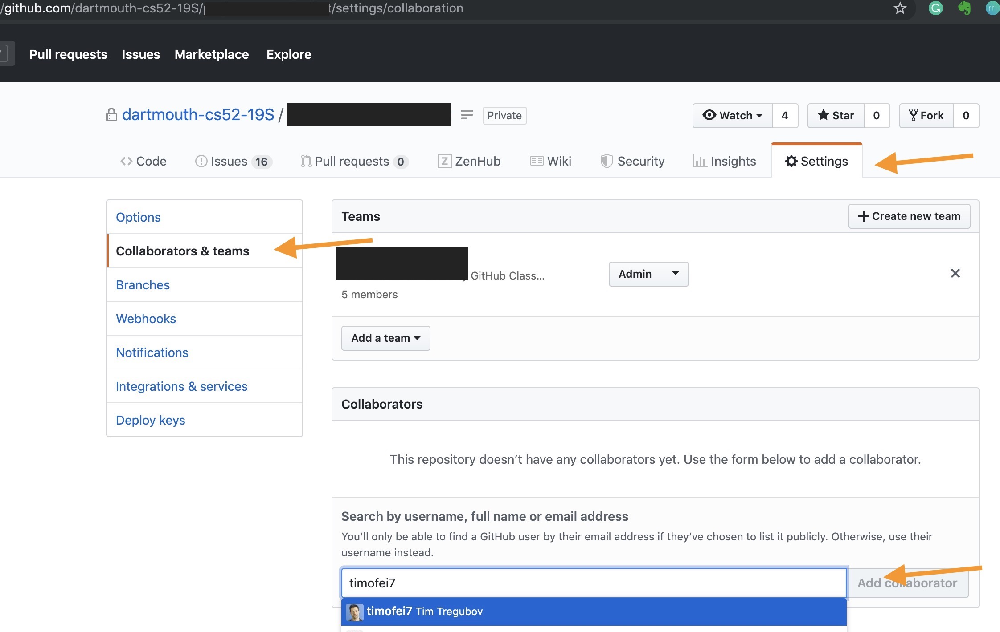

{: .fancy .small}

Each team should be prepared to demo what they have currently and to discuss their progress. We'll offer bug rewards in the form of snacks! 

Bugs will need to be submitted in the form of git issues that you write together.  Each person will submit 2 issues to one of their own team repos and record the name of the person they worked with. 

Steps to successful testing:
1. sharer: share your problem statement and who your target users are
1. tester: take on the persona of the target user - pretend to be them
1. tester:  use the product; sharer: observe and take notes, but don't tell them what to click
1. together discuss how it went, look at the codes, make an github issue and record
1. switch roles and repeat

`@mention` their github username in the body of the issue even though they don't have access to the repo. 

Your issues should look like this: 

{: .fancy .medium}

EC if you find where in the code it might be:

{: .fancy .medium}

If you wanted you are allowed to add them as a collaborator on your project. 
{: .fancy .medium}

## To Turn In:

* github urls to at least 2 issues that you recorded together with someone from another team.  @mention their github username in the issue (even if they do not have access to the repo).  