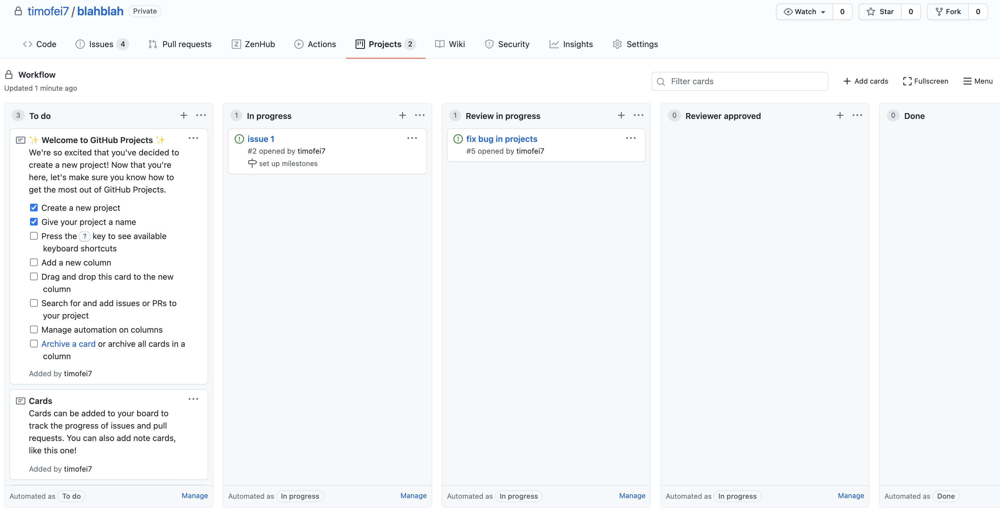

{: .fancy .small}

Dev site goes live, this allows testing and sharing of progress for feedback.

## Dev Site

At this stage you should have rudimentary functionality in place. For instance if you were building a web or mobile app there should be frontend components hitting api endpoints that are pulling data from the database. You should have all the components/views planned out and started in code even if they are simple placeholders. You should be at the point where you have most of your presentational components (UI) laid out and have started on wiring things together with any data sources such as your api server.

## Wiring

For this milestone the main idea is to get a "deep" wiring of your project components up and running in a testable fashion.  Your frontend and backend need to be talking to each other.  If you have computational elements and display elements, this is the time to move past mockup data and have the display use the computed data.  You don't have to have every data connection wired up, but at least one should be working - the idea being to test the full data path.

## GitHub Milestones and Issues

To help us plan out the work needed to be done we're going to use GitHub Issues and Milestones.  Don't worry this won't be a complicated thing that adds a ton of overhead to the project. You'll find this will speed up your dev time and breaking up tasks and accomplishing them smoother and faster.

### Issues

{: .fancy .medium}

You can think of the issues as individual tasks: "create login button",  "api endpoint for user profile", etc.  Issues can also be bugs that you find along the way.

Break up large tasks into individual smaller ones, each one should be under a few hours of work. The smaller the tasks the faster you will actually work (not just the appearance of speed).  It is easier to take on a manageable scope issue and work through it than if the issue has multiple steps that quickly become overwhelming to think through.  Assign each other tasks, a little aggressiveness is good!

🚀 Create at least 2 issues per team member.  Create a plan to have a deep wiring of your project so that major parts of your project work and record it as issues.

### Milestones

{: .fancy .medium}

Milestones allow you to assign a due date to a set of issues.  These are useful for feature level goals and allow you to easily see progress and group together sets of issues.  Milestones should be less specific than "create login button" (this is an issue rather than a milestone). Examples include: "login and user profile flow",  "event review functionality", "fully integrate current flows with api".  These are generally how people initially think of breaking up tasks - as the more overwhelming goals such as 'integrate social into product'.  However if you create this as a milestone you should then split that into a whole bunch of small achievable tasks: 'add facebook sdk', 'add share button to posts',  'show profile image', etc.

🚀 Group some issues together into milestones and split up any issues that seem too weighty into smaller tasks. 

### GitHub Projects

{: .fancy .medium}

Project Boards are a great way to view your github issues and have a more organized workflow.  Think of this as an active and collaborative todo that is connected to your repos.  Github Projects can span multiple repositories which can help you see all your issues in one place.  

[Get started with GitHub Projects!](https://docs.github.com/en/github/managing-your-work-on-github/about-project-boards)

It is not required that you do this, but highly recommended.

🚀 Set up a github project to manage your issues for Extra Credit and because your project will go so much more smoothly. 

## Continuous Integration

Continuous integration is a software development practice where code changes are integrated into your product often and deployed as you go after code reviews.  We've already been doing this with the Netlify and Heroku automatic deploys on changes.  We have also been using [Github Actions](https://docs.github.com/en/actions/quickstart) to run our linting tests on every change to the main branch.  If you are curious how that was set up you can see the `.github/classroom/autograding.json` and `.github/workflows/classroom.yml`.  Your main branches should always contain code that works.  This way your deployed site and api are always showable and testable.

No action items necessary at this point since this is already how we are set up!

## What About ReactNative

If your project is a ReactNative project with Expo this is a bit tricker.  What you'll want to do is create a team Expo account - one where you can share the username and password - this will be helpful later when we will want to have a way to test out your project.

You'll also want to start using expo publish to make your project available offline.  [See documentation here](https://docs.expo.io/workflow/publishing/).

For continuous integration the easiest option is to try out [Expo publishing using github actions here](https://github.com/marketplace/actions/expo-github-action).

## Such Dev Environment

Now, you can work in your local environment on your feature branch and when you are ready, merge it into main which will deploy it automatically. Do not simply start using the main branch and the dev site directly as your primary method of testing.  You should always be working locally first! But this does allow you to merge in changes quickly and you can have a shared dev site where you can see the latest pushed version of everyone's code and ask others for feedback.

## To Turn In:

* github URLs for the various repos involved with updated README.md files
* at least 2 github issues assigned per team member in github (include links for each)
* dev urls
  * url of frontend
  * url for api server
* demonstrated fetching of data from frontend ↔️ api.
* short short comment on what worked and what didn't
