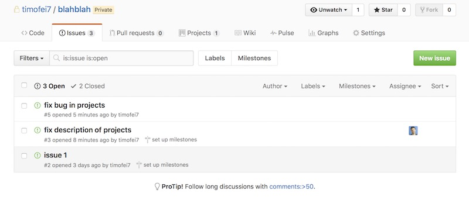
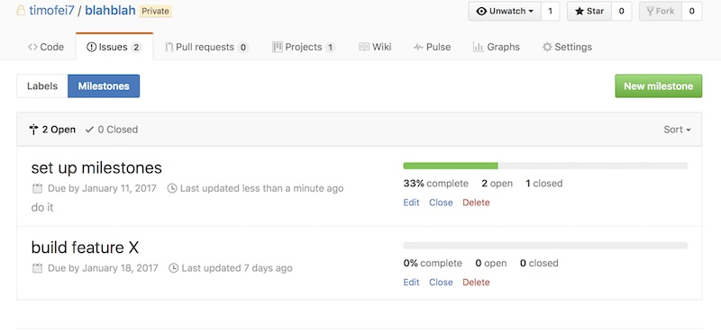

{: .fancy .small}

Dev site goes live, this allows testing and sharing of progress for feedback.

## Dev Site

At this stage you should have rudimentary functionality in place. For instance if you were building a web or mobile app there should be frontend components hitting api endpoints that are pulling data from the database. You should have all the components/views planned out and started in code even if they are simple placeholders. You should be at the point where you have most of your presentational components (UI) laid out and have started on wiring things together with any data sources such as your api server.

## Wiring

For this milestone the main idea is to get a "deep" wiring of your project components up and running in a testable fashion.  Your frontend and backend need to be talking to each other.  If you have computational elements and display elements, this is the time to move past mockup data and have the display use the computed data.  You don't have to have every data connection wired up, but at least one should be working - the idea being to test the full data path.

## GitHub Milestones and Issues

To help us plan out the work needed to be done we're going to use GitHub Issues and Milestones.  Don't worry this won't be a complicated thing that adds a ton of overhead to the project. You'll find this will speed up your dev time and breaking up tasks and accomplishing them smoother and faster.

### Issues

{: .fancy .medium}

You can think of the issues as individual tasks: "create login button",  "api endpoint for user profile", etc.  Issues can also be bugs that you find along the way.

Break up large tasks into individual smaller ones, each one should be under a few hours of work. The smaller the tasks the faster you will actually work (not just the appearance of speed).  It is easier to take on a manageable scope issue and work through it than if the issue has multiple steps that quickly become overwhelming to think through.  Assign each other tasks, a little aggressiveness is good!

### Milestones

{: .fancy .medium}

Milestones allow you to assign a due date to a set of issues.  These are useful for feature level goals and allow you to easily see progress and group together sets of issues.  Milestones should be less specific than "create login button" (this is an issue rather than a milestone). Examples include: "login and user profile flow",  "event review functionality", "fully integrate current flows with api".  These are generally how people initially think of breaking up tasks - as the more overwhelming goals such as 'integrate social into product'.  However if you create this as a milestone you should then split that into a whole bunch of small achievable tasks: 'add facebook sdk', 'add share button to posts',  'show profile image', etc.

## Travis CI

{:  .tiny}

You will need to set up Travis CI for your project with automatic linting. You already have been using eslint, so now we'll just make sure that whenever you push to github it will automatically run eslint again just in case.  We'll also have Travis CI run other stuff for us, in particular it will push to surge automatically.  Here's a bit of a todo on [how to set up Travis](http://cs52.me/resources/travis).

### Deployment API

{:  .tiny}

Set up your Heroku app to be connected to GitHub with [automatic deploys](https://devcenter.heroku.com/articles/github-integration#automatic-deploys).  Set this up so that whenever you merge a pull-request into your master branch for your server component, Heroku will pick up the change.  You will obviously still work locally on your own feature branches. Your master branch will be the branch that is tested and working.  You can set this up so that Heroku only updates if the Travis tests have completed successfully.

### Continuous Integration Frontend

{:  .tiny}

For the frontend, we can set up Surge with Travis so that it too will update automatically.  Here's how to set up [surge+travis](https://surge.sh/help/integrating-with-travis-ci).

## Such Dev Environment

Now, you can work in your local environment on your feature branch and when you are ready, merge it into master which will deploy it automatically. Do not simply start using the master branch and the dev site directly as your primary method of testing.  You should always be working locally first! But this does allow you to merge in changes quickly and you can have a shared dev site where you can see the latest pushed version of everyone's code and ask others for feedback.

## To Turn In:

* github URLs for the various repos involved with updated README.md files
* at least 2 github issues assigned per team member in github (include links for each)
* dev urls
  * url of frontend
  * url for api server
* demonstrated fetching of data from frontend ↔️ api.
* screenshots of Travis CI running on pull requests with short short comment on what worked and what didn't
