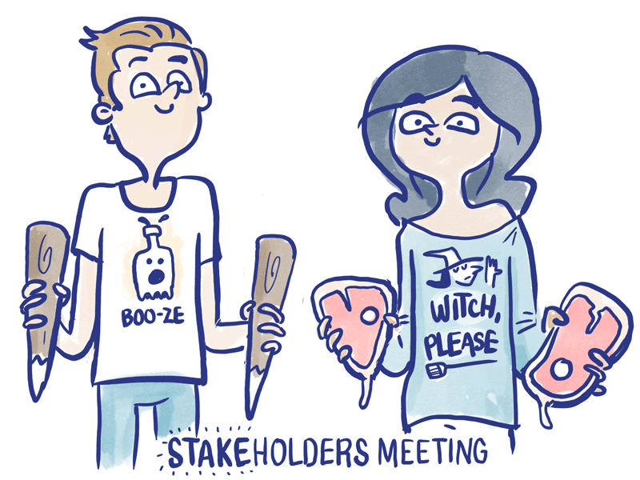

{: .fancy .medium}


The feature spec is a document that is a walk-though of your project from the users perspective. It provides a listing of all the features you are envisioning for the product. The feature spec functions as your overall plan for the project. Rather than thinking about it as locking you in, use this as an opportunity to think through your product in detail.

To help us think through features, it is useful to start with the users.


## To Get Started - Our First Team Project Repo

We'll use this opportunity to get your first project repo started!  We'll be using github classroom to autoprovision repositories and set up teams.

*Every member* on your team **must** use github classroom (found on canvas) to set up the teams correctly and automatically.

The first person on your team will name the repo and the team name. Each consecutive person will click on the same github classroom link and simply choose the repo and team to be granted permissions. Please use this as it keeps everything organized and in one place and sets up a github team automatically.


## Stakeholders

{: .medium_small}

Stakeholders are anybody who gives a damn about what you are building. These can be your end users, founding team, investors, clients, customers, parents, and professor.  Regardless of what you are building, there are most likely humans involved. Actually, stakeholders can also be non-humans in the case where you are building something for animals or aliens. 

## Feature list

You're going to need a list of features that you will work off of. To get to this list of features — we're going to first make up some users. Their needs and desires will drive our features — so they need to exist first. *Expecto Patronum.*

## User Stories and Personas

User stories are short scenarios about how your product is used.  User personas are the fictional individuals who comprise your product's users.  Your personas should have names and believable backgrounds.  They should have specific demonstrative use cases for your product.  You will refer to them as you work on the product and you'll find they will be quite useful!  The aim of user stories is to codify specific use cases for your product and allow them to be easily communicated as you build the product.  They help keep the team focused on the functionality of the product for specific people rather than getting sidetracked by features that seem "cool" or "look good".  For every feature in your spec you should have a user persona that would find it useful or compelling.

We'll store our Personas as [Issues in our github repos](https://help.github.com/articles/creating-an-issue/). We'll dig into that more later but for now - go to your newly created project repository on github. 

🚀 Create a new issue and new label `user-personas`.  This way you'll be able to reference them later!


__Structure your user persona like so:__

```markdown
# UserPersonaName


## Background and Demographic Information
  * _Fictional Name_:
  * _Demographics_: (short)
  * _Overheard quote_:

## Narrative

*Short narrative or description about the user and why they're using your product/service (try to capture their attitudes, needs, problems/concerns, and experience)*

## Behavioral and Dimensional Information
  * __Goals and Motivations:__
    *(goals should directly relate to product/service)*
  * __Tasks:__
    *(break goals down into tasks — what does the user need to do to accomplish a particular goal)*
  * __Pain Points, Concerns, and Challenges:__
    *(what are they worried about? what do they have trouble with?)*
  * _User Flow_
    *(describe a typical scenario of the user interacting with your product – this is a short ordered list of actions)*
```

Once you have the user personas they will help a great deal in figuring out your essential features and thinking more deeply about what you are building.

# Feature List 

🚀 Create a GitHub Wiki page title `Feature Spec` in your project repo and in a very short bulleted list summarize your main features.

This does not need to be exhaustive by any means, but will be a place for you to start prioritizing and choosing how and what to work on.

```markdown
# Feature Spec

## User Personas
*links to persona issues*

* [the thinker](github/link/to/person)
* [the walker](github/link/to/person)

## Feature List

* list of features
  * <font style="color:red">[ 🔥 primary feature]</font>
* some more
  * <font style="color:orange">[ 💼 secondary feature]</font>
* maybe even some stretch goals here
  * <font style="color:lightblue">[ 🏹 stretch feature]</font>

```

## GitHub wiki

We'll be using github wikis to keep track of some project documentation. If you haven't used it before [here's how](https://help.github.com/articles/about-github-wikis/). And some tips on using [markdown](https://guides.github.com/features/mastering-markdown/).

🚀 [Initialize your wiki now](https://help.github.com/articles/about-github-wikis/).

And then use the template above to start a page!

## Realtime Wiki Collaboration? 

If you want to collaborate together on markdown files in realtime — rather than having one person type everything in, here's a cool free tool: [HackMD](https://hackmd.io).   Just copy/paste from here into github wiki when you are done. 


## To Turn In:

* link to github feature spec wiki page
