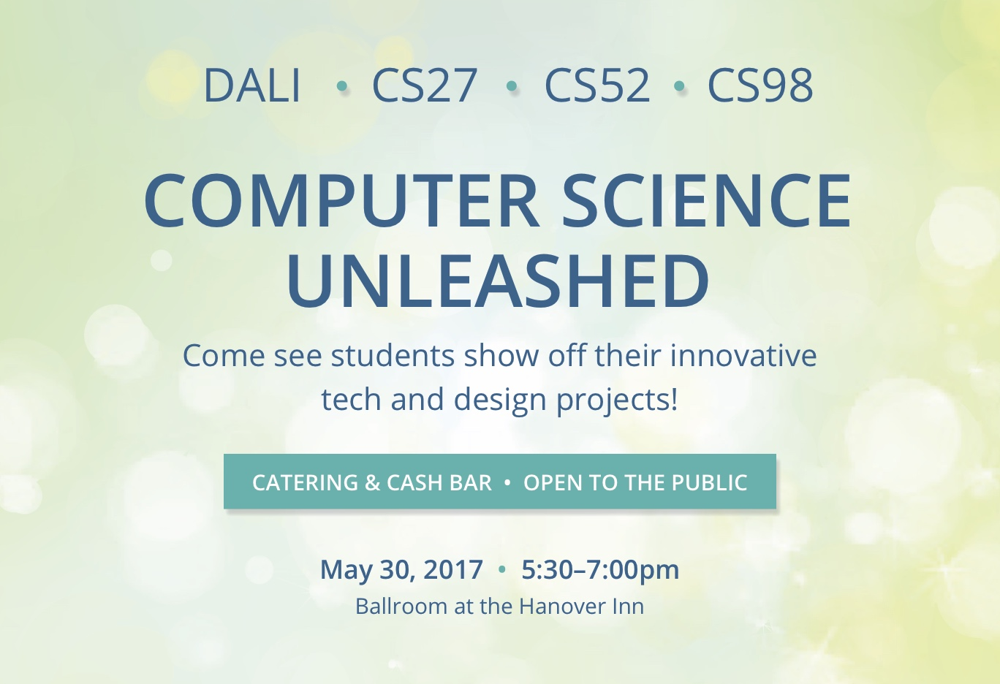

{: .fancy .medium}

Final presentations and demos of the projects. Will be open to public!

Demos are **Tuesday, May 30th, Hanover Inn Ballroom 5:30-7pm**. Please show up at **5:15pm** to set up your table (remember we could have had a final instead!).  The event will be science fair style - you will have a table with your project name and either a screen or a stand for a laptop to better demo your awesome projects.

[Invite your friends!](https://www.eventbrite.com/e/computer-science-unleashed-tickets-34734714466)

Each team will set up their table with a large screen to show the project. The focus is on having a fully functional demo!  

You can have up to 4 slides or a custom website to help:
* Motivate the idea
* Show it in action
* Discuss challenges
* Show user testing

There will be voting and prizes for best demos!

{: .fancy .small}
