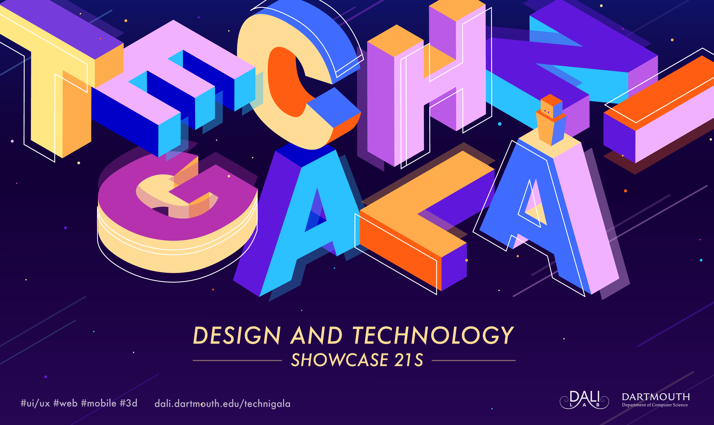

{: .fancy .large}

Final presentations and demos of the projects. Will be open (virtually) to public!

Demos are **Tuesday, June 8, 6-8pm**. 

<!-- Please show up at **5:45pm** to set up your ta  ble (remember we could have had a final giant quiz instead!).  The event will be expo style - you will have a table with your project name and either a screen or a stand for a laptop to better demo your awesome projects. -->

## Invite your friends, your enemies, everyone!

Register here: [https://live.remo.co/e/technigala-21s](https://live.remo.co/e/technigala-21s)

<!-- Each team will get a poster to demarcate their table.  -->

This is a great time to see your product in action, get some real users signed up, and enjoy the fruits of your labors.

Your mission is to show off your fully functional demo!  Have a really short intro to your project ready for when people come by to ask what you have built - don't overwhelm them with too much info, quick intro and then let them play with your demo.  Feel free to have another screen open to your designs if you want.

Grading will be based on how functional the demo is and how bug free it is.

{: .fancy .small}
