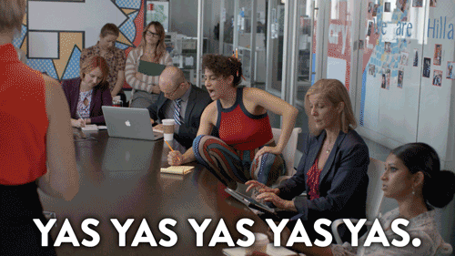

{: .fancy .medium}

## Overview

To get your team going on an idea - let's get started on finding some common passions.  You'll fill out the following worksheet together and add it to your github project repo wiki. 

Here is a markdown file template to get you started with instructions on how/where to upload it below. 

Create this as a wiki page titled `First Team Meeting Worksheet` in github.


```markdown
# First Team Meeting Worksheet


## Team Members Present

* name
* name
* name
* name
* name


## I. Identify a Common Vision
*You’ve all voted on a common idea and themes. Now is the time to work through your commonalities and find a unifying vision between all of you. Answer the following for each of you.  This is the time to speak your mind.  Be honest with each other.*

### Commonalities
*Who makes up your team?  What are some common things you are interested in? Tell each other about the things you put down on the survey and expand on some of your passions.*

### Inspiration
*What are some things each of you is inspired by?*

### Problems of Interest
*What problems are you looking to address? Why?*


### Identify
*Which of the above is most interesting to all of you?*


## II. Narrow In
*Now let's try narrowing in on a problem that interests all of you. Make sure to go around and listen to everybody on your team without interruption.*

### Problem Statement
*State the problem you want to solve succinctly.*


### Rephrase
*Try to rephrase the problem statement (negative) as an opportunity (positive). Word it as a question beginning with, “How might we…?”*


### Reframe
*Reframe the question in at least 5 different ways to change the question fundamentally or imply a different solution set.  Try changing scope, or audience, or technology.*

1. reframe
1. reframe again
1. more 
1. more different
1. last one

### Choose
*Are any of the reframes more interesting?  Choose one.*

#### Coolness
*What could be cool about this potential project?*

#### Challenges
*What could be challenging / unfun about this potential project?*

#### Success
*What does success look like for this project?*


## III. Survey the State of the Art
*Do some research. Try to find what else is out there that is similar, either products, or technical papers that are related.*


### Similar Goals
*Are there others working to achieve similar goals?*

### Differences
*How is your approach different/better than the state of the art?*

### Inspiration
*Are there any existing products/techniques/research, that we could, by analogy, draw inspiration from?*

## IV. Team Dynamics
*And finally, let's think through a couple of team dynamics things as we'll be working together for the next month.*

### Schedule

*Outline a general weekly meeting schedule with at least 1 time that everybody can make. That one meeting must include everyone on the team. A nice tool for this is [when2meet](https://www.when2meet.com/).*

* Zoom link - time of day.

### Responsiveness
*How often should team members be expected to check and respond on Slack?*

often

### Group Decisions
*What types of decisions need to be discussed and approved by the entire group?*

* list

### Individual Decisions
*What types of decisions can be made by a single person?*

* list

### Conflict Resolution
*There are three main types of conflict that tend to occur in group projects*

* *Creative differences: disagreement on any decisions related to the product*
* *Personal differences: friction between people due to manner or words said*
* *Ghosting: consistent missed deadlines or lack of contribution*

*Your group should decide on a plan of action to deal with each type of conflict. There can be multiple levels to each plan. Involving the TA's or instructor can be part of it. Try to be specific*

* plan of action


```


## Github Markdown Files and Repo

We'll use this opportunity to get your first project repo started!  We'll be using github classroom to autoprovision repositories and set up teams.

*Every member* on your team **must** use github classroom to set up the teams correctly and automatically, find the github classroom link on Canvas.

The first person on your team will name the repo and the team name. Each consecutive person will click on the same github classroom link above and simply choose the repo and team to be granted permissions. Please use this as it keeps everything organized and in one place.  Once your team is created and you have all gone through the classroom link you will be able to create additional repositories as necessary later.

*Later we'll set up repos for api or mobile as needed, this will be the frontend repo and where we will keep most docs.*

## GitHub wiki

We'll be using github wikis to keep track of some project documentation. If you haven't used it before [here's how](https://help.github.com/articles/about-github-wikis/). And some tips on using [markdown](https://guides.github.com/features/mastering-markdown/).

🚀 [Initialize your wiki now](https://help.github.com/articles/about-github-wikis/).

And then use the template above to start a page!

## Realtime? 

If you want to collaborate together on markdown files in realtime — rather than having one person type everything in, here's a cool free tool: [HackMD](https://hackmd.io).   Just copy/paste from here into github wiki when you are done. 


## To Turn In:

  * github repository URL to wiki page you created
  * make sure **everyone** on your team has clicked the github classroom link and is on the github team

