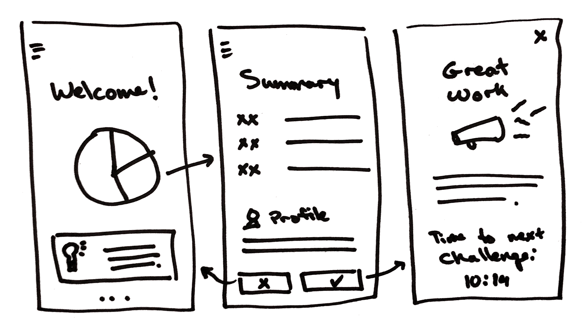
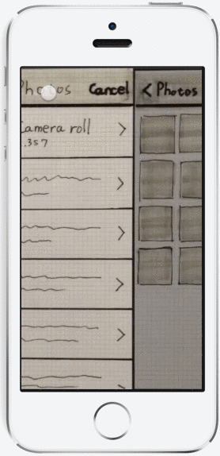

{: .fancy .small}

## Step 1: Paper Sketch
Based on the various features and pages you described in the feature spec, draw up sketches of each view.  Napkin style quick sketches are a good place to start. Focus more on thinking through the common actions that the users will be making rather than how and where the buttons go.  As you draw our these sketches with your team several things will come to light, features you might have missed or interactions that need to be changed.  Make your sketches comprehensive, they should cover all the views and functionality that your apps needs. Additionally you should make a site map style overview showing how the views are connected. It's more important to think through layout and functionality than making sure your color scheme or logo are perfect as you can continue to iterate on those.  Do not use wire-framing software, for wire-framing you might as well just sketch on paper, it is a waste of time to learn a separate program.

Time to take the abstract to concrete. Sketch rough layouts of screens focused on **features**.

### Generate options as a group
* Determine which **(2-5) main features** you will sketch that are essential to your product (e.g. the feed, leaderboard, comments, etc)
* Get thick markers, printer paper, and designate a timekeeper
* Allow for **5 minutes of individual sketching per feature**, working on as many unfiltered iterations as possible in that time limit. Treat this much like improv - try not to self-edit or rule out anything just yet.
* After each round, compare sketches and create a few group versions that incorporates the best of all the ideas. Actively agree/disagree with specific elements. Aim for **2-3 versions per feature**.

### Rules
* Use the “thick marker trick” - the thicker the marker, the more you force yourself to keep the designs at a conceptual level the better. Whiteboard markers are great here too, just take photos!
* Include little or no specific content
* Drop any worries about scale, straight lines, grids, etc.
* Think in flows whenever possible (what views or steps come after?)
* Match your sketches with your flow diagram - what part of the flow is not yet in the sketch?
* Never settle for your first idea!

{: .fancy .medium}

You can [download all sorts of device paper](http://sneakpeekit.com/) to help.

You can put all your sketches together using [Pop](https://marvelapp.com/pop/) — Prototyping on Paper, is a good way to get started without doing high quality designs and get something that you can click through.

{: .fancy .tiny}

## Step 2: Make Prettier

### Figma

Once you are ready to make it prettier just go straight to[Figma](https://www.figma.com/). You'll need to [verify your student account status](https://www.figma.com/student/apply) to verify your .edu email. 

🚀 Create a new [Team Project in Figma under the CS52 Org](https://www.figma.com/files/team/695309768358025992/CS52).  You should have all received an invite at the beginning of term to your @dartmouth.edu emails. *Note: Make sure to create your project in the team - and don't create multiple projects — just one project and one page so you can link your various designs together.*

There's a short [tutorial for figma](http://cs52.me/workshops/design) available as well. 

## Interactive Prototype vs Flow Map

As you are working on your designs you should [create a clickable prototype in Figma](https://help.figma.com/article/199-getting-started-with-prototyping).  Since you already have things set up in Figma with views or storyboard elements, you can create simple interactive connections between them.  Usually you would want to map out your user interactions as a separate graph, as this allows you both to see how each view connects to the rest of your product. However, creating a clickable prototype will allow you to show how you think the product should work and run it by people for feedback.

<iframe style="border: none; " width="300" height="500" src="https://www.figma.com/embed?embed_host=share&url=https%3A%2F%2Fwww.figma.com%2Fproto%2FOSX6FgNYF0vY11cfl1P9qO%2FSommelier%3Fnode-id%3D0%253A1%26scaling%3Dscale-down" allowfullscreen></iframe>
<iframe style="border: none;" width="300" height="500" src="https://www.figma.com/embed?embed_host=share&url=https%3A%2F%2Fwww.figma.com%2Fproto%2FFYyrExk1nzz4Jo9yLYO54iEd%2FRecycleIt-Mockups%3Fnode-id%3D0%253A1%26scaling%3Dscale-down" allowfullscreen></iframe>

## To Turn In:

* Sketches of each view of your product (photos of paper)
* Mockups submitted as [figma](https://www.figma.com) links, with working linked prototype mode.
