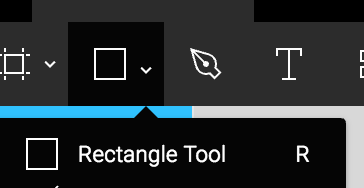

# Designing with Figma

Figma is a browser-based interface design tool that allows for live team editing of files. This means that you can not only access your files from any computer by simply logging in, but anyone on your team can edit files and use shared components.

Figma also has Desktop apps available for download if you prefer that!

If you want to learn more about Figma there many online tutorials including the [Figma YouTube Channel](https://www.youtube.com/channel/UCQsVmhSa4X-G3lHlUtejzLA) that has a lot of short useful videos.

## Getting Set up
Go to figma.com and Sign Up for a new account. This account that you create will be the one you use to log in whether you're in the browser or on the desktop app.

To download the desktop app click on the hamburger menu and then on "Get Desktop app":

## Introduction to the tools
For a brief run-down of the Figma interface take a look at the last 2min of [this video](https://youtu.be/RFi7wQHUP0c?t=1m33s).

And now we can get started!

## Designing your Quiz page
**Create a new file** by either clicking the "New File" button at the end of your files, by clicking on the hamburger menu icon and going to New File, or by going File > New File, or pressing Cmd + n. (Wow so many ways to do one thing)

Now **create an "Artboard"** or what Figma calls a "Frame" by clicking on the frame tool:

Then click on "Desktop HD" on the panel that appears on the right hand side of the screen.

Anything you add onto this frame will be grouped within the frame. Let's try this out.

Select the rectangle tool by clicking on it in the top bar, or by pressing "R":

Now try creating a rectangle over your white Frame. Press "R" again and now create one outside of the frame. You'll see on the left hand bar how the second rectangle was created outside of the frame you created but the first one is grouped within it.

For the purposes of this assignment we want all of our assets to be within the frame we create so if you run into problems with layers etc. take a look at this sidebar.

If you move the rectangle from outside the frame into the frame, Figma automatically puts it into the Frame grouping.

## Creating the Header
### Using Frames and Constraints
Press "F" or select the Frame tool and drag out a frame that stretches across the top of the quiz page and is about 200px tall.

Rename the frame to keep everything organized:

With your header selected, click on the white rectangle under BACKGROUND to open the color picker. Select a new color for the header.

Now go to CONSTRAINTS and change the settings to match these:

Select "Desktop HD" in the layers panel on the left and try resizing your first frame. With the constraint settings of "top" and "left and right" your navbar will adjust width but stay at the top of your frame as you resize the parent frame.

* If you're interested in learning more about how to use Frames to create responsive designs take a look at [this video](https://www.youtube.com/watch?v=rRQAQ1d9q9w) on constraints in Figma.

### Adding a background image and masking

Now to add a background image to the header.

If you're looking for a high resolution do-whatever-you-want images https://unsplash.com/ and  https://www.pexels.com/ are good sites.

Once you have your image, save it somewhere easy to find, such as your desktop.
