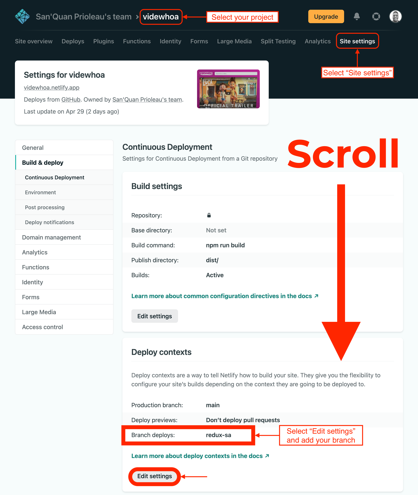

## Overview

We've seen a fair amount of class components *and* functional components in React, but up until now, the distinguishing factor has been that class components have state, while functional components don't. 

Here, we'll see that functional components can have state and work with Redux, and we'll see how to implement them! Hooks allow us to use functional components with state, redux, and other aspects of React that we've mostly seen in the context of class-based components thus far...all in terms of functions! 

## Let's Start

🚀 Clone your **SA2 (React Intro)**.  Create a new branch with `git checkout -b react-hooks`. We're going to refactor all class-based code into hooks, and using a branch seems reasonable for this.

## Search Bar

🚀 Let's start with `search_bar.js`. As a recap, this component is a search bar consists of an `<input>` component. Every time the input value changes, we store it in state under the variable name `searchterm`.

❓ Why did we make this component class-based in the first place? Because it requires state! However, with hooks, we don't need class-based components to have state; instead, we can use the relevant hook!

💡 The first thing that we need to do is transform this class component into a functional one. We can do this by creating a function with the same name, `SearchBar`, which takes in `props` as a parameter. You'll recall that functional components **return** any values that they're supposed to render, which would be returned by the `render()` function of a class component. Let's fill in that part of the component:

```javascript
const SearchBar = (props) => {
  return (
    <div id="search-bar">
      <input onChange={onInputChange} value={searchterm} placeholder="search" />
    </div>
  );
};
```

🗒️ We still need to translate two parts of this component: our use of state and our `onInputChange` function. 

<br>

:bulb: We can incorporate state using React's `useState` function. Start by importing `useState` from React (hint: it's not the default export!).

Then, add the following line right after the function declaration:
```javascript
  const [searchterm, setSearchTerm] = useState('');
```
:bulb: This line declares a variable called `searchterm` in state, as well as a setter, `setSearchTerm`, to update it. That is, if we were to update the `searchterm` variable in state, we'd do so by calling `setSearchTerm(newSearchTerm)`. The initial argument of an empty string sets our initial value for our `searchterm` state.

:mag: Now, let's add the last piece of the puzzle. Declare the `onInputChange` function like an ordinary function, but keep it within the body of `SearchBar`.

<details markdown="block">
<summary>Stuck? Take a look below!</summary>

Add the following immediately before the `return` statement:

```javascript
const onInputChange = (event) => {
    setSearchTerm(event.target.value);
    props.onSearchChange(event.target.value);
  };
```
</details>

🎊 Nice work! The search bar is good to go! You can test this in the same way that you did for the React and Redux short assignments.

## Video Detail
💬 While the video detail doesn't have state, it does use Redux state! You should already have a functional component here, but if you don't, switch it over.

📹 `VideoDetail` should currently track `list` inside of the portion of Redux state declared by the reducer we've defined as `video`, which is declared inside of `mapStateToProps`, which we connect to `VideoDetail` using the function `connect`. If that isn't currently the case, see the Redux short assignment.

:bulb: How can we update this component to use hooks? We can switch out our use of the `connect` function and `mapStateToProps` for `useSelector`! `useSelector` allows us to access different parts of Redux state similarly to `mapStateToProps`.

Instead of the `connect` function, import `useSelector` from `react-redux`. Then, at the top of the `VideoDetail` components, add the following line:

```javascript
const video = useSelector((state) => state.video.selected);
```

:bulb: The above code snippet does the same thing that `mapStateToProps` and `connect` do: it connects `VideoDetail` to Redux store and abstracts out `video`, which is stored in the same place as before! You can now delete `mapStateToProps` and change the export statement to not include `connect`, as follows:

```javascript
export default VideoDetail;
```

🎊 You can now test that this component works as expected. A similar fix can be applied to counters. Woohoo! Two components down, two to go!

## Video List Item
💡 Similar to `VideoDetail`, `VideoListItem` interacts with Redux—but in this case, it uses `mapDispatchToProps`. Just like the `useSelector` equivalent of `mapStateToProps`, `useDispatch` is somewhat similar to `mapDispatchToProps`.

Switch out the `connect` import from `react-redux` for one of `useDispatch`. Then, immediately after the function declaration, define `dispatch` as an instance of `useDispatch()`:

```javascript
const dispatch = useDispatch();
```

💡 Now, wherever you called `props.selectVideo`, instead, call `dispatch(selectVideo(props.video))`. For example, the `onClick` of your list item element could look as follows:
```javascript
onClick={() => dispatch(selectVideo(props.video))}
```

❓ What does this mean? Calling `dispatch(selectVideo(props.video))` essentially states that not only do we want to call `selectVideo` but also connect the function to Redux for this component.

🗒️ Test this component; it should work! One more component to go!

## YouTube
📹 The `YouTube` component has the most moving parts of any in this repository. We're going to use not one, not two, but **three** hooks to replicate its functionality with hooks.

📖 First, let's translate our class-based component to a functional one. Something that will be quite clear from this swap is that **functional components don't use the keyword `this`.** Our new component won't have a constructor, which is also specific to class-based components. For now, let's table everything in that function and translate `search` and `render`, just like we did earlier. We'll come back for an initial search and debouncing that function.

🎣 Now, onto using hooks! Let's start with something we've seen before: `useDispatch`! Swap out the `connect` import statement, add a line to reference `useDispatch` at the top of the functional component, and wrap `setVideos` in a call of `dispatch`. Take another look at the VideoListItem code if you get stuck.

🗒️ There are two parts of our original functionality that we're still lacking: an initial search and debouncing our search function. We'll handle these with two new hooks now.

🔍 We want an initial search to run on the component the first time it's rendered. Where should we put this call? In the function body itself? That's not a great idea, because the function is run on every render, and we only want this initial search to appear the first time.

💡 This is a perfect use case for the `useEffect` hook! Import it from `react`, in the same way that we did `useState` earlier, and stick the following code into the body of the function, after your declaration of `search` and before your `return`:

```javascript
useEffect(() => {
    search('pixar');
  }, []);
```

💡 The `useEffect` hook tells React that there's something your component needs to do after it's rendered. It takes input of a function and a dependency array. Every time a value in the dependency array is updated, it triggers a function call. Here, since we have no dependencies, this function is called once when the component is mounted, similar to `componentDidMount` from our class-based alternatives.

:bulb: There's one last thing we need to do: debounce our search function! Import `useCallback`, also from `react`, and put the following line after the search function and before our `return`:

```javascript
const debouncedSearch = useCallback(debounce(search, 500), []);
```
💡 The `useCallback` hook is structured similarly to `useEffect`. It returns a memoized version of the callback that is passed—in, in this case `debounce(search,500)`. The debounce function returns a debounced version of the search function that batches up calls every half-second (500 milliseconds). This hook, similar to `useEffect`, is useful for preventing unnecessary renders, but specifically for callback functions.  Since a hooks based component is just an function, every const and function definition is recreated every render call - to prevent that, `useCallback` takes a function and returns a version of it that persists across renders.  

To integrate `debounceSearch` instead of `search` itself, swap out `search` for `debouncedSearch` in the `onSearchChange` attribute of `SearchBar` in the `return` statement. This call of the component should now look like the following:
```javascript
<SearchBar onSearchChange={debouncedSearch} />

```

🎥 Your YouTube component—and the shor assignment as a whole—should now be fully up and running! Nice work!

## Test it

If you haven't by now, please do it here!

## Deploy it!

Deploy from this branch using Netlify! You know the drill by now.

{: .small}

## To Turn In (Canvas)

* url to videos assignment hooks branch of github repo
* url to video videos Netlify app
* remember that all your code should lint cleanly
* your youtube searcher should have the same functionality as before, but now with hooks!

## Resources

* [Hooks introduction](https://reactjs.org/docs/hooks-intro.html)
* [Hooks API reference](https://reactjs.org/docs/hooks-reference.html)
