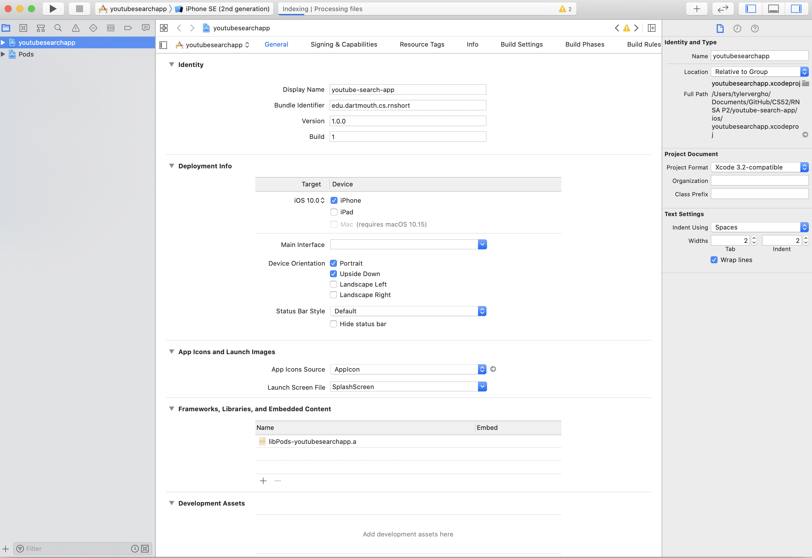
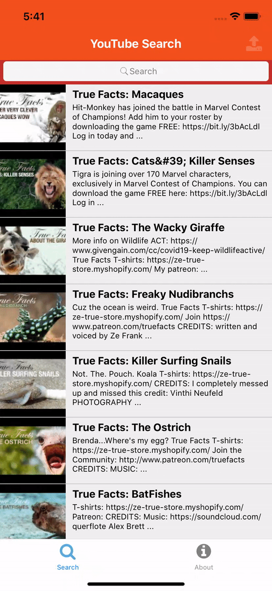
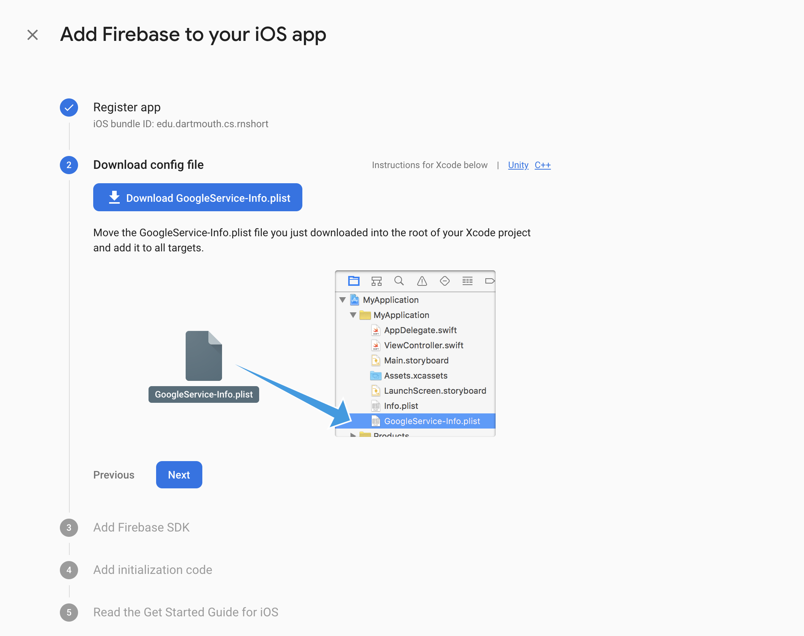
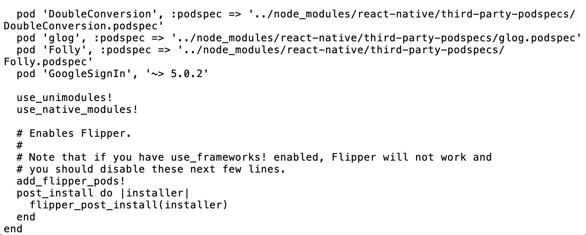
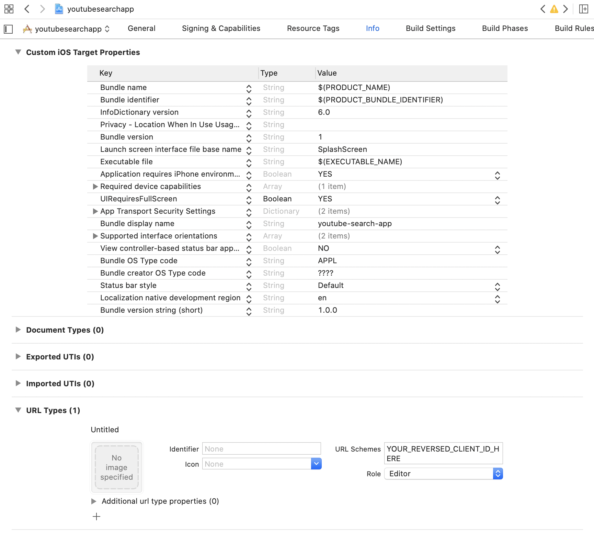
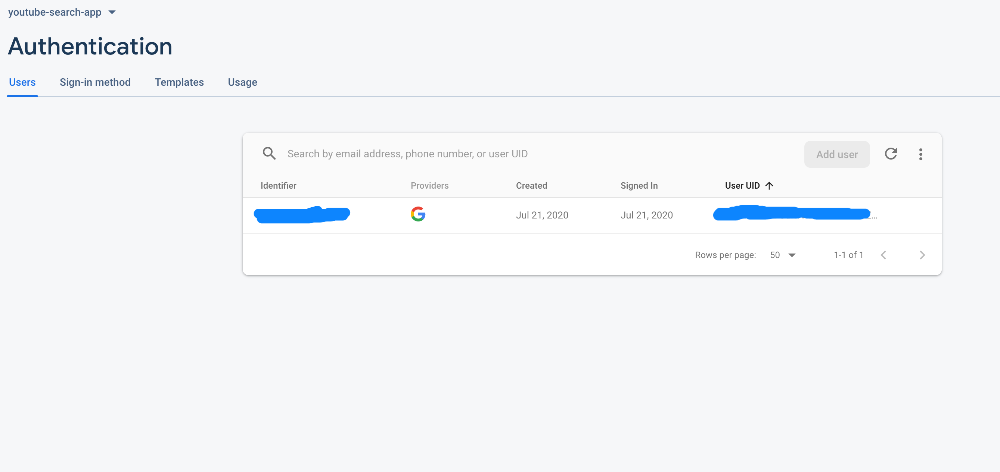
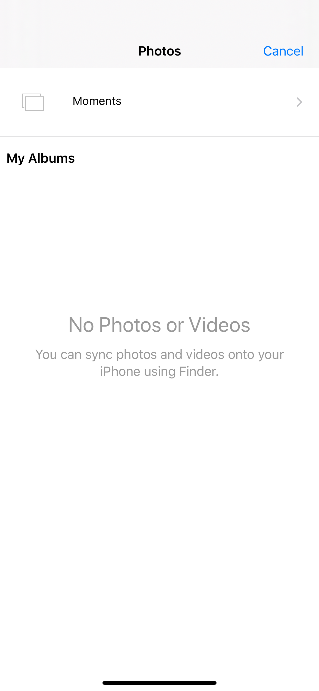
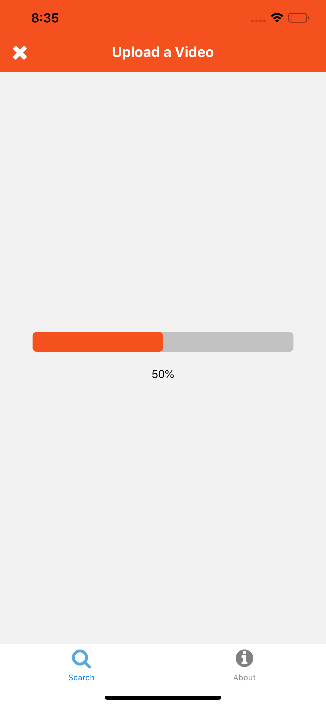
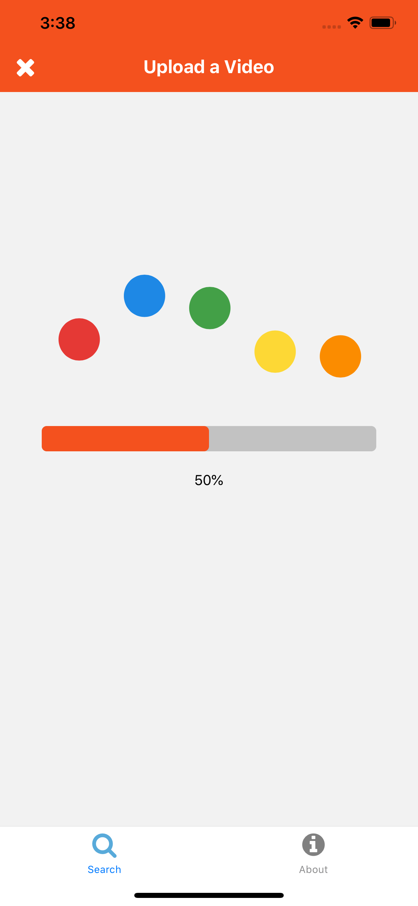



# Advanced React Native

This short assignment will build off the React Native app you created in [part 1](http://cs52.me/assignments/sa/react-native/) to search for and display YouTube videos. If you haven't completed that project yet, you should do so before starting this short assignment.

We will be adding authentication, video uploads, and basic animations to this app to further showcase the power of React Native. 

⚠️ For this assignment, we'll be removing Expo and running the app as a bare React Native app through Xcode. We'll also only focus on iOS development (although many of these steps are easily extendable to Android). Because of this, you'll need a Mac to complete this tutorial and you should [download Xcode](https://apps.apple.com/us/app/xcode/id497799835) before starting.

## Ejecting from Expo

First, we'll need to **eject** from our trusty Expo client (oh no!) to install and set up the dependencies we'll need for this assignment. Ejecting – or the process of removing Expo and configuring your project as a standard React Native app – is unnecessary in many cases. Often, it makes sense to keep all development in Expo and never eject, or only eject towards the end of development. 

However, some modules will require you to install custom native code (usually indicated by references to "linking" in the installation instructions), which requires removing Expo and exposing the iOS and Android project files. While Expo does have its own authentication and background process modules (which we'll be using), they rely on Expo API keys and generally aren't as robust or adaptable as their native equivalents. 

⚠️ While Expo is constantly improving, the eject process tends to produce bugs and your app may not always compile properly straight after ejecting. If that happens, Google your error message – eject errors are common enough that someone likely has documented the error you're encountering – or post in the Slack group for this short assignment. 

🚀`git commit` any changes you've made before starting. This will allow you to easily revert back if something goes wrong with the eject process or you decide to switch back to the managed workflow in the future. 

🚀Run `expo eject` in your app's directory. You can name your Android package and iOS bundle identifier whatever you want – it should be unique and in the format of a *reverse domain name* (e.g. edu.dartmouth.cs.rnshort). Expo will then generate `ios` and `android` folders for you containing traditional projects that can be opened with Xcode or the Android SDK. These projects essentially serve as the bridge between your JS code and the native platform code. 

🚀After this, [install Cocoapods](https://cocoapods.org/) if you don't already have them installed (you'll only have to do this once). Then, `cd` into your `ios` folder and run `pod install` to install all of your dependencies for iOS. 

### Xcode

🚀Next, let's check to make sure the app still compiles and builds properly. You can do this by running `yarn ios` (the equivalent of `expo start`) from the terminal to launch a simulator, but let's do this through Xcode the first time so we can easily catch any errors. 

🚀In your `ios` folder, open the `.xcworkspace` file (**not** `.xcodeproj`) in Xcode. 

{: .tiny }

🚀Click the run button (▶️) at the top of the screen to build and run your app on a simulator. 

❄️ Note that the build process takes a while, especially for the first time. That's one downside of bare React Native apps as opposed to managed Expo projects – you have to wait for the Xcode compiler to bundle everything into a native app package before testing and debugging your app. You'll still get access to hot reloading once the app's open, though. 

At this point, if the simulator pops up with your app loaded, then you've successfully ejected from Expo!

## Upload Screen

Let's create the screen that'll be used to upload videos from our app. This will require another set of nested navigators to provide two ways to navigate away from our search page: to the VideoDetail component or the Upload component.

🚀In `components/upload.js`, let's create an empty view for now to represent our Upload component.

```js
import React from 'react';
import { View } from 'react-native';

const Upload = (props) => {
  return (
    <View />
  );
};

export default Upload;
```

### Header

Now, let's create a custom header component to allow us to navigate between our search screen and upload screen. This allows us to handle navigation ourselves, which is nice, and enables some more complex header configurations and layouts.

🚀Fill in `components/header.js`: 

```js
import React from 'react';
import {
  View, StyleSheet, Text, Dimensions, TouchableOpacity,
} from 'react-native';
import Ionicons from 'react-native-vector-icons/FontAwesome';
import { useNavigation } from '@react-navigation/native';

const UploadHeader = ({ title }) => {
  const navigation = useNavigation();
  const isUpload = title === 'Upload a Video';

  return (
    <View style={headerStyles.header}>
      <Text style={{ color: 'white', fontWeight: '700', fontSize: 18 }}>{title}</Text>
      {!isUpload
        ? (
          <TouchableOpacity style={headerStyles.uploadIcon} onPress={() => { navigation.navigate('Upload'); }}>
            <Ionicons name="upload" size={26} color="#fff" />
          </TouchableOpacity>
        )
        : (
          <TouchableOpacity style={headerStyles.closeIcon} onPress={() => { navigation.goBack(); }}>
            <Ionicons name="times" size={26} color="#fff" />
          </TouchableOpacity>
        )}
    </View>
  );
};

const headerStyles = StyleSheet.create({
  header: {
    backgroundColor: '#f4511e',
    flex: 1,
    alignItems: 'center',
    justifyContent: 'center',
    minHeight: 50,
    width: Dimensions.get('window').width,
  },
  uploadIcon: {
    position: 'absolute',
    right: 15,
  },
  closeIcon: {
    position: 'absolute',
    left: 15,
  },
});

export default UploadHeader;
```

❄️ There's a lot going on here, so let's break it down. We're sharing this header between two screens – the search view and the upload view – so we pass the title in as a prop and use that to define which icon the header should display. We're also using the `useNavigation` hook conveniently provided by React Native Navigation to handle opening and closing our screens. Finally, `TouchableOpacity` is a default React Native component that essentially serves as a more flexible button – you can use it to receive onPress events and it automatically responds by decreasing the opacity of its children when pressed.

🚀Let's update `search_tab.js` so we can display our new header. Replace the SearchTab component with the following:

```js
const SearchTab = () => {
  return (
    <Stack.Navigator>
      <Stack.Screen name="Search"
        component={SearchUploadNavigator}
        options={{ headerShown: false }}
      />
      <Stack.Screen name="Detail" component={VideoDetail} />
    </Stack.Navigator>
  );
};
```

🚀And define `SearchUploadNavigator` directly above `SearchTab` (make sure to update your imports as well):

```js
const SearchUploadNavigator = () => {
  return (
    <Stack.Navigator mode="modal" initialRouteName="SearchScreen">
      <Stack.Screen name="SearchScreen"
        component={VideoList}
        options={{
          headerStyle: {
            backgroundColor: '#f4511e',
          },
          headerTintColor: '#fff',
          headerTitle: (props) => <UploadHeader {...props} title="YouTube Search" />,
        }}
      />
      <Stack.Screen name="Upload"
        component={Upload}
        options={{
          headerStyle: {
            backgroundColor: '#f4511e',
          },
          headerTintColor: '#fff',
          headerTitle: (props) => <UploadHeader {...props} title="Upload a Video" />,
        }}
      />
    </Stack.Navigator>
  );
};
```

What happened here? We kept the "Search" route from the original navigator, but instead of making it point to a component, we directed it to *another navigator* that controls navigation between the search and upload screens. The reason why we did this was so we could use modal navigation mode (where the view comes from the bottom instead of the side) with the Upload component. Notice how we override the header on the original navigator and use `SearchUploadNavigator` to control the custom headers.

❄️ Also notice how we pass the `UploadHeader` component into the `headerTitle` option of `Stack.Screen`. `headerTitle` allows you to pass in another component, and since we defined the width of `UploadHeader` to be the width of the window it takes up the whole header. 

If you did it right, you should now be able to do this:

{: .tiny }

Cool, right?

## Firebase

Let's connect our app with Firebase to allow us to authenticate with Google. 

### Configuration

🚀Go to [firebase.google.com](https://firebase.google.com/) and create a new project.

🚀Click the "iOS" button on the main screen to add an iOS app to your project. The bundle ID should be the same as the one you set when ejecting from Expo – if you can't remember it, then go to Xcode and check the build settings.

🚀Download the config file generated by Firebase and add it to your project's root in Xcode. 

{: .tiny }

🚀While we're in Xcode, let's modify a couple of the automatically generated app files so they're compatible with Firebase. Open `AppDelegate.m` from Xcode and add this to the top: 

```
#import <Firebase.h>
```

🚀And, at the top of the `didFinishLaunchingWithOptions` method, add this:

```
- (BOOL)application:(UIApplication *)application didFinishLaunchingWithOptions:(NSDictionary *)launchOptions {
  if ([FIRApp defaultApp] == nil) {
    [FIRApp configure];
  }
  // Rest of the default function code
}
```

🚀Finally, in your project directory, run `yarn add @react-native-firebase/app` to add the Firebase NPM package. Then run `cd ios` and `pod install` to install its native dependencies. 

Your app is now configured to use Firebase! Rebuild your app to make sure it still runs. 

### Authentication

Now, let's set up authentication for our app. Although we're just using Google login in this case for the purposes of being able to upload videos to YouTube, this process can be scaled to add full user authentication to any React Native app. 

🚀In the Firebase console, click the Authentication icon in the sidebar and then the "Set up sign-in method" button.

🚀Enable Google as a sign-in provider. Save the web client ID – you'll need it later.

🚀Let's define the login UI for our app. Change `upload.js` to the following:

```js
import React from 'react';
import {
  View, TouchableOpacity, Text, StyleSheet,
} from 'react-native';

const Upload = (props) => {
  const signInButton = () => {
    return (
      <TouchableOpacity style={styles.button}>
        <Text style={{ color: 'white' }}>Sign in with Google</Text>
      </TouchableOpacity>
    );
  };

  return (
    <View style={styles.background}>
      {signInButton()}
    </View>
  );
};

const styles = StyleSheet.create({
  background: {
    flex: 1,
    alignItems: 'center',
    justifyContent: 'center',
  },
  button: {
    flex: -1,
    alignItems: 'center',
    justifyContent: 'center',
    padding: 10,
    backgroundColor: '#f4511e',
    borderRadius: 5,
  },
});

export default Upload;
```

🚀Install the Google login SDK – which Firebase will use to login with Google – using `yarn add @react-native-community/google-signin @react-native-firebase/auth`. 

🚀Open your Podfile (in the `ios` directory) using any text editor, and at the bottom add `pod 'GoogleSignIn', '~> 5.0.2'`. Then, you know the drill – `cd ios` and `pod install` to get all the native dependencies. 

{: .tiny }

🚀In Xcode, open `GoogleService-Info.plist` and copy your REVERSED_CLIENT_ID. Then, click on your project in the left sidebar and add a new URL type under the Info panel containing your REVERSED_CLIENT_ID. 

{: .tiny }

🚀Rebuild the app to capture all your changes.

🚀Let's actually try signing in! At the top of `upload.js`, add the following imports (note that this is where you use your Web Client ID from Firebase):

```js
import auth from '@react-native-firebase/auth';
import { GoogleSignin } from '@react-native-community/google-signin';

GoogleSignin.configure({
  webClientId: YOUR_WEB_CLIENT_ID,
  scopes: ['https://www.googleapis.com/auth/youtube.upload'],
});
```

🚀And then at the very top of the Upload functional component:

```js
const Upload = (props) => {
  const [initializing, setInitializing] = useState(true);
  const [user, setUser] = useState();

  function onAuthStateChanged(newUser) {
    setUser(newUser);
    console.log(newUser);
    if (initializing) setInitializing(false);
  }

  async function onGoogleButtonPress() {
    const { idToken } = await GoogleSignin.signIn();
    const googleCredential = auth.GoogleAuthProvider.credential(idToken);
    return auth().signInWithCredential(googleCredential);
  }

  async function signInOnStart() {
    await GoogleSignin.signInSilently();
  }

  useEffect(() => {
    const subscriber = auth().onAuthStateChanged(onAuthStateChanged);
    signInOnStart();
    return subscriber; // unsubscribe on unmount
  }, []);

  if (initializing) return null;
```

🚀Add `onGoogleButtonPress` to the `onPress` prop of your sign in button.

🚀Try signing in! It'll warn you about not being a verified app, which you can safely ignore, and then prompt you to grant access to your YouTube account. After the window closes, you should see your user data printed in the console. 

If you open the authentication pane of your Firebase console, you should see a new user added.

{: .tiny }

❄️ If you've used other authentication APIs in the past, you might be wondering whether we need to store a refresh token or some other means of persisting the user's data between app closures. We don't want to have to login again every time we reload the app! Luckily, Firebase deals with many of the complexities behind persisting a user for you. In this case, the `onAuthStateChanged` function subscribes to authentication state changes and automatically updates the state when the component is mounted with the user's account info. Additionally, the `signInOnStart` function automatically refreshes the user's Google API access token when the component loads so that we can use it to call the YouTube API. 

🚀Finally, add an upload button and update what you return to check whether or not a user has logged in:

```js
  const uploadButton = () => {
    return (
      <TouchableOpacity style={styles.button}>
        <Text style={{ color: 'white' }}>Upload Video</Text>
      </TouchableOpacity>
    );
  };

  return (
    <View style={styles.background}>
      {user ? uploadButton() : signInButton()}
    </View>
  );
```

You should see your app change to display the new upload button. You've now implemented Google sign-in through Firebase for your app!

## Upload Video

Now, let's actually set up video uploading to YouTube. 

### Getting Video from Camera Roll

In order to retrieve a video to upload, we'll need to ask for permission from the user to access the Camera Roll and then display a dialog prompting them to select a video. Luckily, Expo has some built-in libraries that allow us to do this fairly easily.

❄️ But I thought we got rid of Expo? Although we ejected the app from the Expo client, we can still use Expo-made packages in our app – essentially, you get the best of both worlds. 

🚀Run `expo install expo-image-picker expo-permissions` in your command line. Then, `cd ios` and `pod install` again. 

🚀In Xcode, open your `Info.plist` as source code by right-clicking on the file in the sidebar and selecting Open As > Source Code. Then, add the following key-value pair to the bottom of the file:

```
<key>NSPhotoLibraryUsageDescription</key>
<string>Give $(PRODUCT_NAME) permission to save photos</string>
```

🚀Rebuild your app.

🚀In `upload.js`, add the following under the `signInOnStart` function:

```js
  async function retrieveVideo() {
    const { status } = await Permissions.askAsync(Permissions.CAMERA_ROLL);
    if (status === 'granted') {
      const result = await ImagePicker.launchImageLibraryAsync({
        mediaTypes: ImagePicker.MediaTypeOptions.Videos,
        allowsEditing: false,
        quality: 1,
      });
      if (!result.cancelled) {
        return result;
      }
    }
  }

  async function upload() {
    const video = await retrieveVideo();
    console.log(video?.uri);
  }
```

🚀Update your imports:

```js
import * as ImagePicker from 'expo-image-picker';
import * as Permissions from 'expo-permissions';
```

🚀And don't forget to add `upload` to the onPress handler of `uploadButton`!

❄️ What is this `?.` operator we used in `console.log`? The [optional chaining](https://developer.mozilla.org/en-US/docs/Web/JavaScript/Reference/Operators/Optional_chaining) operator is new in the 2020 edition of Javascript. It allows you to check for nested properties in an object without receiving a TypeError for attempting to read properties from a missing or undefined object reference. Cool, right?

Now, when you click the upload button, it should prompt you to grant permission to access the Camera Roll and open a dialog to allow you to select a video. One problem – if you're testing this on a simulator, there aren't any videos to select! You'll see the console log "undefined" when you close the dialog. Let's fix that. 

{: .tiny }

🚀Choose a video from your hard drive and drag it onto the simulator. You can use any video – I used Dartmouth's [2020 commencement address](https://www.youtube.com/watch?v=fIQoLdlJPk0) – but make sure it's at least several hundred MB so that it doesn't upload instantly. 

⚠️ If you encounter an error when attempting to import your file from Finder, try moving it to a different directory and re-import it. 

Now, you should be able to select your video from the Camera Roll and see the file URI displayed in the console.

### Uploading the Video

We *could* use Axios to upload the video, but for a large upload like this we want to allow the user to send the app to the background and conduct other tasks on the device without fear of terminating the download. Let's install another module to help us accomplish that. 

🚀Run `yarn add react-native-background-upload` and then `cd ios` `pod install`.

🚀Since we created a new Firebase project for this app and we're using that API key to authenticate the user, we'll need to re-enable access to the YouTube API. Go to your [Google Cloud console](https://console.cloud.google.com/) (not Firebase console) and follow the instructions from Short Assignment 4 to enable the YouTube Data API. Note that you don't have to generate a new API key, just enable the API.

🚀In your `upload` function, under the `console.log` add the following code:

```js
    if (video) {
      const { accessToken } = await GoogleSignin.getTokens();
      const { size } = await stat(video.uri);

      const uploadData = await axios({
        method: 'POST',
        url: 'https://www.googleapis.com/upload/youtube/v3/videos?uploadType=resumable&part=snippet,status,contentDetails',
        headers: {
          Authorization: `Bearer ${accessToken}`,
          'content-type': 'application/json; charset=UTF-8',
          'x-upload-content-type': 'video/*',
          'x-upload-content-length': size,
        },
        data: {
          snippet: {
            title: 'RN Video Upload',
            categoryId: 24,
          },
          status: {
            privacyStatus: 'private',
          },
        },
      });

      const uploadUrl = uploadData?.headers?.location;
      console.log(uploadUrl);
    }
```

🚀And, we'll need to install the `react-native-fs` module to get the video file size. Run `yarn add react-native-fs` and then manually add `pod 'RNFS', :path => '../node_modules/react-native-fs'` to your Podfile like before. Then, run `pod install` and add the following import statement:

```js
import { stat } from 'react-native-fs';
```

❄️ There's a lot going on here, so let's break it down. YouTube follows a [multi-step upload protocol](https://developers.google.com/youtube/v3/guides/using_resumable_upload_protocol), and the first step is to retrieve the URL that will be used for upload. We then call YouTube's upload API with the user's access token and details about the video to obtain the URL. Note that some of these parameters, like the video title and category, would be generated based on user input in an actual app – you can see how to obtain YouTube category IDs [here](https://developers.google.com/youtube/v3/docs/videoCategories/list). 

⚠️ For basic versions of the API, there's a quota on the amount of times you can call this API endpoint per day – make sure to not test these steps more than a couple times once you get it working, or you may encounter 403 errors until midnight Pacific Time the next day. 

🚀Let's actually upload the video now! Replace the last `console.log` with the following:

```js
    const uploadOptions = {
        url: uploadUrl,
        path: video.uri,
        method: 'PUT',
        type: 'raw',
        headers: {
          Authorization: `Bearer ${accessToken}`,
          'content-type': 'video/*',
          'content-length': size,
        },
      };

      BackgroundUpload.startUpload(uploadOptions).then((uploadId) => {
        BackgroundUpload.addListener('progress', uploadId, (data) => {
          console.log(data.progress);
          setProgress(data.progress);

          if (progress === 100) {
              setProgress(0);
          }
        });
        BackgroundUpload.addListener('error', uploadId, (data) => {
          console.log(`Error: ${data.error}`);
        });
      }).catch((err) => {
        console.log(err);
      });
```

🚀Update your imports:

```js
import BackgroundUpload from 'react-native-background-upload';
```

🚀And of course, add another variable to your state configuration:

```js
const [progress, setProgress] = useState(0);
```

Now, after selecting your video, you should see the progress logged in the console as it uploads.

### Progress Bar

Just logging our progress isn't very interesting, though. We want to keep the user informed of how much their upload has progressed. 

🚀Let's create a `progressBar` function to render a progress bar. Under where you have `uploadButton`:

```js
const progressBar = () => {
    return (
      <>
        <View style={styles.progressBar}>
          <View style={[styles.progress, { width: `${progress}%` }]} />
        </View>
        <Text style={{ marginTop: 20 }}>{`${Math.floor(progress)}%`}</Text>
      </>
    );
  };
```

🚀Update your return block to conditionally check for progress:

```js
return (
    <View style={styles.background}>
      {progress > 0 && progressBar()}
      {progress === 0 && (user ? uploadButton() : signInButton())}
    </View>
  );
```

🚀And add some styles:

```js
  progressBar: {
    width: '80%',
    height: 25,
    backgroundColor: 'rgba(0,0,0,0.2)',
    borderRadius: 5,
  },
  progress: {
    position: 'absolute',
    left: 0,
    height: 25,
    backgroundColor: '#f4511e',
    borderRadius: 5,
  },
```

It should look like this:

{: .tiny }

🚀But wait! If we close the upload modal and wait for the component to unmount, when we open it again we don't have access to the progress bar from before! Let's update our `useEffect` hook to listen for a progress event when the modal opens:

```js
  useEffect(() => {
    const subscriber = auth().onAuthStateChanged(onAuthStateChanged);
    signInOnStart();

    BackgroundUpload.addListener('progress', null, (data) => {
      console.log(data.progress);
      setProgress(data.progress);

      if (progress === 100) {
        setProgress(0);
      }
    });

    return () => {
      subscriber(); // unsubscribe on unmount
      DeviceEventEmitter.removeAllListeners();
    };
  }, []);
```

🚀And add `DeviceEventEmitter` to your `react-native` imports.

❄️ What does useEffect do? useEffect is a React hook designed to mirror the functionality of componentDidMount, componentDidUpdate, and componentWillUnmount in functional components. Here, the empty dependency array [] supplied as the second parameter to the hook specifies that the function should run once upon mount, and returns a cleanup function for our event subscriptions that will run on unmount. You can add objects to the dependency array to specify that useEffect should run when one of those parameters changes. 

## Animation

Finally, let's add some animations to our upload screen to make it more interesting.

### Lottie

🚀Run `yarn add lottie-react-native lottie-ios@3.1.8`, then `cd ios` and `pod install`. This adds [Lottie](https://github.com/react-native-community/lottie-react-native) to your project, a framework that parses Adobe After Effects animations and renders them natively on mobile.

🚀We're going to add an animation from [LottieFiles](https://lottiefiles.com/), a free library of Lottie animations that you can download and use in your projects. We're going to be using [this](https://lottiefiles.com/196-material-wave-loading) loading indicator, which you can download [here](./196-material-wave-loading.json). Download it and put it in your `assets` folder. 

🚀In `upload.js`, add the following import: 

```js
import LottieView from 'lottie-react-native';
```

🚀And update your `progressBar` function:

```js
  const progressBar = () => {
    return (
      <>
        <LottieView source={require('../assets/196-material-wave-loading.json')} autoPlay loop style={{ marginBottom: 100 }} />
        <View style={styles.progressBar}>
          <View style={[styles.progress, { width: `${progress}%` }]} />
        </View>
        <Text style={{ marginTop: 20 }}>{`${Math.floor(progress)}%`}</Text>
      </>
    );
  };
```

You should now have a nice complement to your progress bar.

{: .tiny }

### React Native Animatable

React Native Animatable is a library that makes it easy to animate `components` in React Native. Let's use it to spruce up our upload button.

🚀Run `yarn add react-native-animatable`.

🚀Import the module:

```js
import * as Animatable from 'react-native-animatable';
```

🚀Then, wrap your button components in Animatable.View, like so:

```js
  const signInButton = () => {
    return (
      <Animatable.View animation="fadeInLeft" delay={500}>
        <TouchableOpacity style={styles.button} onPress={onGoogleButtonPress}>
          <Text style={{ color: 'white' }}>Sign in with Google</Text>
        </TouchableOpacity>
      </Animatable.View>
    );
  };

  const uploadButton = () => {
    return (
      <Animatable.View animation="fadeInLeft" delay={500}>
        <TouchableOpacity style={styles.button} onPress={upload}>
          <Text style={{ color: 'white' }}>Upload Video</Text>
        </TouchableOpacity>
      </Animatable.View>
    );
  };
```

That was easy!

{: .tiny }

## We're done!

You successfully took off the Expo training wheels and built a full-fledged video uploader, complete with animations, background loading, and Firebase authentication. And you did it without having to write a single line of native code!  

There's a lot going on in `upload.js` – think about how you'd divide up the code and organize a larger React or React Native project.

We breezed through Firebase and the YouTube API, but there's a lot more functionality to them that's accessible with a simple `yarn add`. 

## Submission

To submit, create a new GitHub repo and push your code up to it. On Canvas, submit the URL to your repo.

## Resources

* https://rnfirebase.io/auth/social-auth
* https://github.com/react-native-community/google-signin
* https://developers.google.com/youtube/v3/guides/using_resumable_upload_protocol
* https://docs.expo.io/versions/latest/sdk/imagepicker
* https://github.com/Vydia/react-native-background-upload



