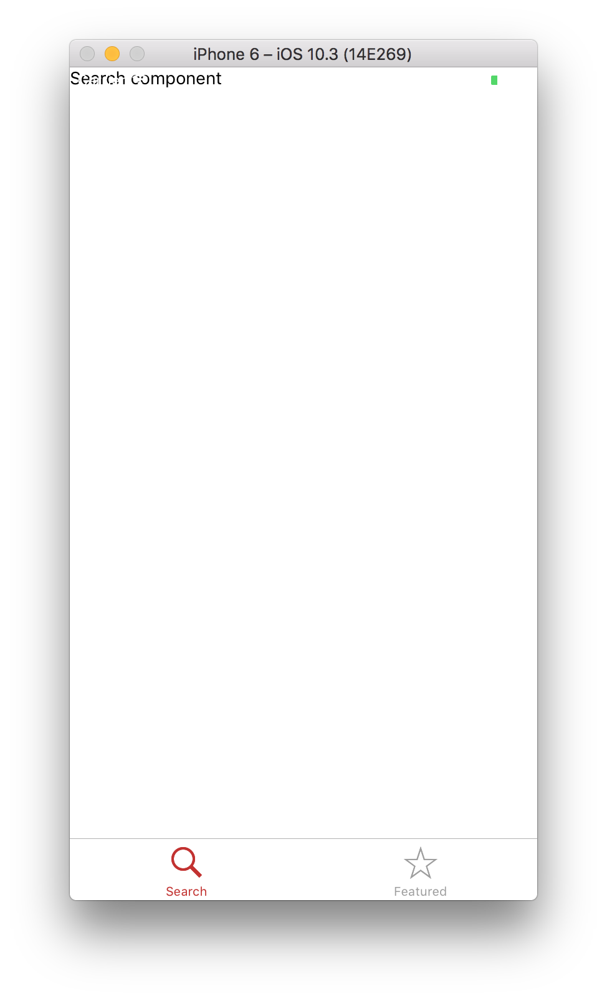
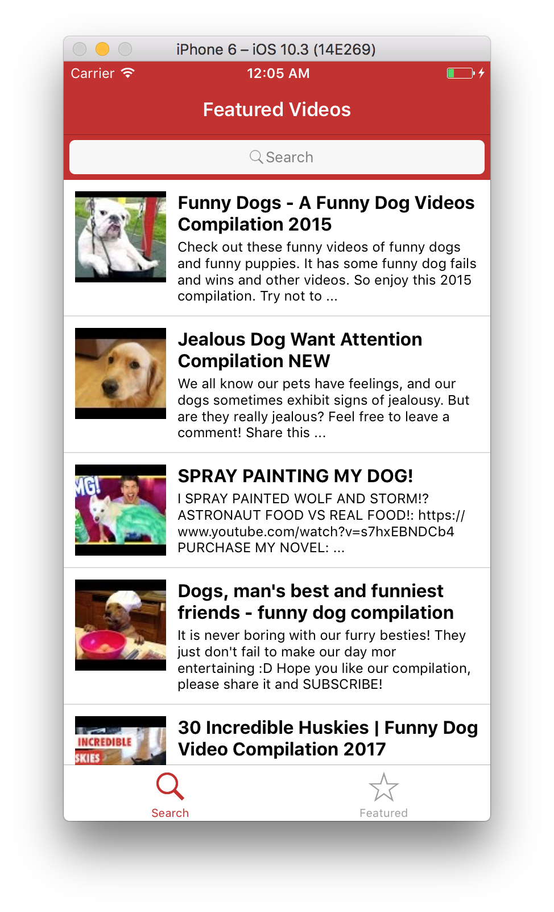


<!-- raw mode to ignore liquid tags that have {{ }} -->


# react-native-workshop

Today we'll be using react-native to build a simple react native app that allows us to search YouTube (just like short assignment 4, way back when.)

React Native is very cool - all your react skills can transfer over.

⚠️ Important note!  This is tested on OS X and requires an updated version of Xcode. If you are on windows or have a mixed operating systems on your team - we will be using [Expo.io](http://expo.io) to start your project rather than react-native-init. Expo provides a cool cloud simulator so you can test your app more easily. Everywhere you see the ☁️ symbol, is where you would do something slightly differently for Expo.

## Special Notes
🚀 Take special note of this

:snowflake: This is pretty cool

## Set Up:

### Expo.io

🚀 Go to http://expo.io and create a free account!

### Command Line

:warning: We should already have node installed on our machines, but just in case, let's go way to the beginning:

`$ brew install node`

🚀 And we should install Watchman, too, since react-native depends on it.

`$ brew install watchman`

Watchman is a file watching service that records when files change, and triggers actions when it detects changes.

🚀 Alright, now we're ready to use react-native! We'll be using `exp` the expo command line to init our project.

`$ npm install -g exp`

Great! Now we're ready to create our repo.

```sh
$ react-native init VidSearch
$ cd VidSearch
$ react-native run-ios
```

When the iPhone simulator pops up, you should be seeing a basic template for an iPhone app.

:snowflake: What just happened? React-Native bundled up everything for us, ran it through XCode, and opened up a simulator, all through the command line and without us ever having to open up XCode or write a single line of Swift code. Neat.

Let's take a sec to talk about how the simulator works. There are two things you can do: `command-R` will refresh the simulator, which is useful each time you save. It's a little annoying, though, especially since we're used to hot reloading in the browser at this point. If you hit `command-D`, a menu will pop up. From there, you can click "Enable Hot Reloading". It might take a few seconds to load (don't panic like we did when the percent complete actually starts going down...) but when it's done it'll refresh the page every time we save something in the project.

:snowflake: Side note: We should appreciate how cool this is. If you've ever tried to program for smartphones before, you know that each time you test, you have to press run in the IDE and then wait for the app to compile. If you're uploading to an actual device instead of a simulator, it takes even longer. React Native is cutting through all the overhead for us so we can do instantaneous reloads without all the wait time.

## Installing Dependencies
We're going to need a few dependencies from our trusty friend, the Node Package Manager.

🚀 Since we're making calls to the YouTube api, it would help if we made GET calls with axios, so:

`$ yarn add axios`

Next, we'll need some specific react-native components that some other open source developers have kindly provided to us. This is fairly common in the react-native community, and it's great to have these pre-styled components at our disposal so we don't have to go through all the trouble of making an input field look nice, for example.

🚀 There's one additional component we'll be using in the workshop: [react-native-search-box](https://github.com/crabstudio/react-native-search-box), a simple input field made to look like the classic iOS search bar.

`$ yarn add react-native-search-box`

🚀 And of course, we need to just install everything that react-native init has kindly provided us with in its `package.json`:

`$ yarn`

## Basic Navigation
One of the classic navigation components in iOS is the Tab Bar.

🚀 Create a new directory in the top level of the project folder called `components`.
Then create two new files: `components/search.js` and `components/featured.js`.

```js
import React, { Component } from 'react';

import {
    NavigatorIOS,
    View,
    Text,
  } from 'react-native';

class Search extends Component {
  render() {
    return (
      <View style={styles.container}>
        <Text style={styles.text}>
          Search component
        </Text>
      </View>
    );
  }
}

export default Search;
```

🚀 And for  do the same for your `featured` component (with whatever refactoring is necessary).

🚀 Now let's connect them all together. Navigate to the file called `App`. This is the top level default component created for us by `react-native-init`. ☁️ expo may be different.

🚀 Add the following code:

```js
import React, { Component } from 'react';
import Featured from './components/featured';
import Search from './components/search';

import {
  AppRegistry,
  TabBarIOS,
} from 'react-native';

class VidSearch extends Component {

  constructor(props) {
    super(props);
    this.state = {
      selectedTab: 'search'
    };
  }

  render() {
    return (
      <TabBarIOS selectedTab={this.state.selectedTab}
        translucent={false}
        unselectedItemTintColor='#9E9E9E'
        tintColor='#c4302b'
      >
        <TabBarIOS.Item
          selected={this.state.selectedTab === 'search'}
          systemIcon='search'
          onPress={() => {
            this.setState({
              selectedTab: 'search'
            });
          }}>
          <Search />
        </TabBarIOS.Item>
        <TabBarIOS.Item
          selected={this.state.selectedTab === 'featured'}
          systemIcon='featured'
          onPress={() => {
            this.setState({
              selectedTab: 'featured'
            });
          }}>
          <Featured />
        </TabBarIOS.Item>
      </TabBarIOS>
    );
  }
}

```

Alright, now head over to your simulator.

What's going on here? We forgot to add styling! Head back to `search.js` and add the following styling:

```js
const styles = StyleSheet.create({
  container: {
    flex: 1,
  },
});
```

🚀 Don't forget to add `StyleSheet` to your imports at the top!

:snowflake: Let's break down how this styling is working. Notice that we create a constant for our component called styles that contains a dictionary, where the id (in this case `container`), corresponds to that called by the `style` prop in the component itself. Take a look at the `<View>` tag in `search.js`. It's referencing `styles.container`, which is what we just declared. Also notice how there's no separate css stylesheet--all styling has to be done inline in React Native. This makes it easier to send through the bridge, which connects our JS code to native code.

🚀 Copy the same thing into `featured.js`. Refresh the simulator again. Now we have a nice looking tab bar at the bottom of the page. Should look something like this:



Let's make the featured page look a little less boring. Replace all the code in it with this:

```js
import React, { Component } from 'react';
import ImageView from './imageView';

import {
    StyleSheet,
    View,
    NavigatorIOS,
    Text,
    Image,
    StatusBar,
  } from 'react-native';

const styles = StyleSheet.create({
  container: {
    flex: 1,
  },
});

const Featured = (props) => {

  return (
    <View style={styles.container}>
    <StatusBar
     backgroundColor="blue"
     barStyle="light-content"
   />
    <NavigatorIOS
      style={styles.container}
      translucent={false}
      barTintColor='#c4302b'
      titleTextColor='white'
      initialRoute={{
        title: 'Yay React',
        component: ImageView,
      }}
    />
    </View>
  );
};


module.exports = Featured;
```

🚀 Now create a new file called `components/imageView.js`. We'll just put this nice react logo in it, so the page isn't so dreadfully boring.

Here's some more code!

```js
import React from 'react';
import {
  View,
  Image,
} from 'react-native';


const ImageView = (props) => {
  return (
    <View>
      <Image
        style={{ width: 400, height: 300 }}
        source={{ uri: 'https://facebook.github.io/react/img/logo_og.png' }}
      />
    </View>
  );
};

module.exports = ImageView;
```

:snowflake: Now, instead of some gross text up in the top corner, we have this nice react logo, since we love react so much:


## Adding Content to the Search Page
So we've got some basic navigation working on the app, but it looks pretty boring. Let's make some cool stuff on the search tab, like how about a nice table view?

Since a table-view is specific to iOS, but react-native is cross-platform, there's no actual table view component. Instead, what we'll need to do is create a list component and instantiate it in our `search` page.

🚀 Create a new file: `components/video_list.js`. Add some imports:

```js
import React, { Component } from 'react';
import youtubeSearch from '../youtube-api';
import axios from 'axios';
import Search from 'react-native-search-box';

import {
    StyleSheet,
    View,
    Image,
    Text,
    TextInput,
    ListView,
    TouchableHighlight,
  } from 'react-native';
```

🚀 Now that that's there, let's import it into `search.js` so we can use it.


🚀 And lets create a new class component:

```js
import VideoDetail from './video_detail';

// Add styling here

class VideoList extends Component {

  constructor(props) {
    super(props);
    this.state = {
      query: 'dog',
      isLoading: true,
      dataSource: new ListView.DataSource({
        rowHasChanged: (row1, row2) => row1 !== row2,
      }),
    };
  }

  //---------- componentDidMount here! -----------//

  //------------ put fetchData here! -------------//

  renderLoadingView() {
    return (
      <View style={styles.loading}>
        <Text>
          Loading videos...
        </Text>
      </View>
    );
  }

  showVideoDetail(video) {
    this.props.navigator.push({
      title: video.snippet.title,
      component: VideoDetail,
      passProps: { video },
    });
  }

  renderVideoCell(video) {
    return (
      <TouchableHighlight onPress={() => { this.showVideoDetail(video); }} underlayColor="#dddddd">
        <View>
          <View style={styles.container}>
            //----- TableView Content should go here -----//
          </View>
          <View style={styles.separator} />
        </View>
      </TouchableHighlight>
    );
  }

  render() {
    if (this.state.isLoading) {
      return this.renderLoadingView();
    }
    return (
      <View style={{ marginBottom: 150 }}>
        <Search
          backgroundColor='#c4302b'
          showsCancelButton={false}
          textFieldBackgroundColor='#c4302b'
          onChangeText={(query) => {
            this.setState({ query });
            // Call fetchData here!
            this.fetchData();
          }
          }
        />

        <ListView
          dataSource={this.state.dataSource}
          renderRow={this.renderVideoCell.bind(this)}
          style={styles.listView}
        />
      </View>
    );
  }
}

module.exports = VideoList;
```

🚀 And we should add in some styles too. Let's make it a little more interesting this time:

```js
const styles = StyleSheet.create({
  container: {
    flex: 1,
    flexDirection: 'row',
    justifyContent: 'flex-start',
    alignItems: 'flex-start',
    backgroundColor: 'white',
    padding: 10,
  },
  thumbnail: {
    width: 80,
    height: 80,
    marginRight: 10,
  },
  rightContainer: {
    flex: 1,
  },
  title: {
    fontSize: 16,
    fontWeight: 'bold',
    marginBottom: 3,
  },
  subtitle: {
    fontSize: 12,
  },
  separator: {
    height: 1,
    backgroundColor: '#dddddd',
  },
  listView: {
    backgroundColor: 'white',
  },
});
```

:snowflake: A few things to note here:
- We can really see how the styles are represented as dictionaries, with the ids being similar to css classes
- Property names need not go in quotes, but if the property itself is a string, it should (like in `backgroundColor: 'white'`)
- Flex is dealt with in kind of a strange way. Instead of a `display` property, these stylesheets default to flex when you simply specify `flex:` followed by some integer. This integer is a lot like the `flex-grow` property that we're familiar with.
- Finally, notice that all our integer values are simply integers! There's no `px`, `pt`, `em`, etc. Only numbers.

🚀 Take a look at the simulator. We've now got some text indicating that the videos are loading. This is the default text we've provided if the API call hasn't returned videos yet. Since we haven't made an API call yet, that definitely makes sense.

:camera: Take a screenshot of the search tab in the simulator at this point. You'll upload this later.

🚀 Now, let's populate the table view! Add in the following lines to instantiate an image component containing the video thumbnail and some text with the video's title and description.

```js
<Image
  source={{ uri: video.snippet.thumbnails.default.url }}
  style={styles.thumbnail}
/>
<View style={styles.rightContainer}>
  <Text style={styles.title}>{video.snippet.title}</Text>
  <Text style={styles.subtitle}>{video.snippet.description}</Text>
</View>
```

🚀 Hmm...simulator says still just loading videos. That's because we need to actually gather our data from Youtube. Let's add in the fetchData method to make our API call.

```js
fetchData() {
  youtubeSearch(this.state.query)
     .then((responseData) => {
       this.setState({
         dataSource: this.state.dataSource.cloneWithRows(responseData),
         isLoading: false,
       });
     })
     .done();
}
```

Where should we call this from? It would be nice if we could get the data from YouTube as soon as we get to the page. Can you recall from your React mastery which life cycle component is the ideal place to call it? You guessed it.

🚀 Create a function `componentDidMount` in `video_list.js`. Inside it, make a call to `fetchData`.

:snowflake: Now when the page loads, we'll call `fetchData` to populate our list view.

🚀 Alright, let's update the `search.js` file to have a table view that lists all our videos. Replace the return statement in the render function with the following:

```js
<View style={styles.container}>
  <StatusBar
    backgroundColor="blue"
    barStyle="light-content"
  />
  <NavigatorIOS
    style={styles.container}
    translucent={false}
    barTintColor='#c4302b'
    titleTextColor='white'
    tintColor='white'
    initialRoute={{
      title: 'Featured Videos',
      component: VideoList,
    }}
  />
</View>
```

Ah darn, one other thing. We need to actually have a reference to the API, right? This next part should (hopefully) look super familiar.

🚀 Create a new file at the top level of your project, `youtube-api.js`.

Sound familiar?  We did this in short assignment 4, and we will be using the exact same api for this react-native app!  That's coooool.

Go ahead and find that file and copy it here.  We need to do this because we need your individual api key, which you already made in sa4.  

- Accidentally deleted your API key? No biggie. Just follow the [old instructions from sa4](http://cs52.me/assignments/sa/react-videos/#youtube-api).

🚀 What's this videoDetail thing? We'll also need to create that. Make a new file called `compnents/video_detail.js` and paste in this code:

```js
import React, { Component } from 'react';

import {
    StyleSheet,
    Text,
    View,
    Image,
    WebView,
  } from 'react-native';

const styles = StyleSheet.create({
  container: {
    alignItems: 'center',
  },
  image: {
    width: 107,
    height: 165,
    padding: 10,
  },
  description: {
    padding: 10,
    fontSize: 15,
    color: '#656565',
  },
});

class VideoDetail extends Component {
  render() {
    const video = this.props.video;
    const description = video.snippet.description || '';
    const vidId = video.id.videoId;
    return (
      <WebView
          style={styles.frame}
          source={{uri: `https://www.youtube.com/watch?v=${vidId}`}}
          renderLoading={this.renderLoading}
          renderError={this.renderError}
          automaticallyAdjustContentInsets={false}
      />
    );
  }
}

module.exports = VideoDetail;
```

:snowflake: This is a little different from what we've been doing. The WebView component is a sort of hybrid component that's actually just rendering a webpage. The `source` prop holds a uri that's called as if in a browser and then displayed in our application. Notice how it looks just like watching youtube on a mobile device. Pretty cool that we can do this within our application alongside native components, huh?

Here's what the app should be looking like now:


🚀 Now that the app is complete, we're using all the styling we pasted in awhile ago. Now it's your turn: play around with the styling in `video_list.js`. If you haven't enabled hot-reloading yet, do that, it'll make it easy to see all your styling changes.

:camera: Make the styling uniquely your own. Then, search for some unique searchterm and take a screenshot. You'll upload this to your repo to turn in.

## And We Are Done!
Look at you! You spend eight weeks in full-stack web dev, but little did you know it was actually smartphone programming in disguise! Here's what we accomplished today:

- [x] Learned how to set up a new iOS project in react native (from scratch!)
- [x] Implement Tab Bar navigation (without Swift code)
- [x] Learn how to use the react-native simulator
- [x] Made a table view on an iPhone in JavaScript
- [x] Make an API call to YouTube using axios
- [x] Evaded a quiz for an extra hour!

## Submission
To submit, create a new github repo and push your code up to it. In the README file, include the two screenshots we asked you to provide. On canvas, submit the URL to your repo. If you had a partner, submit their name too, so we can count the assignment for both of you.

## Resources

Really like React-Native?  Here are some more resources for you to look at and play around with:

* http://www.reactnative.com/
* https://facebook.github.io/react-native/

* https://github.com/jondot/awesome-react-native


