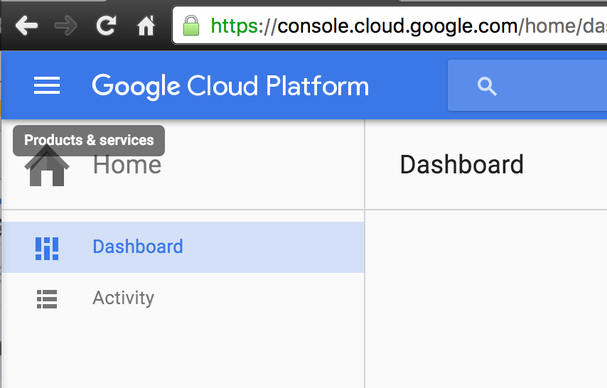
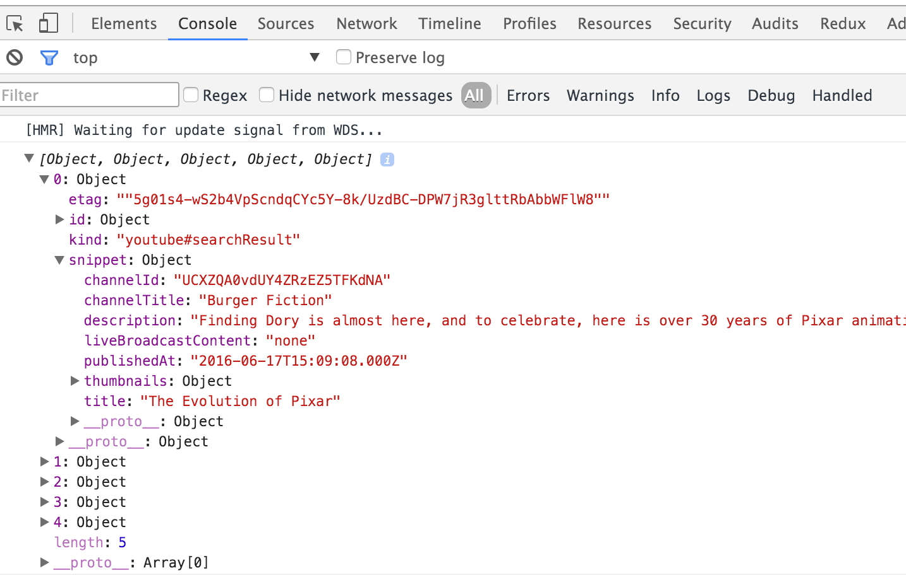
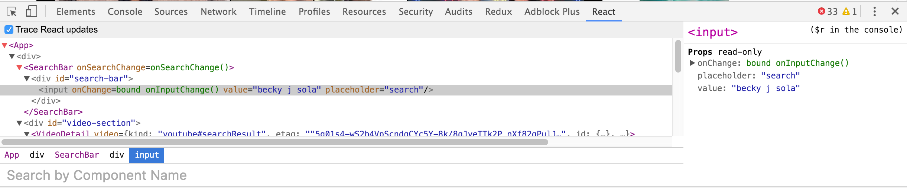

{: .small }


## Overview

Today we'll be learning about [React](https://facebook.github.io/react/)!  So far you've been using html and css to build static sites.  Sites that do not have much going on in terms of content that changes. React is a javascript frontend framework for making dynamic sites.  In this workshop we will build a video chooser.  We will also work with the  webpack+babel+eslint starter code that you worked on in the previous short assignment.

💻 : run in Terminal<br>
🚀 : a step to not forget


🚀 To start grab the github classroom link to start a new repository.  Then you'll pull in your webpack+babel+eslint starter code like so:

```bash
#make sure you are in your project directory
git remote add starter git@github.com:dartmouth-cs52-17S/starterpack-your-gitub-username.git
git pull starter master
```

What just happened?  You merged in the git tree from another repo (the remote we named starter) into your own! Hopefully you'll build on your starter repo and use it for lots of projects.


## Setup


We're going to need to add a few things to our project to get it ready for React.


### Babel

🚀 Lets add in support for React and JSX in babel:

```bash
# just make sure you're in the root of your project

npm install --save-dev babel-preset-react
# installs a react babel preset
```

🚀 Add a `["react"]` preset to your existing `.babelrc` file to look something like this:

```json
{
  "presets": [
    ["react"],
    ["env", {
      "targets": {
        "browsers": ["last 2 versions"]
      }
    }]
  ]
}
```


### eslint

Let's modify your `.eslintrc` to add in some React support.

🚀 Change your `.eslintrc` file. Here we only show the things to ADD. Do not delete any existing lines just add the following in the right locations:

```json
{
    "rules": {
        "react/jsx-uses-react": 2,
        "react/jsx-uses-vars": 2,
        "react/react-in-jsx-scope": 2,
        "react/prop-types": 0,
        "react/jsx-first-prop-new-line": 0,
        "react/jsx-filename-extension": 0,
        "import/no-unresolved": [2, { "commonjs": true, "caseSensitive": false}],

    },
    "plugins": [
        "react"
    ],
    "ecmaFeatures": {
        "jsx": true,
        "modules": true
    }
}
```


### Dependencies

🚀 Let's just take care of all our dependencies up front so we can just dig into all of the codes without distraction.


```bash
npm install --save lodash.debounce react react-dom react-router axios
```

We'll learn what all these do soon!


🚀 Start up your webpack-dev-server:

```bash
npm start
```

If there are no errors we can move on!  Leave the server running as now we have everything necessary to just jump into the codes.

One common cause of errors can be dependency version mismatches in the various npm packages.  This is because by default when you `npm install` something it will attempt to install the most recent thing. Addditionally in the `package.json` file it will save the installed version with a `^` prepended which indicates that future installs should be at least that version or greater. Sometimes the *or greater* can cause trouble.  One way to attempt to fix this is to update all the versions to the most recent, like so:

```bash
npm install -g npm-check-updates #installs a new command: ncu

ncu #run in your project will tell you what packages can be udpated
ncu -ua # will update all packages

rm -rf node_modules #remove existing installed modules
npm install  #reinstall new versions
```


## Our First React View

Let's make our first React view.  React operates on a concept of components -- there are a few different kinds of components with the most simple being just a function (sometimes called a function or dumb component).  Lets start with that.

🚀Edit your `index.js` file:


```javascript
import React from 'react';
import ReactDOM from 'react-dom';

const App = () => {
  return <div className="test">All the React are belong to us!</div>;
};

ReactDOM.render(<App />, document.getElementById('main'));
```

Now check your page: http://localhost:8080

Our first React app!  Ok we're done. Kidding!


## StarterPack

At this point you will want to push these changes to your starter pack!  This will add React support to your starterpack.  

```bash
git push starter master
```

Careful!  Don't push anything else to starter for this assignment, you want your starterpack to only contain starter configurations, not your actual project. We'll be adding more stuff to it over time so make sure your personal starterpack is in good shape. If you have questions come to office hours!


## [JSX](https://facebook.github.io/react/docs/introducing-jsx.html)

Did you notice how there seems to be html like stuff in the above?  What is `<App />`?  It is a function that seems to return html?  In fact all the `<tags>` you see when working in react that are inside of javascript code are actually in [JSX](https://facebook.github.io/react/docs/introducing-jsx.html).  When we did `<div></div>` in the above what we are actually doing is `React.createElement("div", { className: "test" }, "All the React are belong to us!");`.  JSX happens to provide all the standard html elements for you so it feels like html while actually being cool react components, but there are some subtle differences: `class` is now `className` for instance because class is already a reserved keyword in javascript!


## Video Search App

Let's build something a little more complicated with multiple components.

<!-- based loosly on https://www.udemy.com/react-redux-tutorial -->

Here's a mockup of our soon to be amazing app:


This web app will search the YouTube api and list the top results as well as have one select video from the list highlighted with a video embed as well as some of the description and more data about the video.

What components do you think compose this app?


### Components

A component is a logical unit that packages up some functionality or some part of the display that can potentially be reused. React is basically just a tree of components. 🌴

Let's break up our app into some components.


Here we have identified a few components:

* Main App: this is the top level component. In the future we might call components that only have children in them **containers**.
* Search Bar: this is the search bar at the top
* Video Detail:  the highlight larger video display
* Video List:  the list of videos found
* Video List Item: an item in the list of videos  

🚀 Let's make a folder and start empty files for these:

```bash
mkdir src/components
cd src/components
touch search_bar.js video_detail.js video_list.js video_list_item.js
```


## SearchBar Attempt

🚀 Let's work on the `search_bar.js`.  That seems to be the first component we would need to get any functionality.


```javascript
import React from 'react';

const SearchBar = () => {
  return <input />;
};


export default SearchBar;
```

Note: we still need to import `React` otherwise none of the JSX will be parsed correctly.

All we are doing here is exporting a function that returns an input component.

🚀 Lets add it into our main page. In `index.js`:

```javascript
import SearchBar from './components/search_bar';
# all imports go at the top
```

and

```javascript
const App = () => {
  return (
    <div>
      <SearchBar />
    </div>
  );
};
```

We defined a new React component `SearchBar` and imported and added it to the main App render function.  Note for multiline JSX put it all in `()` for easier legibility.  In general remember that this is a tree — React expects a component to be **one** top level element.  You can also return an array of elements/components but not in your top level React App container.

Great, now you should see a search bar on your page.

## Functional VS Class Components

So far we've made 2 components and they have both been very simple, just a function really that returns some JSX.   This is great for simple components, but as we get more complicated components we might want to upgrade them.  In particular when a component needs to be aware of some internal state or perform any sort of logic, Class components come in handy.

Let's refactor our functional SearchBar component to an es6 class. React has a handy class called Component that we will extend,  this class is what imbues our application with React powers.

🚀 First, we need to import it.


```javascript
import React, { Component } from 'react';
```

The `Component` class is actually already available to us as `React.Component` but we can extract it using es6 destructuring.

### Side note on destructuring

If you have an object in es6 you can extract contents from it using object literal notation:

```javascript
let foo = {
  a: 100,
  b: 5,
  c: 'a string'
}

let { x: a, y: c } = foo;
console.log(x, y); // → 100 a string

// or with shorthand if named the same
let { a, c } = foo;
console.log(a, c); // → 100 5
```

More here: [mikaelb](http://git.mikaelb.net/presentations/bartjs/destructuring/#/)


### SearchBar Class

🚀 Let's replace our functional component now with a class based component:


```javascript
import React, { Component } from 'react';


class SearchBar extends Component {
  render() {
    return <input />;
  }
}

export default SearchBar;
```

Great, now we have a fancy class component but what does it do?  The same thing right now as the functional component did, we should probably add some functionality...


## Events in React

What we need to do is handle some events.  The browser emits events on things like mouse move, click, keypress, and other forms of input.  For our *SearchBar* we want to hand the [onChange](http://www.w3schools.com/jsref/event_onchange.asp) event.  This event gets triggered whenever anything in the input textfield changes.

🚀 So let's add a function to handle input changes:

```javascript

// add this above your render method
onInputChange(event) {
  console.log(event.target.value);
}

// in render method change return to:
return <input onChange={this.onInputChange} />;

```

We've created a function `onInputChange` which we are registering as a callback for the builtin `onChange` event on the input element.


{: .fancy .small}


## State

Each class based React component has it's own internal state object which is used to react to and record events.  Whenever this state changes React re-renders the component.  This is the basis of React, and why it is so cool.  It is all about the state.


### Initialize state

ES6 classes have constructors.  This is where we would do setup stuff, in particular we want to initialize our state object. The constructor is always the first thing at the top of your class.

🚀 At the top of our SearchBar class add in:

```javascript
  constructor(props) {
    super(props);

    this.state = {searchterm: ''};
  }
```

* First thing we do is call the parent classes constructor as any class that extends another should do.
* Then we initialize a state object with one field `searchterm`.  This will be for our search term.

Note: The constructor is the **ONLY** place you will ever set `this.state` directly like this.  We will see how to do this later, but in general, you initialize it once and then you use a method `setState` on it from then on. This  is critical, if you skip using `setState` then React doesn't know that anything happened.  


### Update state

Ok, so now we should probably update the state as we type into the input.

🚀 Let's try that. We will use `setState` to update the state whenever the onChange event is triggered.

```javascript
// in your onInputChange method add:
this.setState({ searchterm: event.target.value });
```


Now, because `onInputChange` needs access to `this` we need to also bind it so that it can find it.  Multiple ways of making that work, we could either call `this.onInputChange` in a fat arrow function callback that we pass to `onChange` like so: `onChange={event => {this.onInputChange(event);}}` or we can bind it.  In the binding option we'll just assign a bound version of the function to that variable like so:

```javascript
// add to the bottom of your constructor
this.onInputChange = this.onInputChange.bind(this);
```

This means whenever we reference `onInputChange` now within the class it will refer to a version of that function that is bound to the instance of the object. It also has the nice property of alerting readers that you have certain functions that are called from within other scope.


🚀 And we should add some way to visualize this so let's add an element to your `render` method:

```javascript
render() {
  return (
    <div>
      <input onChange={this.onInputChange} />
      <p> State value: {this.state.searchterm} </p>
    </div>
  );
}
```

Now you have something like this:

{: .fancy .tiny }


## Controlled field

Great, we're now updating some random text on the page.

Let's take this a step further and make the `<input>` field *driven*. What this means is that instead of the field showing the text that is being input directly and as a side effect updating state, we will make the field display the actual react state instead.  This is an important distinction, it is cleaner to have controlled or driven components because then always know that your state is in control of the output.


🚀 Change `<input>`:

```javascript
<input onChange={this.onInputChange} value="hi" />
```

Now when you try the page, weird stuff happens.  The field is now driven by the constant value of 'hi'.  Not very helpful.  What should we change it to instead?


```javascript
<input onChange={this.onInputChange} value={this.state.searchterm} />
```

Now when you type the value displayed by the field is actually what is currently in the state.  This is useful for a number of reasons, but primarily it means that the user sees exactly what the state is and React knows exactly what the input is at any point.  You never have to search the DOM for the input field and yank the value, it is always in the state.  In a more complicated example, say we forgot to `setState` in our `onChange` callback on a particular form field. If the field wasn't driven then you might not notice that your state wasn't recording that field and later on would have to debug missing values.  This way the state of the component is authoritative and visible.


🚀 Go ahead and delete the `<p> State value: {this.state.searchterm} </p>` line completely, we don't need it.


Ok, at this point you have an app that displays a search bar, it is a driven field so it's value is always the value that is in the state. Now, lets add some fun stuff.


## Upgrade App to Class

🚀 Want to go ahead and give it a shot to upgrade `index.js` to a class base component?  Take a few minutes and give that a shot.

Here is what you should end up with:

```javascript
class App extends Component {
  constructor(props) {
    super(props);

  }

  render() {
    return (
      <div>
        <SearchBar />
      </div>
    );
  }
}
```

We'll probably need to add some state here, but for now this is good. Make sure everything still works as expected. And we have an empty constructor ready to do stuff.


## YouTube API

We'll be using YouTube's api for finding videos. So we need to sign up and get an api key.

🚀 Go to:  [http://console.developers.google.com](http://console.developers.google.com )

1. Per rather poor UX: click the hamburger menu on the top left
  <br>{: .fancy .tiny}
1. Open **Api Manger**
1. Search for youtube and select **YouTube Data API V3**
  <br>{: .fancy .tiny}
1. Click **Enable**
1. Go to **Credentials**
1. Click **Create Credentials**
1. Choose **Browser Key**
  <br>{: .fancy .small}
1. Save the **API Key** for you will need it!


## YouTube Search

Now, you are ready to connect to YouTube!

🚀 Let's create a module to make searching the youtube API easier for us.  Create a new file under `src` called `youtube-api.js`

```javascript
import axios from 'axios';

const API_URL = 'https://www.googleapis.com/youtube/v3/search';
const API_KEY = 'YOUR SAVED API KEY';

const youtubeSearch = (term) => {
  const params = {
    part: 'snippet',
    key: API_KEY,
    q: term,
    type: 'video',
  };

  return new Promise((resolve, reject) => {
    axios.get(API_URL, { params })
      .then(response => {
        resolve(response.data.items);
      })
      .catch(error => {
        console.log(`youtube api error: ${error}`);
        reject(error);
      });
  });
};

export default youtubeSearch;
```

In the above, [axios](https://github.com/mzabriskie/axios) is a module to simplify making http api requests (GET, POST, etc).  We are wrapping it in a Promise so that using our module is really easy from our `index.js`.


🚀 Now import our new module in `index.js`:

```javascript
import youtubeSearch from './youtube-api';
```


🚀 Let's try getting some results! Since we just want to test, add the following into your `constructor` in `index.js`:

```javascript
youtubeSearch('pixar').then(videos => {
  console.log(videos);
});
```

We're just console logging the response, open up inspector to examine!

{: .fancy }

Cool!

Note: In the above you may have noticed we used a `Promise`.   [Promises](https://scotch.io/tutorials/javascript-promises-for-dummies) are a way of dealing with asynchronous callbacks in a more elegant fashion.


## Results and State


Now that we have some results, we should do something with them?  Perhaps we should have some state! Let's be proactive and think about what state we need for our app.  We should save the search results certainly, but we should probably also choose a default video to display in the larger detail view.  Let's call that our `selectedVideo`.

🚀 Let's save our search results in some state in our `index.js`.

```javascript
// here's what our constructor would look like
constructor(props) {
  super(props);

  this.state = {
    videos: [],
    selectedVideo: null,
  };

  youtubeSearch('pixar').then(videos => {
    this.setState({
      videos,
      selectedVideo: videos[0],
    });
  });
}

```

Note: we are using some more es6 shorthand.  When working with dictionaries, if the key is being set to a variable with the same name as the key `{videos: videos}`, you can shorten that and just do `{videos}`, so you can see an example of that in the `setState` in `youtubeSearch` above.


What shall we do with this state now?


## VideoList and Props


We identified a component *VideoList* originally, that seems like a reasonable place to handle displaying some videos.

But how do we get our parent videos state into another component?

React has a way to do this called [props](http://ricostacruz.com/cheatsheets/react.html#states--properties).  You can pass data from a parent to a child component as easily as defining a property on the JSX tag.


In our case we want to pass `this.videos` to our *VideoList* component. That component doesn't exist yet but let's see how we would call it first:

🚀 Change the JSX in `index.js` to include the *VideoList* component:

```html
<div>
  <SearchBar />
  <VideoList videos={this.state.videos} />
</div>
```

and don't forget:

```javascript
import VideoList from './components/video_list';
```


🚀 Now, let's make *VideoList* do something:

```javascript
import React from 'react';

const VideoList = (props) => {
  const videoItems = props.videos.map((video) => {
    return <li>{video.snippet.title}</li>;
  });

  return (
    <ul>
       {videoItems}
    </ul>
  );
};

export default VideoList;
```


Note: how props are passed into this functional component as an argument. These are the props from the parent, which in our case is *App* passign down the list of video objects.  

Are you getting console log errors?  

{: .fancy .small}

This is because React needs each component in a list to have a `key` property.  If you click on an element React needs to have more information about that element, which it is in the list etc and it uses the unique identifier key property to do so.

But, since we were just testing let's fix this when we create the *VideoListItem* component.


## VideoListItem

Before we continue,  we should create our *VideoListItem* component.  Does this component need to know it's own state?  Does it need to be a class based on functional component?

It would seem that all it really needs to do is display a video object reasonably.

🚀 Let's create our *VideoListItem* component as a functional component. From now on actually we're going to call it a dumb component. A component that does not need to know anything about its state.

```javascript
import React from 'react';

const VideoListItem = (props) => {
  const imgUrl = props.video.snippet.thumbnails.default.url;

  return (
    <li>
      
      <div>{props.video.snippet.title}</div>
    </li>
    );
};

export default VideoListItem;
```


🚀 Now import it into *VideoList* and let's use it. Remember you'll need to set the key property on it as well as passing the video in to props, like so:

```javascript
const videoItems = props.videos.map((video) => {
  return <VideoListItem key={video.etag} video={video} />;
});
```


Great,  now we're showing the list!  


## VideoDetail

We promised that we would have a larger video view with details.  I suppose we should write this!


```javascript
import React from 'react';

const VideoDetail = ({ video }) => {
  const videoId = video.id.videoId;
  const url = `https://www.youtube.com/embed/${videoId}`;

  return (
    <div className="video-detail">
      <iframe src={url}></iframe>
      <div className="details">
        <div>{video.snippet.title}</div>
        <div>{video.snippet.description}</div>
      </div>
    </div>
  );
};

export default VideoDetail;
```

🚀 And don't forget to add it in to the right place in `index.js`, this should be old hat for you know now.

```javascript
// at the top-ish
import VideoDetail from './components/video_detail';
//
// and in render after SearchBar
<VideoDetail video={this.state.selectedVideo} />
// finally selectedVideo comes into play!
```


Take a look at your page, what is happening? Oh wait, it's crashing! Why?

{: .fancy }

Hmm, looks like for some reason `video` is undefined!

This is because `this.state.videos[0]` which we are using for `this.state.selectedVideo` is actually undefined for a little bit of time when we first load the page.  The videos array is empty until the API request to youtube completes, but that takes a few milliseconds at least. However React just goes and runs the render() functions of all the components right away.  As soon as the state changes, it will re-render with all the data there, but for a brief moment the data isn't there yet.

To fix this, we can just have the *VideoDetail* component render something else if video is not set.  How would you do that?

```javascript
// Here's a snippet that'll help
if (!video) {
  return <div>Loading...</div>;
}
```

Now, when the page reloads you will very briefly see loading and then the component will fill in.

Note: I know right now the pages are looking pretty grim.  We'll do a little bit of styling at the end just to clean it up some, but you are welcome to style things as you see fit.  EC for styling!


### VideoListItem OnClick

Wait, what are we doing?  Don't we want *VideoListItem* to be clickable to select which video to display?  

In our case *VideoListItem* needs to be clickable.  We want the user to be able to click on it to select it and then show that video in the *VideoDetail* view.  How should we structure this?

This is where a tricky part of React comes in.  It is a tiny bit tricky to pass an event from one component to another.  We want the *onClick* event in *VideoListItem* to trigger a change in the state of the top level *App* component.  That is we want to change `this.state.selectedVideo` in `index.js`.  But currently all of that functionality is in the *App* component.

Well, so far what we've been doing is implementing downwards data flow.   Our toplevel component is the one that knows about videos and passes that data onto its children.  What we want to do now is pass events or actions back up the chain.  When there is an event in one of the child components that other components need to be aware of we would pass that event upwards to the parent, and then back downwards to any component that 'needs to know'.

{: .fancy .small}
<!-- TODO: redo this graphic -->


Solution!  We create a callback function in the parent and pass it down to the children in `props`!  We're just passing a function around, we know how to do that.

🚀 Let's change where we instantiate *VideoList* in `index.js` and pass in a callback function. It can even be an anonymous function.

```javascript
<VideoList onVideoSelect={selectedVideo => this.setState({ selectedVideo })} videos={this.state.videos} />
```

Note how we are using es6 shorthand here. `selectedVideo` the key for `setState` is the same as the variable name so we don't have to do `{ selectedVideo: selectedVideo }`

🚀 Now, in *VideoListItem* all we need to do is set an `onClick` event listener on `<li>`.  When clicked it will run the passed in callback function with the video that that link is displaying (that was passed in as a prop originally!).

```javascript
<li onClick={() => props.onVideoSelect(props.video)}>
```

🚀 Oh, wait but we actually need to pass this callback through one more view, *VideoList*.  Simple, just pass it down the same way: in props.  Change our instantation of *VideoListItem*

```javascript
return <VideoListItem onVideoSelect={props.onVideoSelect} key={video.etag} video={video} />;
```

Ok, now it should all be wired together. Try it!  When you click on any of the list items, the *VideoDetail* should update. Cool.

Note: Passing callbacks like this down for multiple views is a bit unwieldy, and this is exactly why next week we're going to learn of some very cool solutions to this. But now you can see how React components are typically arranged.  This works pretty well for smaller simpler apps such as this, but if you end up passing props around for more than two levels, you should rethink your life and continue with this class so next week you'll learn how to avoid this.


## But SearchBar?

Ok, but wait.  The *SearchBar* doesn't actually do anything yet. We still have to wire up the *SearchBar* to trigger events!

You can see a pattern here, *SearchBar* is in a similar position where it has datas it needs to pass up to *App*.  Let's make that happen!

🚀 In *App* let's refactor our youtubeSearch out into a separate method in the *App* class:

```javascript
search(text) {
  youtubeSearch(text).then(videos => {
    this.setState({
      videos,
      selectedVideo: videos[0],
    });
  });
}
```

🚀 In the constructor,  call this new method

```javascript
this.search('pixar');
```

🚀 Now let's pass this new `search` method down to *SearchBar*:

```javascript
<SearchBar onSearchChange={text => this.search(text)} />
```

Note the use of lots of arrow functions and the lack of `bind`.  EC: why might this be? How could we get rid of the `bind` in *SearchBar*?

🚀 In *SearchBar*  let's call this new callback! Add the following to your `onInputChange` method.

```javascript
this.props.onSearchChange(event.target.value);
```

Try it out!  You should now be able to type into the search bar and get the results to change. Note that we couldn't use `this.state.searchterm` right after having on the previous line just run `setState`.  The reason for this is that `setState` is not guaranteed to be synchronous, in fact usually it is not as it tries to batch state changes for efficiency. Something to keep an eye out for if you are having bugs where your state seems to be lagging behind.


## Debouncing

You may notice that it searches immediately when you type.  This both desired, but also it seems a little laggy. That is because for every keystroke it immediately launches an asynchronous web API request.  This isn't quite ideal.  You might want to issue a fewer requests.  The technique for this is called debouncing.  The term comes from hardware input where buttons will sometimes bounce slightly — enough to trigger a few keypresses where only one was really intended.   Debouncing is simple, if a function was called, don't let it be called again within some small timeout.  We're going to use lodash.debounce to help us.

`lodash.debounce` is a higher order function.  It takes as an argument a function and a timeout and returns a new function that is debounced.

```javascript
// import at top
import debounce from 'lodash.debounce';


// in constructor:
this.search = debounce(this.search, 300);
```

Can you explain what the above assignment is doing?


## Where's the Styles?

Congrats you now have a fully functioning React frontend webapp!

Ok, lets do a quick styling pass on this. You already have `style.scss` file with a nicer default font. Let's flex a few things.


🚀 Wrap *VideoDetail* and *VideoList* in `index.js` in a `<div id="video-section">` — this we can make a flex container.

🚀 Add an id to the *SearchBar* div in `search_bar.js` also: `id="searchbar"`

🚀 Here's some basic scss to get you started.


```css
$fontcolor:  rgb(10%, 10%, 10%);
$backgroundcolor: rgb(98%, 98%, 98%);


body {
  font-family: "Roboto", sans-serif;
  color: $fontcolor;
  background-color: $backgroundcolor;
  margin: 50px;
}


#search-bar {
  margin-bottom: 20px;

  input {
    font-size: 1.5em;
    border-radius: .25em;
  }
}


#video-section {
  display: flex;

  li {
    list-style: none;
    cursor: pointer;
    display: flex;
    width: 25vw;
    padding: 10px;
  }
  li:hover {
    background: darken( $backgroundcolor, 10% );
  }

}
```

🚀 Don't forget to import your `scss` from your `index.js`:

```javascript
import './style.scss';
```


This css could still use a lot of love. Feel free to make this look better!


## Responsive video iframes

Turns out response iframe embeds are actually pretty difficult to achieve.  We're going to cheat a little and include bootstrap only for the responsive video.

🚀 In `index.html` add bootstrap4-dev css only:

```html
<link rel="stylesheet" href="https://cdn.rawgit.com/twbs/bootstrap/v4-dev/dist/css/bootstrap.css">
```

🚀 Change your video iframe code in *VideoDetail*

```html
<div className="embed-responsive embed-responsive-16by9">
  <iframe className="embed-responsive-item" src={url}></iframe>
</div>
```

## Debugging

🚀 You **MUST install**: [React Developer Tools](https://chrome.google.com/webstore/detail/react-developer-tools/fmkadmapgofadopljbjfkapdkoienihi)

This adds a tab to your Chrome Dev Tools which allows you to inspect state in your React app and more!

{: .fancy}


## To Turn In

1. Your App should have the following working:
  * search, with new videos loading
  * clicking on a list item changes state and the main detail view
  * js is es6 and linted without errors
  * styled to look nice
1. A short answer response to:
  * describe what you think React is and how you can imagine using it?
  * any questions about what/why/how that you feel are unresolved?

## Extra Credit

* add in other video / media sources such as vimeo, giphy, etc
* pull in the weather or other data sources
* make it responsive
