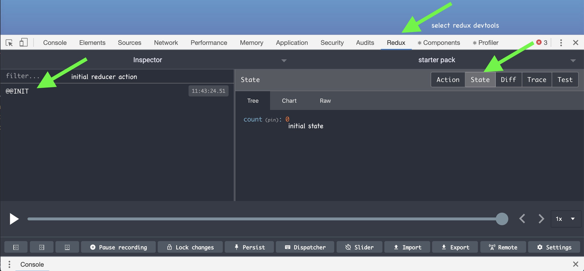

[](http://redux.js.org/)


## Overview

React + Routing + [Redux](http://redux.js.org/)

For this workshop we're just going to add redux to our starter pack and our YouTube video Short Assignment!

Redux is a fancy state management system that we'll be using to build our blog platform.  It will allow us to simplify our code and have a global state in our app with fewer callbacks!


## Let's Start Part 1

🚀 We're going to keep working on your starterpack for this assignment. So just dig up that repo and work there!  At this point you should have a starterpack that has webpack+babel+eslint+sass+react+reactrouter.  Remember to just push your new stuff to this. For grading we'll know which commits to look at.  You want to keep building this up.

Now we're going to add in Redux to your personal starter repository so now you'll have webpack+babel+eslint+sass+react+reactrouter+redux! Wow.


## Double check your tags:

```bash
git tag
```

You should have v1, v2, and v3. if you don't have v3 then [go back](../routing) and do that now.


## Redux


🚀 Install redux

```bash
yarn add redux react-redux redux-thunk
```

These are the packages we will be using. Redux is a general state management paradigm that does not necessarily need to be tied to React. But together they are an unstoppable force for clean webdevelopment — so we will use another module `react-redux` that connects the two.   We won't use `redux-thunk` today but will soon — it allows us to work better with asynchronous server calls.


## Chrome React and Redux Devtools

These Chrome extensions will greatly assist us in debugging our React+Redux apps.

### React Dev Tools:

If you don't have React Devtools installed yet, please do so now [React Devtools in Chrome Store](https://chrome.google.com/webstore/detail/react-developer-tools/fmkadmapgofadopljbjfkapdkoienihi)

More docs [here](https://github.com/facebook/react-devtools).


### Redux Dev Tools

And [redux-devtools](https://chrome.google.com/webstore/detail/redux-devtools/lmhkpmbekcpmknklioeibfkpmmfibljd) will give us time travel! No joke! Install this now!

More docs [here](https://github.com/zalmoxisus/redux-devtools-extension).

Using these tools will help save you hours/days of debugging.


## What is Redux

> Redux is a predictable state container for JavaScript apps.

Redux has 3 main concepts that we will tackle. Each concept is related to a particular structure within Redux.


- **Store**:  the entire state of your app is stored in an object tree inside a single store.
- **Actions**:  the only way to change the state tree 🌳is to emit an action — an object that describes that happened.
- **Reducers**:  specify the state transformation based on the actions triggered.


### Actions

Remember how our state should be treated as if it is immutable (read-only)?   Actions are the way to trigger new states.  In plain React we would run `setState` based on events passed up through callbacks. With Redux we can still use local component state for certain things, but whenever we need a far reaching state change we will use actions instead.

An action is an object with at least the property `type: string`.  The convention is to make these all upper case. They can also have payloads of other associated data.  

For instance an action might be:

```javascript
{
  type: VIDEO_SELECTED,
  video: videoID
}
```
{: .example}

Actions ensure that no views or callbacks will write to the state. An action does not alter state itself,  it expresses an intent for the state to change. All actions are processed by associated reducers in a centralized manner.  

🐘 Remember, actions are just plain old objects, they can be logged and stored, and replayed even!


### Reducers


When an action is triggered, reducers kick in to do the necessary state changes.  Reducers are functions that take in previous state + the action triggered, and return the next state.  This is similar to what we did with `setState` where we would take existing state and set it to new state.  Your app may have multiple reducers each responsible for a particular part of the state tree.  

An example reducer that responds to the above VIDEO_SELECTED action might look something like this:

```javascript
export default function(state = null, action) {
    switch (action.type) {
        case 'VIDEO_SELECTED':
            return { selectedVideo: action.video };
        default:
            return state;
    }
}
```

Note the switch statement. Actions are global and **every reducer** gets called with every action. It is up to the reducer to act on the action or not.

### Store

Finally there is the Redux Store.  A redux store is a way to store the global state for your app.  So far for the React apps that we have built we have had local component state for a few of our smart components, and often have had a top level state inside of our App component.  Having your app state (minus in a single state tree has lots of positive benefits.  The store is initialized in your top level `index.js` file.


## Code

Let's wire this all together, it may seem a bit tricky at first but we'll work though it!


### File Structure

🚀 Create a file structure to store our actions and reducers.

```bash
mkdir src/actions src/reducers src/components
```


We're going to create an extensible action and reducer structure so there might be a little bit extra boilerplate, but not to worry it'll all make sense.

*This file organization is one of many!  For our learner projects it is conceptually beneficial to keep things separated by code type (actions, reducers, components, services, etc).  For large projects however, this becomes unwieldy and you would want to use the recommended [feature folder organization](https://redux.js.org/style-guide/style-guide/#structure-files-as-feature-folders-or-ducks) where every feature would have its own folder: `features/login/loginPage.js, features/login/loginRedux.js features/login/loginPage.scss`. For our smaller sites we won't need this, but feel free to experiment.*


### Actions

Best way to trigger actions in a connected component is via triggering an ActionCreator.  ActionCreators are simply functions that return an action object. Remember an action object is an arbitrary object that that has at a minimum a type property `{ type: 'SOME_ACTION' }`.

🚀 Let's create an `actions/index.js` file and give it some very basic actions.

```javascript

// keys for actiontypes
export const ActionTypes = {
  INCREMENT: 'INCREMENT',
  DECREMENT: 'DECREMENT',
};


export function increment() {
  return {
    type: ActionTypes.INCREMENT,
    payload: null,
  };
}

export function decrement() {
  return {
    type: ActionTypes.DECREMENT,
    payload: null,
  };
}
```

1. we have `ActionType` an object with keys. This is simply so we have constants so we don't have to type in string identifiers.
2. `increment` just returns an INCREMENT action
3. `decrement` just returns a DECREMENT action


### Reducers

🚀 Let's create a `reducers/index.js` file.   

With ES6 if you have a directory with multiple files and an `index.js` file you can import it by the directory name:  `import ./reducers`.

We are going to split up our reducers into a top level root reducer and smaller reducers that each act on a part of the state tree. The root reducer will use `combineReducers` to combine multiple reducers together into our redux state.


```javascript
// the starting point for your redux store
// this defines what your store state will look like
import { combineReducers } from 'redux';

import CountReducer from './count-reducer';

const rootReducer = combineReducers({
  count: CountReducer,
});

export default rootReducer;
```

Here, we have created our `rootReducer` which combines all other potential reduces into one main state object with several top level keys.


🚀 Now create `reducers/count-reducer.js`

```javascript
import { ActionTypes } from '../actions';

const CountReducer = (state = 0, action) => {
  switch (action.type) {
    case ActionTypes.INCREMENT:
      return state + 1;
    case ActionTypes.DECREMENT:
      return state - 1;
    default:
      return state;
  }
};

export default CountReducer;
```

Our `CountReducer` gets called with actions.  When it is called with the 2 actions it knows something about it will return new state.  What will our state object look like overall? Simply:

```javascript
{
  count: 0
}
```


### Initialize Store

The Redux store is the main class responsible for bringing it all together.  The store is initialized with the reducers and knows when and how to call them. The store contains our state data and contains the dispatch functionality that we need to trigger actions. It is what holds it all together.

Just a tiny bit more boilerplate, I promise.

🚀 Add the following to your root/main `index.js` file.

```javascript
import React from 'react';
import ReactDOM from 'react-dom';
import { Provider } from 'react-redux';
import { createStore, applyMiddleware, compose } from 'redux';

import reducers from './reducers';

import App from './components/app';

// this creates the store with the reducers, and does some other stuff to initialize devtools
// boilerplate to copy, don't have to know
const store = createStore(reducers, {}, compose(
  applyMiddleware(),
  window.__REDUX_DEVTOOLS_EXTENSION__ ? window.__REDUX_DEVTOOLS_EXTENSION__() : f => f,
));

// we now wrap App in a Provider
ReactDOM.render(
  <Provider store={store}>
    <App />
  </Provider>
, document.getElementById('main'));
```

*Note: in the above App is being loaded from the file `src/components/app.js`. You are welcome to move all your router navigation functional components there if you'd like to hang on to it as a an example. A nice pattern is to keep index.js as just the entry point with only setup stuff — and your main App component separated out.*


✔️ Now you can open redux dev tools in your browser and confirm that the redux store is initialized:




## Connected components

Now we have the basics done, we should create some connected components.  A connected component is one that is literally connected to the Redux store.  The easiest way to do this is by wrapping a component in a higher-order function that returns a new component that has access to Redux: `connect(mapStateToProps, mapDispatchToProps)(YourComponent)`. We'll explain the syntax shortly.

Let's some components that make use of our Redux setup!  These will be toy examples, and don't particularly need Redux.  But they'll demonstrate the various wirings needed for setting up a much more complicated app.


### Counter

🚀 Let's create a component for displaying our state. Create a new file `counter.js`

```javascript
import React from 'react';
import { connect } from 'react-redux';
import { withRouter } from 'react-router-dom';

// this can be dumb or smart component - connect works with either
const Counter = (props) => {
  return (
    <div>
      Current Count: {props.count}
    </div>
  );
};

// connects particular parts of redux state to this components props
const mapStateToProps = state => (
  {
    count: state.count,
  }
);

// react-redux glue -- outputs Container that know state in props
// also with an optional HOC withRouter
export default withRouter(connect(mapStateToProps, null)(Counter));
```


Some things to note about the this component:

1. `mapStateToProps`.  This is a simple function that takes the full global state as an argument and maps some part or parts of it this components props.  The mapping is a simple object with key: value pairs. As is everything!
1. `connect`.  This is the magic that connects the component to Redux.  It takes 2 arguments: `mapStateToProps` and `mapDispatchToProps` and returns a new version of the component in which the actions and store are "mapped into props".
1. `props.count`.  Check it, passed into props from Redux.
1. `withRouter`. Gives you access to history and match in your component for (i.e. `<Route component={SomeConnectedThing}/>`) `connect`ed redux components.


🚀 Add `<Counter />` to the render method of one of the components that are currently displaying like *Welcome*


You should now see it rendering with a value of 0.  This value is coming from the default value in our reducer!


### Controls

🚀 Let's create one more component. Oof!  This time it'll just be a couple of buttons to call some actions.  Make one last file: `controls.js`.

```javascript
import React from 'react';
import { connect } from 'react-redux';
import { withRouter } from 'react-router-dom';


import { increment, decrement } from '../actions';

const Controls = (props) => {
  return (
    <div>
      <button type="button" onClick={props.increment}>+</button>
      <button type="button" onClick={props.decrement}>-</button>
    </div>
  );
};

export default withRouter(connect(null, { increment, decrement })(Controls));
```


Some things to note about the this component:

1. `import { increment, decrement } from '../actions';`:  we're importing the 2 ActionCreators we created earlier.
1. `connect`: note the second argument to connect, this can either be a function mapDispatchToProps, or a simple dictionary mapping.  This makes sure that connected versions of the increment and decrement ActionCreators are passed into props for us.
1. `props.increment/decrement`:  Here's the confusing part. You must call the connected version of the actionCreator methods in props rather than calling them directly. If you just call the methods directly nothing will happen (as Redux doesn't know about them. However the versions of the versions that are passed into `props` will get passed down into the reducer. ⚠️⚠️ This is important - you have 2 versions of each of the ActionCreator functions in your namespace — one in props and one not. The props version is one you want to use, if nothing happens, that means most likely you are calling the non-connected non-props version.


🚀 Add `<Controls />` to the render method of one of the components that are currently displaying like *Welcome*


Ok, so that may seem like a lot of code for a toy examples.  However, note that these two components **don't need to have a common parent**, and you **don't have to pass around functions in callbacks**.  In a simple example like this it might not make much of a difference,  we could have put the counter into the local component state of the parent. However if you had multiple levels of components the callback tracking would get difficult.


We'll do much more React+Redux so if this is confusing don't worry!  


## Debugging


Last thing!  Try opening up the Redux Chrome DevTools and play with the timeline to move the state forward and back.

Play with the *slider* and note how you can export and import state. Imagine how powerful that would be if we could just save the whole state of a very complex app!


## Release it!

```bash
# commit and push as you normally would - but also
git tag v4
git push origin --tags
```

# Part 2: YouTube!

Currently our React YouTube search app works great, but maybe we can learn some redux and refactor it! If you remember we had to pass props down multiple levels, can we use Redux to select the video to show in Detail View without passing properties multiple levels and to keep our state beautifully coherent?

<video loop autoplay mute controls>
  <source src="http://res.cloudinary.com/dali-lab/video/upload/ac_none,w_800,h_762/v1546203223/cs52/videos-redux.webm" type="video/webm"/>
  <source src="http://res.cloudinary.com/dali-lab/video/upload/ac_none,w_800,h_762/v1546203223/cs52/videos-redux.mp4" type="video/mp4"/>
  <source src="http://res.cloudinary.com/dali-lab/video/upload/ac_none,w_800,h_762/v1546203223/cs52/videos-redux.ogv" type="video/ogg"/>
  Your browser does not support HTML5 video tags
</video>


## Prepare the Repo

🚀 To begin, we'll create a new branch `redux-sa` in your SA4 repo, the react-videos one.

Navigate to your repository on the command line and pull in the updates you've just made to your starterpack:

``` bash
cd sa4-YOUR_USERNAME
git pull origin main #just in case
git checkout -b redux-sa #create a new branch redux-sa
git pull starter main  #pull in your updated starter code!
```
Hopefully, you should only have major conflicts in your `src/index.js` file. Let's handle them now!

⚠️ If you have conflicts in your `yarn.lock` do: `git checkout --theirs -- yarn.lock`. This will choose the entire file from your starterpack.  

⚠️ If you have conflicts in your `package.json` or `webpack.config.js`, merge them in manually, you will most likely want the union of the two.

🚀 Copy all the code from the HEAD (Current Change) of `src/index.js` or (`app.js` if you had chosen to put it in there) and paste it into its own new file `src/components/youtube.js`. Now go ahead and accept the incoming change.

{::options parse_block_html="true" /}
<div class="accordion-section">
<p>Don't worry if you lost your HEAD, it's right here!</p>
<div>

```javascript
import React, { Component } from 'react';
import ReactDOM from 'react-dom';
import './style.scss';
import debounce from 'lodash.debounce';
import SearchBar from './components/search_bar';
import youtubeSearch from './youtube-api';
import VideoList from './components/video_list';
import VideoDetail from './components/video_detail';

class App extends Component {
  constructor(props) {
    super(props);

    this.state = {
      videos: [],
      selectedVideo: null,
    };

    this.search = debounce(this.search, 300);
    this.search('pixar');
  }

  search = (text) => {
    youtubeSearch(text).then((videos) => {
      this.setState({
        videos,
        selectedVideo: videos[0],
      });
    });
  }

  render() {
    return (
      <div>
        <SearchBar onSearchChange={this.search} />
        <div id="video-section">
          <VideoDetail video={this.state.selectedVideo} />
          <VideoList onVideoSelect={(selectedVideo) => this.setState({ selectedVideo })} videos={this.state.videos} />
        </div>
      </div>
    );
  }
}
```
</div>
</div>

{::options parse_block_html="false" /}


🚀 To finish off our merge, let's create a new route in `components/app.js` for YouTube:

```javascript
// Add this import somewhere at the top
import YouTube from './youtube';

// Add a new NavLink to your Nav constant
<li><NavLink to="/youtube" exact>YouTube</NavLink></li>

// And add a new Route to the Switch in App
<Route exact path="/youtube" component={YouTube} />
```

⚠️ You may need to do a little bit of cleanup, for instance in `app.js` get rid of the counter and controls components, you won't need them.  This is a good exercise in going through your code.

🚀 Your linter should tell you that `youtube.js` has a lot of errors.  Notice that we moved that code into the component directory so a lot of the import paths are wrong. You'll want to fix the paths in those import statements. Remember `../` is up one directory and `./` is in the current directory. At this point you should be able to get it to a point where it will build and you can get the main page up and running.

🚀 Don't forget to run `yarn install` to install any of the new dependencies that were merged into `package.json`.

🚀 Finish the Merge! Once you have finished handling the conflicts, go ahead and `git add` and `git commit` the changes to resolve the conflicts and finish the merge.

*If you are adding redux to some other existing project and don't want to merge in the starter repo, you can go through the steps in part 1 to set up the dependencies and index.js redux Provider.*

## Actions

Since selecting a video and the full list of videos will be state handled by our redux store, we will need to create some new functions in `actions/index.js`.

🚀 First let's expand our `ActionTypes`:

```javascript
// keys for actiontypes
export const ActionTypes = {
  INCREMENT: 'INCREMENT', //you can delete these
  DECREMENT: 'DECREMENT', //if you don't want the counter anymore
  SELECT_VIDEO: 'SELECT_VIDEO',
  SET_VIDEOS: 'SET_VIDEOS',
};
```

🚀 Next, we add two new functions to use our action types. Notice that these functions, unlike before, are passed a variable to be used as `payload`. Arbitrary key name tbh.

```javascript
export function selectVideo(video) {
  return {
    type: ActionTypes.SELECT_VIDEO,
    payload: video,
  };
}

export function setVideos(videos) {
  return {
    type: ActionTypes.SET_VIDEOS,
    payload: videos,
  };
}
```

## Reducers
🚀 Create `reducers/video-reducer.js`

```javascript
import { ActionTypes } from '../actions';

const initialState = {
  selected: null,
  list: [],
};

const VideoReducer = (state = initialState, action) => {
  switch (action.type) {
    case ActionTypes.SELECT_VIDEO:
      return { selected: action.payload, list: state.list };
    case ActionTypes.SET_VIDEOS:
      return { selected: state.selected, list: action.payload };
    default:
      return state;
  }
};

export default VideoReducer;
```

Two key differences between this new reducer and the one we had just made:

1. Our initial state is now slightly more complex to reflect the new data structures.
2. We update the state by setting certain keys in the state to `action.payload` instead of manipulating the state directly. The payload for the SELECT action is a video object, and for the FETCH action is the list of all videos.

⚠️ Note, that the object we return in each case has the same keys as `initalState`. Remember this fact. That the *shape* (ie the keys and value data structures) of your state should stay consistent no matter what the input.

🚀 Add our new reducer to `reducers/index.js` so that the store knows to keep track of an additional state variable. *(feel free to cleanup the count reducer stuff if you aren't using it)*

```javascript
// the starting point for your redux store
// this defines what your store state will look like
import { combineReducers } from 'redux';
import CountReducer from './count-reducer';
import VideoReducer from './video-reducer';

const rootReducer = combineReducers({
  count: CountReducer,
  video: VideoReducer,
});

export default rootReducer;
```

## Connected Components
Let's see what you remember!

### VideoListItem

🚀 In `components/video_list_item.js` connect `VideoListItem` to the redux store and change the react props function `props.onVideoSelect(props.video)` to the new redux connected function `props.selectVideo(props.video)`. 

__HINT:__ if you're stuck, use `controls.js` as an example

{::options parse_block_html="true" /}
<div class="accordion-section">
<p>If you're stuck++, take a look here</p>
<div>

```javascript
import React from 'react';
import { connect } from 'react-redux';
import { selectVideo } from '../actions'; //import the actionCreator

const VideoListItem = (props) => {
  const imgUrl = props.video.snippet.thumbnails.default.url;

  return (
    <li onClick={() => props.selectVideo(props.video)}>
      
      <div>{props.video.snippet.title}</div>
    </li>
  );
};

// we won't map any state here just actions
// some nice shorthand for that is simple passing in an object with the methods you want to end up connected to the store
export default connect(null, { selectVideo })(VideoListItem);
```
</div>
</div>
{::options parse_block_html="false" /}


## VideoList

🚀 In `components/video_list.js` remove `onVideoSelect={props.onVideoSelect} ` from `VideoListItem`. Yay! We no longer need to pass this function around it lives directly in our redux 'actions'.

🚀 We can also upgrade *VideoList* to connect to the entire list of videos in redux. Edit `video_list.js` to include the following:

```js
// don't forget to import at the top
import { connect } from 'react-redux';

// define a `mapStateToProps` function that takes in state and maps it to a key in an object.
const mapStateToProps = (reduxState) => ({
  videos: reduxState.video.list,
});

// connect videolist so that now props.videos comes from redux
export default connect(mapStateToProps, null)(VideoList);
```

*Note we don't have to edit that we map over props.videos... cause we're just naming it the same thing!*

{::options parse_block_html="true" /}
<div class="accordion-section">
<p>Whole thing in case, but you should really not need this.</p>
<div>

```javascript
import React from 'react';
import { connect } from 'react-redux';
import VideoListItem from './video_list_item';

const VideoList = (props) => {
  const videoItems = props.videos.map((video) => {
    return <VideoListItem key={video.etag} video={video} />;
  });

  return (
    <ul>
      {videoItems}
    </ul>
  );
};

const mapStateToProps = (reduxState) => ({
  videos: reduxState.video.list,
});

export default connect(mapStateToProps, null)(VideoList);
```
</div>
</div>
{::options parse_block_html="false" /}


## YouTube Component

🚀 Now, we need to connect `components/youtube.js`

1. Let's connect `YouTube` to our redux store. The only thing this top component now needs is to be able to run the `setVideos` ActionCreator.
2. Remove ALL state! It isn't necessary to keep the variables in both the react state and the redux store in this situation.
3. Remove ALL props from `<VideoDetail />` and `<VideoList />`, just render them as is.
4. Change the search function to simply pass the videos list to `this.props.setVideos(videos)` rather than running setState. We'll stick with using the youtubeSearch api promise like we've been doing.

{::options parse_block_html="true" /}
<div class="accordion-section">
<p>Give it a try on your own first!</p>
<div>

```javascript
import React, { Component } from 'react';
import '../style.scss';
import debounce from 'lodash.debounce';
import { connect } from 'react-redux';
import SearchBar from './search_bar';
import youtubeSearch from '../youtube-api';
import { setVideos } from '../actions';
import VideoList from './video_list';
import VideoDetail from './video_detail';

class YouTube extends Component {
  constructor(props) {
    super(props);

    this.search = debounce(this.search, 300);
    this.search('pixar');
  }

  search = (text) => {
    youtubeSearch(text).then((videos) => {
      this.props.setVideos(videos);
    });
  }

  render() {
    return (
      <div>
        <SearchBar onSearchChange={this.search} />
        <div id="video-section">
          <VideoDetail />
          <VideoList />
        </div>
      </div>
    );
  }
}


export default connect(null, { setVideos })(YouTube);
```
</div>
</div>
{::options parse_block_html="false" /}


## VideoDetail

Ok, this one needs access to the bit of redux state which is `reduxState.video.selected`. 

{::options parse_block_html="true" /}
<div class="accordion-section">
<p>Here's the mapStateToProps if you need it.</p>
<div>

```js
// add this
const mapStateToProps = (reduxState) => ({
  video: reduxState.video.selected,
});

// change the export to be
export default connect(mapStateToProps, null)(VideoDetail);
```
</div>
</div>
{::options parse_block_html="false" /}


## Not quite

It should be working now, however, wait there is something wrong. It used to select the first returned video to detail, now that isn't working!

{::options parse_block_html="true" /}
<div class="accordion-section">
<p>How might we easily make a small change in a reducer to also select a video at the same time as setting them? </p>
<div>

In the VideoReducer, when you return the state for SET_VIDEOS, also set the first video!
```js

//change
return { selected: state.selected, list: action.payload };
//to
return { selected: action.payload[0], list: action.payload };

```

Now that is cool.
</div>
</div>
{::options parse_block_html="false" /}


## Debugging

Last thing!  Try opening up the Redux Chrome DevTools and play with the timeline to move the state forward and back.

Play with the *slider* and note how you can export and import state. Imagine how powerful that would be if we could just save the whole state of a very complex app!

## Release it!

Commit and push your changes to your new redux branch of SA4 `git push origin redux-sa`. No need to merge into main! Deploy it somewhere on netlify and include the deployed url in your submission.

# To Turn In (Canvas)

* url to starterpack github repo (makes grading a whole lot easier and friendlier)
* url to starterpack netlify
* url to redux branch of SA4 github repo
* url to redux videos netlify
* remember that all your code should lint cleanly
* your youtube searcher should have the same functionality as before, but now with redux!


## Resources

* [redux.js.org](http://redux.js.org/index.html)
* [Learning resources](https://redux.js.org/introduction/learning-resources)
* [css-tricks.com/learning-react-redux/](https://css-tricks.com/learning-react-redux/)
* [Redux integration with React Router](https://reacttraining.com/react-router/web/guides/redux-integration)
<!-- * [React Router Redux Docs](https://github.com/reacttraining/react-router/tree/master/packages/react-router-redux) -->
