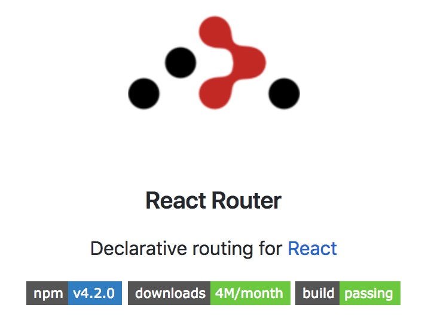

{: .small }


## Overview

React + Routing

What if you want your frontend to have routes — different URLs that map to different components and layouts of components?   We're going to add React Router to our starterpack so all your future projects can have it!


## Let's Start


🚀 We're going to keep working on your starterpack for this assignment. So just dig up that repo and work there!  At this point you should have a starterpack that has webpack+babel+eslint+sass+react.

For this workshop we're just going to add React Router to your personal starter repository so now you'll have webpack+babel+eslint+sass+react+reactrouter! Wow.

*Note: if you forgot to push the react stuff from the first few steps of the [React Videos assignment](../react-videos) to your starterpack, you should go back and do that now! You can simply do those steps now directly in your starterpack repo.*

🐙 Before we start let's tag the starterpack with v2!  This is with react but before we add routing.

```bash
git tag v2
git push origin --tags
```


## Start adding in routing


```bash
#make sure you are in your sa3 starterpack repo
yarn add react-router-dom

```

## Done

Now you have added React Router to your starter package!

[React Router](https://reacttraining.com/react-router/web/example/basic) has undergone some major rewrites in the past but has been stable for a year (didn't have to rewrite this section this year!). It used to be that all routes were defined in one place, now you can have composable declarable routes spread throughout your components.  You'll see what that means shortly.


## Route setup

What we want to do is have the following URL structure:

* `/`  displays `Welcome` component and `Nav` component.
* `/about` displays `About` component + `Nav`.
* `/test/id` displays `Test` component and shows ID from url + `Nav`

This will demonstrate the power of routing and we'll be using this in our next lab as well.


## Let's Build Some Test Components

Go ahead and create three very simple function based components. You can make these in your `index.js` file for now. Generally components should go in their own files, but we're just playing around here.


```js
const About = (props) => {
  return <div> All there is to know about me </div>;
};
const Welcome = (props) => {
  return <div>Welcome</div>;
};
```


🚀 Now let's import in some routing magic

```js
import { BrowserRouter as Router, Route, NavLink } from 'react-router-dom';
```

Note: **we are renaming BrowserRouter to Router** with the `as` keyword. The react-router gives us a few different routers including one for react-native for instance but we want the browser one. For now...


🚀 And let's add in some routes in our `App` component.  For now it can just be a dumb component.

```js
const App = (props) => {
  return (
    <Router>
      <div>
        <Nav />
        <Route exact path="/" component={Welcome} />
        <Route path="/about" component={About} />
      </div>
    </Router>
  );
};
```

Woop, we forgot our `Nav` component, that is essential.

```js
const Nav = (props) => {
  return (
    <nav>
      <ul>
        <li><NavLink to="/">Home</NavLink></li>
        <li><NavLink to="/about">About</NavLink></li>
      </ul>
    </nav>
  );
};
```

Here we use a special react-router `NavLink` component rather than an anchor tag. `NavLink` by default adds an `active` class to the link you are currently on, which is pretty cool.

In your `style.scss` file add:

```css
.active {
  color: pink;
}
```

(don't forget `import '../style.scss';` in app)


Ok,  test this out.  What you should have when you first load the page is some links in the top nav that show up on every page, but when you click them they navigate the page and also change to the highlighted color.  Wait, but why does `Home` always stay active?  Because the match that `NavLink` is making is not exact, `/` is matching anything that begins with a `/`.   Changing `<NavLink to="/">` to `<NavLink to="/" exact>` should fix it.

Great, ok let's add in one more component to test with. 👍

## URL Parameters

So what if you want is to be able to pass in a URL parameter.  Something like `profile/some_id` where `some_id` might be how Facebook does your profile url:  `profile/username`

Turns out we can do that!

🚀 Add in a new route:

```js
<Route exact path="/test/:id" component={Test} />
```

```js
const Test = (props) => {
  return <div> ID: {props.match.params.id} </div>;
};
```

Note the new `match` property!  This is given to us by react router for every path.  We can use it for some cool things like knowing what url we are on, but also for parsing out any URL parameters that we defined!

Let's add in some links to our Nav as well:

```js
<li><NavLink to="/test/id1">test id1</NavLink></li>
<li><NavLink to="/test/id2">test id2</NavLink></li>
```

Try it out.  Cool.  The "/path/:parameter" style of defining a http route is very common and used in many frameworks.


## Unknown Routes

What happens if we type in a route that is unknown to the router.  Currently that would mean that it would not match any of existing `Route` components and so will display the `Nav` and nothing else.  But what if we wanted a fallback route?

React-router let's us do this with a `Switch` component -- this component wraps `Route` components and returns only the first one that matches. *By default if multiple `Route`s match they will all render.*

🚀 Wrap your `Route`s in a `Switch` and add in a `FallBack` component that will always match (with no `path` specified):

```html
<Switch>
  <Route exact path="/" component={Welcome} />
  <Route path="/about" component={About} />
  <Route exact path="/test/:id" component={Test} />
  <Route component={FallBack} />
</Switch>
```


```js
const FallBack = (props) => {
  return <div>URL Not Found</div>;
};
```

Wait, but this doesn't quite work right, as we've been playing with this for some reason we keep getting a `Cannot GET /test/id1` message, but it works if we just go back to [http://localhost:8080/](http://localhost:8080/)...

## FallBack Server Support

Turns out we need to tell `webpack-dev-server` that if you load a frontend route directly (not through javascript) — rather than refusing to find that file, it should always return `index.html`.  This is an SPA after all. 

🚀 In your `webpack.config.js` file merge in with the other `module.exports`:

```js
  devServer: {
    hot: true,
    historyApiFallback: true,
  },
```

## Deployment

There is one tricky bit with deployment now that we have frontend routes.  The problem is that say you go to your yoursitename.surge.sh/posts/id page. If you ask the server for this page the server will tell you it doesn't exist. Because in point of fact the resource `/posts/id/index.html` does not exist on the server.  `webpack-dev-server` happens to have a configuration option `historyApiFallback` which makes it serve up the base index.html file for every resource URL that it can't find, but hosting services don't do this by default. So we're going to alter our webpack a bit to be more robust.

🚀 Now we have to make sure that we are telling webpack to output our files to the root '/' rather than using relative links. Add the following to your `webpack.config.js` file:

```javascript
mode: env,
output: { publicPath: '/' },
```

### If you are using SURGE.SH

Now we're going to do something odd. We're going to make a copy of `index.html` to `200.html`.  What will happen is when you hit a route that *surge* doesn't know about, it will serve up the contents of the `200.html` file. Since this file is your app, it will load up, read the current route, and change the page appropriately. This is *surge* specific but will make our SPA setup pretty robust.

🚀 Duplicate the `HtmlWebpackPlugin` entry in the `webpack.config.js` file so you have one with `filename: './200.html'` and one with `filename: './index.html'` both using the same template file `template: './src/index.html'`.


### If you are using NETLIFY.COM

[Netlify.com](http://netlify.com) is a more powerful platform than surge (albeit a bit more complicated).  They support a config file `_redirects` that allows you to create any number url redirect rules. 

For our purposes: 

🚀 create a `_redirects` file in the root of your project with:

```
/*   /index.html   200
```

as contents. 

Then edit your `package.json` file and change your `build` script to be:

```
    "build": "yarn clean; NODE_ENV=production webpack --colors; cp -f _redirects dist/",
```

The idea being that when you set up netlify with github - give it `yarn build` as the build command and `dist` as the output directory, and your build scripts needs to just add it to there. 


## Test Your Deployed URL

Check it out in your browser.  Try changing the url to `/badlink`,  it should load your test app and hit the fallback route!


## Commit!

Don't forget to commit and push your code so that your starterpack now has routing support and an example!

## Release V3!

```bash
git tag v3
git push origin --tags
```


## To Turn In (Canvas)

* url to github repo (makes grading a whole lot easier and friendlier)
* url to surge.sh/netlify site
* your starter pack should now
    * have working test routes
    * be deployed to surge with working 200.html
    * lint correctly
    * have fallback webpack serving index.html for any route


## Resources

* [https://reacttraining.com/react-router/web/guides/quick-start](https://reacttraining.com/react-router/web/guides/quick-start)
