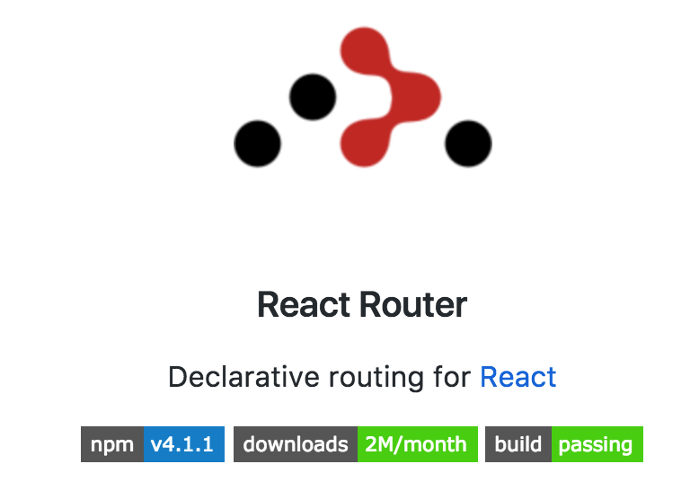

{: .small }


## Overview

React + Routing

What if you want your frontend to have routes — different URLs that map to different components and layouts of components?   We're going to add React Router to our starterpack so all your future projects can have it!


## Let's Start


🚀 We're going to keep working on your starterpack for this assignment. So just dig up that repo and work there!  At this point you should have a starterpack that has webpack+babel+eslint+sass+react.

For this workshop we're just going to add React Router to your personal starter repository so now you'll have webpack+babel+eslint+sass+react+reactrouter! Wow.


*Note: if you forgot to push the react stuff from the first few steps of the React Videos assignment to your starterpack, you should go back and do that now. You can simply do those steps now directly in your starterpack repo.*

## NPM It


```bash
#make sure you in your sa3 starterpack repo
npm install --save react-router-dom react-router

```

## Done

Now you have added React Router to your starter package!

We're going to be working with a brand new version (released April 12th 2017) of [react-router, version 4](https://reacttraining.com/react-router/web/example/basic).  This is a major rewrite and handles routing completely differently from how it has been done in the past.   Where it used to be that all routes were defined in one place, now you can have composable declarable routes spread throughout your components.  You'll see what that means shortly.


## Route setup

What we want to do is have the following URL structure:

* `/`  displays `Welcome` component and `Nav` component.
* `/about` displays `About` component + `Nav`.
* `/test/id` displays `Test` component and shows ID from url + `Nav`

This will demonstrate the power of routing and we'll be using this in our next lab as well.


## Let's Build Some Test Components

Go ahead and create three very simple function based components. You can make these in your `app.js` file for now. Generally components should go in their own files, but we're just playing around here.


```js
const About = (props) => {
  return <div> All there is to know about me </div>;
};
const Welcome = (props) => {
  return <div>Welcome</div>;
};
```


🚀 Now edit App and let's import in some routing magic

```js
import { BrowserRouter as Router, Route, NavLink } from 'react-router-dom';
```

*Note: we are renaming BrowserRouter as Router. react-router gives us a few different routers including one for react-native for instance but we want the browser one. For now...*


🚀 And let's add in some routes in our `App` component.  For now it can just be a dumb component.

```js
const App = (props) => {
  return (
    <Router>
      <div>
        <Nav />
        <Route exact path="/" component={Welcome} />
        <Route path="/about" component={About} />
      </div>
    </Router>
  );
};
```

Woop, we forgot our `Nav` component, that is essential.

```js
const Nav = (props) => {
  return (
    <nav>
      <ul>
        <li><NavLink to="/">Home</NavLink></li>
        <li><NavLink to="/about">About</NavLink></li>
      </ul>
    </nav>
  );
};
```

Here we use a special react-router `NavLink` component rather than an anchor tag. `NavLink` by default adds an `active` class to the link you are currently on, which is pretty cool.

In your `style.scss` file add:

```css
.active {
  color: pink;
}
```

(don't forget `import '../style.scss';` in app)


Ok,  test this out.  What you should have when you first load the page is some links in the top nav that show up on every page, but when you click them they navigate the page and also change to the highlighted color.  Wait, but why does `Home` always stay active?  Because the match that `NavLink` is making is not exact, `/` is matching anything that begins with a `/`.   Changing `<NavLink to="/">` to `<NavLink to="/" exact>` should fix it.

Great, ok let's add in one more component to test with. 👍

## URL Parameters

So what if you want is to be able to pass in a URL parameter.  Something like `profile/some_id` where `some_id` might be how Facebook does your profile url:  `profile/username`

Turns out we can do that!

🚀 Add in a new route:

```js
<Route exact path="/test/:id" component={Test} />
```

```js
const Test = (props) => {
  return <div> ID: {props.match.params.id} </div>;
};
```

Note the new `match` property!  This is given to use by react router for every path.  We can use it for some cool things like knowing what url we are on, but also for parsing out any URL parameters that we defined!

Let's add in some links to our Nav as well:

```js
<li><NavLink to="/test/id1">test id1</NavLink></li>
<li><NavLink to="/test/id2">test id2</NavLink></li>
```

Try it out.  Cool.


## Unknown Routes

What happens if we type in a route that is unknown to the router.  Currently that would mean that it would not match any of existing `Route` components and so will display the `Nav` and nothing else.  But what if we wanted a fallback route?

React-router let's us do this with a `Switch` component -- this component wraps `Route` components and returns only the first one that matches. *By default if multiple `Route`s match they will all render.*

🚀 Wrap your `Route`s in a `Switch` and add in a `FallBack` component that will always match (with no `path` specified):

```html
<Switch>
  <Route exact path="/" component={Welcome} />
  <Route path="/about" component={About} />
  <Route exact path="/test/:id" component={Test} />
  <Route component={FallBack} />
</Switch>
```


```js
const FallBack = (props) => {
  return <div>URL Not Found</div>;
};
```

Try it out by typing in some random url.  ⚠️ if you run into a problem where it says it can't find `bundle.js`  this means that in your `index.html` you are loading in your bundle with a relative url.  Generally that is fine, except that now our URL is changing so the relative URL ends up being wrong. To fix this change your `index.html` file to refer to `/build/bundle.js` and `/build/style.css`.


## Commit!

Don't forget to commit and push your code so that your starterpack now has routing support and an example!

## Deployment

There is one tricky bit with deployment now that we have frontend routes.  The problem is that say you go to your github.io/posts/id page. If you ask the server for this page the server will tell you it doesn't exist. Because in point of fact the resource `/posts/id/index.html` does not exist on the server.  `webpack-dev-server` happens to have a configuration option `historyApiFallback` which makes it serve up the base index.html file for every resource URL that it can't find.  But gh-pages doesn't do that for us.

So what we're going to do is add a new deployment method.  We'll use [surge.sh](surge.sh) for this.  Surge is a fast static file hosting service similar to gh-pages but it has a couple of extra features.

```bash
npm install -g surge
npm install --save-dev surge #both command and in dependencies
```

and then add in a new script in `package.json`
```json
    "surge": "npm run build; surge -p public -d cs52-my-cool-starterpack.surge.sh; npm run clean"
```

Now we're going to do something odd. We're going to make a copy of `public/index.html` to `public/200.html`.  What will happen is when you hit a route that surge doesn't know about, it will serve up the contents of the 200.html file. Since this file is your app, it will load up, read the current route, and change the page appropriately.

Go ahead.  Change the `-d cs52-my-cool-starterpack.surge.sh` to be unique for you. `npm run surge`.  

The other additional benefit of surge is that now your `/build/bundle.js` link will work,  on github pages if you were hosted in a subfolder like `https://dartmouth-cs52-17s.github.io/somerepository` then any resources starting with `/` would go too far up the tree.


## Resources

* [https://reacttraining.com/react-router/web/guides/quick-start](https://reacttraining.com/react-router/web/guides/quick-start)
