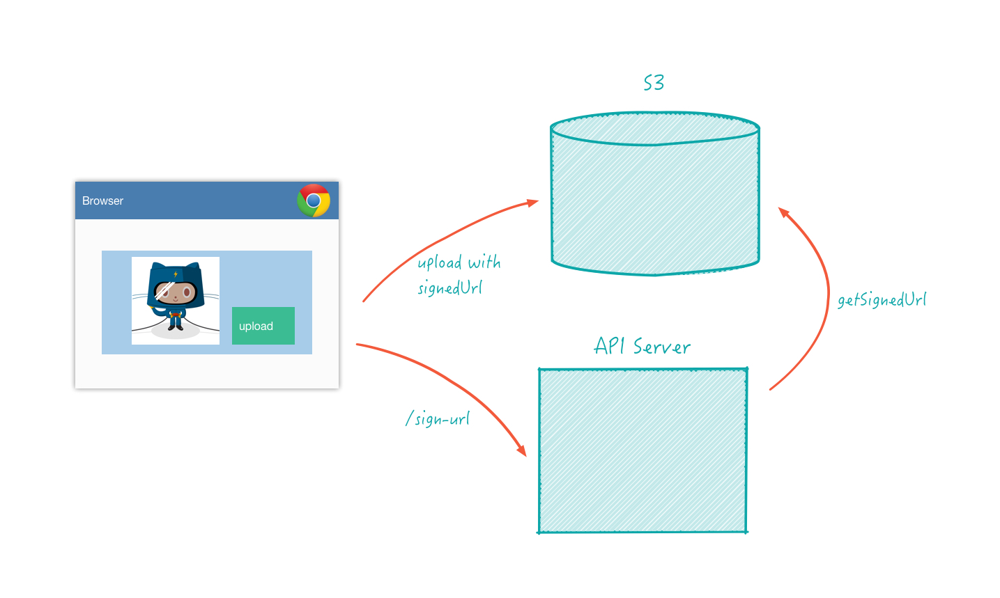
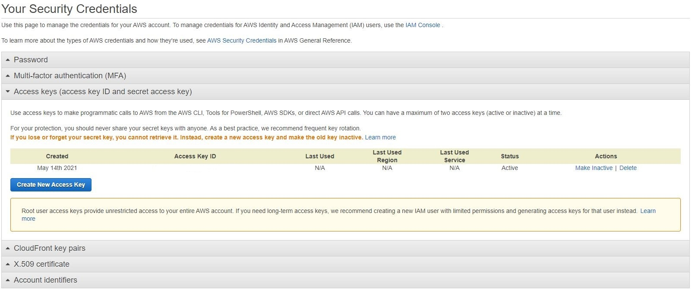
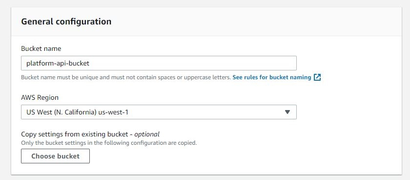
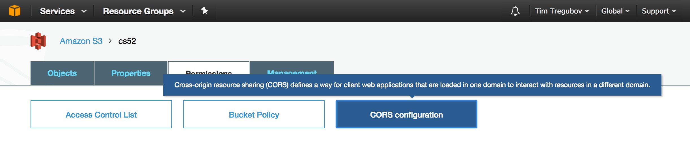

## Overview
*Updated by Sudharsan and Rishik 21S*

Today we'll be learning how to directly upload images to Amazon Web Services Simple Storage Service (S3) on our blog application from Lab 4 and 5. We will be implementing an image input for handling image uploads and then these images will directly be uploaded to S3.

Amazon S3 is a popular and reliable storage option for storing files such as images, documents, and videos. By uploading directly to S3, we can reduce server load because our server load no longer needs to handle receiving images from the client. When handling large images, our service would otherwise not be able to respond to other web requests as efficiently.


### Code Flow

In general, the method described in this article follows these simple steps:

- A file is selected for upload by the user in the client
- The client makes a request to your server, which produces a temporary signature with which to sign the upload request
- The browser then uploads the file directly to Amazon S3 using the signed request




## Setup

### Git Tags

Before you start make sure to tag your previous Lab4 and Lab5 with v2.

🚀 Make sure everything is commited and pushed to github normally.

🚀 Go into your Lab5 and Lab4 directories and run:

```bash
git tag
```

to double check your versions, then if you didn't tag your last version do so now:

```
git tag v2 #or whatever version your previous should have been tagged with
git push origin --tags
```

Great, now you can add uploading but always know the version that came before.

### S3 Setup

First we need to enable our Heroku application to use S3, which requires that the app have access to the AWS credentials as well as the name of the bucket to store files. 

🚀 Create an AWS account [here](https://aws.amazon.com/) and navigate to the [Security Credentials](https://console.aws.amazon.com/iam/home?#security_credential) page under Identity Access Management (IAM). You'll need to scroll down to Access Keys and create an access key.



🚀 Copy down the Access Key ID and the Secret Access Key ID, you will be putting it into your Heroku App config vars later on.

🚀 Next, navigate back to the AWS [home page](https://aws.amazon.com/) and then to the [S3 Console](https://console.aws.amazon.com/s3/home?#). Here, create a bucket; this is where all the files you upload from your client will live. Choose an [appropriate name](https://devcenter.heroku.com/articles/s3#naming-buckets) and take it down as well, we will also be adding it to heroku. For the region, make sure you create the bucket in the same region as the app that will use it. Uncheck the block public access box for now and keep the rest of the settings the default.



🚀 You will now need to edit some of the permissions properties of the target S3 bucket so that the final request has sufficient privileges to write to the bucket. In a web-browser, sign in to the AWS console and select the S3 section. Select the appropriate bucket (or create a new one) and click the ‘Permissions’ tab. Scroll down to the very bottom, where you will see 'cross-origin resource sharing' (CORS). 

CORS (Cross-Origin Resource Sharing) will allow your application to access content in the S3 bucket. Each rule should specify a set of domains from which access to the bucket is granted and also the methods and headers permitted from those domains.



Then, click the Edit button at the right and enter the following JSON inside the configuration editor: 


```json
[
  {
    "AllowedHeaders": [
      "*"
    ],
    "AllowedMethods": [
      "PUT",
      "POST",
      "GET"
    ],
    "AllowedOrigins": [
      "*"
    ],
    "ExposeHeaders": []
  }
]
```

🚀 Click 'Save’ in the CORS window. 

This tells S3 to allow any domain access to the bucket and that requests can contain any headers, which is generally fine for testing. When deploying, you should change the 'AllowedOrigin’ to only accept requests from your domain.

🚀 Finally, log the three fields you took down onto your API's configuration variables. When you are locally testing, add them to your `.env` file.


## Direct Uploading Client


### File input component

We need to add some JSX to our frontend in both the `newPost` component and `post` component that allows us to upload images for our cover image.

```javascript

<input type="file" name="coverImage" onChange={this.onImageUpload} />
```

These are the basic elements you would need. You should definitely revamp this to make this look nicer. The `preview` element shows a preview of the new image you just added after you choose it. We have a function `onImageUpload` that handles our input.

```javascript
onImageUpload(event) {
  const file = event.target.files[0];
  // Handle null file
  // Get url of the file and set it to the src of preview
  if (file) {
    this.setState({ preview: window.URL.createObjectURL(file), file });
  }
}
```

Note: in the above we have **2** bits of state. `preview` which is set to an inlined string blob version of the image created by [`window.URL.createObjectURL`](https://developer.mozilla.org/en-US/docs/Web/API/URL/createObjectURL), and `file` which is the actual [file object](https://developer.mozilla.org/en-US/docs/Web/API/File) that is currently only in the browser memory but not yet uploaded.  

⚠️ You should theoretically cleanup these weird window global preview url objects with: `window.URL.revokeObjectURL(this.state.preview)` and if a new image is uploaded as they will leak memory, but you can ignore these for now.

You can also use external react components such as [react-dropzone](https://react-dropzone.netlify.com/)


### S3 Functions

Since our post creation no longer relies on the `cover_url` input we need to do a bit more work to preview and upload the image, and only upon success get access to the url.

🚀 Create a file named `s3.js` - we won't need to use redux for this immediately so we're going to simplify and keep these functions separate from actions.  You will need access to your api server `ROOT_URL` through, so you can try to `import { ROOT_URL } from './actions';`  if you've also exported it.

```javascript
function getSignedRequest(file) {
  const fileName = encodeURIComponent(file.name);
  // hit our own server to get a signed s3 url
  return axios.get(`${ROOT_URL}/sign-s3?file-name=${fileName}&file-type=${file.type}`);
}
```

```javascript
// return a promise that uploads file directly to S3
// note how we return the passed in url here rather than any return value
// since we already know what the url will be - just not that it has been uploaded
function uploadFileToS3(signedRequest, file, url) {
  return new Promise((fulfill, reject) => {
    axios.put(signedRequest, file, { headers: { 'Content-Type': file.type } }).then((response) => {
      fulfill(url);
    }).catch((error) => {
      reject(error);
    });
  });
}
```

We have two helper functions, `getSignedRequest` and `uploadFileToS3` that each return a promise. The reason why we have this pattern is that `uploadFileToS3` requires `getSignedRequest` to return a success call. These functions are used by `uploadImage` which also returns a promise.

```javascript
export function uploadImage(file) {
  // returns a promise so you can handle error and completion in your component
  return getSignedRequest(file).then((response) => {
    return uploadFileToS3(response.data.signedRequest, file, response.data.url);
  });
}
```

We use promises because we need the image to successfully upload to S3 first, before we can add it to our post - this way we can wait for `uploadImage` and only submit our post after that.

### Submit Handler

How would use our new `s3.uploadImage` function?   Well something like the following in your *onSubmit* or `onFinishEdit` handlers would work. All you are doing is waiting for the image to upload first and only then creating or updating your post.

```js
if (this.state.file) {
  uploadImage(this.state.file).then(url => {
    // use url for content_url and
    // either run your createPost actionCreator
    // or your updatePost actionCreator
  }).catch(error => {
    //handle error
  });
}
```


## Server

We need some new packages to communicate with s3. `aws-sdk` is used to communicate with s3  and `dotenv` is used to load environment variables from `.env` for your server.

```bash
npm install aws-sdk dotenv
```

🚀 To setup `dotenv`, we want to call `dotenv.config({ silent: true });` as early as possible in our `server.js`. Then we can access our environment variables by using `process.env.S3_BUCKET_NAME`.


### Heroku Setup

🚀 Make a `.env` file in your root directory of your **server**. It should look something like this.

```bash
AWS_ACCESS_KEY_ID=YOUR_KEY_HERE
AWS_SECRET_ACCESS_KEY=YOUR_KEY_HERE
S3_BUCKET_NAME=YOUR_BUCKET_NAME_HERE
```

🚀 Remember to add the `.env` file to your `.gitignore`, since this file should only be used for local testing.

In order for your application to access the AWS credentials for signing upload requests, they will need to be added as configuration variables in Heroku. You can add these environment variables to Heroku for use on your server by running the following command for each of your variables, or you can log into Heroku dashboard and add them there.

```bash
$ heroku config:set AWS_ACCESS_KEY_ID=YOUR_KEY_HERE
```

We set all of these secret keys in a config variable because we don't want to expose these variables directly in code, where they could be potentially stolen.

### S3 Service

We also need a new route on our server to return our signedRequest. Make a new folder under app called `services`, and add a new `s3.js` file.

```javascript
const signS3 = (req, res) => {
  const s3 = new aws.S3();
  const fileName = req.query['file-name'];
  const fileType = req.query['file-type'];
  const s3Params = {
    Bucket: process.env.S3_BUCKET_NAME,
    Key: fileName,
    Expires: 60,
    ContentType: fileType,
    ACL: 'public-read',
  };
  s3.getSignedUrl('putObject', s3Params, (err, data) => {
    if (err) { res.status(422).end(); }

    const returnData = {
      signedRequest: data,
      url: `https://${process.env.S3_BUCKET_NAME}.s3.amazonaws.com/${fileName}`,
    };
    return (res.send(JSON.stringify(returnData)));
  });
};

export default signS3;
```

Note: if your S3 region got assigned to Ohio rather than the usual `us-east-2`: instead of `const s3 = new aws.S3();`, you'l need to use
`const s3 = new aws.S3({ signatureVersion: 'v4', region: 'us-east-2' });`

🚀 Now in your router, we can add a new route:

```javascript
router.get('/sign-s3', signS3);
```

#### Test it

Things should be working now!


#### Required Features

- Add the image upload ability to create post and update post
- Add a route on the backend to return signed requests

#### To Turn In

- github url to your repo
- your deployed netlify and heroku urls
- brief what worked and what didn't

###### Additional Readings

* [Heroku Direct to S3 File Upload](https://devcenter.heroku.com/articles/s3-upload-node)
* [Heroku S3 Setup](https://devcenter.heroku.com/articles/s3)
* [Dotenv Docs](https://github.com/motdotla/dotenv)

