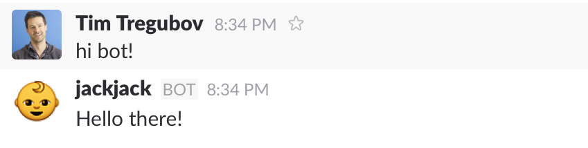
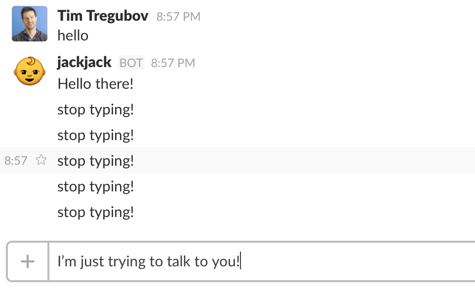
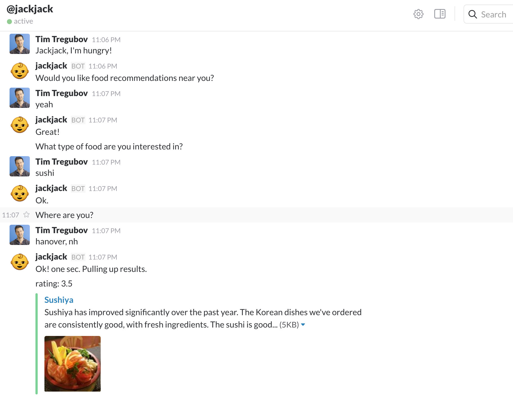

Are you ready to invent the next AI?  Any self-respecting bot needs to be able to communicate via Slack. The bot will be able to do things like respond to messages and message users as they join your Slack team. It will be a simple [Node.js](https://nodejs.org/en/) and [Express.js](http://expressjs.com/) app and run on [Heroku](https://www.heroku.com/). Don't worry if you haven't used these technologies before — all will be explained!

{: .fancy .small}


## Slack Bot Basics
In Slack, bot users are similar to human users in that they have names, profile pictures, exist as part of the team, can post messages, invited to channels, and more. The main difference is that bots are controlled programmatically via an API that Slack provides. We'll be building a custom bot that listens to certain events, like a message or a new member joining your team, and responds accordingly.


## Setup
Some of the technologies we'll be using are Slack, Github, Heroku, and Node.js. Node is runtime environment used for developing server-side web applications and Heroku is a [Platform-as-a-Service](https://en.wikipedia.org/wiki/Platform_as_a_service) which runs our Node application. Let's walk through these basic setup steps together.

1. **GitHub**

    🚀 Pull in some starter code from [express+babel+eslint](https://github.com/dartmouth-cs52/express-babel-starter).

1. **Slack**

    🚀 From the Slack desktop app, click on the team name in the top-left and then go to "Apps & Integrations." Search for "bot" and click the top result, "Bots." Click "Add Configuration". Choose a name for your bot and fill in the details for the bot. Take note of the API Token, we'll use it later.

    {: .fancy}

1. **Setup Local Environment**

    Your app will need to know about the API token. This token allows you to talk to Slack's servers in an authenticated way.  API keys can be thought of as authentication for programs.

    You'll need to have the API token as a local environment variable.  However, to make it simpler than editing individual shell environment variables we're going to use a node module:  [`dotenv`](https://www.npmjs.com/package/dotenv) module to import it into your code.

    🚀 Save `SLACK_BOT_TOKEN="TOKEN_YOU_SAVED_EARLIER"` into a `.env` file that you do not add to git (add .env to your .gitignore file).

    Then in your code wherever you need it you can use:

    ```javascript
    import dotenv from 'dotenv';
    dotenv.config({ silent: true });

    // and then the secret is usable this way:
    process.env.SLACK_BOT_TOKEN
    ```

    Note: during deployment for Heroku you'll need to add SLACK_BOT_TOKEN to your config variables in Settings.

1. **Express**

    [Express](http://expressjs.com/) is a web framework for Node.
    This can be useful if we need to control our app remotely, for now we'll leave this set up.

    🚀Open `app/server.js`.  This is the main file that launches your bot.

1. **Run Dev Mode**

    You can now start your app in dev mode.

    In the `package.json` there is a section named `scripts`.  This happens to have a few handy things already defined for you.  In particular the dev command which you can run with `npm run dev`.

    This will launch your bot in development mode!  Node will watch for any file changes and relaunch itself as needed.

    ```bash
    ➜ npm run dev

    > example_express_with_es6@1.0.0 dev
    > nodemon app/server.js --exec babel-node
    [nodemon] 1.9.2
    [nodemon] to restart at any time, enter `rs`
    [nodemon] watching: *.*
    [nodemon] starting `babel-node app/server.js`
    listening on: 9090
    ```

## Your First Bot Words

Ok so now you have a little server running, but how does it talk to Slack?

1. 🚀Let's add a little library to do that. In a new Terminal window (cool thing about how we're running node in dev mode is that we can change things while it is  running and it'll pick up the changes):

    ```bash
    cd slackattack #make sure you are in your project direct
    npm install --save botkit
    ```

    We are going to use [botkit](https://github.com/howdyai/botkit), which is a library that helps create conversational bots.  

    Note how as soon as that finishes running your nodemon restarts.

1. Import the library.

    🚀in `app/server.js` add:

    ```js
    import botkit from 'botkit';
    // this is es6 syntax for importing libraries
    // in older js this would be: var botkit = require('botkit')
    ```

1. Setup Bot Controller

    🚀After we create the express app, lets set up botkit.

    ```js
    // botkit controller
    const controller = botkit.slackbot({
      debug: false,
    });

    // initialize slackbot
    const slackbot = controller.spawn({
      token: process.env.SLACK_BOT_TOKEN,
      // this grabs the slack token we exported earlier
    }).startRTM(err => {
      // start the real time message client
      if (err) { throw new Error(err); }
    });

    // prepare webhook
    // for now we won't use this but feel free to look up slack webhooks
    controller.setupWebserver(process.env.PORT || 3001, (err, webserver) => {
      controller.createWebhookEndpoints(webserver, slackbot, () => {
        if (err) { throw new Error(err); }
      });
    });
    ```

    If you notice an error: `Error: not_authed` this is because you forgot to export/set the environment variable for the SLACK_BOT_TOKEN.

    If you have trouble setting up your environment you can use a .env file with the [dotenv node package](https://www.npmjs.com/package/dotenv).


1. Lets Say Hi!

    ```js
    // example hello response
    controller.hears(['hello', 'hi', 'howdy'], ['direct_message', 'direct_mention', 'mention'], (bot, message) => {
      bot.reply(message, 'Hello there!');
    });
    ```

    Give it a shot,  try direct messaging your bot in Slack!

    

1. What about names?

    Want the bot to respond to the user by name?

    Well we have full access to [Slacks web api](https://api.slack.com/methods/users.info). Lets look up the users name.

    ```js
    bot.api.users.info({ user: message.user }, (err, res) => {
      if (res) {
        bot.reply(message, `Hello, ${res.user.name}!`);
      } else {
        bot.reply(message, 'Hello there!');
      }
    });
    ```

    You would do this inside of the callback to controller.hears.


## Now for the Real Stuff!

Ok now your Bot knows how to say hi.  But lets make it do some useful stuff!

The rest of this assignment is more hands-off. We'll provide some direction and resources but you'll be looking up API docs and adding more cool stuff to your bot.

So far we've been using Botkit.  [Botkit](https://github.com/howdyai/botkit) has support for more complex [conversations](https://github.com/howdyai/botkit/blob/master/examples/convo_bot.js). This might come in handy.


The Botkit library provides us with a convenient wrapper around Slack's API. Our bot connects to Slack's RTM API and opens a WebSocket connection with Slack. *If you set `debug=true` in the botkit initialization you can see how it polls the Slack servers.*

### Events
The Slack server issues **events** that are then consumed by clients. These are things like [messages](https://api.slack.com/events/message) and [team join](https://api.slack.com/events/team_join) events. Botkit can hook up to any of Slack's events.  `.hears` is a fancier way of listening to message events.   

🚀Botkit [slack event integration](https://github.com/howdyai/botkit/blob/master/readme-slack.md#slack-specific-events).

For instance:

```js
controller.on('user_typing', (bot, message) => {
  bot.reply(message, 'stop typing!');
});
```

will make your bot a jerk! 😡



The format of the `message` object is defined on the Slack documentation for [message events](https://api.slack.com/events/message).

## Make Your Bot Do More
At this point you've achieved a general understanding of what goes into making a Slack bot and have implemented some functionalities. Now, go and see what else you can do with your Slack bot. Brainstorm, read documentation, and experiment. Make your bot the best that it can be!

### Wait But Food

Except first, lets make your bot actually helpful.  I am hungry, and I want your bot to suggest places to eat.

🚀Add in [Yelp API for node](https://github.com/olalonde/node-yelp).

🚀You'll need to [sign up and generate API keys](http://www.yelp.com/developers/getting_started/api_access
), similar to what you had to do for Slack.

Tip: Yelp results come back looking something like:

```js
{ region:
   { span:
      { latitude_delta: 0.718768709999992,
        longitude_delta: 1.2334175700000003 },
     center: { latitude: 43.667689249999995, longitude: -72.23498615 } },
  total: 293,
  businesses:
   [ { is_claimed: true,
       rating: 3.5,
       mobile_url: 'http://m.yelp.com/biz/lui-lui-west-lebanon?utm_campaign=yelp_api&utm_medium=api_v2_search&utm_source=SP9uRBTuVFlkyH53y2dRbw',
       rating_img_url: 'https://s3-media1.fl.yelpcdn.com/assets/2/www/img/5ef3eb3cb162/ico/stars/v1/stars_3_half.png',
       review_count: 107,
       name: 'Lui Lui',
       rating_img_url_small: 'https://s3-media1.fl.yelpcdn.com/assets/2/www/img/2e909d5d3536/ico/stars/v1/stars_small_3_half.png',
       url: 'http://www.yelp.com/biz/lui-lui-west-lebanon?utm_campaign=yelp_api&utm_medium=api_v2_search&utm_source=SP9uRBTuVFlkyH53y2dRbw',
       categories: [Object],
       phone: '6032987070',
       snippet_text: 'Still in heaven over how good the food was. We stopped in Lui Lui while looking for a quick dinner spot. While we couldn\'t sit due to the wait, I ordered...',
       image_url: 'https://s3-media2.fl.yelpcdn.com/bphoto/-yb1mjp8cvQwXqCnUUUNrw/ms.jpg',
       snippet_image_url: 'http://s3-media3.fl.yelpcdn.com/photo/m6vlPsVGi9ln0hQM0LGylw/ms.jpg',
       display_phone: '+1-603-298-7070',
       rating_img_url_large: 'https://s3-media3.fl.yelpcdn.com/assets/2/www/img/bd9b7a815d1b/ico/stars/v1/stars_large_3_half.png',
       id: 'lui-lui-west-lebanon',
       is_closed: false,
       location: [Object] },
     }
   },
 ...]
}
```

So you'll need to process those to filter out results you find useful.

Try something like:

```js
data.businesses.forEach(business => {
  // do something with business
});
```

instead of a c-style for loop.

Here's some sample output that your bot too can return.  Just slack [jackjack](https://cs52-dartmouth.slack.com/messages/@jackjack/) and tell him you are `hungry`.




## Data Stores

We're not covering the datastores here. So your bot will forget conversations it has had. Botkit does provide a [storage api](https://github.com/howdyai/botkit#storing-information).

If you want to try setting that up, its **extra credit** to have a convo that isn't only in memory.  Heroku has free Mongo addons so that might be a direction to take.

## Default/help responses

Don't forget to make your bot able to respond to any messaged directed at it with at least a "what are you even talking about" — and it should also tell people what it is capable of doing for them in response to @yourbotname help


## Deploy On Heroku

Ok the last step is to deploy your bot to Heroku!

1. 🚀Head over to [Heroku](https://www.heroku.com/) and login/sign up. Then, make a new app. Head over to "Settings" and add a Config Variable `SLACK_BOT_TOKEN` with value set to the API token of the Slack bot you made in step 1. You probably also need to add all your YELP keys, and any other API's you used.

1. Follow the steps under "Deploy Using Heroku Git".

You may have noticed a file named `Procfile` in the project. This tells Heroku what commands to run in its [dynos](https://devcenter.heroku.com/articles/dynos). Our `Procfile` is just one line, `web: npm run prod`, where `web` defines the dyno type (this one receives HTTP traffic), `npm run prod` is the command defined in `package.js` that we want to run.


## Outgoing Webhook

Heroku dynos will typically sleep after some period of time. Your bot will not wake up automatically based on the slack RTM because that is a queue that it is your bots responsibility to check.

There are ways around this, but a workaround for now would be to add an an [Outgoing Webhook](https://api.slack.com/outgoing-webhooks) that would wake up your bot.  Invite your bot to the **#bots** channel on slack and have the bot wake up on an outgoing webhook that mentions their name or another string.  Outgoing webhooks are configured as separate Slack integrations and require your bot to both have a public url (such as you would get when deploying on Heroku), and also have specific strings that trigger the outgoing webhook.  I have mine wake up on "jackjack wake up!" and send back a giphy to prove it.

```javascript
controller.on('outgoing_webhook', (bot, message) => {
  bot.replyPublic(message, 'yeah yeah');
});
```

## To Turn In:

* github url to your bots repo (must be readable by staff, can be public)
* screen caps of some conversations that test your bot's functionality
* when we talk to your bot, it should be able to:
  * respond to hi and random messages
  * return results for a restaurant query
  * carry on at least one conversation
  * send back an [*attachment* message](https://github.com/howdyai/botkit#botreply) in response to something.
  * wake up on an outgoing webhook from #bots
* your heroku URL.  This is so we can wake up your bot if heroku sleeps your dyno.
* /invite your bot to the Slack #bots channel where we will have bot parties.


# Extra Credit

* So many options. Be creative!
* Maps?
* Driving directions?
* [MongoDB Botkit Storage](https://github.com/howdyai/botkit-storage-mongo) setup on Heroku.
* have your bot talk with another bot in #bot (requires collaboration but only on discussing how the bot conversation would go — this is still an individual assignment).  For instance, if I ask your bot for a recipe (in a DM), your bot could then use #bot to ask another bot for a suggested recipe and then return the results in the DM. This might be tricky to get right, document your "bot2bot chat api" and submit that in addition to screenshots showing the functionality.
* play with es6 promises
