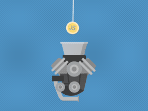
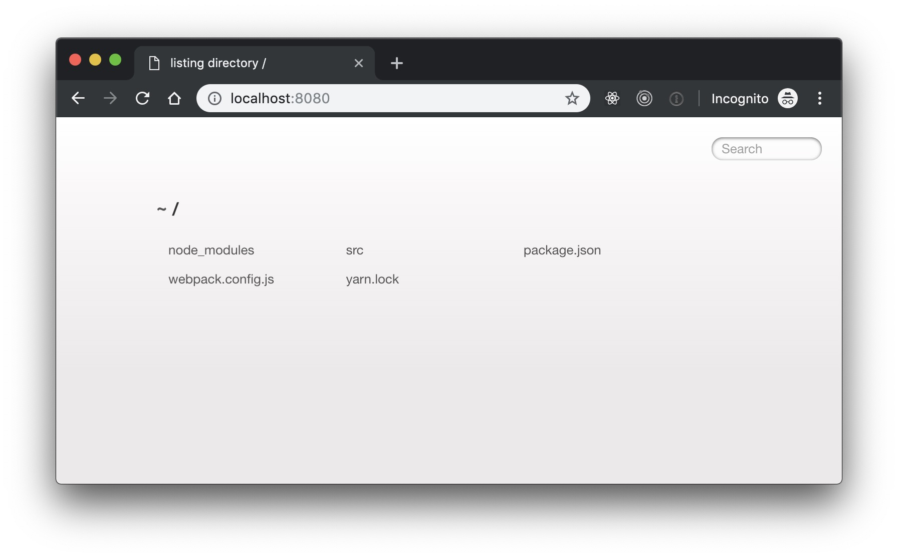
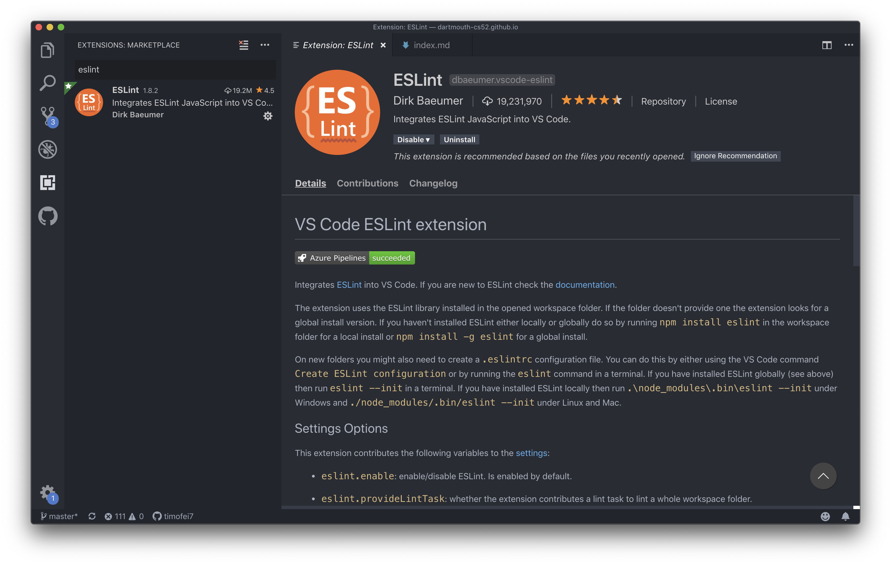
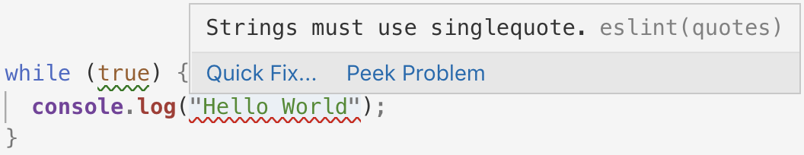
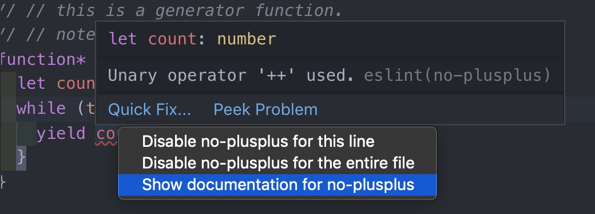
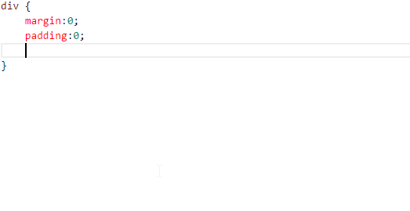
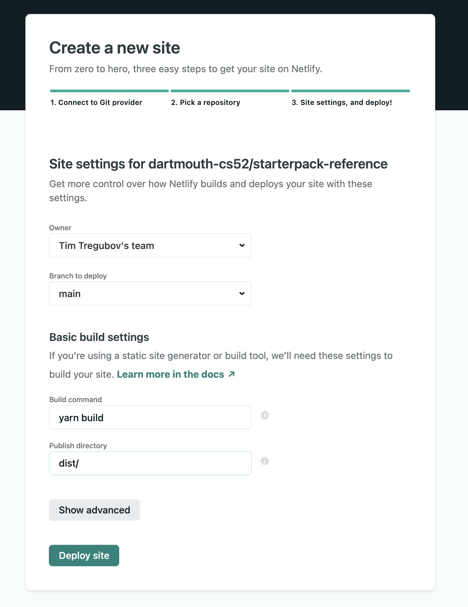

## Overview

Today we'll be learning about a set of tools for making your code compact and pretty.  So far you've been using html and css in separate files and the sites have been fairly compact — but as your sites grow more complex and include more and more libraries there has to be a way to manage it all.  We'll introduce a set of tools to help you build complex sites with many module dependencies easily.


💻 : run in Terminal<br>
🚀 : a step to not forget

🚀 To start grab the github classroom link in canvas to start a new repository. Work in the `main` branch for now, you'll see why later.

## Today's Stack

We'll build a starter package that will use:

* webpack
* sass
* babel
* eslint
* as well as a suite of cool tools: node, npm, yarn

Don't worry we'll learn allllll about it.

🌵 Note: This *short* is a little on the long side, but it's important. Try to read the explanations so you understand what is happening — you will be using and building up from this starterpack for the next month.

*There is an way to generate a similar starterpack that some of you may have played around with: `create-react-app`.  This is generally a fine way to do a quick start react project. However, it hides all the magic it does in a complex set of hidden config files, and is difficult to extend.  We want to have the confidence to do that and to understand what is actually happening — so we're going to start from scratch.* ✊


## [NPM](https://www.npmjs.com/)

{: .fancy .tiny }


[NPM](https://www.npmjs.com/) is the dependency package manager for Node.js and the javascript ecosystem in general.  While we won't exactly be using node just yet today, we will be using the package manager to install various javascript tools. Node.js is a javascript platform for running javascript outside of a browser for developing server side applications and we will be using it extensively later on. You can do things like `npm install somepackage` and it will download that package and add it to your project. Great.


### Installation

🚀 Let's install some Nodejs!

#### os x:

```bash
brew update
brew upgrade
brew install node
```

Make sure you have reasonably up to date versions of node/npm/yarn:

```bash
node --version
# v14.16.1
npm --version
# 7.9.0
```
Newer than these is fine, but if you have older ones you might need to force uninstall/reinstall:

If you run into problems here (such as permissions issues) you can try forcing a reinstall:

```bash
sudo chown -R $USER /usr/local  #in case you had ever run brew with sudo
brew uninstall --force node
brew install node
```

#### windows, other:

* windows: install from [nodejs.org](https://nodejs.org/en/) and [yarnpkg.com](https://yarnpkg.com/en/). *you may need to restart git shell afterwards*
* linux: use your distribution's package manager

### start a node project

🚀 We will start a node js project even though we will only be using the node package manager.

```bash
#make sure you are cd'd into your cloned workspace

npm init #accept all the default answers if you want
```

All this did was create a barebones `package.json`  file.  This file defines a node.js based project and is required.  It will primarily list all of the dependencies of our project.  It will also define some convenient scripts for us.  Take a look at it, mostly it has a name and some other metadata about your project.

### Index file

🚀 Let's create a simple javascript file to get us started. It is good practice to keep your app in a subdirectory of the project so let's create that and call it `src`.

```bash
mkdir src #create directory
touch src/index.js   #creates an empty file
```

🚀 Now in **VSCode** let's give our app something to do.

```javascript
console.log('starting up!');
```

### npm start

Now let's make it so we can run our app!

🚀 Edit your `package.json` file:

* change:
  `"main": "index.js"` to `"main": "src/index.js"`
* add/modify a `"scripts"` section:
  `"scripts": { "start": "node src/index.js" }`

Now in 💻 you can:

```bash
💻 npm start

> starterpack@1.0.0 start
> node src/index.js

```

Great, you just ran a little bit of javascript on the computer without a browser.

But, we want to actually make a webpage right?

## Index HTML

Let's set up a simple `index.html` to act as our main html page.

🚀 Create an `index.html` in the `src/` folder. You can add in a `favicon.png` if you like.

```html
<!DOCTYPE html>
<html>
  <head>
    <title>starter pack</title>
    <meta name="viewport" content="width=device-width, initial-scale=1.0">
    <link href="https://fonts.googleapis.com/css?family=Roboto" rel="stylesheet">
		<!-- Adding a favicon is optional, but will help your users differentiate browser tabs -->
		<link rel="shortcut icon" href="favicon.png" type="image/x-icon" />
  </head>
  <body>
    <div class="logo"></div>
    <div id="main">Loading</div>
  </body>
</html>
```

Sweet, a page that probably says "loading". We rock. But you probably want to be able to view it, and maybe we can do it better than with that python module we used last week.


## Webpack

{: .fancy .small}

[Webpack](https://webpack.js.org) is a build tool.  What it does is take all your dependencies (all the various files and libraries that your project is using) and bundle them up together — but in a smart way where it will only bundle up the things you need. It can do any preprocessing that you need, such as converting various code syntax and supports hot-reloading, so you never have to refresh the page manually again.  Most cleverly it actually analyzes your code and figures out what you are doing and only includes what is necessary. It makes 1 file out of all your JS files, it can optimize your images, it can make your CSS better.

{: .profile}

Webpack is the shopping cart; `package.json` is the shopping list; and your browser is um, the frying pan that cooks a delicious web meal for you? 

### Install Webpack for the project


🚀 Let's add webpack to our 🚼 project:

```bash
npm install -D webpack webpack-dev-server webpack-cli
```

`npm install` is how you add most any javascript library to your project.  It will install in a directory `node_modules` in your project and it will also add it into the `dependencies` section of the `package.json`! You want to add it to your project so that later if others were to download the project they could install the same packages.

Note: when you give `-D` as an argument it will add those modules to your `package.json` in a `devDependencies` section.  In this case we are saying these are *development* only dependencies. So you will now notice new lines declaring those dependencies in `package.json` as `"devDependencies"`. Leave off the `-D` flag if you are adding in a library you want to package up for the browser.

*If you see some warnings about deprecated packages — don't worry, the NPM ecosystem is large and often packages you install will have their own dependencies that might have warnings about versions that should be upgraded. In this context warnings are usually ok.* 

### .gitignore

⚠️ `node_modules` is **not** something you need to commit to git.  These are libraries that you can assume will be available and so as long as you have saved the dependencies to the `package.json` file anybody can later install all of the required packages by simply running `npm install`. There will **always be points off** if your github repo contains `node_modules`. 

🚀 Let's make sure we don't do that now.  Create a file called `.gitignore` and add the following:

```bash
dist
node_modules
.DS_Store
```

🚀 Let's add things to git while we are at it: `git add * .gitignore`, `git commit -am "we have some files in our project now"`

Whenever there are files in your project that you don't want git tracking, you can add them to your `.gitignore` file.


### First JS On The Web


🚀 Let's add in [JQuery](http://jquery.com/) really quick. We won't really be using much jquery this term, but for a quick example it will suffice.

```bash
💻 npm install jquery   #notice there is no -D
```


🚀 Change your `index.js` to the following:

```javascript
const $ = require('jquery');

$('#main').html('Here we go!');

```

All this will do is find the element with the `id` of `main` and change the content to 'Here we go!'.

At this point, you could try opening this page in a browser, but it won't work! The browser has no idea how to find jquery and it all crashes and burns 🔥.  Luckily webpack allows us to run a development mode server.

### Configure webpack

🚀 Let's give webpack a very basic configuration. Create a file called `webpack.config.js` with these contents:

```javascript
const env = process.env.NODE_ENV || 'development';
// set to 'production' or 'development' in your env

module.exports = {
  mode: env,
  entry: ['./src'], // this is where our app lives
  devtool: 'source-map', // this enables debugging with source in chrome devtools
  module: {
    rules: [
      {
        test: /\.js$/,
        exclude: /node_modules/,
      },
    ],
  },
  plugins: [],
};
```

All this is saying is that we want to look in `src` for `.js` files. Webpack will assume some other things about our project - in particular it will package things up into a directory called `dist`.

```bash
src/ #all the source html,js,css,scss files for your app
dist/  #autogenerated directory where webpack will put your bundle files
```

🚀 now try running webpack directly from the commandline: `./node_modules/.bin/webpack`

```bash
💻 ./node_modules/.bin/webpack
asset main.js 284 KiB [emitted] (name: main) 1 related asset
./src/index.js 62 bytes [built] [code generated]
./node_modules/jquery/dist/jquery.js 282 KiB [built] [code generated]
webpack 5.31.2 compiled successfully in 510 ms
```
{: .example}

🚀 Now if you do `ls dist`, you'll see some files in there!

Great! It is building our `index.js` file and packaging it up into a new bundle called `main.js`. There is also one hidden module which isn't ours. In this case this is jquery! How'd it know?  Well it analyzed our `index.js` and saw our `require` statement, then it located the module in `node_modules` and included it. 😎

Ok, but like, there is no `.html` file and how is this even useful, you can't even see the page!?!

🚀 Let's delete dist for now. `rm -rf dist`

### webpack-dev-server

{: .fancy .tiny}


This is where webpack-dev-server comes in. It is a development server setup that will help us run our web app.

We could start up a python webserver to load the files, but webpack comes with a dev server built in and it is much better.

🚀 Edit your `package.json` again and change the `start` line to: `"start": "NODE_ENV=development webpack serve"`

*Note: on windows the syntax may be a tiny bit different `SET NODE_ENV=development& webpack serve`*

🚀 Now you can simply run `npm start`:

```
💻 npm start

> starterpack-test@1.0.0 start
> NODE_ENV=development webpack serve

ℹ ｢wds｣: Project is running at http://localhost:8080/
ℹ ｢wds｣: webpack output is served from /
ℹ ｢wds｣: Content not from webpack is served from /Users/tim/Sandbox/CS52/20s/assignments/starterpack-test
ℹ ｢wdm｣: asset main.js 632 KiB [emitted] (name: main) 1 related asset
runtime modules 432 bytes 3 modules
cacheable modules 617 KiB
  modules by path ./node_modules/webpack-dev-server/client/ 20.9 KiB 10 modules
  modules by path ./node_modules/html-entities/lib/*.js 61 KiB 5 modules
  modules by path ./node_modules/url/ 37.4 KiB 3 modules
  modules by path ./node_modules/querystring/*.js 4.51 KiB
    ./node_modules/querystring/index.js 127 bytes [built] [code generated]
    ./node_modules/querystring/decode.js 2.34 KiB [built] [code generated]
    ./node_modules/querystring/encode.js 2.04 KiB [built] [code generated]
  modules by path ./node_modules/webpack/hot/*.js 1.42 KiB
    ./node_modules/webpack/hot/emitter.js 75 bytes [built] [code generated]
    ./node_modules/webpack/hot/log.js 1.34 KiB [built] [code generated]
./node_modules/webpack/hot/ sync nonrecursive ^\.\/log$ 170 bytes [built] [code generated]
webpack 5.31.2 compiled successfully in 748 ms
ℹ ｢wdm｣: Compiled successfully.

```
{: .example}

{: .small}

Ok,  we're now *supposedly* showing our page through webpack-serve, but why isn't it working??!?!  

### HtmlWebpackPlugin

Well... by default webpack understands javascript, but has no idea what to do with our `index.html` file. **That** is the file we need the browser to see. So we have to teach webpack about html. To do this we're going to add a webpack plugin.

🚀 The plugin we are looking for now is the `html-webpack-plugin`.  Go ahead `npm install -D` that and add
`const HtmlWebpackPlugin = require('html-webpack-plugin');` to the top of your `webpack.config.js` file.

🚀 And in the `plugins: []`array add in:

```js
    new HtmlWebpackPlugin({
      template: './src/index.html',
      filename: './index.html',
			favicon: "./src/favicon.png",
    }),
```

This just tells webpack that we want it to know that we have a `src/index.html` file and we want it to be available as just `index.html` in our final product.

_Note: Including the `favicon: "./src/favicon.png"` key-value pair will ensure that you're able to see the the favicon in your local dev environment (just as you would on your deployed site). Make sure the path matches that of the `<link rel="shortcut icon" ...>` meta tag referenced in your `index.html` file._

🚀 ctrl-c out of your webpack server and rerun `npm start`.

Now it works!

{: .fancy .tiny}

Notice that now index.html is being output by webpack in addition to the main.js file.

```
ℹ ｢wdm｣: asset main.js 632 KiB [emitted] (name: main) 1 related asset
asset ./index.html 358 bytes [emitted]
```


#### Webpack loaders

Webpack [loaders](https://webpack.js.org/concepts/loaders/) are modules that help webpack understand certain types of files. Loaders are the magic that allow webpack to `import` js files, compile sass to css, optimize images etc.

We're now going to add a loader that teaches webpack about newer ES6 syntax javascript - the `babel-loader`.

## Babel

{: .fancy .small }

We've talked a little bit about various JS versions.  Babel is a transpiler that converts newer es6+ javascript syntax to more compatible es5 syntax that browsers actually understand (browsers are typically behind in their ECMAScript support). If you are curious you can try it out at [babeljs](https://babeljs.io/repl/)


### Install and configure Babel

🚀 Let's install babel and the webpack babel-loader.

```bash
npm install -D @babel/core @babel/preset-env babel-loader
```

Babel needs to be configured for the particulars of what feature set of ECMAScript you want. Babel allows us to use the latest and greatest javascript features while generating output javascript that is compatible with older browsers.

🚀 Create a file called `babel.config.json` in your project:

```json
{
  "presets": [
    ["@babel/preset-env", {
      "targets": "> 0.25%, not dead"
    }]
  ]
}
```


🚀 Finally merge the following with your `webpack.config.js` file

```javascript
  module: {
    rules: [
      {
        test: /\.js$/,
        exclude: /node_modules/,
        use: [ //this is the part you want to add
          { loader: 'babel-loader'}
        ]
      },
    ],
  },
```

<!-- 🚀 and change your `entry` to be `entry: [ 'babel-polyfill', './src' ],`
this loads in some nice extra babel functions before we get into our app so we can use them. In essence, if there are any javascript features that a particular browser might lack, this fills them in. -->

🚀 `ctrl + c` out of your webpack server and run `npm start` again to pick up the changes to the config files.

###  use some new javascript syntax

🚀 Let's change our `index.js` to do something a tiny bit more interesting and we'll use ES6 syntax.

```javascript
// change require to es6 import style
import $ from 'jquery';
```

🚀 Now write some javascript that updates the `#main` element every second to:  `You've been on this page for ${num} seconds.`.  This will be a simple counter.  

* you could use `setInterval` to call a function
* if you have anonymous functions please use arrow notation `() => { }`
  * in fact you might run into scope problems if you don't use arrow notation as arrow notation does better things with scope than regular anonymous functions.
* avoid using `var` (remember `let` and `const`)

Excellent, now your page is keeping count of how long its been since you loaded / reloaded it. **SUPER USEFUL!**


## Linting

{: .fancy .small}

Ok, how about we add in linting. Linters are code parsers that check your code for syntax errors, common style mistakes, and makes sure that your code is clean and follows some best practices. Linters help save time, detect bugs, and improve code quality. Linters exist for all types of languages and even markdown such as HTML, CSS, and JSON. Linters are especially helpful for detecting syntax errors while using dynamically typed languages in lightweight editors such as VSCode and Atom.

In VSCode install the [ESLint](https://marketplace.visualstudio.com/items?itemName=dbaeumer.vscode-eslint) extension or in *Atom* install the `linter-eslint` plugin.

{: .small}

We'll be using [Eslint](http://eslint.org/) in every assignment.

🚀 Install `eslint`:

```bash
npm install -D eslint @babel/eslint-parser eslint-webpack-plugin
npm install -D eslint-config-airbnb eslint-plugin-import eslint-plugin-jsx-a11y eslint-plugin-react eslint-plugin-react-hooks
```

`eslint` comes with a series of plugins for various javascript packages.  In particular Airbnb's style guide is one that we will be **strongly** requiring:  [eslint-config-airbnb](https://github.com/airbnb/javascript/tree/master/packages/eslint-config-airbnb). We'll be changing some of the rules and the rules are flexible (you may disable some of the more annoying ones).  

🚀 After installing `eslint`, create an eslint configuration file `.eslintrc.json` with something like the following. This file instructs eslint to use the airbnb rules and overrides some of the common rules that I found particularly obtrusive. You are allowed to turn off certain rules if you prefer but take a look at the documentation and read about why the rule was implemented first.

```json
{
    "extends": "airbnb",
    "parser": "@babel/eslint-parser",
    "env": {
        "browser": true,
        "es6": true
    },
    "rules": {
        "strict": 0,
        "quotes": [2, "single"],
        "no-else-return": 0,
        "new-cap": ["error", {"capIsNewExceptions": ["Router"]}],
        "no-console": 0,
        "import/no-unresolved": [2, { "caseSensitive": false } ],
        "no-unused-vars": ["error", { "vars": "all", "args": "none" }],
        "no-underscore-dangle": 0,
        "arrow-body-style": 0,
        "one-var": ["error", { "uninitialized": "always", "initialized": "never" }],
        "one-var-declaration-per-line": ["error", "initializations"],
        "max-len": ["error", 200],
        "no-extra-parens": 0,
        "no-restricted-syntax": [
          0,
          "DebuggerStatement"
        ],
        "no-debugger": "warn"
    }
}
```

If you find a rule you want to modify, or ignore — you can add it in above.  `0` means turn off, `1` means warning, `2` means throw an error, with additional options available per each rule's description page.

🚀 Now in VSCode -> Preferences -> Settings -> search: `editor.codeActionsOnSave` -> and click Edit in settings.json -> add this line to the JSON file: `"editor.codeActionsOnSave": { "source.fixAll.eslint": true },` -> save the file. 

🚀 Now in Atom -> Preferences -> Packages -> linter-eslint -> Settings, and check "Fix Errors on Save".

👍 Super useful. This will fix indentation problems and some other things automatically whenever you save! Now restart your editor. Test it out - put in some extra spaces at the beginning of a line of javascript, make sure it hightlights and when you save the file it should automatically fix any indentation and semi-colons etc.

When you see errors such as below:

{: .fancy .small}

You can click on the definition of the error to learn more.  Note: many of these show up as errors but are not compiler errors like you are used to in Eclipse.  The browser or node may still run the code fine — however it is recommended that you fix these errors or learn about what the errors mean and disable them only if you disagree with that particular rule stylistically.

{: .fancy .medium_small}

🚀  Now let webpack include eslint! In your `webpack.config.js` file, add `const ESLintPlugin = require('eslint-webpack-plugin');` at the top of the file and merge in the following into the `plugins` section of your webpack config.

```js
module.exports = {
  // ...
  plugins: [new ESLintPlugin({})],
  // ...
};
```

This will run your code through eslint before compiling it – thus making sure it is all good and giving you warnings and errors otherwise. Not only will your editor show the errors - but the browser console will as well.

From here on **all assignments** will all use an `.eslintrc.json` file as well as a `.babelrc` file.  Adhering to a code style and ES6 will at first seem annoying but you'll find ES6 to be a much more beautiful version of the language and over time will grow to appreciate the linting rules as well. This is also pretty much industry standard.


## SASS Webpack loader

Let's make webpack handle CSS for us also, and we'll even upgrade that to [SASS](http://sass-lang.com/guide)!  SASS is nicer - and demonstrates why webpack is so cool.

{: .fancy .small}

🚀 Does this mean we need another loader? Yup!

```bash
npm install -D css-loader sass-loader sass style-loader mini-css-extract-plugin
```

😑 Too many!  We have a few loaders:

* [css-loader](https://github.com/webpack-contrib/css-loader): allows you to use @import and url() in css to import other files
* [sass-loader](https://github.com/webpack-contrib/sass-loader): loads SASS/SCSS files and compiles to CSS
* [style-loader](https://github.com/webpack-contrib/style-loader): Adds CSS to the DOM by injecting a <style> tag

And a couple other helper packages.

🚀 Now you need to modify the `webpack.config.js` file to include the css/sass loaders. Here's what it should look like now:


```javascript
const env = process.env.NODE_ENV || 'development';
// set to 'production' or 'development' in your env

const HtmlWebpackPlugin = require('html-webpack-plugin');
const ESLintPlugin = require('eslint-webpack-plugin');
const MiniCssExtractPlugin = require('mini-css-extract-plugin');

const finalCSSLoader = (env === 'production') ? MiniCssExtractPlugin.loader : { loader: 'style-loader' };

module.exports = {
  mode: env,
  entry: ['./src'], // this is where our app lives
  devtool: 'source-map', // this enables debugging with source in chrome devtools
  module: {
    rules: [
      {
        test: /\.js$/,
        exclude: /node_modules/,
        use: [
          { loader: 'babel-loader' },
        ],
      },
      {
        test: /\.s?css/,
        use: [
          finalCSSLoader,
          {
            loader: 'css-loader',
            options: {
              sourceMap: true,
            },
          },
          {
            loader: 'sass-loader',
            options: {
              sourceMap: true,
            },
          },
        ],
      },
    ],
  },
  plugins: [
    new MiniCssExtractPlugin({
      filename: '[name].css',
    }),
    new ESLintPlugin({}),
    new HtmlWebpackPlugin({
      template: './src/index.html',
      filename: './index.html',
    }),
  ],
};
```
Don't worry about the `MiniCssExtractPlugin` part - that is for outputting files for publishing later.

🚀 Create a  `src/style.scss` file and add in some style!

```css
body, html {
  font-family: "Roboto", sans-serif;
  background: linear-gradient(to bottom, #87e0fd 0%,#53cbf1 40%,#05abe0 100%);
  height: 100%;
}
```

🚀 Now, you need to have webpack include it, so add `import './style.scss'` to your `index.js` file! Remember webpack won't include anything that isn't used by your app directly - and the way to tell it is to import it into your app somewhere.  Your whole app right now is `index.js` so let's import it there.

🚀 Restart your webpack server and see if you style changes are picked up.

### Hot reloading

Wait, we were promised hot-reloading, whatever that means!

Ok, ok. Add this in to your `webpack.config.js` file along side the other keys in the `module.exports` section:

```js
  devServer: {
    hot: true,
  },
```

You got it!  Try changing your `style.scss` file – you should see changes but your counter doesn't restart!

On the terminal you'll see anytime you change your project files that webpack recompiles automatically - and in your browser console log as well. 

## MiniCssExtractPlugin

This part gets a bit complicated.  We are including both css and sass loaders, and doing a little bit of trickery with the `mini-css-extract-plugin`.  The reason for this is that by default webpack is really all about the javascript. This means that webpack loads your CSS in via javascript.  This could cause an annoying flash of unstyled content ([FOUC](https://en.wikipedia.org/wiki/Flash_of_unstyled_content)) when you first load the page.  We want the CSS to be output separately as text into a `main.css` rather than loaded from `main.js`.  

The ternary line we have `(env === 'production') ? MiniCssExtractPlugin.loader : { loader: 'style-loader' };`
evaluates so that in *development* mode we use the `style-loader` which injects the CSS into the DOM via JS so that we can have hot-reloading, whereas in *production* mode it compiles it all down to an actual file.

## Image File Loader

{: .fancy .tiny}

Ok, so now webpack understands html, js, sass, and css.  But what if we want to include an image?

🚀 Just add another loader!  Let's use [file-loader](https://github.com/webpack-contrib/file-loader)

```bash
npm install -D file-loader
```

🚀 Here's the bit to include, where do you think it goes in your `webpack.config.js` file? *Hint: look for where you already have an example using `test`*

```js
{
  test: /\.(jpe?g|png|gif|svg)$/,
  use: [
    {
      loader: 'file-loader',
      options: {
        useRelativePath: true,
        name: '[name].[ext]',
      },
    },
  ],
},
```

🚀 Restart webpack server to pick up config changes.

🚀 Try adding an image into your `src/img` folder maybe and then showing it in the logo div:

```css
.logo {
  background-image: url('img/MYIMAGE.jpg');
  width: 100px;
  height: 100px;
  background-repeat: no-repeat;
  background-size: contain;
}
```

Yeah, can you see it?


## AutoPrefixing!

{: .small}


As you've been playing with CSS you've probably noticed the internet mentioning vendor prefixes such as:

```
-webkit-transition: all 4s ease;
-moz-transition: all 4s ease;
-ms-transition: all 4s ease;
-o-transition: all 4s ease;
transition: all 4s ease;
```

Due to varying browser support of features these are often associated with newer CSS. This should be something easy for a machine to solve rather than us humans manually remembering to make a mess of our CSS code, and indeed someone has.  Enter [autoprefixer](https://github.com/postcss/autoprefixer).

This is a module that we can incorporate and have webpack automatically prefix our canonical css to work in all browsers. It is actually a plugin for a [loader](https://webpack.js.org/concepts/loaders/), but regardless, you can see how it is configured here. We will use the [postcss-loader](https://github.com/postcss/postcss-loader) to load in `autoprefixer`. 

🚀 Let's install some dependencies: `npm install -D autoprefixer postcss-loader postcss-preset-env`

🚀 Edit your `webpack.config.js` file once again and add in:

```js
/* !! at the top of the file !! */
const autoprefixer = require('autoprefixer');
const postcssPresets = require('postcss-preset-env');

/* !! merge in between css-loader and sass-loader objects !! */
{
  loader: 'postcss-loader',
  ident: 'postcss',
  options: {
    sourceMap: true,
    postcssOptions: {
      plugins: [
        autoprefixer(),
        postcssPresets({ browsers: 'last 2 versions' }),
      ],
    },
  },
},
```

## Project Structure

At this point your project structure should look something like:

```
babel.config.json
.eslintrc.json
.git
.gitignore
node_modules/
package.json
package-lock.json
src/
    img/someimage.jpg
    index.html
    index.js
    style.scss
webpack.config.js
```

## Deployment

{: .fancy .small}


How would you deploy a webpack setup such as this?

We're prepping this to be our SPA (single-page-app) starter pack and unfortunately github-pages doesn't have SPA support.  So we're going to be using another service to host our pages. Super easy though.

So what we're going to do is add a new deployment method.  We'll [Netlify](https://www.netlify.com/) for this.  Netlify provides a fast static file hosting service similar to gh-pages but it has a couple of extra features and is a bit faster too.

{: .small}

🚀 Go to [Netlify](https://www.netlify.com/) and create an account!  Easiest is to log in with GitHub Auth. 

Netlify does have a commandline tool and you are [welcome to set that up](https://docs.netlify.com/cli/get-started/), but rather than deploying manually, we're going to explore a concept called continuous integration. 

### Test Build 

What if we could automatically deploy our main branch whenever it was updated on GitHub.  That is exactly what we are going to do!

Let's test locally first though. 

🚀 Add a build command to `package.json`:

```js
//merge into scripts section
"build": "npm run clean; NODE_ENV=production webpack --color",
"clean": "rimraf dist"
```

This will first clean out anything old if there is a `dist` folder, and then generate all of the static compiled files for the site.  

🚀  Run `npm run build`

And poke around in the newly created `dist` folder.  It should look something like:

```bash
index.html          main.css.map        main.js.LICENSE.txt image.png
main.css            main.js             main.js.map
```
{: .example}

These are the compiled/built output files — the actual files that the browser sees. *`dist` should never be added to git as it is generated output.*

### Continuous Integration

🚀 Now git `add`, `commit`, `push` all the code that is currently in your `main` branch to your `origin main` branch. You should now have:  `main` branch with `/src` and all your webpack and package files. We won't be using ghpages for this, so all your source code will simply be in a `main` branch. 

🚀 Create a [New Site From GitHub](https://app.netlify.com/start) on Netlify

{: .fancy .medium}

Set it to deploy your `main` branch, use `npm run build` to build and `dist` as the build folder. 

You can watch it deploy every time you push to github by going to the deploy tab for the site on netlify.  Netlify does have [commandline tools](https://docs.netlify.com/cli/get-started/) if you are interested. 

## Release Version

🐙 Before we finish let's tag our repo so that there is a *release version* associated with our starterpack. This is convenient so you can keep track of how your starterpack progresses and for us to grade as well.

```bash
git tag starterpack.v1
git push origin --tags
```

Now on github you can look at official releases of your startpack! So official. ⚠️*Note: you have to push commit and push code and `--tags` separately, so don't assume that because you tagged something that it was also pushed to the remote!*

{: .fancy .small}


## A word about debugging

{: .fancy .small}

As always you should use Chrome Dev Tools with the console as the first line of defense. Checking for errors there is the first thing you should look for.  You can also use breakpoints.  The recommended way to is locate the source in devtools and click the line number to add the breakpoint. Because of webpacks magic all sources end up in *(Sources -> yourAppName . -> src)*

{: .fancy }

You can also use the statement `debugger;` in your code, but that is somewhat frowned upon as you might forget and leave one in a piece of code that doesn't get executed often — causing mayhem for yourself later.


## Frontend Starter Pack is ready to go!

You now have a nicely set up starter pack that you can use for all your cool projects.  We will use this in most of the future assignments and build up on it too, so it is worth getting this all working.

### To Turn In

1. url to your github repository
1. url to deployed netlify url
1. Checklist:
  * webpack dev server starts and serves pages
  * babel is configured
  * eslint is configured - it complains if there is bad code / autocorrects indents etc
  * webpage displays and counts seconds
  * image displays and is loaded via webpack
  * js is es6 and linted without errors!
1. A short answer response on canvas to:
  * describe the environment you set up.
  * any questions about what/why/how that you feel are unresolved?

### Extra Credit

* add in more robust image loading than just file-loader. (compress + optimize) - explore some more webpack loaders [here](https://webpack.js.org/loaders/)


## Resources:

* [Ijemma Onwuzulike '19: Pack It Up With WebPack](https://www.youtube.com/watch?v=hzIzwmy3sas)
* [Ijemma Onwuzulike '19: Core Features of ESLint](https://www.youtube.com/watch?v=6yf90kEJLh0)
* [Ijemma Onwuzulike '19: Modernize Your JavaScript with Babel!](https://www.youtube.com/watch?v=IZQhKi8oQl8)
* [webpack docs](https://webpack.js.org/)
* [babeljs](https://babeljs.io/)
* [Survive Webpack](https://survivejs.com/webpack/foreword/)
