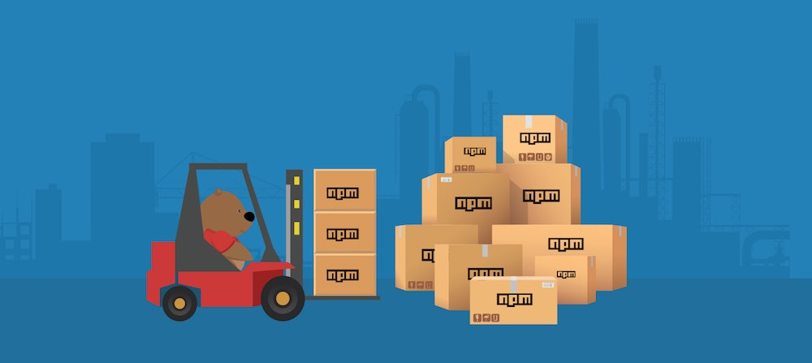
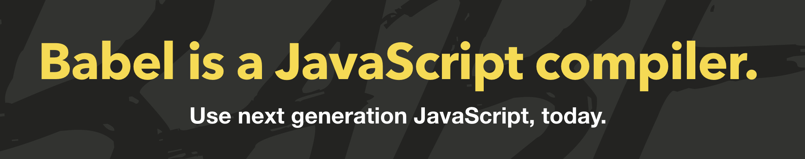
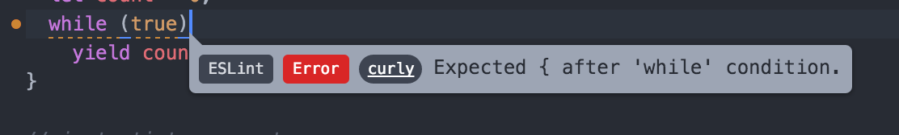

## <span style="color: #F27D00">WARNING! Not finalized, stay tuned!</span> ##

## Overview

Today we'll be learning about a set of tools for making your code compact and pretty.  So far you've been using html and css in separate files and the sites have been fairly compact — but as your sites grow more complex and include more and more libraries there has to be a way to manage it all.  We'll introduce a set of tools to help you build complex sites with many module dependencies easily.

💻 : run in Terminal<br>
🚀 : a step to not forget


🚀 To start fork: [js-starter-workshop](https://github.com/dartmouth-cs52/js-starter-workshop)


## NPM

{: .fancy .small }

[NPM](https://www.npmjs.com/) is the dependency package manager for Node.js and the javascript ecosystem in general.  While we won't exactly be using node just yet today, we will be using the package manager to install various javascript tools. Node.js is a javascript platform for running javascript outside of a browser for developing server side applications and we will be using it extensively later on.


### Installation

🚀 NPM comes with Nodejs so we'll first install that.

#### os x:

```bash
brew install node
```

#### windows, other:

install from [nodejs.org](https://nodejs.org/en/)

### start a node project

🚀 We will start a node project even though we will only be using the node package manager.

```bash
cd js-starter-workshop #make sure you are in cloned workspace

npm init #accept all the default answers if you want
```

All this did was create a barebones `package.json`  file.  This file defines a nodejs based project and is required.  It will primarily list all of the dependencies of our project.  It will also define some convenient scripts for us.


### Index file

🚀 Lets create a simple javascript file to get us started. It is good practice to keep your app in a subdirectory of the project so lets create that and call it `src`.

```bash
mkdir src #create directory
touch src/index.js   #creates an empty file
```

🚀 Now in **Atom** lets give our app something to do.

```javascript
console.log('starting up!');
```

### npm start

Now lets make it so we can run our app!

🚀 Edit your `package.json` file:

* change:
  `"main": "index.js"` to `"main": "src/index.js"`
* under `"scripts"` add a line:
  `"start": "node src/index.js"`

Now in 💻 you can:

```bash
💻 npm start

> js-starter@1.0.0 start ...
> node src/index.js

starting up!
```

Great, you're now running a little bit of javascript on the computer without a browser.


## Webpack

### Install Webpack for the project

{: .fancy .small}

Webpack is a build tool.  What it does is take all your dependencies and bundle them up together — but in a smart way where it will only bundle up the things you need. It can do any preprocessing that you need, such as SASS and supports hot-reloading, so you never have to refresh the page manually again.  Most cleverly it actually analyzes your code

🚀 Lets install webpack:

```bash
npm install webpack webpack-dev-server --save-dev
```

`npm install` is how you install most any javascript library.  It will install in a directory `node_modules` in your project.

Note: when you pass `--save-dev` it will add those modules to your `package.json`.  In this case we are saying these are *development* only dependencies. So you will now notice new lines declaring those dependencies in `package.json` as `"devDependencies"`. If you are adding in a library you want to always include just do `--save` instead.

:warning: `node_modules` is **not** something you need to commit to git.  These are libraries that you can assume will be available and so as long as you have saved the dependencies to the `package.json` file anybody can later install all of the required packages by simply running `npm install`.

### Now what?  

Lets set up a simple webapp so we can see start using webpack.

🚀 Create an `index.html` file in your `app` folder:

```html
<!DOCTYPE html>
<html>
  <head>
    <meta name="viewport" content="width=device-width, initial-scale=1.0">
    <link href="https://fonts.googleapis.com/css?family=Roboto" rel="stylesheet">
  </head>
  <body>
    <div id="main">Howdy</div>
  </body>
  <script src="build/bundle.js"  charset="utf-8"></script>
</html>
```

Note: `bundle.js`,  that is the file we are going to have webpack build for us.

🚀 Lets add in [JQuery](http://jquery.com/) really quick. We won't really be using jquery this term, but for a quick example it will suffice.

```bash
💻 npm install jquery --save
```

🚀 Change your `index.js` to the following:

```javascript
const $ = require('jquery');

$('#main').html('Here we go!');

```

All this will do is find the element with the `id` of `main` and change the content to 'Here we go!'.


### Configure webpack

🚀 Lets give webpack a very basic configuration:

```javascript
module.exports = {
  entry: [
    './src', //this is where our app lives
  ],
  output: {
    path: 'build',  
    publicPath: 'build/',
    filename: 'bundle.js',
    // outputs everything to build/bundle.js
  },
};
```

🚀 now try running webpack directly from the commandline:

```bash
💻  ./node_modules/.bin/webpack

Hash: 6abdfc297e95edec1ef9
Version: webpack 1.13.1
Time: 305ms
    Asset    Size  Chunks             Chunk Names
bundle.js  273 kB       0  [emitted]  main
   [0] multi main 28 bytes {0} [built]
   [1] ./src/index.js 65 bytes {0} [built]
    + 1 hidden modules
```

Great! It is building our index file in addition to one hidden module which isn't ours. In this case this is jquery! How'd it know?  Well it analyzed our `index.js` and saw our `require` statement, then it located the module in `node_modules` and included it.


### webpack-dev-server

Shall we look at what we have done so far?  We could start up a python webserver but webpack comes with a dev server build it, lets use that instead.

🚀 Edit your `package.json` again and change `"start": "node_modules/.bin/webpack-dev-server --inline"`

🚀 Now you can simple run:

```bash
💻 npm start

> js-starter@1.0.0 start /Users/tim/Sandbox/js-starter
> webpack-dev-server --inline

http://localhost:8080/
webpack result is served from /
content is served from /Users/tim/Sandbox/js-starter
Hash: 9c2c72cddcf76bb7f71c
Version: webpack 1.13.1
Time: 636ms
[...]
```

{: .fancy .tiny}

Ok,  we're now loading our page through webpack-dev-server and also loading in our javascript and changing some HTML!


### Hot reloading

Wait, we were promised hot-reloading, whatever that means!

Ok, lets config that. This will make it so your page reloads every time you save any files that are part of the javascript app (index.html is not included however).

🚀 Edit your `package.json` and add `--hot` to the end of the the `start` command.

`ctrl + c` out of your webpack-dev-server and run `npm start` again.

Try changing your `index.js` file to change the text of `#main` to something else.  You should see those changes happen immediately!

On the terminal you'll see anytime you change the js file that the webpack becomes invalidated and rebuilds automatically

```
webpack: bundle is now INVALID.
[...]
webpack: bundle is now VALID.
```


## Babel

{: .fancy .small }

We've talked a little bit about various JS versions.  Babel is a transpiler that converts new es6 javascript syntax to more compatible es5 syntax that browsers actually understand (browsers are typically behind in their ECMAScript support). If you are curious you can try it out at [babeljs](https://babeljs.io/repl/)


### Install and configure Babel

🚀 Let's install babel and the webpack babel-loader.

```bash
npm install babel-core babel-preset-es2015  babel-preset-stage-1 babel-loader babel-polyfill --save-dev
```

Babel needs to be configured for the particulars of what feature set of ECMAScript you want.  Note: es2016 is not yet officially out so we're still using es6 (which is es2015).

🚀 Create a file called `.babelrc` in your project:

```
{
  "presets": ["es2015", "stage-1"]
}
```

🚀 Change your `entry` in your `webpack.config.js`file:

```js
entry: ['babel-polyfill', './src']
```

*This will add support in your browser for some specific es6 things such as generators.  A polyfill is usually a small library that implements a feature in web browsers that don't support that feature natively.*

🚀 Finally add the following to your `webpack.config.js` file:

```javascript
module: {
  loaders: [{
    test: /\.js$/,
    exclude: /node_modules/,
    loader: 'babel',
  }],
},
```

###  use some es6

🚀 Let's change our `index.js` to do something a tiny bit more interesting and we'll use ES6 syntax.

```javascript
// change require to es6 import style
import $ from 'jquery';
```

🚀 Now write some javascript that updates the `#main` element every second to:  `You've been on this page for ${num} seconds.`.  This will be a simple counter.  

* you could use `setInterval` to call a function
* if you have anonymous functions please use arrow notation `() => { }`
  * in fact you might run into scope problems if you don't use arrow notation as arrow notation does better things with scope than regular anonymous functions.
* avoid using `var`

`ctrl + c` out of your webpack-dev-server and run `npm start` again to pick up the changes to the config files.  Hopefully now your page is keeping count of how long its been since you loaded / reloaded it.

#### debugging

Use Chrome Dev Tools with the console as the first line of defense, see if there are any explicit errors printing out. You can also use breakpoints.  The recommended way to is locate the source in devtools and click the line number to add the breakpoint. Because of webpacks magic all sources end up in webpack:// *(Sources -> weback:// -> . -> src)*

{: .fancy }

You can also use the statement `debugger;` in your code, but that is somewhat frowned upon as you might forget and leave one in a piece of code that doesn't get executed often causing mayhem.

## Linting

{: .fancy .small}

Ok, how about we add in linting. Linters are code parsers that check your code for syntax errors, common style mistakes, and makes sure that your code is clean and follows some best practices. Linters help save time, detect bugs, and improve code quality. Linters exist for all types of languages and even markdown such as HTML, CSS, and JSON. Linters are especially helpful for detecting syntax errors while using dynamically typed languages in lightweight editors such as Atom and Sublime.

In *Atom* install the `linter-eslint` plugin.

{: .fancy .small}


The recommended linter plugin for javascript is [Eslint](eslint.org).

🚀 Install `eslint`:

```bash
npm install --save-dev eslint babel-eslint
npm install --save-dev eslint-config-airbnb eslint-plugin-import
```

`eslint` comes with a series of plugins for various javascript packages.  In particular Airbnb's style guide is one that we will be **stronglly** suggesting / requiring:  [eslint-config-airbnb](https://github.com/airbnb/javascript/tree/master/packages/eslint-config-airbnb). We'll be changing some of the rules and the rules are flexible (you may disable some of the more annoying ones).  

🚀 After installing `eslint`, create an eslint configuration file `.eslintrc` with something like the following:

```javascript
{
    extends: "airbnb",
    parser: "babel-eslint",
    env: {
        browser: true,
        es6: true
    },
    rules: {
        strict: 0,
        quotes: [2, "single"],
        no-else-return: 0,
        new-cap: ["error", {"capIsNewExceptions": ["Router"]}],
        no-console: 0,
        import/no-unresolved: [2, { commonjs: true}],
        no-unused-vars: ["error", { "vars": "all", "args": "none" }],
        no-underscore-dangle: 0,
        arrow-body-style: 0,
        one-var: ["error", { uninitialized: "always", initialized: "never" }],
        one-var-declaration-per-line: ["error", "initializations"],
        max-len: ["error", 200],
        no-extra-parens: 0,
        no-restricted-syntax: [
          0,
          'DebuggerStatement'
        ],
        no-debugger: "warn"
    },
    ecmaFeatures: {
        modules: true
    }
}
```

🚀 Now go to Atom -> Preferences -> Packages -> linter-eslint -> Settings, and check "Fix Errors on Save". Super useful. This will fix indentation problems and some other things automatically whenever you save.

When you see errors such as below:

{: .fancy .small}

You can click on the definition of the error to learn more.  Note: many of these show up as errors but are not compiler errors like you are used to in Eclipse.  The browser or node may still run the code fine — however it is recommended that you fix these errors or learn about what the errors mean and disable them only if you disagree with that particular rule stylistically. I left the above errors so you could fix them!

From here on most assignments will come with a `.eslintrc` file as well as a `.babelrc` file.  Adhering to a code style and es6 will at first seem annoying but you'll find ES6 to be a much more beautiful version of the language and over time will grow to appreciate the linting rules as well. This is also pretty much industry standard.


## SASS Webpack loader

Lets make webpack handle CSS for us also, and we'll even upgrade that to [SASS](http://sass-lang.com/guide)!

{: .fancy .small}


🚀 Add loading the output `bundle.css` file into your `index.html`:

```html
<head>
<link href="build/bundle.css" rel="stylesheet">
```


🚀 The only loader that comes built-in to webpack is javascript so we need some more packages:

```bash
npm install css-loader sass-loader node-sass style-loader extract-text-webpack-plugin --save-dev
```

🚀 Now you need to modify the `webpack.config.js` file to include the css/sass loaders. This part gets a bit complicated.  We are including both css and sass loaders, and doing a little bit of trickery with the `extract-text-webpack-plugin`.  The reason for this is that by default webpack is really all about the javascript. That means if it was going to be in charge of CSS it would load it into the page using javascript. Which could cause annoying flashing as styles get applied.  We want the CSS to be output separately as text into `bundle.css` rather than into `bundle.js` so that we can load it in `<head>`.


```javascript
const ExtractTextPlugin = require('extract-text-webpack-plugin');

module.exports = {
  stats: { colors: true },
  devtool: 'inline-source-map',
  entry: ['babel-polyfill', './src'],
  output: {
    path: 'build',
    publicPath: 'build/',
    filename: 'bundle.js',
  },
  module: {
    loaders: [{
      test: /\.js$/,
      exclude: /node_modules/,
      loader: 'babel',
    },
    {
      test: /\.css$/,
      loader: ExtractTextPlugin.extract('style-loader', 'css-loader'),
    },
    {
      test: /\.scss/,
      loader: ExtractTextPlugin.extract('style-loader', 'css-loader!sass-loader'),
    },
      // You could also use other loaders the same way. I. e. the autoprefixer-loader
    ],
  },
  plugins: [
    new ExtractTextPlugin('bundle.css'),
  ],

};
```

🚀 Create a  `src/style.scss` file and add in some style!

```css
body {
  font-family: "Roboto", sans-serif;
  background: darken(white, 0.2);
}
```

🚀 Now, you need to have webpack include it, so add `import './style.scss'` to your `index.js` file! Remember webpack won't include anything that isn't used by your app directly.

🚀 Restart your webpack server and see if you style changes are picked up.  Note how you can change styles and the hot-reloading kicks in!


## Deployment

How would you deploy a webpack setup such as this?

{: .fancy .tiny}

Let's use [surge.sh](http://surge.sh) for static hosting.  This is a bit of an oversimplication.  We'll be uploading more files than are necessary as you really only index.html and the build directory — but for now this will work.

🚀 Install surge:

```bash
npm install --global surge
```

This will give you the `surge` command with which you can now really easily push static sites to the web!


🚀 Add the following to your `package.json` `scripts` section:

```javaScript
"build": "WEBPACK_ENV=production node_modules/.bin/webpack --optimize-minimize --progress --color",
"deploy": "npm run build; surge -p .",
```

🚀 Add in a `CNAME` file with a unique  .surge.sh name, something like `cs52-myname.surge.sh`

```
💻 npm run deploy
```

This will build your app into the build directory and then upload your whole directory (with the exception of node_modules) to surge.


### To Turn In

1. URL to your github repo for this
1. URLs to your hosted page on surge.sh (or other hosting if you prefer)
1. Checklist:
  * webpack-dev-server starts and serves pages
  * hot-reloading works as advertised
  * babel is configured
  * eslint is configured
  * webpage displays and counts seconds
  * js is es6 and linted without errors
1. A short answer response to:
  * describe the environment you set up.
  * any questions about what/why/how that you feel are unresolved?

### Extra Credit

* use webpack to add in [autoprefixer](https://github.com/postcss/autoprefixer) and show it in action (screen shot added vendor prefixes visible in build/style.css). You may need to use some css that actually has vendor prefixes to trigger this.
* play around with ES6 generators and iterators for fun and profit


## Resources:


* [webpack-your-bags](https://blog.madewithlove.be/post/webpack-your-bags/)
* [webpack docs](https://webpack.github.io/)
* [babeljs](https://babeljs.io/)
* [State of the Art Javascript 2016](https://medium.com/javascript-and-opinions/state-of-the-art-javascript-in-2016-ab67fc68eb0b#.26xksjxvt)
