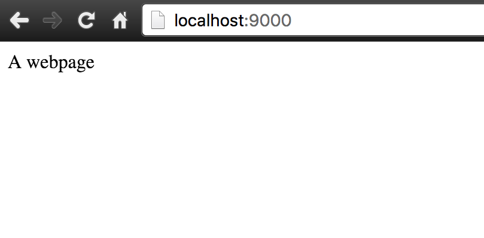
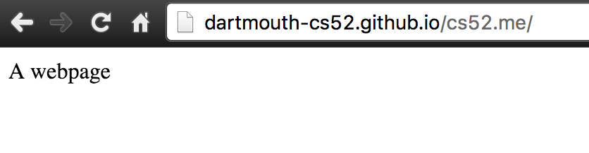

# Local Dev Environment and Hosting a Domain

First things first.  You need a local development environment.  

*Why is this important you ask.  Couldn't I just copy code over to a server every time I make changes?  You could.  But imagine debugging,  every change you make you spend a few seconds maybe copying code over, or pushing git.  This time adds up.  Save yourself hours of your life, get your laptop set up for coding now.*


## Tools! ##


🚀Install [atom](http://atom.io).  Atom is a code editor.  Atom is an open source, made by Github
web technology written in html+css+javascript using a platform called [Electron](http://electron.atom.io/). Using Electron to create a desktop app is an option for the final project.  We'll be using Atom for coding and utilizing a lot of its plugins.

🚀If you don't have it, install [Google Chrome](https://www.google.com/chrome/browser/desktop/).  Why?
Because we'll be using [Chrome Developer Tools](https://developers.google.com/web/tools/chrome-devtools/) for debugging — more on that later.

🚀Install [GitHub Desktop](http://desktop.github.com).  We will be mostly using `git` from the commandline but installing the App gives you a nice tree visualization.


### OS X ###

🚀Install [Homebrew](http://brew.sh/).  This is a package manager for all things open source.
We will use `brew` extensively to setup your dev environment.

### Various Linux ###

Most of the directions through the class will be very similar on the various flavors of linux.  Mostly just replace any `brew` command with the package manager for your system (apt on Ubuntu or yum on Fedora).

### Windows ###

Windows is a trickier dev environment.  We'll try to provide directions but these may need revision.

In general though whenever we refer to 💻 Terminal you can just use ***Git Shell*** (which comes bundled with the GitHub app).  You may want to check out [Chocolatey](http://chocolatey.org) which is a package manager for Windows.

If you want to be brave you can try out the very new beta of [ubuntu in windows](https://blogs.msdn.microsoft.com/commandline/2016/04/06/bash-on-ubuntu-on-windows-download-now-3/) — no guarantees there.


## Command Line ##

We'll be doing a lot of commandline stuff.  We'll introduce stuff as we go, so do not fear, commandline is best.

If you are interested here's a tutorial that gives you more than enough to be a master:
[learn just enough commandline to be dangerous](https://www.learnenough.com/command-line-tutorial)

Here's some basics:

* `ls -la`  will list files in current directory
* `pwd`  will show current directory
* `cd  somedirectory`  will change directory to *somedirectory*
* `cp source target` will copy files
* `mv source target` will move
* `rm somefile` will remove that file (permanently, bypassing trash)
* `mkdir somedirectory` will create a folder (directory)

On OSX:

* `open somefile` will open the file in the default app associated with it
* `open somedirectory` will open that folder in Finder


## Register a Domain!

Lets start off the term right, with a domain of your own that you'll use throughout the course.

We'll use NameCheap as our registrar.  Namecheap is a good [net citizen](https://www.netneutrality.com/) and have free domains for students.

🚀go to: https://nc.me/
and lets register you a domain!

{: .fancy }

🚀I'm going to grab one for cs25 now too!

{: .fancy .small }

🚀When prompted choose Github Pages Setup
{: .fancy .small }

🚀Great, now we'll do the rest of the setup manually so when prompted to setup github — instead to do advance setup.

{: .fancy .small }

## Create a GitHub Repo

🚀 go to http://github.com  if you don't have an account, set one up!

🚀 create a new repo for your domain, probably best to name it with your domain name.

{: .fancy .small }

Grab the URL for the repository (either SSH or HTML depending on how you have git setup.  If SSH gives you trouble just try HTML.)

**Note:**  the following are transcripts of MY terminal session while setting up **cs52.me** with my github URL.  You should replace anything with cs52.me with your repo name and your github URL instead.

### Clone Repo

```bash
💻 git clone git@github.com:dartmouth-cs52/cs52.me.git
Cloning into 'cs52.me'...
warning: You appear to have cloned an empty repository.
Checking connectivity... done.
💻 cd cs52.me/
💻 pwd  #checking current working directory
/Users/tim/Sandbox/cs52.me
```

### Create some HTML

```bash
💻 atom index.html
```
🚀basically just start Atom and create a file called `index.html` in your cloned workspace.

{: .fancy .small }


### Test Locally

```bash
💻 python -m SimpleHTTPServer 9000
Serving HTTP on 0.0.0.0 port 9000 ...
127.0.0.1 - - [09/Jun/2016 18:25:18] "GET / HTTP/1.1" 200 -
```

❓does anybody remember what `127.0.0.1` is the address for?

Lets check out what we have made: http://localhost:9000

{: .fancy .small }

Note: to quit the python server type: ctrl+c
(this is a default for many commandline processes).

### Git Add

```bash
💻 git status  #check and see what the story is
On branch master

Initial commit

Untracked files:
  (use "git add <file>..." to include in what will be committed)

  index.html

nothing added to commit but untracked files present (use "git add" to track)
💻 git add index.html  #lets track index.html
💻 git status  #check again -- I'm OCD with this
On branch master

Initial commit

Changes to be committed:
  (use "git rm --cached <file>..." to unstage)

  new file:   index.html

💻 git commit -am "its hideous"   #please make yours prettier 😃
[master (root-commit) 93a5c69] its hideous
 1 file changed, 10 insertions(+)
 create mode 100644 index.html
```

### Git Branch

Ok, now we have a local commit!  However before we push our changes.. GitHub Pages requires that the git branch we use for their hosting is named `gh-pages`.

So lets rename our branch!

```bash
💻 git branch
 * master
💻 git branch -m master gh-pages
💻 git branch
 * gh-pages
```

### Git Push

```bash
💻 git push -u origin gh-pages
Counting objects: 3, done.
Delta compression using up to 8 threads.
Compressing objects: 100% (2/2), done.
Writing objects: 100% (3/3), 289 bytes | 0 bytes/s, done.
Total 3 (delta 0), reused 0 (delta 0)
To git@github.com:dartmouth-cs52/cs52.me.git
 * [new branch]      gh-pages -> gh-pages
```

### Default GitHub Pages Hosting

By default GitHub Pages, when it sees a branch named `gh-pages`, will publish it at `http://<github username>.github.io/<repository name>`.

You can make sure of this by going to Settings for your repository.

{: .fancy .small }

{: .fancy .small }


### CNAME hosting

But we want our domain!

Ok. Add another file to your local workspace named `CNAME`.  Inside this file put in just one line with your domain name.

{: .fancy .small }

🚀 Now you have to `git add` and `git commit` and `git push` this new file.  See [Git Add](#git-add) section (skip branching as thats a one time thing).

### DONE!

As soon as you `git push` your site should become available at your URL!

{: .fancy .small }


### What About DNS?!?!

You didn't actually have to do any DNS setup,  what happened?

NameCheap set up all the right Domain Name Service Records automatically for you. In NameCheap you can inspect what it did:

{: .fancy .small }

Take a look at your settings in your Namecheap Dashboard.

Note the 2 IP addresses in the `A Record` fields,  those are github servers.

🚀 Try doing a reverse DNS lookup (IP address to name):

```bash
💻 host 192.30.252.153
153.252.30.192.in-addr.arpa domain name pointer pages.github.com.
```

Wait,  but how does pages.github.com know? Does that machine serve lots of addresses?

Yes, those IPs point to load balancers that direct requests based on the transport packet which happens to have the domain name requested in it.  This is where that magical `CNAME` file comes in.  That tells GitHub Pages that your repository should be served when requests come in for that domain. :cool:


### To Turn In

1. GitHub repository URL (should be public so we can see it)
1. your working domain name URL

### Extra Credit

* Make your page more interesting than mine.
* Add in some CSS even though we haven't talked about it yet.
