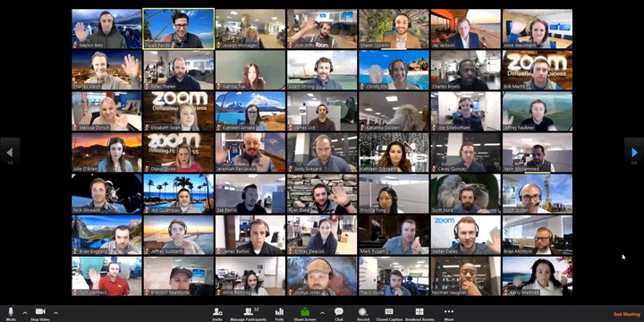

{: .medium}

# Course Overview

The Web is a powerful delivery tool for complex real-time applications. This is a new hands-on course that will introduce the state of the art of full-stack web development. You will learn to build not only interactive web applications, but also chatbots, and mobile apps. This class will be an adventure and requires active participation both inside and outside of class. There will be lab projects, exercises in class, and a collaborative final project.

By the end of term, you will:

* use your knowledge of the fundamental concepts and best practices of web application development to design web systems from the ground up
* utilize state of the art tools and frameworks used to build web technologies
* build your own web applications with front-end UIs and server-side APIs

Topics include: static pages, Internet protocols, layout, markup, event-driven asynchronous programming, deployment, security, scalability, and user experience.

Prerequisites: CS10 or permission of [instructor](mailto:tim@cs.dartmouth.edu)

Here's a silly video of me introducing the class (wait for it):
<iframe scrolling='no' frameborder='0' style='width: 800px; height: 525px; border:0;' src='https://dartmouth.techsmithrelay.com/connector/embed/index/tqVy' webkitallowfullscreen mozallowfullscreen allowfullscreen></iframe>

## Coursework:

Will be challenging and rewarding.

See [assignments](/assignments).

## Schedule:

### Class:

<!-- * 2A Classes will meet Tuesday and Thursday (2:25-4:15pm).  -->
* 2A Classes will meet via Zoom Tuesday and Thursday (2:25-4:15pm). Zoom recordings will be available for those with timezone differences. 
* X-hours are 4:35-5:25pm on Wednesday and will be used as TA/Lab hours and some Workshops. Only class sessions will be recorded, see [logistics for recording consent information](http://localhost:4000/logistics/#video-recording).  
<!-- * Location: LSC 200 -->
* Location: ZOOM permalink on canvas.

{: .fancy .small}

### Office Hours and Contact:

* We'll be using [Slack](https://cs52-dartmouth.slack.com) for course communication. Find us there!

* Open Help Hours via Zoom/Remo:  
  Most 2A periods and Fridays 1-3pm. 
  <!-- Mon 4-6pm: Sudikoff 213 
  Mon 8-10pm: Carson 61  -->
  <!-- Weds 4:35-5:25 (when there is no official x-hour): LSC 200  -->
  <!-- Thurs 7:30-9:30 pm: Carson 61 
  Sun 6-9 pm: Carson 61  -->

* Instructor: 
  Fri 2:30pm-4pm or by appointment, (zoom link on slack)
  <!-- Fri 11am-1pm; or by appointment in Sudikoff 219/007 -->

<table>
  <tr>
    <td>
      
    </td>
  </tr>
  <tr>
    <td>
      <a href="mailto:tim@cs.dartmouth.edu">Tim Tregubov</a> 
      <a href="https://cs52-dartmouth.slack.com/messages/@tim/">@tim</a>
    </td>
  </tr>
</table>

* TAs, Graders, Webdev experts: <a href="https://www.notion.so/cs52/877dd17791a94bc38f930884a068ab73?v=f655aefd18424e0291ff0960fb724696" target="_blank">course staff roster.</a>

 

Half of each class will be hands-on demonstrations, code and project discussions, and exercises. See [schedule](/schedule).

## Lectures:

Will be hands-on and interactive. See [lectures](/lectures).

Unfortunately due to the projects based nature of the class, auditing the class will not be permitted. All class slides, notes, and assignments will be posted here online though!

<!-- Additionally [DALI Lab Open Lab Nights](http://dali.dartmouth.edu/news-posts/dali-open-lab-hours) are a good time to get help with webdev from myself and DALI mentors. -->

## Logistics:

See [logistics](/logistics)

## The Archives 

Prior archived versions of this course website are available: [16x](https://dartmouth-cs52-16x.github.io/), [17s](https://dartmouth-cs52-17s.github.io/), [18s](https://dartmouth-cs52-18s.github.io/), [19s](https://dartmouth-cs52-19s.github.io/), [20s](https://dartmouth-cs52-20s.github.io/)

Also check out [previous projects](assignments/project).

## Contributing

Interested in contributing to the course?  There are several opportunites:

*  Want to file a bug report?  All the presentations, and assignments on this website are on [github](https://github.com/dartmouth-cs52/dartmouth-cs52.github.io).
* Want to pass on your knowledge, and help the next generation of webdevs? Future TA's <a href="http://cs52.me/ta/" target="_blank">apply here!</a>.  You don't really know something until you've tried explaining it to others. [Ask me](https://cs52-dartmouth.slack.com/messages/@tim/) about the opportunity if you want to learn more. 
* Want to build cool interactive webdev learning games like [boomsync](http://boomsync.me)? There's some funding available to help with that, [slack me about it](https://cs52-dartmouth.slack.com/messages/@tim/).
