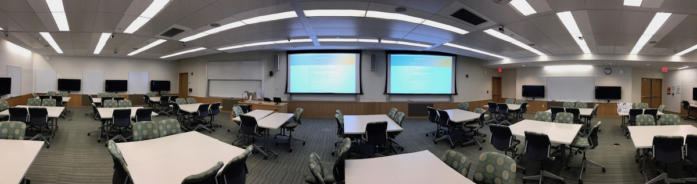

# Course Overview

The Web is a powerful delivery tool for complex real-time applications. This is a new hands-on course that will introduce the state of the art (2017) of full-stack web development. You will learn to build not only interactive web applications, but also chatbots, and mobile apps. This class will be an adventure and requires active participation both inside and outside of class. There will be lab projects, exercises in class, and a collaborative final project.

By the end of term, you will:

* use your knowledge of the fundamental concepts and best practices of web application development to design web systems from the ground up
* utilize state of the art tools and frameworks used to build web technologies
* build your own web applications with front-end UIs and server-side APIs

Topics include: static pages, Internet protocols, layout, markup, event-driven asynchronous programming, deployment, security, scalability, and user experience.

Prerequisites: CS10 or permission of [instructor](mailto:tim@cs.dartmouth.edu)

## Coursework:

Will be challenging and rewarding.

See [assignments](/assignments).

## Schedule:

### Class:

* 2A Classes will meet Tuesday and Thursday (2:25-4:15pm). 
* X-hours are 4:35-5:25pm on Wednesday and will be used as TA/Lab hours and Workshops. 
* Location: LSC 200

{: .fancy }

### Office Hours and Contact:

* We'll be using [Slack](https://cs52-dartmouth.slack.com) for most communication. Find us there!

* Open Help Hours in Sudikoff 003:  
  TBD<!-- Sunday 6-9pm; Mon 8-11pm; Wed 4:35-5:25pm during X-hour, 9-11am, 8-10pm -->

* Instructor: 
  Fri 11-1pm; or by appointment in Sudikoff 219/007

<table>
  <tr>
    <td>
      
    </td>
  </tr>
  <tr>
    <td>
      <a href="mailto:tim@cs.dartmouth.edu">Tim Tregubov</a> 
      <a href="https://cs52-dartmouth.slack.com/messages/@tim/">@tim</a>
    </td>
  </tr>
</table>

* TAs, Graders, Webdev experts: 

<!-- 
 -->

  

  
<a href="mailto:TBD">TBA</a> <a href="https://cs52-dartmouth.slack.com/messages/@TBA/">@TBA</a>

  
 

  

  
<a href="mailto:TBA">TBA</a> <a href="https://cs52-dartmouth.slack.com/messages/@TBA/">@TBA</a>

  
 

  

  
<a href="mailto:yichen.ke.19@dartmouth.edu">Annie Ke</a> <a href="https://cs52-dartmouth.slack.com/messages/@annieke/">@annieke</a>

  

  
<a href="mailto:yeonjae.park.19@dartmouth.edu">Yeonjae Park</a> <a href="https://cs52-dartmouth.slack.com/messages/@yeonjae/">@yeonjae</a>

  
 

  

  
<a href="mailto:kevin.r.farmer.18@dartmouth.edu">Kevin Farmer</a> <a href="https://cs52-dartmouth.slack.com/messages/@kevinfarmer/">@kevinfarmer</a>

  
 

  

  
<a href="mailto:barry.a.yang.18@dartmouth.edu">Barry Yang</a> <a href="https://cs52-dartmouth.slack.com/messages/@barryyang/">@barryyang</a>

  

  
<a href="mailto:shiyao.peng.20@dartmouth.edu">Sia Peng</a> <a href="https://cs52-dartmouth.slack.com/messages/@siapeng/">@siapeng</a>

  
 

  

  
<a href="mailto:alma.wang.18@dartmouth.edu">Alma Wang</a> <a href="https://cs52-dartmouth.slack.com/messages/@almawang/">@almawang</a>

  
 

  

  

  

  
<a href="mailto:luisa.n.vasquez.gutierrez.18@dartmouth.edu">Luisa Vasquez</a> <a href="https://cs52-dartmouth.slack.com/messages/@luisa/">@luisa</a>

  
 

  

  
<a href="mailto:benjamin.k.cooper.18@dartmouth.edu">Benjamin Cooper</a> <a href="https://cs52-dartmouth.slack.com/messages/@ben/">@ben</a>

  
 

  

  

  

  
<a href="mailto:jonathan.d.gonzalez.18@dartmouth.edu">Jon Gonzalez</a> <a href="https://cs52-dartmouth.slack.com/messages/@jongonzalez/">@jongonzalez</a>

  
 

  

  
<a href="mailto:mauricio.esquivel.rogel.18@dartmouth.edu">Mauricio Esquivel Rogel</a> <a href="https://cs52-dartmouth.slack.com/messages/@mauesrog/">@mauesrog</a>

  
 

  

  

Half of each class will be hands-on demonstrations, code and project discussions, and exercises. See [schedule](/schedule).

## Lectures:

Will be hands-on and interactive. See [lectures](/lectures).

Unfortunately due to the nature of the class and our classroom size, auditing the class will not be permitted. All class material will be posted here online though!

<!-- Additionally [DALI Lab Open Lab Nights](http://dali.dartmouth.edu/news-posts/dali-open-lab-hours) are a good time to get help with webdev from myself and DALI mentors. -->

## Logistics:

See [logistics](/logistics)

prior versions of this class: [16x](https://dartmouth-cs52-16x.github.io/), [17s](https://dartmouth-cs52-17s.github.io/)
