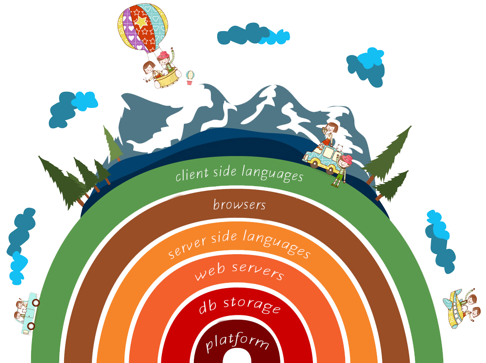
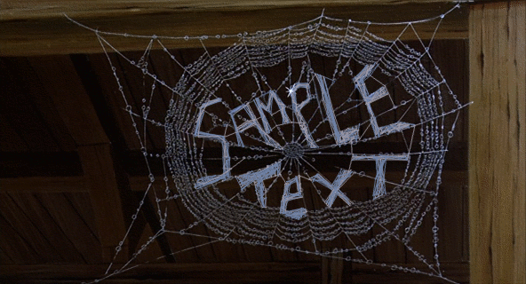
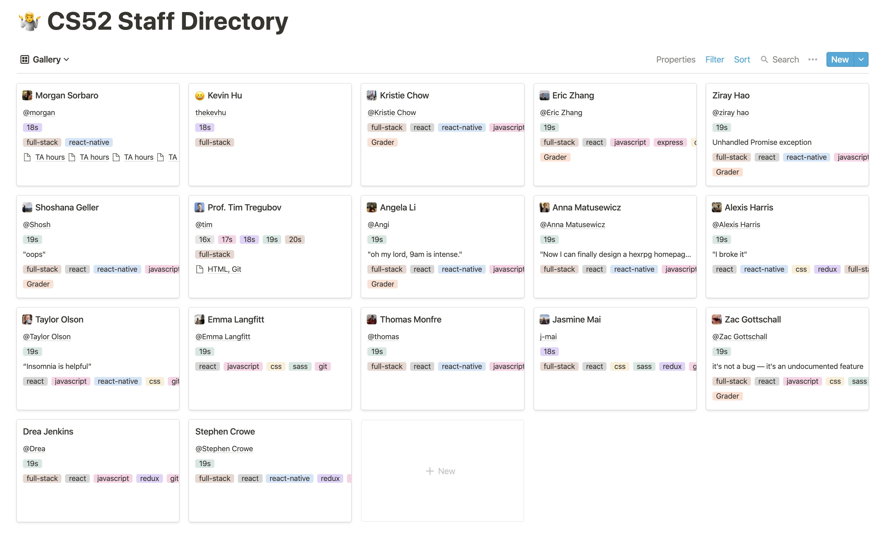
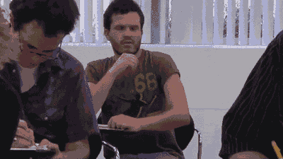
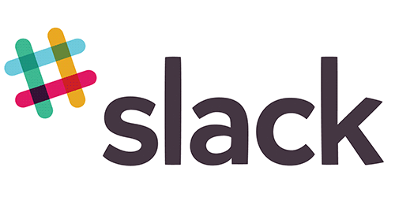

layout: true
class: center, middle
name: pic
background-size: contain

---

layout: true
class: center, top
name: fragment

.title[{{name}}]

---
layout: true
class: center, middle
name: base

.title[{{name}}]

---
name:

.medium_small[]

### full-stack web development.
## be the webdev.

[Tim Tregubov](http://zingweb.com)

???
* you are the lucky "few" - waitlist stretches pretty long still, have already started the 21s waitlist

---
name: Survey Results of Goals
* Learn best practices/standards in webdev; Learn state-of-the-art webdev tools, technologies, and techniques.
* Excited to challenge myself, and hope that I will be .orange[**proud of my final project**].
* Have a greater appreciation for frontend so that .orange[**my code can be implemented as well as possible**]
* have the tools to .orange[**build real working web apps**]!
* web dev is most important types of development because it .orange[**interacts with the user most often and most directly**]
* have a small .orange[**collection of really neat projects**].
* Get a feeling of the group-working environment for software engineerss
* I'd like to be a .orange[**pro web developer by the end**] of this course!
* want to .orange[**build something that is my own**], not something dictated by a strict assignment.
* build something I am proud of, host it, and .orange[**leave it up for all the world to marvel at!**]
* like to .orange[**build some sick websites/APIs**],feel proud of what we have created
* be able to do a web-based project from .orange[**start to finish**].

???

* some requests for learning included:
  * more frontend
  * what is the DOM
  * how to make pretty things on the web
  * a few mentions of design (should we have a design workshop?)
  * "designing / working with design for the web"
  * best practices

---
name: full-stack

.large[]
*(remixed from [brianfalls.com](http://brianfalls.com/))*

???
* what is this full-stack thing?
* the stack is the set of tools/concepts/steps
  involved in building a modern client-server application
  (in particular on the web)
* how data is stored
* how it is communicated/transferred
* how it is displayed

---
name: Magicians Of The Web

client ⇔ server ⇔ database

.large[]

???
* a full-stack dev implies working knowledge of all the components
* my favorite classes have always been those that empower - this will hopefully make you all magicians

---
name: CS52 Tech Stack

* client-side:
  * HTML5/CSS3(SASS)/ES6:
    * ui/ux, design, Document Object Model
  * React+Redux:
    * state, sessions
* server-side:
  * Heroku, GitHub pages, AWS:
    * static pages, hosting, deployment, scalability
  * MongoDB, sqlite:
    * models, queries, schema, objects, CRUD
  * Nodejs, Expressjs:
    * REST APIs, sessions, MVC, auth

???
* going to be **latest and greatest**
* no rails or django or php, none of that first or second gen tech here
* some of this stuff in actively changing
* surprisingly the web as a platform is **still rapidly evolving** - after being around for 20 years now
* desktop technology is much more stable/stodgy.
* **background and concepts behind the best practices and tool design**
* static vs server side rendered vs clientside
* don't worry we'll mostly just be **building all term long**!

---
name: Sample Weekly Projects

* get a domain and make some pages
* put yourself on a class map
* build a beautiful static landing page
* build a buzzfeed style quiz site
* build a realtime collaborative note-taking app
* classy content platform with all the bells and whistles
* api backend and databases

???

* think medium or pintrest or twitter CREATE RETRIEVE UPDATE DELETE
* shorter assignments will include building a bot and a mobile app
* someone has **said that course is like a firehose**, fine maybe it is a little intense but builds character
* **if you are a senior looking for an easy spring class, we might not work out, its not you its me, i just want you to love learning.**

---
name: Final Project

<iframe style="transform: scale(0.5) translateX(-850px) translateY(-500px) " width="1600" height="1000" src="http://cs52.me/assignments/project/19s" frameborder="0" allowfullscreen></iframe>

???

---
name: Online @

.small[]

* web: [http://cs52.me](http://cs52.me)
* github: [http://github.com/dartmouth-cs52-19s](http://github.com/dartmouth-cs52-19s)

???

* using github extensively, get comfortable
* BTW, science has shown that watching kitten gifs improves health - so, i'm making you all healthier

---
name: Staff

.large[]

???
* brilliant world class course staff
* ask us all the questions
* i'm excited to be working with them!
* we're all excited to be working with you!
* lots of help hours

---
name: etc

.medium_small[]

* class time 2A — 2:25-4:15pm via Zoom:
  * half lecture / half workshop / demos / code and project discussions
* x-hours — 4:35-5:25pm every Weds
  * me + tas + students @here to help
  * some xhours will be workshops

???
* half lecture / half workshop / demos / code and project discussions
* will be recorded for offline viewing also
* due to course size we'll have to use xhours for some stuff
* as the course goes on i'll talk less you'll talk more
* but it'll be action packed

---
name: Wait List?!?

.fancy.medium_small[]

* experimental structure
* interactive
* open syllabus
* <strike>auditing</strike>
* from blank terminal to full project

???
* 130 people tried to get into this course
* you are the few the proud
* still an experiment
* **not going to dumb things down** so you'll be doing industry standard stuff, no web ide's or lots of starter code.
* the goal to get you to be comfortable going from an blank terminal to a full projecct
* open syllabus more later

---
name: Slack

.small[]

* <strike>Piazza</strike>
* [Slack](https://cs52-dartmouth.slack.com)!

* mobile, desktop, web apps
  * (all web technologies actually)
  * get used to it
  * you can write a chat bot for Slack as a short assignment

???
* i don't do email well...
* assignments will have due dates on canvas
* will send out invites later today

---
name: Drawings?!

.medium[]

???
* you get points for making illustrations for the class
* some have been philosophical

---
name: Drawings?!

.medium[]

???
* others poignant

---
name: Drawings?!

.medium[]

???
* others perfectly describe the concept

