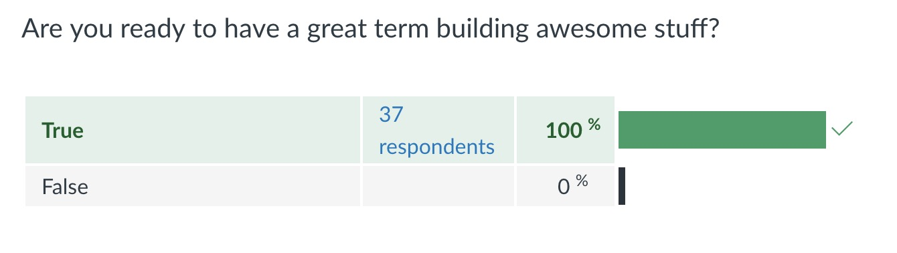

layout: true
class: center, middle
name: MORON
background-size: contain

---

layout: true
class: center, top
name: fragment

.title[{{name}}]
published: false

---
layout: true
class: center, middle
name: base

.title[{{name}}]


published: false

---
name: CS52

### full-stack web development.

## be the webdev.

[Tim Tregubov](http://zingweb.com)


---
name: What is?

<iframe width="600" height="400" src="https://www.youtube.com/embed/82DNYqurkxo?rel=0&amp;showinfo=0" frameborder="0" allowfullscreen></iframe>

???
* last year I taught cupstacking - but afterwards was told that wasn't full-stack...


---
name: What is?

.large[]


???
* this year i thought i had it right and ordered a bunch of pancakes but procurement told me that its very unlikely that the class is about making pancakes...
* sorry they cancelled the order - maybe later in the term once final projects start
* so help me out - what is this thing?

---
name: Survey Results

* I want .orange[**coding to feel fun and fulfilling**], and to gain experience for future internships and jobs.
* I am really excited to take this course! I do not know much about webdev but it seems extremely .blue[**relevant and useful for real world applications**].
* I'd like to become more .orange[**comfortable building real-time applications**] with web technologies. I find myself getting lost in the array of available frameworks
* I would like to be able to .blue[**design beautiful, interactive websites**] so that I can start working on some ideas for companies
* Learning useful coding skills for .orange[**creating back end apis and elegant front end ui**].
* hope to be comfortable enough to take on more .blue[**substantial projects**]
* I'm .orange[**excited to learn**] how to .orange[**connect front and backends.**]
* give me .blue[**exposure to the tools and techniques used by developers in the real world**] so that I can apply my ideas and coding ability to .orange[**real projects/applications**] throughout my life
* I want to learn modern web technologies and build websites and apps using .blue[**best practices**].

???

* some requests for learning included:
  * more frontend
  * what is the DOM
  * how to make pretty things on the web
  * a few mentions of design (should we have a design workshop?)
  * "designing / working with design for the web"
  * best practices


---
name: full-stack


.large[]
*(remixed from [brianfalls.com](http://brianfalls.com/))*

???
* what is this full-stack thing?
* the stack is the set of tools/concepts/steps
  involved in building a modern client-server application
  (in particular on the web)
* how data is stored
* how it is communicated/transferred
* how it is displayed

---
name: Magicians Of The Web

client ⇔ server ⇔ database

.large[]

???
* full-stack implies working knowledge of all the components
* my favorite classes have always been those that empower

---
name: CS52 Tech Stack

* client-side:
  * HTML5/CSS3(SASS)/ES6:
    * ui/ux, design, Document Object Model
  * React+Redux:
    * state, sessions
* server-side:
  * Heroku, GitHub pages, AWS:
    * static pages, hosting, deployment, scalability
  * MongoDB, sqlite:
    * models, queries, schema, objects, CRUD
  * Nodejs, Expressjs:
    * REST APIs, sessions, MVC, auth

???
* going to be **latest and greatest**
* no rails or django or php, none of that first or second gen tech here
* some of this stuff in actively changing
* surprisingly the web as a platform is still rapidly evolving - after being around for 20 years now
* desktop technology is much more stable/stodgy.
* background and concepts behind the best practices and tool design
* static vs server side rendered vs clientside
* don't worry we'll mostly just be building all term long!


---
name: Sample Weekly Projects

* get a domain and make some pages
* put yourself on a class map
* build a beautiful static landing page
* build a buzzfeed style quizz site
* build a realtime collaborative note-taking app
* classy blogging app
* api backend and databases


???

* classy blogging like medium
* shorter assignments will include building a bot and a mobile app
* someone has **said that course is like a firehose**, fine maybe it is a little intense but builds character
* **if you are a senior looking for an easy spring class, we might not work out, its not you its me, i just want you to love learning.**

---
name: Online @

.small[]


* web: [http://cs52.me](http://cs52.me)
* github: [http://github.com/dartmouth-cs52-18s](http://github.com/dartmouth-cs52-18s)

???

* using github extensively, get comfortable
* BTW, science has shown that watching kitten gifs improves health - so, i'm making you all healthier

---
name: Staff

<div class="rtable rtable--7cols">

  <div style="order:1;" class="rtable-cell"></div>
  <div style="order:2;" class="rtable-cell"><a href="mailto:jiachen.jiang.20@dartmouth.edu">Jiachen Jiang</a></div>
  <div style="order:3;" class="rtable-cell"></div>

  <div style="order:4;" class="rtable-cell"></div>
  <div style="order:5;" class="rtable-cell"><a href="mailto:TBA">TBA</a></div>

  <div style="order:1;" class="rtable-cell"></div>
  <div style="order:2;" class="rtable-cell"><a href="mailto:yeonjae.park.19@dartmouth.edu">Yeonjae Park</a></div>
  <div style="order:3;" class="rtable-cell"></div>

  <div style="order:4;" class="rtable-cell"></div>
  <div style="order:5;" class="rtable-cell"><a href="mailto:kevin.r.farmer.18@dartmouth.edu">Kevin Farmer</a></div>

  <div style="order:1;" class="rtable-cell"></div>
  <div style="order:2;" class="rtable-cell"><a href="mailto:shiyao.peng.20@dartmouth.edu">Sia Peng</a></div>
  <div style="order:3;" class="rtable-cell"></div>

  <div style="order:4;" class="rtable-cell"></div>
  <div style="order:5;" class="rtable-cell"><a href="mailto:alma.wang.18@dartmouth.edu">Alma Wang</a></div>

  <div style="order:1;" class="rtable-cell"></div>
  <div style="order:2;" class="rtable-cell"><a href="mailto:luisa.n.vasquez.gutierrez.18@dartmouth.edu">Luisa Vasquez</a></div>
  <div style="order:3;" class="rtable-cell"></div>

  <div style="order:4;" class="rtable-cell"></div>
  <div style="order:5;" class="rtable-cell"><a href="mailto:benjamin.k.cooper.18@dartmouth.edu">Benjamin Cooper</a></div>

  <div style="order:1;" class="rtable-cell"></div>
  <div style="order:2;" class="rtable-cell"><a href="mailto:jonathan.d.gonzalez.18@dartmouth.edu">Jon Gonzalez</a></div>
  <div style="order:3;" class="rtable-cell"></div>

  <div style="order:4;" class="rtable-cell"></div>
  <div style="order:5;" class="rtable-cell"><a href="mailto:mauricio.esquivel.rogel.18@dartmouth.edu">Mauricio Esquivel Rogel</a></div>

  <div style="order:1;" class="rtable-cell"></div>
  <div style="order:2;" class="rtable-cell"><a href="mailto:yichen.ke.19@dartmouth.edu">Annie Ke</a></div>
  <div style="order:3;" class="rtable-cell"></div>

  <div style="order:4;" class="rtable-cell"></div>
  <div style="order:5;" class="rtable-cell"><a href="mailto:barry.a.yang.18@dartmouth.edu">Barry Yang</a></div>


  <div style="order:1;" class="rtable-cell"></div>
  <div style="order:2;" class="rtable-cell"><a href="mailto:TBA">TBA</a></div>
  <div style="order:3;" class="rtable-cell"></div>

  <div style="order:4;" class="rtable-cell"></div>
  <div style="order:5;" class="rtable-cell"></a></div>


</div>

???
* brilliant course staff
* ask us all the questions
* i'm excited to be working with them!
* we're all excited to be working with you!

---
name: etc

.medium_small[]

* class time 2A — 2:25-4:15pm:
  * half lecture / half workshop / demos / code and project discussions
* x-hours — 4:35-5:25pm every Weds
  * me + tas + students @here to help
  * some xhours will be workshops
* coding time (>= CS50)

???
* due to course size we'll have to use xhours for some stuff
* as the course goes on i'll talk less you'll talk more
* but it'll be action packed

---
name: Wait List?!?

.fancy.medium_small[]

* experimental structure
* interactive
* open syllabus
* <strike>auditing</strike>
* oh and bring laptops to every class
* from blank terminal to full project

???
* 120 people tried to get into this course
* you are the few the proud
* still an experiment
* not going to dumb things down so you'll be doing industry standard stuff, no web ide's or lots of starter code.
* the goal to get you to be comfortable going from an blank terminal to a full projecct
* open syllabus more later


---
name: Slack

.small[]

* <strike>Piazza</strike>
* [Slack](https://cs52-dartmouth.slack.com)!

* mobile, desktop, web apps
  * (all web technologies actually)
  * get used to it
  * you'll be writing a chat bot for Slack soon!

???
* i don't do email well...
* assignments will have due dates on canvas
* will send out invites later today

---
name: Grading

- In-class short assignments: 10%
- 5ish week-long labs:  25%
- Short In-class quizzes:  10%
- 1 group presentation and workshop: 10%
- group workshop participation:  10%
- 1 final project:  30%
- class participation/attendance:  5%

* late penalty:
  * -1% of assignment per hour
  * 2 allowed re-submits (capped at 80%)


???
* may be adjusted slightly
* all assignments individual except for final and workshop
* workshops - learn and teach a technology and get everybody exposed to many things
* workshops will be graded (in the past they weren't)
* **re-submits (must have submitted something)**
* late is letter grade per day basically
* hopefully class isn't super boring - at least your workshops will be interesting

---
name: Extra Credit is Real


<iframe src="//giphy.com/embed/wapSaE3rNQoZa" width="271" height="480" frameBorder="0" class="giphy-embed" allowFullScreen></iframe>

???
* up to 110% per each assignment

---
name: Workshop?

.medium[]

* Workshop: sign up to present some cool tech as a team
  * present how its used / motivate it
  * write up a tutorial on it, teach us!
  * you'll be the experts!


???

* idea is to learn something well enough to teach it
* and become a resource for it
* everybody gets exposed to many technologies
* workshops will be graded (in the past they weren't)


---
name: Project Demos


.medium[]

* what to work towards
* show off your work!
* invite your friends!

???
* together with cs98 and dali and others
* 500+ people
* not presentations (science fair style)
* some amazing projects like yipyip: https://projects.invisionapp.com/share/HABOKZQRZ


---
name: Quizzes?!?!


.small[]

* after each assignment
* if you did the assignment, you can do the quiz
* short
* fun?

???
* web is open platform - you can see a lot of the codes
* unfortunate assessment problem
* if you did the assignment should understand the concepts behind it
* typed in the code yourself and understood it
* mean on these is like 60% but gotta correct for all that extra credit right?


---
name: Drawings?!

.medium[]


???
* you get points for making illustrations for the class
* some have been philosophical

---
name: Drawings?!

.medium[]


???
* others poignant

---
name: Drawings?!

.medium[]


???
* others perfectly describe the concept


---
name: Open Syllabus Contribution

.small[]


* illustrations, doodles, etc
* pull requests, github issues on site
* workshops, mentorship


???
* mentor Don Sheehan - best way to learn something is to teach it


---
name: Code

.small[]

* the internet is full of the codes
  * cite every line from stackoverflow, google, wikipedia, etc
  * cite every line from a friend
* if (cite) { ~no penalty }
* else { mandatory vacation }

```javascript
// adapted from: http://stackoverflow.com/someurl
// this method does x and y
```

???
* internet full of codes is a good thing - we're all archeologists - puzzle solvers
* want you to be able to show your work - have lots of green squares on github
* do not copy from other students, they are not authoritative sources
* preferable don't look at others code - it may not be correct
* want you to be able to show your work
* story time from summer
  * provide lots of help
  * I offer lots of outs - worst case you panic, can't figure it out and you end up cheating - just cite it. you might get a 0 but you won't get a 2 term vacation.
* remember, I am hyper available, just talk to me
* pretty sweet deal am i right?

---
name: Survey Results

.fancy.medium[]
.fancy.medium[]


.fancy.small[]

???
* good mix of backgrounds and desires
* we'll have fun and learn to build cool stuff
* by end of class you will!


---
name: Note on Slides


* [h] for help
* [p] for presenter mode with full notes


---
name: onwards

[the internet](../01_interwebs)
