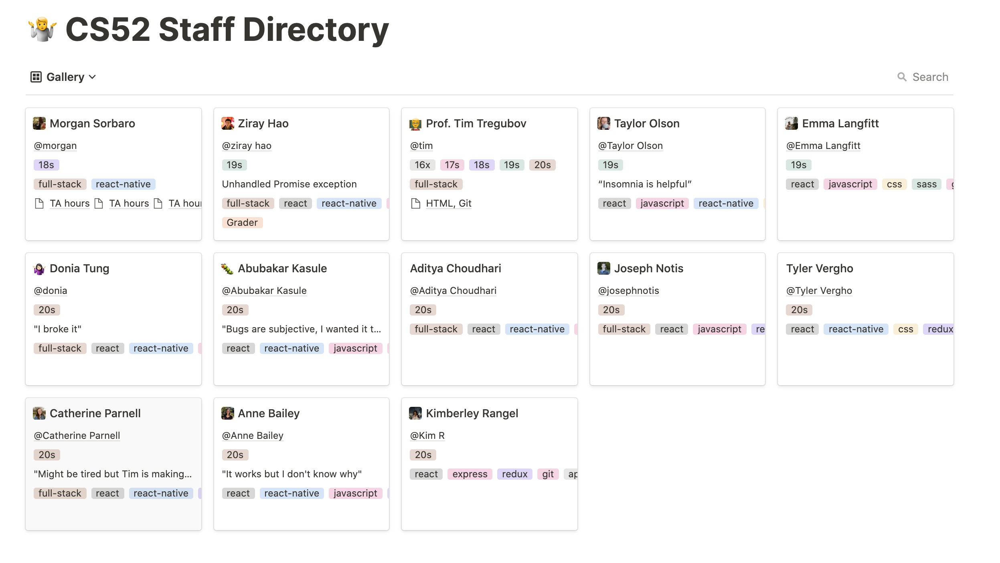
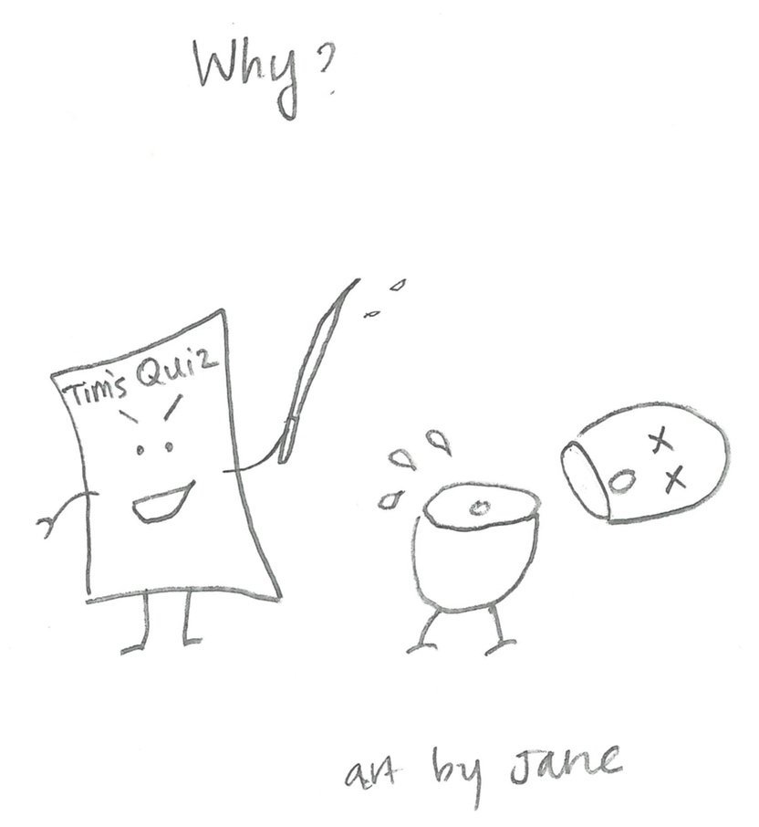
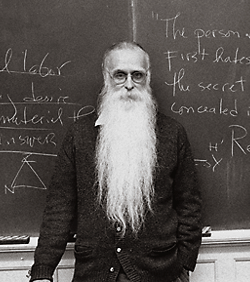
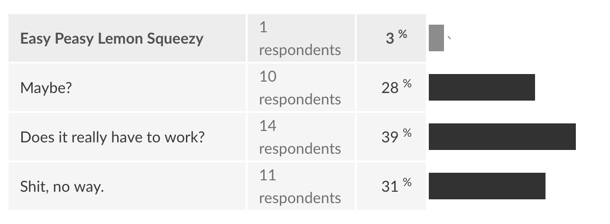
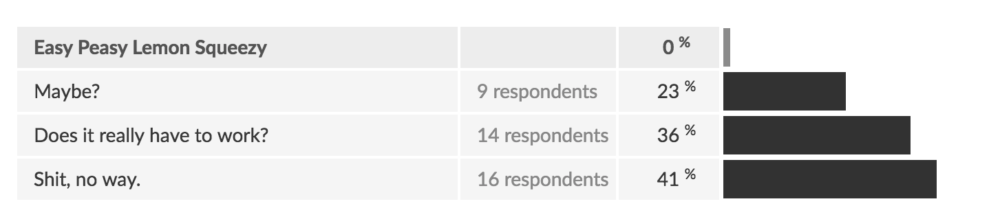
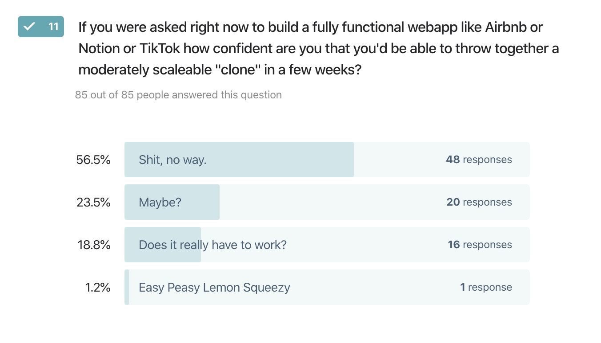
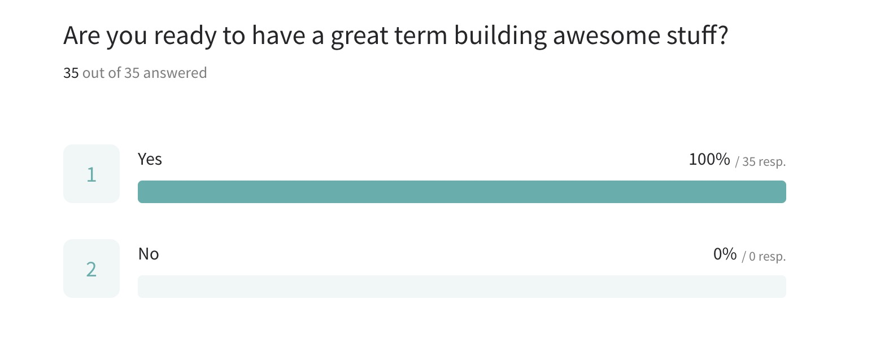

layout: true
class: center, middle
name: pic
background-size: contain

---

layout: true
class: center, top
name: fragment

.title[{{name}}]

---
layout: true
class: center, middle
name: base

.title[{{name}}]

---
name: CS52: full-stack web development

<video loop autoplay mute controls>
  <source src="http://res.cloudinary.com/dali-lab/video/upload/ac_none,w_283,h_512/v1546203223/cs52/zoomawkward.webm" type="video/webm"/>
  <source src="http://res.cloudinary.com/dali-lab/video/upload/ac_none,w_283,h_512/v1546203223/cs52/zoomawkward.mp4" type="video/mp4"/>
  <source src="http://res.cloudinary.com/dali-lab/video/upload/ac_none,w_283,h_512/v1546203223/cs52/zoomawkward.ogv" type="video/ogg"/>
  Your browser does not support HTML5 video tags
</video>


---
name: full-stack web development

.medium[]

[Tim Tregubov](http://zingweb.com)

???
* hope you and yours are well and staying safe
* waitlist stretches pretty long still, have already started the 21/22s waitlists
* if you're here and not yet registered email at me after class please and I'll see what i can do

---
name: Zoomtiquette

.medium_small[]<br>

* auto-muted
* video on plz
* open `Chat` and `Participants`
* use reactions in the participants list
* chat for questions


???
* they say video on promotes visual communication - i can pause if you look sad etc
  * at minimum set a profile picture
* also suffice to say you should probably get dressed for class
* finding a separate work space from sleep space is also basic psychology - you associate spaces with tasks
* open chat and participants and leave those open for any interactive stuff


---
name: Zoom is going away


<video loop controls>
  <source src="http://res.cloudinary.com/dali-lab/video/upload/w_283,h_512/v1546203223/cs52/walkforme.webm" type="video/webm"/>
  <source src="http://res.cloudinary.com/dali-lab/video/upload/w_283,h_512/v1546203223/cs52/walkforme.mp4" type="video/mp4"/>
  <source src="http://res.cloudinary.com/dali-lab/video/upload/w_283,h_512/v1546203223/cs52/walkforme.ogv" type="video/ogg"/>
  Your browser does not support HTML5 video tags
</video>

<video loop controls>
  <source src="http://res.cloudinary.com/dali-lab/video/upload/w_283,h_512/v1546203223/cs52/badboy.webm" type="video/webm"/>
  <source src="http://res.cloudinary.com/dali-lab/video/upload/w_283,h_512/v1546203223/cs52/badboy.mp4" type="video/mp4"/>
  <source src="http://res.cloudinary.com/dali-lab/video/upload/w_283,h_512/v1546203223/cs52/badboy.ogv" type="video/ogg"/>
  Your browser does not support HTML5 video tags
</video>

???
* trying to convince the TAs to start a cs52 tiktok - who's with me?
* also we'll be switching to a new platform for when we do have course sessions. you'll see it'll be great.  


---
name: What is?

<!-- <iframe width="600" height="400" src="https://www.youtube.com/embed/82DNYqurkxo?rel=0&amp;showinfo=0" frameborder="0" allowfullscreen></iframe> -->
.medium[]
.small[]

???
* when i was first asked to teach this class, i thought i was teaching this kind of stacking
* but afterwards was told that wasn't full-stack...  not great course reviews that year especially since we lost regionals


---
name: What is?

.large[]


???
* the following year i thought i had it right and ordered a bunch of flour and eggs and butter but procurement told me that its very unlikely that the class is about making pancakes...
* so help me out - what is this thing?

---
name: Survey Results
* Learn **best practices/standards** in webdev; Learn **state-of-the-art** webdev tools, technologies, and techniques.
* get a more thorough **big picture understanding of the technologies** available
* I want to be able to **have an outlet** (especially during this quarantine) to put time into to making and building websites and really **refining my coding skills**.
* want to be **more creative in school projects**, experiment with visual design.
* gain proficiency working on front-end development, and especially good design principles
* I know some front end stuff but I want to learn about the back end stuff.
* learn how to **build entire websites on my own** backend/fronted
* **Hands-on experience** with designing and building web-based code
* The ability to make **pretty, impressive websites**!
* To be able to build cool websites and maybe .io games

???
* let's pull in the survey most of you took
* if there are things you are excited about learning - you can also put them in the chat now


---
name: Survey Results
* test if web dev is a **possible career path**
* I want to feel like I'm not lying when I write Full-Stack Developer in LinkedIn bio
* use the knowledge to **continue to make usable products** after the class
* Hoping for a lot of **group projects and tons of learning**!
* I would like to have a **project at the end that I can be proud of**
* The ability of building a **fully functional website from scratch**
* develop skills to enable me to **build products that are interesting**
* get a foundation for learning more frameworks and toolsets
* ability to **materialize my independent ideas** and push them to the web
* have a strong enough understanding to **help others** understand web development as well.* Lots of experience and the ability to **ship a project** with the full stack.
* **experience collaborating in group coding projects.**
* Not sure! I’ve heard great things about this course, and am looking forward to the final project.
* **I want to become a real coder, to feel like I have the potential to be a professional, and to understand how to use the technologies I've been exposed to in order to create meaningful and useful apps.**


---
name: full-stack


.large[]
*(remixed from [brianfalls.com](http://brianfalls.com/))*

???
* what is this full-stack thing?
* the stack is the set of tools/concepts/steps
  involved in building a modern client-server application
  (in particular on the web)
* how **data is stored**
* how **data is communicated and transferred**
* and finally how it is **displayed and interacted with**

---
name: Magicians Of The Web

client ⇔ server ⇔ database

.large[]

???
* as you probably have experienced, the Web is a ***powerful delivery tool*** for complex real-time applications for important things like gifs and advertisements
* to less important things like productivity tools, data analysis, and governance.  
* in this class you learn how to **build important scaleable applications**
* a full-stack dev is someone who has **full working knowledge of all the components**
* my favorite classes have always been those that empower me, after which i feel like i can conquer the world - this class will hopefully make you all magicians

---
name: CS52 Tech Stack and Concepts

* client-side:
  * HTML5/CSS3(SASS)/ES6:
      * ui/ux, design, Document Object Model, layout, markup, transpilers
  * React+Redux:
      * state, sessions, data driven interfaces, event-driven asynchronous programming
* the in-between:
  * internet protocols, security, application program interfaces
* server-side:
  * Heroku, GitHub pages, AWS:
      * static pages, hosting, deployment, scalability
  * MongoDB, sqlite:
      * databases, models, queries, schema, objects, CRUD
  * Nodejs, Expressjs:
      * REST APIs, sessions, MVC, authentication, concurrency

???
* here's some words on a page - but the point is you'll learn the 
* **background and concepts behind best practices and scalable software design**
* we'll learn the **latest and greatest** tools and why they are the way they are
* but more importantly we'll **build lots of projects along the way**!
* we're **not going to dumb things down** so you'll be doing industry standard stuff, no starter code
* the goal is to get you to be comfortable going from an blank terminal to a full project
* we're learning some of **latest and greatest**, no php or django here


---
name: Sample Weekly Projects

* get a domain and make some pages
* put yourself on a class map
* build a beautiful static landing page
* build a buzzfeed style quiz site
* build a realtime collaborative note-taking app
* classy content platform with all the bells and whistles
* api backend and databases


???

* students have **said that course is like a firehose**, it's nonstop work, but that builds character
* in anycase **if you are looking for an easy spring class, we might not work out, its not you its me, i just want you to love learning and building cool products.**


---
name: Final Project

<iframe style="transform: scale(0.5) translateX(-850px) translateY(-500px) " width="1600" height="1000" src="http://cs52.me/assignments/project/20s" frameborder="0" allowfullscreen></iframe>

???
* there is a 3-4 week group final project, for which we will use collaborative coding and agile project management to help us do it remotely.  we'll use zoom and github and slack.
* this is where everything you've learned comes together and every year the projects dazzle and impress - you'll be surprised by what you can build in 3-4 weeks. 


---
name: Online @ cs52.me

.small[]


* web: [http://cs52.me](http://cs52.me)
* Slack: [https://cs52-dartmouth.slack.com](https://cs52-dartmouth.slack.com)
* github: [http://github.com/dartmouth-cs52-20x](http://github.com/dartmouth-cs52-20x)

???
* ok, lastly some administrative details
* using github extensively, get comfortable
* we'll communicate on slack - and zoom too
* BTW, science has shown that watching kitten gifs improves health - so, i'm making you all healthier

---
name: Staff

.large[]

* will have sections on Slack, stay tuned

???
* brilliant course staff
* ask us all the questions
* i'm **excited and lucky to be working with them**!
* we're all excited to be working with you!
* lots of help hours

---
name: etc

.medium_small[]

* class time 2A — Tues/Thurs 2:25-4:15pm — zoom/remo and recorded
    * some pre-recorded videos as well
  <!-- * half lecture / half workshop / demos / code and project discussions -->
* x-hours — Weds 4:35-5:25pm
  * will use some xhours as additional material or workshops - announced in advance
* office hours
  * tas @here to help
* coding time (>= CS50)

???
* spent today learning adobe premier for video editing haha
* due to course size we'll have to use xhours for some stuff
* as the course goes on i'll talk less you'll talk more
* but it'll be action packed

---
name: Wait List?!?

.fancy.medium_small[]

* projects based
* interactive
* open syllabus
* from blank terminal to full project

???
* since this course is projects based we can only scale it so far and still provide meaningful mentorship and teaching, hence the cap
* there is a large waitlist for the course and so it is not available for shopping
* 130 people tried to get into this course
* the goal to get you to be comfortable going from an blank terminal to a full project
* open syllabus more later


---
name: Slacktiquette

.small[]

* <strike>Piazza</strike>
* [Slack](https://cs52-dartmouth.slack.com)!

* mobile, desktop, web apps
  * (all web technologies)
  * use it for all course communications
  * channels for each short and lab assignment as well as teams
  * section channels
  * **use your real name and upload photo**
  * you can write a chat bot for Slack as a short assignment

???
* i don't do email well...
* assignments will have due dates on canvas
* will send out invites later today
* will talk more about sections

---
name: Grading
- Grading Scale : 🔥👍👎
- Short assignments: 10%
- 5ish week-long labs:  30%
- Quizzlets:  5%
- 1 group presentation and workshop: 10%
- group workshop participation:  10%
- 1 final project:  35%

<!-- - class participation/attendance:  5% -->

* late penalty:
  * -1% of assignment per hour
  * 2 allowed re-submits (capped at 80%)
  * 2 x 24 hour extension
  * -2% for submission fails (unshared links, empty repos, wrong urls)

???
* may be adjusted slightly
* all assignments individual except for final and workshop
* workshops - learn and teach a technology and get everybody exposed to many things
* workshops will be graded (in the past they weren't)
* **re-submits (must have submitted something)**
* late is letter grade per day basically
* hopefully class isn't super boring - at least your workshops will be interesting
* **attendance** sheets on table

---
name: How to be fuego

.left.medium[]
.right[
- Grading Scale : 🔥👍👎
    - 90 is the new 100
    - \> 90 == 🔥== you went above and beyond
    - 80-90% == 👍 == you satisfied the requirements
    - < 80% == 👎== didn't quite work out
- **do it for the love, not for the points**
- A- median usually because most people try pretty hard
]

???
* canvas won't allow me to go over 100%. 
* do extra credit and really make the assignments your own - **this is how you get fuego on assignments**
* tough quizzes and quality of work expectations

---
name: Workshop?

.medium[]

* Workshop: sign up to present some cool tech as a team
  * present how it is used / motivate it
  * write up a tutorial on it, teach us!
  * you'll be the experts!


???

* idea is to learn something well enough to teach it
* and become a resource for it
* everybody gets exposed to many technologies
* workshops will be graded (in the past they weren't)
* 20 min presentation - create a tutorial do at your own pace later


<!-- name: Project Demos


.medium[]

* 
* what to work towards
* show off your work!
* invite your friends!

* together with cs98 and dali and others
* 500+ people
* not presentations (expo style)
* some amazing projects like yipyip: https://projects.invisionapp.com/share/HABOKZQRZ
 -->

---
name: Quizzes?!?!

.small[]

* after each assignment
* or 1 per class
* if you did the assignment, you can figure these out
* short
* fun?

???
* didn't have these last term and people actually complained - they were fun. will reinstate in some form. 
* web is open platform - you can see a lot of the codes
* unfortunate assessment problem
* if you did the assignment should understand the concepts behind it
* typed in the code yourself and understood it
* mean on these is like 60% but gotta correct for all that extra credit right?


---
name: Drawings?!

.medium[]


???
* you get points for making illustrations for the class
* some have been philosophical

---
name: Drawings?!

.medium[]


???
* others poignant

---
name: Drawings?!

.medium[]


???
* others perfectly describe the concept


---
name: Open Syllabus Contribution

.small[]


* illustrations, doodles, etc
* pull requests, github issues on site
* workshops, mentorship


???
* mentor Don Sheehan - best way to learn something is to teach it
* come back as a TA, we have a lot of fun


---
name: Code

.small[]

* the internet is full of the codes
  * cite every line from stackoverflow, google, wikipedia, etc
  * cite every line from a friend
* if (cite) { ~no penalty }
* else { mandatory vacation }

```javascript
// adapted from: http://stackoverflow.com/someurl
// this method does x and y
```

???
* internet full of codes is a good thing - we're all archeologists - puzzle solvers
* want you to be able to show your work - have lots of green squares on github
* do not copy from other students, they are not authoritative sources
* preferable don't look at others code - it may not be correct
* want you to be able to show your work
* story time from summer
  * provide lots of help
  * I offer lots of outs - worst case you panic, can't figure it out and you end up cheating - just cite it. you might get a 0 but you won't get a 2 term vacation.
* remember, I am hyper available, just talk to me
* pretty sweet deal am i right?

---
name: Survey Results

<!-- .fancy.medium[] -->
<!-- .fancy.medium[] -->
.medium[]

.small[]

???
* good mix of backgrounds and desires
* we'll have fun and learn to build cool stuff
* by end of class you will!


---
name: Note on Slides


* [h] for help
* [p] for presenter mode with full notes

???
* there are more notes if you go into presenter mode, for most lectures the stuff in there is 
* mostly for me, and lectures will be mostly conceptual and then you learn by doing


---
name: onwards

* next up
    * HTML and CSS lecture videos sent out tonight (will post on website and slack)
    * Short assignment to get a dev environment and first page set up
    * use your own personal github account for this one
    * if you already have one, just do the tool setup and submit your page   

<!-- [the internet](../01_interwebs) -->

