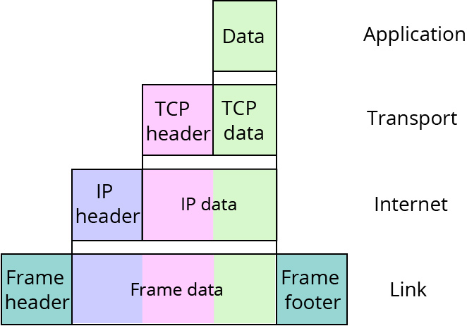
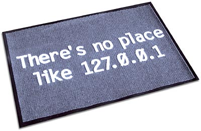
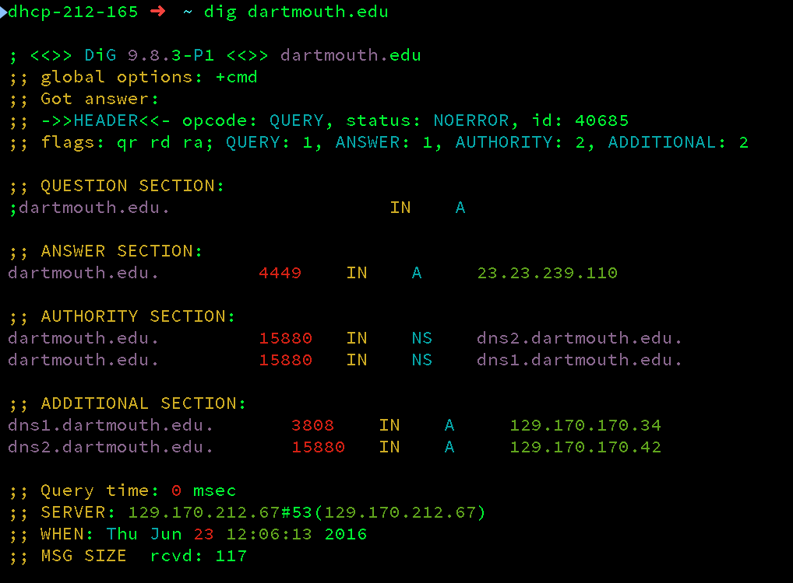
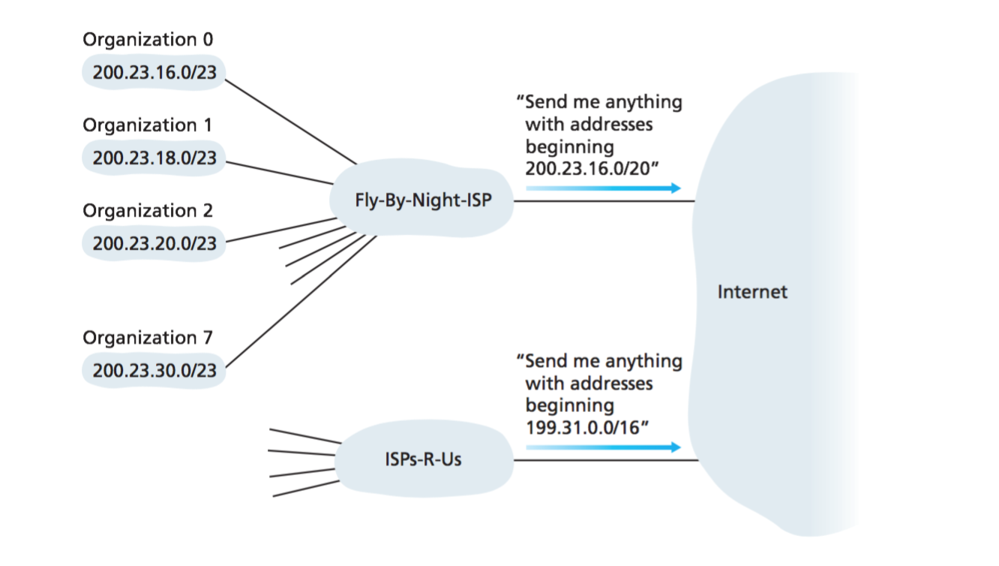
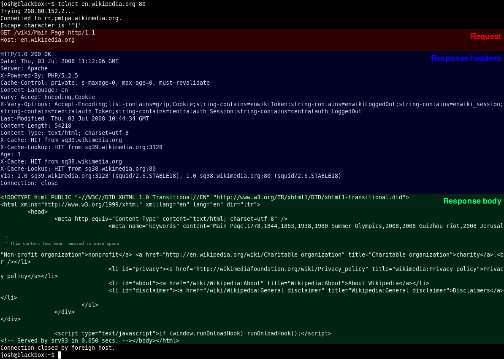
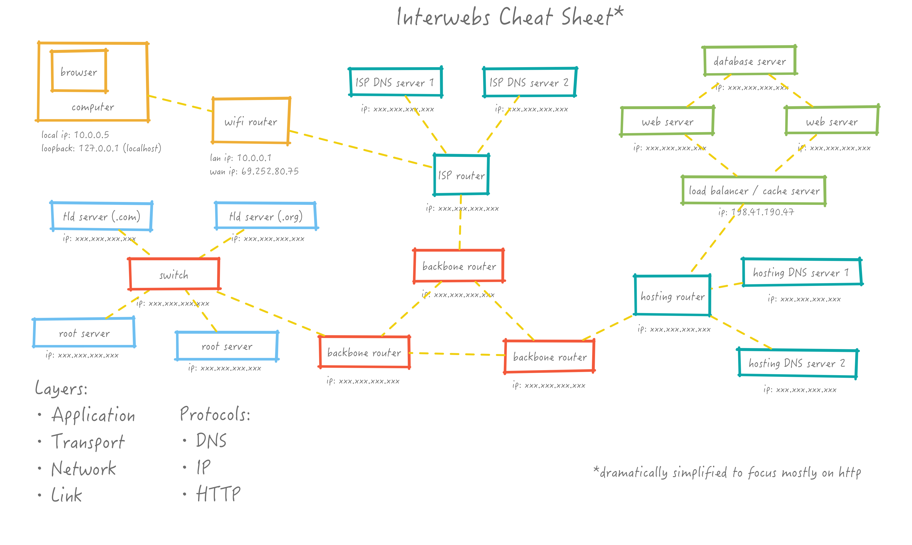

layout: true
class: center, middle
name: pic
background-size: contain
background-position: center

---

layout: true
class: center, top
name: fragment

.title[{{name}}]

---
layout: true
class: center, middle
name: base

.title[{{name}}]

---
name: WWW, tubes, networks


<audio  controls="true" preload="auto">
  <source src="img/series_of_tubes.mp3" type="audio/mp3">
  <source src="img/series_of_tubes.ogg" type="audio/ogg">
Your browser does not support the audio element.
</audio>

<audio controls>
  <source src="img/got_it_yesterday.mp3" type="audio/mp3">
  <source src="img/got_it_yesterday.ogg" type="audio/ogg">
Your browser does not support the audio element.
</audio>


.fancy.medium[]

> &ldquo;series of tubes --[Senator Ted Stevens (R-Alaska)](https://en.wikipedia.org/wiki/Series_of_tubes)&rdquo;

???
* CS60

---
template: base
name: Submarine Cables

.fancy[]

*(from [submarinecablemap.com](http://www.submarinecablemap.com/))*

???
* literally tubes under the ocean

---
name: City To City


.fancy[]

*(from [Chris Harrison](http://chrisharrison.net/index.php/Visualizations/InternetMap))*

???
* based on router configurations - which you'll learn about shortly!

---
name: Facebook Map

.fancy[]

*(from [Paul Butler](https://gigaom.com/2010/12/14/facebook-draws-a-map-of-the-connected-world/))*


Notice anything interesting missing?


???
* FB map is more of a social graph but does show internet connected Facebook users.
* missing obviously siberia.
* China blocks facebook

---
name: Computer2Computer Communication

<iframe src="//giphy.com/embed/zXmbOaTpbY6mA" width="480" height="202" frameBorder="0" class="giphy-embed" allowFullScreen></iframe>

URL=protocol+IP+port<br>
http://127.0.0.1:8000

???
* how to get from one computer - your laptop - to somewhere else
* or to this magical cloud thing
* or the pentagon

---
name: Protocols
template: fragment
class: center, top

What is a protocol?

--
name: Protocols
template: fragment
.fancy.medium[]


???
* Anybody?
* we have social protocols all time
* secret handshakes!

---
template: base
name: Social Protocols

.fancy.medium[]

*(image from [Computer Networking: A Top Down Approach](https://wps.pearsoned.com/ecs_kurose_compnetw_6/))*


???
* Computers talk to each other like humans.  
* interaction at a cafe with the barista
* social protocol.
* Protocols are simply the order and format of the conversation
* both computer hardware and software employ protocols to communicate.
* many protocols from how to transmit email to how your wifi sends radio signals.


---
template: fragment
name: Layers

.fancy.medium_small[]


???
* not just tubes, also layers

--
template: fragment
name: Layers

of protocols


???
* internet currently operates using a system of layered protocols.
* Your mail program does not need to know about how data gets transmitted between your computer and your wifi router
* but both of these things have to work to get the data to your destination.
* So the internet is made of layers. Like parfait.


---
template: base
name: Human Protocol Layers


<iframe src="//giphy.com/embed/onZIkheksIuje?hideSocial=true" width="480" height="269.76" frameBorder="0" class="giphy-embed" allowFullScreen></iframe>


???
* humans have layers of protocols, we have verbal protocols (how order food, or say hi) but also and body language protocols for instance.
* I'm pacing around with my hands in my pockets, is it because I'm super comfortable up here or is it a defense?
* better example


---
template: base
name: Airline Routing


.fancy.medium[]


???
* you are carrying some important data
* want to get from Boston to SF
* want to fly.
* layered systems involved

---
name: Airline Routing


.fancy.medium[]

*(image from [Computer Networking: A Top Down Approach](https://wps.pearsoned.com/ecs_kurose_compnetw_6/) p. 48)*

???
* Note how these are layered
* Any given system adds information and provides a service.
* baggage layer provides the service of transferring baggage
* gives you a baggage tracking code that you carry with you.


---
name: No baggage, no problem


<iframe src="//giphy.com/embed/IWOEH2zDGka88" width="480" height="480" frameBorder="0" class="giphy-embed"></iframe>

???

* layered system allows us to add/remove/change services
* without impacting the rest of the stack.
* travel with carry-on for instance and skip the baggage service completely
* or you can buy your ticket in different ways.

---
name: Internet Protocol Suite

5 layers!

🍎 Application Layer (ex. web)<br>
🚋 Transport Layer (ex. tcp)<br>
🚩 Network Layer (ex. ip)<br>
🔗 Link Layer (ex. ethernet/wifi)<br>
🔌 Physical Layer (ex. fiber optic)<br>

???
* in this delicious parfait

---
name: Application Layer

* Application Layer: HTTP (web), SMTP(email), FTP(files)
  * pass messages between specific applications
  * web browser and a program running on a web server


???

* we'll all be running this web server thing by thursday


---
name: Transport Layer

<iframe src="//giphy.com/embed/ByhlGtyxMR6Mg" width="480" height="270" frameBorder="0" class="giphy-embed"></iframe>

* establishes a connection to the correct application on another host
* delivery of applications messages
* TCP (transmission control protocol) usually
* TCP port numbers to identify applications

???
* TCP only handles the transfer of application data
  * doesn't actually know how to get places
  * network layer does the routing
  * makes sure all application data gets to the right application

---
name: Network Layer

<iframe src="//giphy.com/embed/WWfOzRDQS20ZG" width="480" height="270" frameBorder="0" class="giphy-embed"></iframe>

* machine to machine addressing
* contains the IP protocol
* IP sends and routes packets between hosts
* IP protocol required for any network connected device
* TCP passes the target destination in the form of the IP address

???
* network layer doesn't know low level hardware details
* but it knows addresses - like street addresses

---
name: Link Layer

<iframe src="//giphy.com/embed/ihwuNjpbb2RBS" width="300" height="300" frameBorder="0" class="giphy-embed" ></iframe><br>

* protocols such as Ethernet and WiFi
* passes data between individual hosts

???
* responsible for data transfer between 2 hosts
* how do two machines with a link between them send each other data

---
name: Physical Layer

<iframe src="//giphy.com/embed/l41YvpiA9uMWw5AMU" width="480" height="270" frameBorder="0" class="giphy-embed" ></iframe>

* transferring bits along a wire or fiber optic cable

???
* how the electrical signals are manipulated to transfer bits

---
name: Internet Data Flow

.fancy.medium[]

???
* two computers (referred to as hosts) that need to communicate
* your laptop is Host A and Google is Host B
* The router is the network hardware similar to an airline controller

---
name: Encapsulation and Packets

.fancy.medium[]

*(image from wikipedia)*

???
* data is passed down the layers
* it is encapsulated with additional layer specific headers.
* browser has query data (application)
* TCP - creates packets with source and destination ports (application identifiers) and packet sequence information (to reassemble if in the wrong order) and other stuff like  control bits (sending/receiving/etc)
* IP adds source / destination IP address
* link has specific hardware addresses to and from
* physical is electical signals (handled by hardware)


---
name: What about Addresses?

To travel anywhere you need an address❕

<iframe src="//giphy.com/embed/14wXMGbHjXK2k0" width="480" height="480" frameBorder="0" class="giphy-embed"></iframe>


---
name: IP Protocol Addresses


* IPV4
  * 32 bit number (4 bytes)
  * 4,294,967,296 (2^32) addresses
  * *dotted decimal notation*: **nnn.nnn.nnn.nnn**
    * byte holds: 0-255 integer
* IPV6 eventually
  * private networks save the day for now


???
* unsigned byte sized integer: 2^8 − 1


---
name: Private Addresses

* `10.*.*.*` and `192.168.*.*` addresses are reserved for private networks.
* Dartmouth Secure is a `10.` network.
* significant bits notation:
  * `10.0.0.0/24` (3 bytes masked)
  * `192.168.0.0/16` (2 bytes masked)
  * subnets use bitmasks


???
* bit masks just mean those bits can be anything
* ie /8 means the last 0-255 can be anything
* private addresses are not publicly routable
* routers across the internet will not know how to direct traffic to them


---
name: Localhost

* `127.0.0.1` loopback address
* local dev environment:
  * `localhost`
  * `127.0.0.1`
  * `0.0.0.0`
  * all point to the machine you are on


.fancy.medium[]


???

special case of:
`255.255.255.255` is a broadcast address
`sudo ping -t1 255.255.255.255`


---
template: pic
background-image: url(img/3327.jpg)


???
* its filling up
* Publicly routable: IPs that you can get to from anywhere.
* various registrars and countries are responsible for different blocks


---
template: base
name: Wait but PORTS!

URL=protocol+IP+port<br>
http://127.0.0.1:8000

<iframe src="//giphy.com/embed/JAU6PUIdLso4U" width="480" height="269" frameBorder="0" class="giphy-embed" allowFullScreen></iframe>

???
* what do ports identify again?
* each computer has 2^16-1  65535
* identifies know apps as ports
* specific services can run on ports


---
name: More Ports

* ports:
  * 16bit number
  * services associate with a port number
    * http: 80
    * https: 443
    * smtp: 25
  * are part of what layer and protocol?


???
* allows many services to run on a single machine
* part of transport layer and TCP!


---
name: Private Addresses Part II.
Wait so how do private addresses help the problem again?

.fancy.medium[]


???
* your router
  * maps certain ports on the private network side to requests going out
  * when packets come back in on that port it know to redirect them to a different machine


---
name: DNS

All I want is myname.com!

<iframe src="//giphy.com/embed/uxCT4ewdlB8uk" width="480" height="192" frameBorder="0" class="giphy-embed"></iframe>

* DNS (Domain Name Service)
  * maps names to numbers (yellowpages?)
  * IP doesn't understand names by itself
  * what layer?


???
* Ok, but question. I'm seeing all these numbers, but what about domain names? All I want is myname.com!

* That is where DNS (Domain Name Service) comes in.  DNS is a protocol for mapping names to IP numbers -- sort of like the yellow pages (😮does anybody even know what that is anymore?) for the internet
* IP doesn't understand names another layer comes in to help with this.

* What layer in the stack do you think DNS fits into?  Application layer actually


---
name: Lookup

.fancy.medium[]

* DNS == Application Layer Protocol
* distributed hierarchical database
* your laptop gets assigned DNS servers by DHCP

```bash
dig dartmouth.edu

host dartmouth.edu
```


???
* DHCP == Dynamic Host Configuration Protocol
* every time your computer needs to lookup a name to tell IP where to go it asks a number of servers


---
name: Lookup

.fancy.medium[]


???
* bottom lines with server tell you which local server was used
* not necessarily the authoritative ones
* in this example happens to be a 10 year old PC running DNS in the basement of sudi


---
name: Iterative DNS Queries

.fancy.medium[]

*(image from [Computer Networking: A Top Down Approach](https://wps.pearsoned.com/ecs_kurose_compnetw_6/))*


???
These local servers can't know every name however.
1. local name server will ask a ROOT server to find out which TLD (top level domain) server to ask.  TLDs are the various .com, .org, .ly, .website, domains.
2. then local name server will ask the TLD what it knows about that domain name. The TLD will return the authoritative name servers that are set up when you register a domain name.  (we'll do that next class!)
3. then finally the local name server will query the authoritative name server.  
Large organizations may run their own DNS servers (CS runs its own as does Dartmouth), but registrars like godaddy(bad) and [namecheap](http://namecheap.com)(good) do as well.


---
name: Routing

How does a packet find its way around all those tubes!?

.fancy.small[]

* packets travel through routers
* routers
  * forward based on a set of rules
  * have routing tables with some directions

???
* wait packet?
* packet travels from one host to another it crosses through a series routers.
* forwards the packet on based on a set of rules
* routing tables that tell it where to send packets.
* bit similar to DNS
* packets are forwarded along to routers that should know more about where to send them


---
name: Routing Logic
When a router gets a datagram (what we've been calling a packet) it does some logic similar to the following:

```python
Given a destination IP address, D, and network prefix, N:

if ( N matches a directly connected network address )
    Deliver datagram to D over that network link
else if ( The routing table contains a route for N )
    Send datagram to the next-hop address
    listed in the routing table;
else if ( There exists a default route )
    Send datagram to the default route
else
    Send a forwarding error message to the originator
```

*(from [wikipedia](https://en.wikipedia.org/wiki/IP_forwarding))*

???
* at the most basic level, more complicated algorithms exist
* network prefix 129.170 is dartmouths prefix

---
name: traceroute

Lets try this out:

```bash
💻 traceroute stanford.edu
traceroute to stanford.edu (171.67.215.200), 30 hops max, 60 byte packets
 1  s009-cisco-212-3-sw.cs.dartmouth.edu (129.170.212.3)  10.278 ms
 2  berry-remsen.berry1-crt.dartmouth.edu (129.170.1.73)  0.556 ms
 3  berry1-crt.border1-rt.dartmouth.edu (129.170.1.42)  1.271 ms
 4  akamai.border1-rt.dartmouth.edu (129.170.9.241)  15.729 ms
 5  et-10-0-0.107.rtr.chic.net.internet2.edu (198.71.45.8)  25.604 ms
 6  et-10-0-0.106.rtr.kans.net.internet2.edu (198.71.45.15)  36.883 ms
 7  et-1-0-0.109.rtr.hous.net.internet2.edu (198.71.45.16)  51.454 ms
 8  et-5-0-0.111.rtr.losa.net.internet2.edu (198.71.45.21)  83.843 ms
 9  hpr-svl-hpr3--lax-hpr3-100ge.cenic.net (137.164.25.74)  90.975 ms
10  hpr-stan-ge--svl-hpr2.cenic.net (137.164.27.162)  91.096 ms
11  west-rtr-vlan8.SUNet (171.64.255.193)  91.846 ms
12  web.stanford.edu (171.67.215.200)  91.974 ms
```

This is a pretty direct route, it can take many more *hops* typically!

---
name: Neighbors
template: fragment

But how do routers know who to send stuff to?

???

* what is this routing table thing?

--
name: Neighbors
template: fragment

Because routers that know stuff, shout about it to their neighbors. 📢


---
name: Routing Announcements
template: base

.fancy.medium[]

Routers use a protocol called BGP to exchange routing information with each other.  

???
* Dartmouth's Border Router 🛂shouts: *Hey I know stuff about 129.170.0.0/16 (Dartmouth)*  
* nearby routers will each record that they are 0 hops away from that particular internet prefix block and will tell others about it
*  Their neighbors will also record their distance and so on and so forth.  
* Each router stores a routing table with entries about which of their neighbors knows about which routes and also the distance (simplest metric is just hop count).

* This is what enables the internet to be robust, if a link goes down, then there are usually alternate/longer routes available.


---
name:

Want to see your local routing table on your laptop?

```bash
netstat -nr  #on osx
route -n     #on linux
route print  #on windows
```

---
name:

Want to see your local routing table on your laptop?

```bash
Routing tables

Internet:
Destination        Gateway            Flags        Refs      Use   Netif Expire
default            129.170.212.1      UGSc          411        0     en7
default            10.31.112.1        UGScI          82        0     en0
10.31.112/20       link#5             UCS            44        0     en0
10.31.112.1/32     link#5             UCS             3        0     en0
10.31.112.1        0:26:98:a:93:c1    UHLWIir        83       30     en0   1142
10.31.113.232      link#5             UHLWIi          2        1     en0
127                127.0.0.1          UCS             2        0     lo0
127.0.0.1          127.0.0.1          UH             10  2248094     lo0
129.170.212/22     link#4             UCS            40        0     en7
129.170.212.1/32   link#4             UCS             4        0     en7
129.170.212.1      0:0:5e:0:1:1       UHLWIir       400        0     en7   1192
129.170.212.26     a0:d3:c1:12:a6:16  UHLWIi          2       12     en7    153
```


---
name: HTTP! Finally!

* Browser requests a page via HTTP
* HTTP:
  * HyperText Transfer Protocol
  * request-response client-server ❓ layer protocol
  * uses tcp as underlying ❓ layer protocol

???
* http == application layer!
* tcp == transfer layer!
* The client (your browser for instance) initiates a request
* and the server (a webserver machine somewhere) responds


---
name: More HTTP

* **stateless**!
  * no tracking between requests
  * workaround?  

<iframe src="//giphy.com/embed/3o6ozgge4UJklqLgIg" width="480" height="270" frameBorder="0" class="giphy-embed"></iframe>


???
* stateless - this is important
* every time you click a button on a page it makeds a new request
* the server has no idea who you are
* workaround:  session and cookies!


---
name: HTTP Data

* HTTP is for HyperText (HTML).
* ... well and JSON
* ... and XML
* ... arbitrary data actually

???


---
name: HTTP Methods

<div class="align-left">
<p>📩 GET:  retrieves a particular resource</p>
<p>📩 POST:  sends a dictionary of key, value pairs</p>
<p>📩 DELETE:  requests server delete specified resource</p>
<p>📩 PUT:  requests server update the specified resource</p>
</div>

???
* GET:  retrieves a particular resource. This is the default method when you first go to a webpage in your browser.
* POST:  sends a dictionary of key,value pairs as data to the server. Typically used for submitting forms.
* DELETE:  requests that the server delete the specified resource.
* PUT:  requests that the server update the specified resource.


---
name:

💻 Want to try it?

```bash
telnet www.cs.dartmouth.edu 80

GET /~testuser/ HTML/1.1


```
???
* hit enter twice

---
name:

.fancy.medium[]

???


---
name: somato-sensory Internet protocols

<iframe width="753" height="380" src="https://www.youtube.com/embed/fd_9qwpzVBQ?rel=0&amp;controls=0&amp;showinfo=0" frameborder="0" allowfullscreen></iframe>

???
hand out roles and explain process


---
name: The Interwebs

.fancy.medium[]

[simulationroles.pdf](img/CS52networksimulationroles.pdf)

???
_Human:_

 > Hey *Browser*, go to http://news.ycombinator.com

_Browser:_

 > Hold on, I don't know how to get there.

*Browser:*

 > Hey *Computer*,  what is the address for news.ycombinator.com?
 `host news.ycombinator.com`

*Computer:*

 > Hmm, one sec.

*Computer:*

 > Hey *ISP DNS server*, what's the address for news.ycombinator.com?

*ISP DNS Server:*

 > No idea, lemme ask someone who knows better, the *ROOT DNS Servers*.

*ISP DNS Server:*

 > Hey *ROOT DNS Servers* whois responsible for ycombinator.com?
 `whois ycombinator.com`

*ROOT DNS Servers:*

 > Better ask the *.COM DNS Servers*, they should know more.

*ISP DNS Server:*

 > Hey *.COM DNS Servers*, what's the address for news.ycombinator.com?

*.COM DNS Servers:*

 > Oh, that was registered to Nicholas Sivo in 2005 and here's a list of *Hosts DNS Servers* that will know all about it.

*ISP DNS Server:*

 > Ok now we're getting somewhere.
 > Hey *Hosts DNS Servers* what is the IP address for news.ycombinator.com.

*Hosts DNS Servers:*

 > Sure thing boss, here it is: *198.41.191.47*

*ISP DNS Server hands address to Computer*.

*Computer hands address to Browser. Browser nods and gets back to work.*

*Browser:*

 > Hey *198.41.191.47*, I want to make a GET HTTP request. Give me / from the default http port for 80.

*198.41.191.47:*

 > Oooh, I'm just the load balancer, let me forward that request to one of my *Webservers*.

*198.41.191.47:*

 > Hey, *Webserver*, here's a request for you.

*Webserver:*

 > Ok, I have a *process* running on port 80 that should be able to answer that, please hold.

*Process:*

 > Lets, see, I need a list of today's top stories to answer that, one sec while I ask one of my *Database Servers*.

*Process:*

 > Hey *Database Server*: 'select title,description from stories order by date desc limit 10'    

*Database Server:*

 > Ok, ok.  Here you go: [results]

*Process takes results,  makes some pretty html for each row in the results and hands it to the webserver.*

*Webserver takes the html and responds to the waiting Browser.*

*Browser:*

 > Oh wow thanks. Ok I'll draw that on the screen! I think I know what all html should look like.


---
background-image: url(http://i.giphy.com/k8kG3Plo87Aqs.gif)
background-position: center
background-repeat: no-repeat
background-size: cover
name: 16X Let's go!


.white-foreground[short assignment 1 out: due Thursday 30th 🕛]
