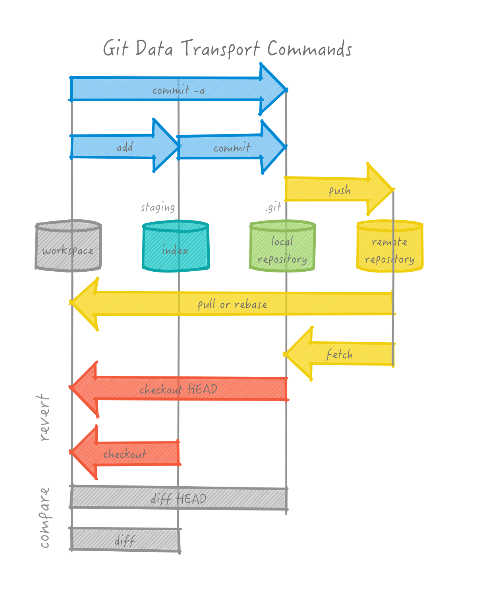

layout: true
class: center, middle
name: pic
background-size: contain

---

layout: true
class: center, top
name: fragment

.title[{{name}}]

---
layout: true
class: center, middle
name: base

.title[{{name}}]

---
name: this is git

.fancy.medium_small[]

???

---
name: social coding

.fancy[<iframe src="//giphy.com/embed/3oD3YveOJWdwIAfZ5e" width="580" height="369" frameBorder="0" class="giphy-embed"></iframe>]

???
social coding

---
name: transports

.medium_small[]

???

---
name: git visualization

[https://onlywei.github.io/explain-git-with-d3/](https://onlywei.github.io/explain-git-with-d3/)

???

---
name: git cheatsheet

[http://www.ndpsoftware.com/git-cheatsheet.html](http://www.ndpsoftware.com/git-cheatsheet.html)

???

---
name: Git Workshop!

[http://cs52.me/workshops/git](http://cs52.me/workshops/git)

???
