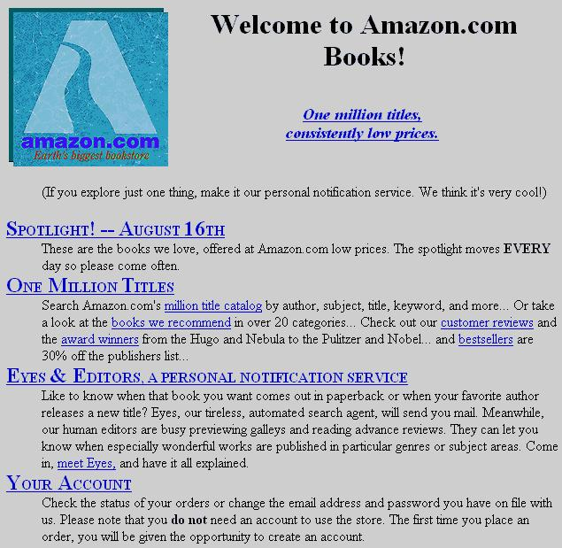
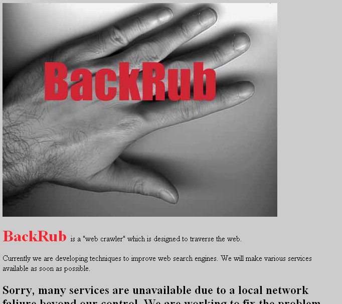
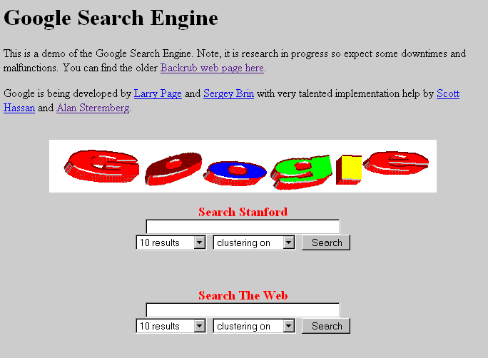
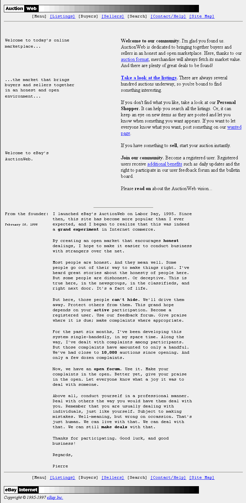
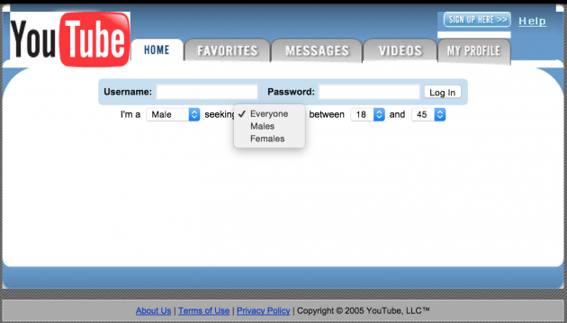
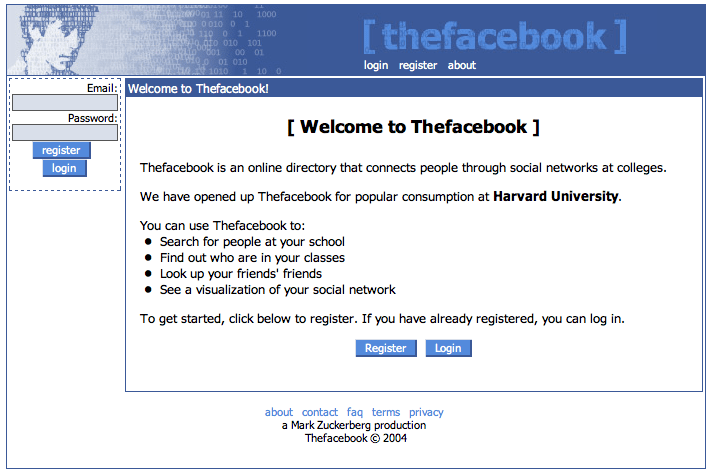



<br>
<hr>
<br>
<h2>deprecated notes:</h2>


# HyperText Markup Language


You all know some programming languages such as python and Java.  HTML is not like those.  

It is not a programming language at all. It is a descriptor language.  HTML describes the structure of a document semantically.  It has no operations or actions, so you can't compute with it, but you can define structure.  This is important. When someone says they can code in HTML, look at them funny. 😑

There are many markup language, you may have heard of or used LaTeX and markdown.  The idea is: include some syntactically identifiable notation/descriptions in your document that can dictate presentation or describe content.

This document you are reading right now, was actually written in [markdown](https://en.wikipedia.org/wiki/Markdown) which is a very simple formatting language. For instance **this** is bold because I wrote `**this**`.

But let's talk HTML.

## Brief History

The year is 1990,  Tim Berners-Lee (not yet knighted!) puts write a bit of code and voila! Soup!

"I just had to take the hypertext idea and connect it to the Transmission Control Protocol and domain name system ideas and—ta-da!—the World Wide Web"

The basic idea of structural tags with links between documents has remained the same since then.

Due to some original problems with various implementations of the HTML standard in browsers, such as allowing missing closing tags. XHTML standard developed (2000) to enforce stricter adherence to proper syntax.

HTML5 (2014) is the latest version (also has an XML version enforcing strictness).

### Note About Syntax, Tabs, Spaces, Legibility, Structure, Comments

We're going to focus a lot on clean correct syntax and code abstraction.  Messiness in code is bad.  Later on you'll learn about [linting](http://stackoverflow.com/questions/8503559/what-is-linting), but for now this is the first of many rants about best practices:

* ALWAYS indent your code.  Points will be deducted for bad indentation. Seriously. [Spaces or tabs](https://www.youtube.com/watch?v=SsoOG6ZeyUI), doesn't matter, just be consistent and indent!
* Always write your code for legibility. Someone somewhere will need to read your code. Be nice to them.
* Always think about your code structure.  More on this later.
* Always comment: when "borrowing code",  when any bit of code needs clarification,  when there are caveats or todos.


## HTML Tags

HTML uses **tags** to describe structural [elements](http://www.w3schools.com/html/html_elements.asp).  Tags are designated by `< >` surrounding the tag.
Tags most often come in pairs. A start tag, `< tag >` and an ending tag `</tag>`.

Everything in between a pair of start and end tags can be thought of as the child/children of that tag.

This is because underneath it all, your HTML is parsed into a ___ .

Yes a tree!  Pretty much everything in this course is going to be a tree! :deciduous_tree:
This is important and we'll dive deeper into this next week.


## HTML Syntax In a NutShell 🌰

* Must be a hierarchical collection of elements, starting with `<html>`
* Elements have a start tag, contents, and end tag.
* Element contents can be text or other tags
* Elements may be nested
* Can use <foo /> as shorthand for <foo></foo>
* Start tags may have [attributes](http://www.w3schools.com/html/html_attributes.asp):
  * `<input type="text">`
  * ``
  * `<div class="col-md-5">`


### Tiny HTML Sample


<p data-height="400" data-theme-id="24119" data-slug-hash="e6bad6db1a6fbebf4d365939d61926de" data-default-tab="html,result" data-user="timofei" data-embed-version="2" data-editable="true" class="codepen">See the Pen <a href="http://codepen.io/timofei/pen/e6bad6db1a6fbebf4d365939d61926de/">e6bad6db1a6fbebf4d365939d61926de</a> by Tim Tregubov (<a href="http://codepen.io/timofei">@timofei</a>) on <a href="http://codepen.io">CodePen</a>.</p>


[`<h1></h1>`](http://www.w3schools.com/tags/tag_hn.asp) surrounds a level 1 heading.   There are more levels possible. H1 is top level, H2 would be a subheading, and so on. It is good practice not to skip levels in your documents.

[`<p></p>`](http://www.w3schools.com/tags/tag_p.asp) surrounds a paragraph.  P tags may be annoying at first, but remember the you are defining the structure.  If the HTML parser knows about each paragraph then later you can style it as needed.

[`<ul></ul>`](http://www.w3schools.com/tags/tag_ul.asp) surrounds an unordered list. `<ol>` indicates an ordered list.

[`<li></li>`](http://www.w3schools.com/tags/tag_li.asp) indicates a list item inside of an unordered or ordered list.

[``](http://www.w3schools.com/tags/tag_img.asp) is a *self-closing* tag. Note the ` />` at the end of it. This means it does not need a closing tag pair. The `img` tag also contains an **attribute** `src` which is set to the string URL of where the image is located. More on attributes and urls soon.

[`<strong></strong>`](http://www.w3schools.com/tags/tag_strong.asp) surrounds text that should be made bolder or more emphatic in some way. Typically default style here is bolding but you could make it red or whatever you desire.

## Nested tags

Since HTML documents form a hierarchy, you can nest tags!  

Many tags can be nested, so you can have `<strong>` inside of paragraphs, but a `<p>` inside of a `<p>` wouldn't really make sense. Lists within lists work.


## HyperLinks

One of the most important features of HyperText are HyperLinks!

[Anchor tags](http://www.w3schools.com/tags/tag_a.asp) are used to define links to other pages. Anchor tags need to have an `href` attribute which is a string URL to the target.

`<a href="http://google.com">a link to google</a>`

## Comments

```
<!--- this is a comment -->
```

## A bit more on images

There's a bit more to hosting images on the internet.  File type, resolution, compression, transparency are all important.

* File type:
    * jpg: offer good compression and can be made to be fairly small file sizes for photo style images. Do not support transparency.
    * gif: not good compression (best with images with few colors), are animated and supported by all browsers.
    * png: lossless compression, only use if you need high quality images with transparency.
    * svg: are a vector file format and are best used when needing scalable high quality images. Come with a size and rendering performance hit though.
* Resolution: the pixel dimensions of an image.  Typical horizontal screen resolutions run around 2560 pixels these days so that is a good place to start for a full screen background image for instance.
* Compression: even though internet bandwidth is pretty high these days, file size is still a big issue.  If you have a whole bunch of several mb images your page load will be slow.

Hubspot's [Website Grader](https://website.grader.com/) is a good starting point for testing your sites performance.

For creating image assets for your website, the best tool out there currently is [Sketch](https://www.sketchapp.com/).  It is a pixel perfect design tool and optimized for creating graphics for the web.


## URLs:  [Uniform Resource Locators](https://en.wikipedia.org/wiki/Uniform_Resource_Locator)

Absolute URLs consist of [at least](https://en.wikipedia.org/wiki/Uniform_Resource_Identifier#Syntax) three parts:

* the protocol (http://, https://, etc)
* the name of the host (www.domainname.com)
* the path to the given resource (/assets/image.jpg)

However you can also have relative URLs as well.   A relative URL would occur on a page where the resource linked to is hosted on the same host and protocol and is a relative path to the current page.

For instance say you have a page `http://www.domainname.com/people/me.html` and on that page you might have:  `` this would really be pointing to `http://www.domainname.com/people/assets/image.jpg`.

Note: if you wanted `http://www.domainname.com/asssets/image.jpg` in the above case you could just add a slash to your src URL like so: `src="/assets/image.jpg"`.  This is because a leading `/` always indicates going all the way back to the root url.


## Document

So far everything we've looked at has been snippets.  The full HTML document has just a few more default tags.

```html
<!DOCTYPE html>
<html>
  <head>
    <title>page title</title>
    <!-- often load various CSS or required js files here -->
  </head>
  <body>
    <!-- all your content here -->
  </body>
</html>
```


## Style!

So far we've only talked about **STRUCTURE** but it all looks so boring. How do I make it pretty with colors?!

Hold on, there was a time before CSS however, when everything about a webpage was defined inline.

Lets take a trip through time!


{: .fancy }<br>
original amazon (1995)

{: .fancy }<br>
google backrub (1996)

{: .fancy }<br>
google after backrub (1997)

{: .fancy }<br>
apple 1997

{: .fancy }<br>
ebay 1996

{: .fancy }<br>
youtube 2005

{: .fancy }<br>
facebook 2004

{: .fancy }<br>
twitter!

[Here's a review](http://fabianburghardt.de/webolution/) through time!

### Classes and IDs

While we are discussing structure over style.  What happens if you want to label something semantically when a tag for that thing doesn't exist? What if you want a *fancy* paragraph,  or a profile link that is different from a normal paragraph or link.

Easy peasy lemon squeezy. 🍋 You can use the `class` and `id` attributes.

```html
<p class="fancy">Some fancy paragraph formatting</p>

<a id="username" hre="...">A unique username link</a>
```

By adding an `id` to an element you give it what should be a unique identifier on your page.  This is useful for elements that have a special role where there is really only just 1 of them on the page — *primary_navbar* or *username_field*, etc. The `id` is assigned a string identifier.

By adding a `class` to an element you are saying it belongs to set of elements that should be styled a particular way. Where styled really means selected. The `class` property is assigned a space separated quoted string with potentially multiple classes. `class="aclass"` but also `class="aclass anotherclass"` this is convenient as you can have one element belong to multiple style classes, inheriting styles from each!  

The result of all of this.  Define your style information once and use it in many places.

### DIV and SPAN

But too many elements come with some sort of default styling, are there generic elements?

You can use the `<div></div>` and `<span></span>` elements in your HTML as elements that come with no default meaning in HTML. What is the difference?

[`div` elements (divisions)](http://www.w3schools.com/tags/tag_div.asp) take up space by default because browsers give them the following CSS: `display: block;`

[`span` elements](http://www.w3schools.com/tags/tag_span.asp) have no default style and can be used inline with other tags.  For instance to separate a word from a sentence.


## Next Time

Everything you wanted to know about making things look pretty.
