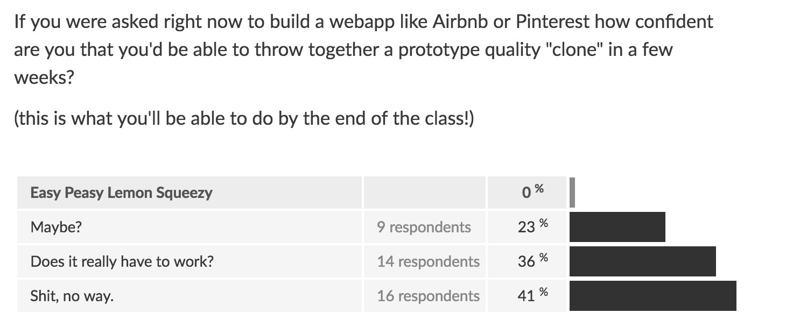
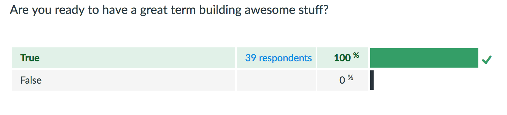

layout: true
class: center, middle
name: pic
background-size: contain

---

layout: true
class: center, top
name: fragment

.title[{{name}}]

---
layout: true
class: center, middle
name: base

.title[{{name}}]

---
name:  CS52 HTML

<iframe width="700" height="400" src="https://www.youtube.com/embed/h1E-FlguwGw?rel=0&amp;showinfo=0" frameborder="0" allowfullscreen></iframe>

---
name:  Discovery Stats

* 38 respondents:
  * 61% git PRs
  * 55% CSS
  * 42% JS
  * 24% Bootstrap
  * 5% ES6
  * 5% PHP
  * 0% Grunt
  * 0% Angular

---
name:  Discovery Stats

.fancy.medium[]

.fancy.medium[]

???

* by end of class you will!

---


name: HyperText Markup Language

HTML != programming

<iframe src="http://giphy.com/embed/cJ0X2Xudyecw0" width="480" height="288" frameBorder="0" class="giphy-embed"></iframe>

???
* html not like python and Java
* just like this cat is not really a panda
* It is a descriptor language.


---
name: Structure

* describes structure of document
* semantics rather than style

```html
<purple-text>Hello</purple-text> <!--BAD-->
```

vs

```html
<greeting>Hello</greeting> <!--GOOD-->
```


???
* HTML describes the structure of a document semantically
* It has no operations or actions, so you can't compute with it, but you can define structure.  
* When someone says they can code in HTML, look at them funny. 😑


---
name: Declarative Vs Imperative

what vs how

```html
<div class="ball"></div>
```

vs

```python
# from cs1
disable_stroke()  
enable_fill()
set_fill_color(0, 0, 0)
draw_circle(135, 110, 20)
```

???
* HTML layout would be declarative.
* sequence of drawing instructions would be imperative.
* granted some style somewhere would have to describe the display properties of the ball
* thats for thursday


---
name: Markup Not Dressup

<iframe src="http://giphy.com/embed/IlTu9eI3cjxIc" width="300" height="300" frameBorder="0" class="giphy-embed"></iframe>
<br>

* built-in browser styles exist
* but html != styles


---
name: semantic structure

.fancy.medium_small[]

* syntactically identifiable annotations
* describe the content

???
* markdown, LaTex
* include some syntactically identifiable notation/descriptions in your document that can dictate presentation or describe content.


---
name: these slides

* started out as [markdown](https://en.wikipedia.org/wiki/Markdown)
* simple formatting language
* For instance **this** is bold because I wrote `**this**`.

???
* But let's talk HTML.
* cs52 website is jekyll
* and these slides are too


---
name: Brief History

1990

"I just had to take the hypertext idea and connect it to the Transmission Control Protocol and domain name system ideas and—ta-da!—the World Wide Web" --Sir Tim Berners-Lee

???
* hypertext was a concept of linking text documents together with hyperlinks (on disk).
* html and http and first web browser


---
name: Brief History

.fancy.medium[]

???
* he was later surprised in a reddit ama that kittens took over the internet
* silly human


---
name: First Browser

.fancy.medium[]


???
* was called WorldWideWeb 1990ish
* marc andreesens mosaic and then netscape


---
name: Structural tags and links!

Unchanged basic premise of **document**

???
The basic idea of structural tags with links between documents has remained the same since then.


---
name: Browser Implementations

varying compatibilities

.medium_small[]

???

Due to some original problems with various implementations of the HTML standard in browsers, such as allowing missing closing tags. XHTML standard developed (2000) to enforce stricter adherence to proper syntax.


---
name: Browser Wars

.medium_small[]

???

* Due to some original problems with various implementations of the HTML standard in browsers, such as allowing missing closing tags
* XHTML standard developed (2000) to enforce stricter adherence to proper syntax.


---
name: HTML5 2014

.medium[]

  * many new semantic elements such as: `time`, `audio`, `video`, `nav`, `footer`
  * many new form controls such as: `email` and `search`

???
* HTML5 (2014) is the latest version (also has an XML version enforcing strictness).
* new apis: editable content, drag-and-drop, canvas
* navs and footers are here to stay


---
name:

```html

<blink> the sadness of changing standards </blink>

```


???
this used to be a thing


---
name: Note About Syntax, Tabs, Spaces, Legibility, Structure, Comments


???
* Later on you'll learn about [linting](http://stackoverflow.com/questions/8503559/what-is-linting), but for now this is the first of many rants about best practices
* clean correct syntax and code abstraction


---
name: pretty

ALWAYS indent your code. Seriously. [Spaces or tabs](https://www.youtube.com/watch?v=SsoOG6ZeyUI), doesn't matter, just be consistent and indent!

```html
    <ul id="sidenav">
<li><a href="/">Home</a>
  </li><li><a href="/contact">Contact</a></li><li>
    <a href="/about">About</a></li></ul>
```

VS

```html
<ul id="sidenav">
  <li><a href="/">Home</a></li>
  <li>
    <a href="/contact">Contact</a>
  </li>
  <li>
    <a href="/about">About</a>
  </li>
</ul>

```

???
* bad idents bad points!
* I have a linter so this was actively difficult for me to even type in Atom


---
name: Legibility

* Someone somewhere will need to read your code. Be nice to them.

<iframe src="http://giphy.com/embed/fDdVNus5ztt7O" width="480" height="270" frameBorder="0" class="giphy-embed"></iframe>

???


---
name: Comment and Cite

* comment when: when "borrowing code", code needs clarification, caveats or todos.
* no comment when: paraphrasing what your code does

.medium[]


???


---
name: HTML Elements and Tags

* **tags** denote structural [elements](http://www.w3schools.com/html/html_elements.asp)
* `< >` surrounding the tag
* start tag, `< tag >` and an ending tag `</tag>`


???
* everything in between a pair of start and end tags can be thought of as the child/children of that tag.
* underneath it all, your HTML is parsed into a ___ .


---
name: HTML Underneath it all

.medium_small[]<br>
*( from [watershedcreative](http://watershedcreative.com/naked/html-tree.html) )*

???
* browser parses it into a tree.
* pretty much everything in this course is going to be a tree! :deciduous_tree:
* more next week


---
name: HTML Syntax In a NutShell 🌰

* hierarchical collection of elements, starting with `<html>`
* have a start tag, contents, and end tag
* contents can be text or other elements
* may be nested
* self-closing: `<foo />` vs `<foo></foo>`

???


---
name: Attributes

* Start tags may have [attributes](http://www.w3schools.com/html/html_attributes.asp):
  * `<input type="text">`
  * ``
  * `<div class="col-md-5">`

???


---
name: Tiny HTML Sample

<p data-height="410" data-theme-id="24119" data-slug-hash="e6bad6db1a6fbebf4d365939d61926de" data-default-tab="html,result" data-user="timofei" data-embed-version="2" data-editable="true" class="codepen">See the Pen <a href="https://codepen.io/timofei/pen/e6bad6db1a6fbebf4d365939d61926de/">what is this html thing?</a> by Tim Tregubov (<a href="http://codepen.io/timofei">@timofei</a>) on <a href="http://codepen.io">CodePen</a>.</p>


???


---
name: headings

* [`<h1></h1>`](http://www.w3schools.com/tags/tag_hn.asp):
  * surrounds a level 1 heading
  * H1 is top level, H2 would be a subheading, and so on
  * don't skip


???


---
name: paragraph

* [`<p></p>`](http://www.w3schools.com/tags/tag_p.asp)
  * defines a paragraph
  * annoying but define structure

???
parser needs to know what is paragraphs


---
name: lists

* [`<ul></ul>`](http://www.w3schools.com/tags/tag_ul.asp)
  * defines un-ordered list
  * `<ol>` indicates an ordered list
* [`<li></li>`](http://www.w3schools.com/tags/tag_li.asp)
  * indicates a list item inside of an unordered or ordered list


???


---
name: images

* [``](http://www.w3schools.com/tags/tag_img.asp)
  * defines an image to include
  * is a *self-closing* tag:  ` />`
  * contains an **attribute** `src` with URL to image file


???
which is set to the string URL of where the image is located. More on attributes and urls soon.


---
name: bold

* [`<strong></strong>`](http://www.w3schools.com/tags/tag_strong.asp)
  * for bolder or more emphatic coffee
  * default is bolding but can redefine

???


---
name: iframes

* [`<iframe src="http://www.w3schools.com"></iframe>`](http://www.w3schools.com/tags/tag_iframe.asp)
  * inline frames can embed other pages inside a pages
  * the code sample above and often video embeds can be iframes


???


---
name: HyperLinks

[Anchor Tags](http://www.w3schools.com/tags/tag_a.asp)

`<a href="http://google.com">a link to google</a>`

Hypertext REFerence

???
* HyperLinks are what hypertext is all about
* Anchor tags need to have an `href` attribute which is a string URL to the target.
* usually urls, but can also be javascript


---
name: comments?

```html
<!--- this is a comment -->
```


???
your tags and classes should be self evident


---
name: URLs

[Uniform Resource Locators](https://en.wikipedia.org/wiki/Uniform_Resource_Locator)

`protocol:[//host[:port]][/]path[?query][#fragment]`

Absolute URLs consist of at least three parts:

* the protocol (`http://`, `https://`, `etc`)
* the name of the host (`www.domainname.com`)
* the path to the given resource (`/assets/image.jpg`)

???


---
name: Relative Paths

`protocol:[//host[:port]][/]path[?query][#fragment]`

* if same protocol and host:
  * path can be relative to current page location
  * ``
    in
    `http://www.domainname.com/people/me.html`
    =
    `http://www.domainname.com/people/assets/image.jpg`.
* `../` directory above
* `/` base url


???


---
name: query

`protocol:[//host[:port]][/]path[?query][#fragment]`

* `?query`
  * is an optional set of arguments
  * `?foo=bar&search=help`
  * can be processed by host

???
* data out in the open but often used for id's and such


---
name: fragment

`protocol:[//host[:port]][/]path[?query][#fragment]`

* `#fragment`
  * an optional fragment identifier
  * often refers to an id of an element
  * browsers will usually scroll to fragment id

???
* some frontend frameworks use # identifiers for routing
* is a bit old fashioned as browsers now support push history (more on that later)


---
name: Document

So far everything we've looked at has been snippets.  The full HTML document has just a few more default tags.

```html
<!DOCTYPE html>
<html>
  <head>
    <title>page title</title>
    <!-- often load various CSS or required js files here -->
  </head>
  <body>
    <!-- all your content here -->
  </body>
</html>
```

???
* migth see more complicated doctypes usually xhtml just more strict
* you should be strict on yourself regardless
* can have meta tags for things like author


---
name: define my own semantics?

What if I want a `fancy-paragraph` or a `profile-image`?

* html5 spec has some support
  * requires javascript
  * not worth it unless making reusable *web components*
* BUT
  * you can use `class` and `id` attributes
  * and `div` and `span` elements.
  * Easy peasy lemon squeezy. 🍋

???
* ok structure over style.
* what about other semantic tags?
* but there are generic tags that you can give id's and classes to!


---
name: class

```html
<p class="fancy">Some fancy paragraph formatting</p>

```

* elements with `class`:
  * belong to a set of elements with some meaning (and style)
  * space separated string attribute `"one-class another-class"`
  * inherits from both


???
By adding a `class` to an element you are saying it belongs to set of elements that should be styled a particular way. Where styled really means selected. The `class` property is assigned a space separated quoted string with potentially multiple classes. `class="aclass"` but also `class="aclass anotherclass"` this is convenient as you can have one element belong to multiple style classes, inheriting styles from each!  


---
name: IDs

```html
<a id="username" hre="...">A unique username link</a>
```

* elements with `id`:
  * uniquely identified on the page
  * have special role
  * `primary_navbar` or `username_field`
  * single string no spaces


???
Define your meaning and style information once and use it in many places.


---
name: Inline Elements

* does not start on a new line
* only takes up as much width as necessary

```html
<a>
<em>

<span>
```


???


---
name: Block Element

* starts on a new line
* takes up the full width available
  * stretches out to the left and right as far as it can

```html
<h1><h2><h3>
<p>
<form>
<ul>
<div>
```


???
fills parent element


---
name: span

* [`span` elements](http://www.w3schools.com/tags/tag_span.asp)
  * don't take up space by default
  * `display: inline`
  * `<p>and then they said, <span class="quote">spans are for babies!</span>.</p>`

???
have no default style and can be used inline with other tags.  For instance to separate a word from a sentence.


---
name: div

* [`div` elements (divisions)](http://www.w3schools.com/tags/tag_div.asp)
  * take up space by default
  * `display: block;`
  * `<div class="row">a row of stuff</div><div class="row">more row</div>`

???


---
name: Nesting Elements

* most elements can be nested but with caveats
  * block inside block ok, but not `p` or `h*`
  * block not nested in inline
  * strict nesting no overlaps

```html
<p> <p>stuff</p></p> <!-- no -->

<span><h1>Hello</h1></span> <!-- no -->

<div><h1>hello</div></h1> <!-- wtf no -->
```


???


---
name: Time Travel

So far we've only talked about **STRUCTURE** but it all looks so boring.

How do I make it pretty with colors?!


???
Hold on, there was a time before CSS however, when everything about a webpage was defined inline.

Lets take a trip through time!


---
name: amazon 1995

.fancy.medium[]

???


---
name: google backrub 1996

.fancy.medium[]


???


---
name: google after backrub 1997

.fancy.medium[]


???


---
name: apple 1997

.fancy.medium[]

???


---
name: ebay 1996

.fancy.medium[]

???


---
name: youtube 2005

.fancy.medium[]


???
dating site


---
name: facebook 2004

.fancy.medium[]


???


---
name: twitter 2006

.fancy.medium[]


???


---
name:

<iframe src="http://fabianburghardt.de/webolution/" width="100%" height="500px" style="background:white;"></iframe>


???


---
name: A bit more on images

File type, resolution, compression, transparency are all important.

.medium_small[]

.medium_small[]

???


---
name: jpg and png

* jpg:
  * good compression for photo style images
  * do not support transparency
* png:
  * lossless compression for high quality images
  * transparency

???


---
name: svg

.small[]

* svg:
  * vector file format
  * can have size and rendering performance hit
  * scalable vector images
  * transparency

???


---
name: gif

<iframe src="http://giphy.com/embed/3o7WTM5kCvIMkVmMN2" width="480" height="262" frameBorder="0" class="giphy-embed"></iframe>

* gif:
  * not good compression (best with images with few colors)
  * automatically support animation
  * transparency

???


---
name: resolution


* Resolution: the pixel dimensions of an image
* Typical horizontal screen resolutions: 2560 pixels
  * 2560 pixels for full screen images
  * everything else make sure is much smaller

???


---
name: tools

* creating image assets:
  * [Sketch](https://www.sketchapp.com/)
  * pixel perfect web optimized
* why is it so slow:
  * Hubspot's [Website Grader](https://website.grader.com/)

???


---
name:

<iframe width="650" height="480" src="https://www.youtube.com/embed/RLgqJdkT5z4?rel=0&amp;showinfo=0" frameborder="0" allowfullscreen></iframe>

I just like bollywood, ok.


---
name: Git


[on to git](../02_git)
