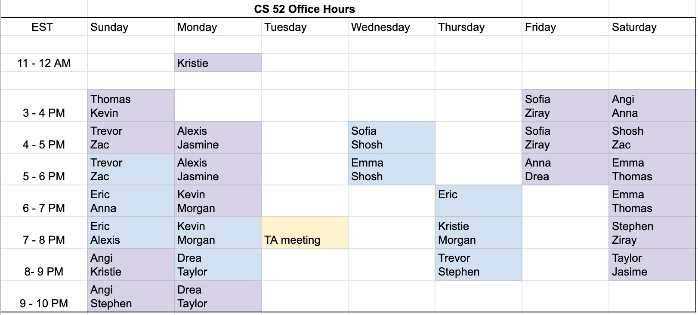
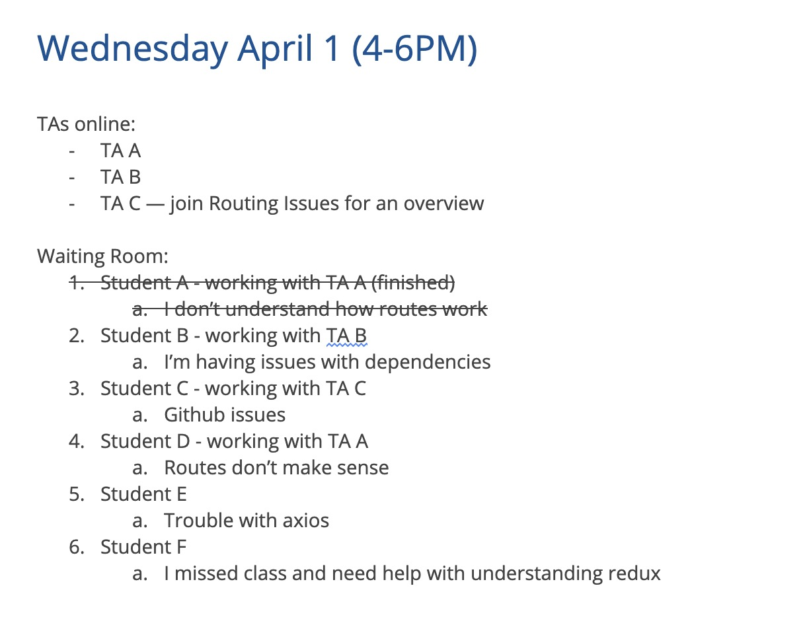
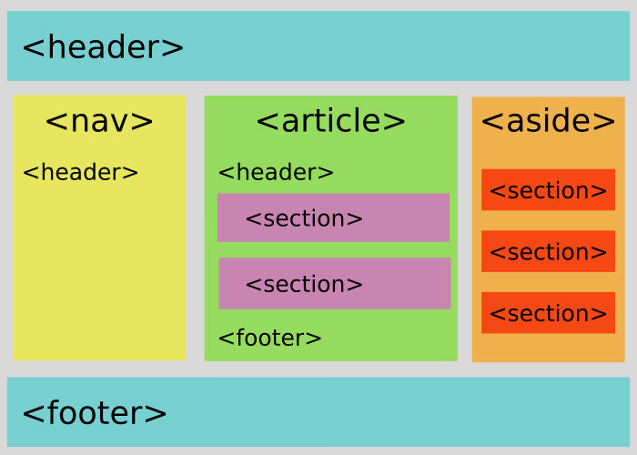
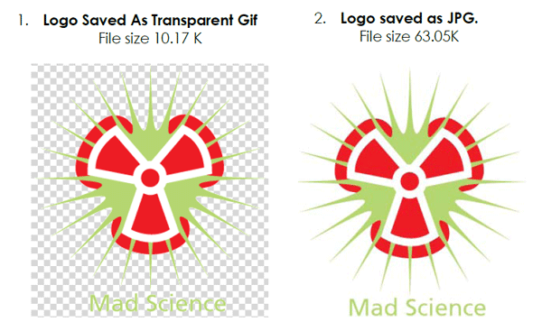

layout: true
class: center, middle
name: pic
background-size: contain

---

layout: true
class: center, top
name: fragment

.title[{{name}}]

---
layout: true
class: center, middle
name: base

.title[{{name}}]

---
name:  CS52 HTML

<iframe width="700" height="400" src="https://www.youtube.com/embed/h1E-FlguwGw?rel=0&amp;showinfo=0" frameborder="0" allowfullscreen></iframe>

---
name: TA Hours

<!-- * Mon 4-6pm: Sudikoff 213
* Mon 8-10pm: Carson 61
* Weds 4:35-5:25: LSC 200
* Thurs 7:30-9:30 pm: Carson 61
* Sun 6-9 pm: Carson 61
 -->

.large[]

---
name: TA Hours HowTo

.medium[]

* Use Slack with specific #sa #lab channels and
* Tandem for video discussion style help

???
* For help over video to debug or ask conceptual questions use Tandem:
* add your name on the sheet below + brief description of what you need help with 
* try to describe the problem/question without code, but feel free to paste in short error messages.
* Log into Tandem
* Wait for a TA (don’t barge into a Tandem room! A TA will reach out when it’s your turn!)
* In some cases a TA may group questions together and start a Tandem Room to address the question.  In that case we’ll comment as such.
* For help over messaging any time of day/night use Slack and find the channel associated with the short or lab you are working on.
* we'll see how this works or doesn't - might switch to zoom with waiting rooms

---
name: HyperText Markup Language

HTML != programming

<iframe src="http://giphy.com/embed/cJ0X2Xudyecw0" width="480" height="288" frameBorder="0" class="giphy-embed"></iframe>

???
* today HTML only - next class is CSS - there's a difference
* html not like python and Java - no logic
* just like this cat is not really a panda
* It is a descriptor language.
  * describes what things are
  * not how they work or **even how they look**


---
name: Structure

* describes structure of document
* semantics rather than style

```html
<purple-text>Hello</purple-text> <!--BAD-->
```

vs

```html
<greeting>Hello</greeting> <!--GOOD-->
```

<iframe src="//giphy.com/embed/tPFHYDMAcWE1O?hideSocial=true" width="380" height="169.76" frameBorder="0" class="giphy-embed" allowFullScreen></iframe>


???
* HTML describes the structure of a document semantically
* no operations or actions
* can't compute with it
* but you can define structure.  
* When someone says they can program in HTML, look at them funny. 😑
* WORD analogy - in word you typically just say, italize this, change the font here - thats not scalable - if you do redefine styles in word kudos

---
name: Skeleton

.fancy.medium_small[]

???
* another way to think of it as the skeleton upon which to hang pretty wings
* ok maybe lets not get carried away with analogies

---
name: Declarative Vs Imperative

**what** vs **how**

```html
<div class="ball"></div>
```

vs

```python
# from cs1
disable_stroke()  
enable_fill()
set_fill_color(0, 0, 0)
draw_circle(135, 110, 20)
```

???
* HTML => declarative.
* sequence of drawing instructions => imperative.
* soome style somewhere would have to describe the display properties of the ball
* thats for next week - css is also descriptive


---
name: Markup Not Dressup

<iframe src="http://giphy.com/embed/IlTu9eI3cjxIc" width="300" height="300" frameBorder="0" class="giphy-embed"></iframe>
<br>

* built-in browser styles exist
* but html != styles
* dressup is css


???
* html is a type of markup
* adding marks to something to indicate **what it is**
* markdown, LaTex
* in the first lab - you'll see how we focus on structure first
* example: underlining and color of links
* we'll often have to undo these bad design decisions


---
name: semantic structure

.fancy.medium_small[]

* syntactically identifiable annotations
* describe the content

???
* what you want to do is **annotate your content**
* with **syntactically identifiable notation/descriptions** in your document that can dictate presentation or describe what it is.
* all these are builtin html5 semantic tags


---
name: these slides

.fancy.medium_small[]

* started out as [markdown](https://en.wikipedia.org/wiki/Markdown)
* simple structure annotation language
* For instance **this** is important because I wrote `**this**`.
* and this is a list because I wrote ` * and this is a list because...`

???
* you'll be using some markdown this term for your README files!
* cs52 website is all markdown run through a static site generator - we'll play with that later
* But let's talk HTML.


---
name: Brief History

## 1990

.fancy.small[]

> "I just had to take the **hypertext** idea and connect it to the Transmission Control Protocol and domain name system ideas and—ta-da!—the World Wide Web" —Sir Tim Berners-Lee


???
* just tim back then
* so checkit, we know TCP and DNS. dudes lets connect em to document
* **hypertext** was a concept of linking text documents together with hyperlinks (on disk).
* built **html** and **http** and **first web browser**


---
name: Brief History

.fancy.medium[]

???
* he was later surprised in a reddit ama that kittens took over the internet
* silly human
* he'd probably also be surprised by how fake this photo looks


---
name: First Browser

.fancy.medium[]


???
* was called **WorldWideWeb 1990ish**
* i can remember the days without the internet, it was a scary world
* **marc andreesens mosaic 1993** and then netscape 1994, etc


---
name: HyperText

1968 - Douglas Engelbart

.fancy.medium_small[]

???
* hypertext was around in works of fiction as early as the 40s (theoretically **linked microfilms** and such)
* 1968 Douglas Engelbart - Mother of all Demos (mouse / video conferencing / and hypertext)
* who knows that microfilms/fiche were? 


---
name: Microfilm/Microfiche aside

.fancy.medium[]

* because carrier pigeons! 🕊


???
* originally invented for use by carrier pigeons in the late 1800s
* can imagine thinking how nice it would be to have links

---
name: HyperText

<iframe width="640" height="395" src="https://www.youtube.com/embed/yJDv-zdhzMY?start=238" frameborder="0" allow="autoplay; encrypted-media" allowfullscreen></iframe>

???
* theoretical demo mouse and videoconfercing and hypertext idea
* wasn't quite all implementable, but showed all the basic features of modern computing, mouse, browser,video
* and somehow 50 years later videoconferencing is still shit
* skip to 30

---
name: Structural tags and links!

Unchanged basic premise of **document** with **links**

???
* The basic idea of **structural tags** with **links between documents** has remained the same since then.


---
name: Browser Implementations

varying compatibilities

.medium_small[]

???
* now we have lots of browsers
* Due to some original problems with various implementations of the HTML standard in browsers
* allowing missing closing tags
* XHTML standard developed (2000) mucho stricter and yay
* back then everybody coded html manually, so browsers were forgiving - now we have better tools


---
name: Browser Wars

.medium_small[]

* for our purposes, ONLY CHROME

???
* safari is clearly just out the jungle somewhere taking pretty pictures of animals instead
* for this class... ONLY CHROME WILL DO
* everybody wants your data


---
name: HTML5 2014

.medium[]

  * many new semantic elements such as: `time`, `audio`, `video`, `nav`, `footer`
  * many new form controls such as: `email` and `search`

???
* HTML5 (2014) is the latest version (also has an XML version enforcing strictness).
* new apis: editable content, drag-and-drop, canvas
* `nav` and `footers` are here to stay
* things like `<b>` for bold are frowned on - `<em>` for emphasis
* all promoting the structural definition way of thinking
* crazy how it wasn't that long ago that this stuff became normal
* basically get rid of style, bring in structure

---
name:

.medium[]

```html

<blink> the sadness of changing standards </blink>

```


???
* other elements got axed
* this used to be a thing
* now you have to write a bunch of css animation keyframes to achieve what you could in just 15 characters


---
name: Note About Syntax, Tabs, Spaces, Legibility, Structure, Comments


???
* there's an art and a craft to coding
* will rant frequently
* Later, learn [linting](http://stackoverflow.com/questions/8503559/what-is-linting)
* first of many rants about best practices
* clean correct syntax and code abstraction
* case statements instead of giant elseifs for instance
* in particular for hierarchical data like HTML - consistent indentation


---
name: pretty

ALWAYS indent your code. Seriously. [Spaces or tabs](https://www.youtube.com/watch?v=SsoOG6ZeyUI), doesn't matter, just be consistent and indent!

```html
    <ul id="sidenav">
<li><a href="/">Home</a>
  </li><li><a href="/contact">Contact</a></li><li>
    <a href="/about">About</a></li></ul>
```

VS

```html
<ul id="sidenav">
  <li><a href="/">Home</a></li>
  <li>
    <a href="/contact">Contact</a>
  </li>
  <li>
    <a href="/about">About</a>
  </li>
</ul>

```

???
* bad idents bad points!
* i use linter so this was actively difficult for me to even type it kept reindenting


---
name: Legibility

* Someone somewhere will need to read your code. Be nice to them.

<iframe src="http://giphy.com/embed/fDdVNus5ztt7O" width="480" height="270" frameBorder="0" class="giphy-embed"></iframe>

???

* super opinionated about legibility vs cleverness
* all code at some point is read
* in industry in class - we'll all spend more time reading code than writing it


---
name: Comment and Cite

* comment when:
  * "borrowing code", code needs clarification, caveats, or todos
  * basically when the code has poor legibility
* no comment when: code is self-explanatory, things are named well

.medium[]


???

* method header should make sense in its naming
* you don't need to say readFromDisk // reads from disk
* please name variables and functions well - if you end up changing what a variable is - rename it!
* don't store shit in a variable that doesn't describe it accurately.
* i've seen code like `string kittenname; //actually string id of user object`


---
name: HTML Elements and Tags

* **tags** denote structural [elements](http://www.w3schools.com/html/html_elements.asp)
* `< >` surrounding the tag
* start tag, `< tag >` and an ending tag `</tag>`


???
* everything in between a pair of **start** and **end** tags can be thought of as the **child/children** of that tag.
* underneath it all, your HTML is parsed into a particular **datastructure** - any gueses?


---
name: HTML Underneath it all

.medium_small[]<br>
*( from [watershedcreative](http://watershedcreative.com/naked/html-tree.html) )*

???
* browser parses it into a tree.
* pretty much everything in this course is going to be a tree! 🌳
* basically everything in world is a graph - if you've taken algos, you can be happy now
* more next week


---
name: HTML Syntax In a NutShell 🌰

* hierarchical collection of elements, starting with `<html>`
* have a start tag, contents, and end tag
* contents can be text or other elements
* may be nested
* self-closing: `<foo />` vs `<foo></foo>`

???


---
name: Attributes

* Start tags may have [attributes](http://www.w3schools.com/html/html_attributes.asp):
  * `<input type="text">`
  * ``
  * `<div class="col-md-5">`

???

* and all elements can have classes


---
name: Tiny HTML Sample

<p data-height="410" data-theme-id="24117" data-slug-hash="e6bad6db1a6fbebf4d365939d61926de" data-default-tab="html,result" data-user="timofei" data-embed-version="2" data-editable="true" class="codepen">See the Pen <a href="https://codepen.io/timofei/pen/e6bad6db1a6fbebf4d365939d61926de/">what is this html thing?</a> by Tim Tregubov (<a href="http://codepen.io/timofei">@timofei</a>) on <a href="http://codepen.io">CodePen</a>.</p>


???


---
name: headings

* [`<h1></h1>`](http://www.w3schools.com/tags/tag_hn.asp):
  * surrounds a level 1 heading
  * H1 is top level, H2 would be a subheading, and so on
  * don't skip


???
* i'm now going to go through a bunch of element types - sit back, relax, absorb it, mediate on it, listen to the sound of my voice.


---
name: paragraph

* html is white space collapsing
* [`<p></p>`](http://www.w3schools.com/tags/tag_p.asp)
  * defines a paragraph
  * annoying but define structure

???
* what is white space?  spaces/newlines/tabs/etc multiple spaces become 1 space
* html is generally white-space collapsing (multiple spaces and new lines are ignored)
* spaces aren't structure - if you want to know what something is - mark it
* parser needs to know what is paragraphs

---
name: paragraph

<video loop controls>
  <source src="http://res.cloudinary.com/dali-lab/video/upload/w_283,h_512/v1546203223/cs52/alloneline.webm" type="video/webm"/>
  <source src="http://res.cloudinary.com/dali-lab/video/upload/w_283,h_512/v1546203223/cs52/alloneline.mp4" type="video/mp4"/>
  <source src="http://res.cloudinary.com/dali-lab/video/upload/w_283,h_512/v1546203223/cs52/alloneline.ogv" type="video/ogg"/>
  Your browser does not support HTML5 video tags
</video>


---
name: lists

* [`<ul></ul>`](http://www.w3schools.com/tags/tag_ul.asp)
  * defines un-ordered list
  * `<ol>` indicates an ordered list
* [`<li></li>`](http://www.w3schools.com/tags/tag_li.asp)
  * indicates a list item inside of an unordered or ordered list


???
* lists are often used by convention for things like nav bars - in places where you logically think, oh its a list of links etc.
* lis are nested inside of ul/ols


---
name: images

* [``](http://www.w3schools.com/tags/tag_img.asp)
  * defines an image to include
  * is a *self-closing* tag:  ` />`
  * contains an **attribute** `src` with URL to image file


???
which is set to the string URL of where the image is located. More on attributes and urls soon.


---
name: strong

* [`<strong></strong>`](http://www.w3schools.com/tags/tag_strong.asp)
  * for bolder or more emphatic coffee
  * default is bolding but can redefine

???

* is this structure or style?  
* the "bolding" is a stylistic thing
* but defining some content as more important than its surroundings is structure


---
name: iframes

* [`<iframe src="http://www.w3schools.com"></iframe>`](http://www.w3schools.com/tags/tag_iframe.asp)
  * inline frames can embed other pages inside a pages
  * the code sample above and often video embeds can be iframes


???
* can be tricky to size automatically
* code running inside iframe can't affect parent
* can be prohibited by origin


---
name: HyperLinks

[Anchor Tags](http://www.w3schools.com/tags/tag_a.asp)

`<a href="http://google.com">a link to google</a>`

Hypertext REFerence

???
* HyperLinks are what hypertext is all about
* Anchor tags need to have an `href` attribute which is a string URL to the target.
* ie hypertext reference
* usually urls, but can also be javascript


---
name: comments?

```html
<!--- this is a comment -->
```


???
your tags and classes should be self evident


---
name: URLs

[Uniform Resource Locators](https://en.wikipedia.org/wiki/Uniform_Resource_Locator)

.orange[protocol]://.blue[host][:port]/.green[path][?query][#fragment]

Absolute URLs consist of at least three parts:

* the .orange[protocol] (`http://`, `https://`, `etc`)
* the name of the .blue[host] (`www.domainname.com`)
* the .green[path] to the given resource (`/assets/image.jpg`)

???


---
name: Relative Paths

.orange[protocol:[//host][:port]][/]path[?query][#fragment]

* if same protocol and host:
  * path can be relative to current page location
  * ``
    in
    `http://www.domainname.com/people/me.html`
    =
    `http://www.domainname.com/people/assets/image.jpg`.
* `../` directory above
* `/` base url


???


---
name: query

`protocol://host[:port]/path[`.orange[`?query`]`][#fragment]`

* `?query`
  * is an optional set of arguments
  * `?foo=bar&search=help`
  * can be processed by host
  * only way to send data in `GET`

???
* data out in the open but often used for id's and such


---
name: fragment

`protocol:[//host[:port]][/]path[?query][` .orange[`#fragment`] `]`

* `#fragment`
  * an optional fragment identifier
  * usually refers to an `id` of an element
  * browsers will scroll to fragment if it is an element id!

???
* some frontend frameworks use # identifiers for routing
* is a bit old fashioned as browsers now support push history (more on that later)


---
name: Document

So far everything we've looked at has been snippets.  The full HTML document has just a few more default tags.

```html
<!DOCTYPE html>
<html>
  <head>
    <title>page title</title>
    <!-- often load various CSS or required js files here -->
  </head>
  <body>
    <!-- all your content here -->
  </body>
</html>
```

???
* migth see more complicated doctypes usually xhtml just more strict
* you should be strict on yourself regardless
* can have meta tags for things like author


---
name: define my own semantics?

What if I want a `slide` or a `profile-image`?

* html5 spec has some support
  * requires javascript / not widely used
* BUT
  * you can use `class` and `id` attributes
  * and `div` and `span` elements.
  * is the way to create your own structure markers

???
* ok structure over style.
* what about other semantic tags?
* but there are generic tags that you can give id's and classes to!
* REACT will give us more powerful abstraction


---
name: class

```html
<div class="slide">the contents of this slide</div>

```

* elements with `class`:
  * belong to a set of elements with some meaning (and style)
  * space separated string attribute `"one-class another-class"`
  * inherits from both


???
* By adding a `class` to an element you are saying it belongs to **set of elements** that mean a certain thing and should be styled a particular way
* Where styled really means **selected** or **grouped**.
* The `class` property is assigned a space separated quoted string with potentially multiple classes. `class="aclass"` but also `class="aclass anotherclass"` this is convenient as you can have one element belong to multiple style classes, inheriting styles from each!  


---
name: IDs

```html
<a id="username" hre="...">A unique username link</a>
```

* elements with `id`:
  * most likely uniquely identified on the page
  * have special role
  * `primary_navbar` or `username_field`
  * single string no spaces  - can only have 1 id


???
* Define your meaning and style information once and use it in many places.
* properly classing and iding your html structure will be critical once we start styling it.


---
name: Inline Elements

.fancy.small[]

* does not start on a new line
* only takes up as much width as necessary

```html
<a>
<em>

<span>
```


???
* certain elements are by default displayed a certain way
* important to remember this so you arent' overriding these


---
name: Block Element

.fancy.small[]

* starts on a new line
* takes up the full width available
  * stretches out to the left and right as far as it can (width of parent)

```html
<h1><h2><h3>
<p>
<form>
<ul>
<div>
```


???
fills parent element


---
name: span

* [`span` elements](http://www.w3schools.com/tags/tag_span.asp)
  * don't take up space by default
  * `display: inline`
  * `<p>and then they said, <span class="quote">spans are for babies!</span>.</p>`

???
* is a generic inline element
* have no default style and can be used inline with other tags.  For instance to separate a word from a sentence.


---
name: div

* [`div` elements (divisions)](http://www.w3schools.com/tags/tag_div.asp)
  * take up space by default
  * `display: block;`
  * `<div>on one line</div><div>on the line below</div>`

???


---
name: Nesting Elements

* most elements can be nested but with caveats
  * block inside block ok, but not `p` or `h*`
  * block not nested in inline
  * strict nesting no overlaps

```html
<p> <p>stuff</p></p> <!-- no -->

<span><h1>Hello</h1></span> <!-- no -->

<div><h1>hello</div></h1> <!-- wtf no -->
```


???


---
name: Time Travel

So far we've only talked about **STRUCTURE** but it all looks so boring.

How do I make it pretty with colors?!

.fancy.medium[]


???
* Hold on, there was a time before CSS however, when everything about a webpage was defined inline.
* Lets take a trip through time!


---
name: amazon 1995

.fancy.medium[]

???

* check it, no styyyle


---
name: google backrub 1996

.fancy.medium[]


???


---
name: google after backrub 1997

.fancy.medium[]


???
microsoft paint masterpiece there


---
name: apple 1997

.fancy.medium[]

???


---
name: ebay 1996

.fancy.medium[]

???


---
name: youtube 2005

.fancy.medium[]


???
dating site


---
name: facebook 2004

.fancy.medium[]


???


---
name: twitter 2006

.fancy.medium[]


???


---
name: evolution


[http://fabianburghardt.de/webolution/](http://fabianburghardt.de/webolution/)

???


---
name: A bit more on images

File type, resolution, compression, transparency are all important.

.medium_small[]

.medium_small[]

???


---
name: jpg and png

* jpg:
  * good compression for photo style images
  * do not support transparency
* png:
  * lossless compression for high quality images
  * transparency

???


---
name: svg

.small[]

* svg:
  * vector file format
  * can have size and rendering performance hit
  * scalable vector images
  * transparency

???

* raster image has pixels
* vector image has math

---
name: gif

<iframe src="http://giphy.com/embed/3o7WTM5kCvIMkVmMN2" width="480" height="262" frameBorder="0" class="giphy-embed"></iframe>

* gif:
  * not good compression (best with images with few colors)
  * automatically support animation
  * transparency
  * but honestly pretty terrible format

???

* love em, use em


---
name: resolution


* Resolution: the pixel dimensions of an image
* Typical horizontal screen resolutions: 2560 pixels
  * 2560 pixels for full screen images
  * everything else make sure is much smaller

???

* do not make your images 10megapixels - your site will be slllooow


---
name: tools

* creating image assets:
  * [figma](https://figma.com)
* why is it so slow:
  * Hubspot's [Website Grader](https://website.grader.com/)

???

---
name: Tomorrow

* CSS, and how to "steal" from pages online
* Lab1 Landing Page out later tonight