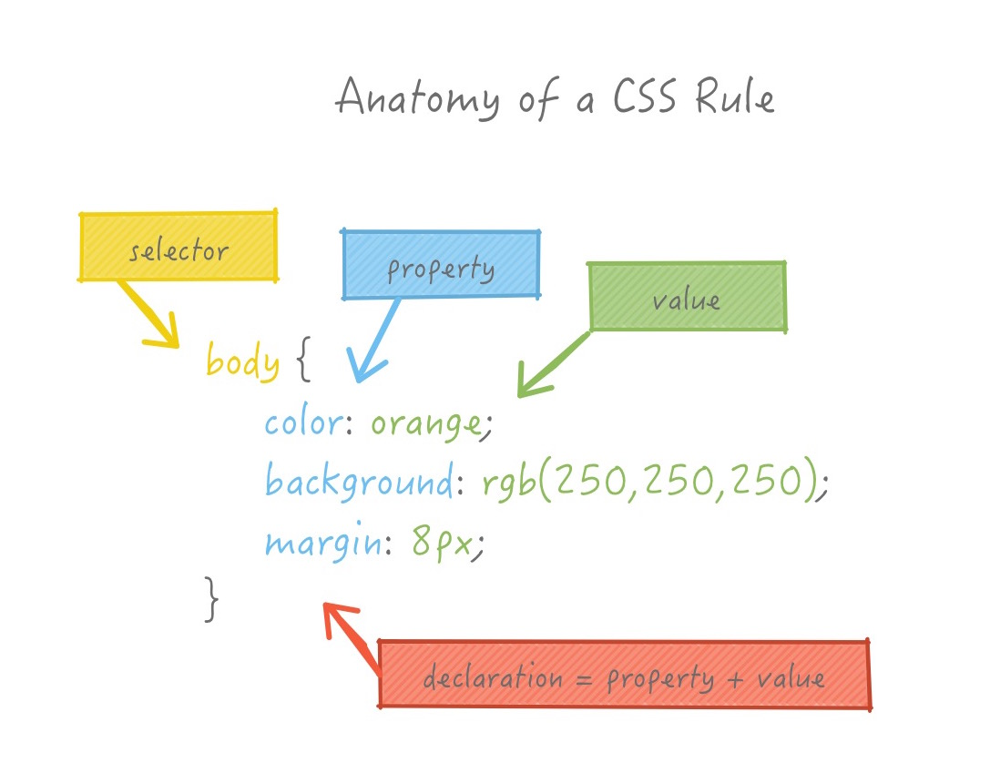
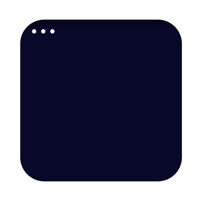
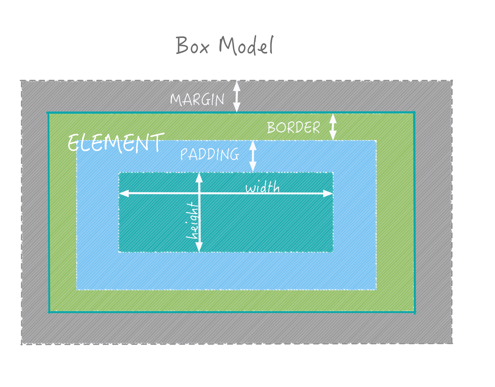

# CSS — Cascading Style Sheets

## Semantics vs. Style

So far we have been defining structure but have not done anything with how they are displayed.  We have mostly relied on the default display styles provided by the browser.  When you set the `h1` tag the font size increased, but we didn't control it directly.  What we were defining was a section of content that was intended to be a header of level 1.

In Microsoft Word,  the default way to format the document is by setting typesetting directly.  You select something and change the font size, or make it bold.  The problem with this is that it unmaintainable in the long term.  Want to change all your headings?  Good luck — should have set up some styles.

The idea behind markup is to help separate the meaning (or semantics) from the style. You specify the intended use of the content,  whether it is a header or a paragraph etc,  and then you define the look and feel of these blocks separately.

The next step is to explore how to do style!

## Enter CSS

{: .fancy .small }

CSS will be friend and foe this term.  Certain things will be easy, certain things will feel impossible.  Try to vertically align something. We will conquer this though.

{: .fancy }

Ok, enough fun.

## CSS Rules

CSS is a list of rules specifying how elements should be displayed. Each rule starts with a selector: a bit of text that selects some elements of the HTML.  When you gave your page structure you defined the elements that could be selected with CSS!





### Selectors!


A selector can target elements in different ways:

a tag name:

```css
p {
  color: blue;
}
```

a class:

```css
.classname {
  color: pink;
}
```

an id:

```css
#elementid {
  color: black;
}
```

combinations:

```css
p.classname {...} /* element with class */
p.classname a {...} /* element that is inside of element.class */
p, a, .classname {...} /* multiple selectors */
```

### Pseudo Selectors

and any of the above plus special keywords such as `hover` which refers to the state something is when your mouse hovers over it:

```css
p:hover {
  color: orange;
}
a:link { color: blue;}
a:visited { color: purple;}
```

### Simple Example With Selectors and Colors

<p data-height="400" data-theme-id="24117" data-slug-hash="a54aae158ba02e5e4cfe33c089277603" data-default-tab="css,result" data-user="timofei" data-embed-version="2" data-editable="true" class="codepen">See the Pen <a href="http://codepen.io/timofei/pen/a54aae158ba02e5e4cfe33c089277603/">a54aae158ba02e5e4cfe33c089277603</a> by Tim Tregubov (<a href="http://codepen.io/timofei">@timofei</a>) on <a href="http://codepen.io">CodePen</a>.</p>

Note: I cheated in the above example and included some magic for that font.

Computers display color using red, green, and blue color light.  Each color intensity is defined by a byte — thus an unsigned integer value of 0-255 (2^8 -1).
When you specify a color on the web there are several ways to do so:

* Predefined names: red, blue, green, white, etc.
* 8-bit hexadecimal numbers for red, green, blue: <span style="color:#cc0000">#cc0000</span>
* 0-255 decimal intensities: <span style="color:rgb(150,0,150)">rgb(150,0,150)</span>
* Percentage intensities: <span style="color:rgb(20%,80%,20%)">rgb(50%,50%,100%)</span>

And a special case with transparency:  <span style="color:rgba(0,0,255,.5)">rgba(0,0,255,.5)</span>

## CSS Game Time

CSS Selector Game — Play this to become a pro!  [CSS Diner](http://flukeout.github.io/)

## Fonts

The [default fonts](http://www.w3schools.com/css/css_font.asp) that browsers support are a bajillion years old.  Please don't design your pages with Times New Roman.

Best way to get prettier fonts is to use [Google Fonts](https://www.google.com/fonts). Simply choose a font you want and Google gives you a stylesheet to include in the head of your HTML.

Here's Open Sans (a lovely simple font):

`<link href='https://fonts.googleapis.com/css?family=Open+Sans' rel='stylesheet' type='text/css'>`

and use:
```css
body {
  font-family: 'Open Sans', sans-serif;
}
```
To make it the default! 💗


## CSS Inside

There are 3 ways to include CSS styles in your page.

* Inline style: `<p style="color: orange;">` BAD
* Internal style sheet: is a block of CSS inside of your html. Better.
* External style sheet: separate file included in head section. BEST.
* CSS Preprocessor Magics:  is actually best, we'll look into this more later. See: [SASS](http://sass-lang.com/)


```html
<!DOCTYPE html>
<html>
  <head>
    <title>CSS Loaded 3 Ways</title>

    <!-- Internal Style Sheet: MEDIOCRE -->
    <style type="text/css">
      h1 {
        color: purple;
      }
      body {
        background-color: orange;
      }
    </style>

    <!-- External Style Sheet: BEST -->
    <link rel="stylesheet" type="text/css" href="mystyle.css">

  </head>
  <body>

    <h1>Title</h1>

    <!-- Inline Style:  WORST -->
    <p style="color: white">Paragraph Stuff</p>

  </body>
</html>
```

## Position

### z-index: -1


Similar to layers and allows elements to be ordered. Parameter: signed integer

### position: static



Default position.  Elements take up space next to each other within the document flow. No position properties like `top`, `right`, `bottom`, `left` take effect.

### position: relative


Position is relative to default (ie. parent within document flow) via `top`, `right`, `bottom`, `left` properties.

### position: absolute


Position is relative to the nearest absolute parent element via `top`, `right`, `bottom`, `left` properties. Element is removed from document so other elements ignore it.

### position: fixed


Position is relative to the screen via `top`, `right`, `bottom`, `left` properties. Otherwise similar to absolute.

Position 0,0 is the top left corner.  

(animated gifs from [FROONT](http://blog.froont.com/positioning-in-web-design/))

For more detailed examples: [css-tricks](https://css-tricks.com/almanac/properties/p/position/)

## Alignment Between Elements, the old way

<p data-height="400" data-theme-id="24117" data-slug-hash="cc696879a64585dc629b27fba80c183d" data-default-tab="css,result" data-user="timofei" data-embed-version="2" data-editable="true" class="codepen">See the Pen <a href="https://codepen.io/timofei/pen/cc696879a64585dc629b27fba80c183d/">floats</a> by Tim Tregubov (<a href="http://codepen.io/timofei">@timofei</a>) on <a href="http://codepen.io">CodePen</a>.</p>

The [`float` CSS property](http://www.w3schools.com/css/css_float.asp) specifies that an element should be taken from the normal flow and placed along the left or right side of its container. Text or other inline elements will wrap around it.

Floating can get tricky.  There is also a [`clear` CSS property](http://www.w3schools.com/css/css_float.asp) to control which elements should *not* float.


## Flexbox, the new way

Alignment used to be miserable. With CSS3 [Flexbox](https://css-tricks.com/snippets/css/a-guide-to-flexbox/) make things much better.

Flexboxes are worth learning. Here's a simple playable example.

<p data-height="505" data-theme-id="24117" data-slug-hash="03b6b8b6dace6d8f7c666514ac66bead" data-default-tab="css,result" data-user="timofei" data-embed-version="2" data-editable="true" class="codepen">See the Pen <a href="https://codepen.io/timofei/pen/03b6b8b6dace6d8f7c666514ac66bead/">simple flexbox</a> by Tim Tregubov (<a href="http://codepen.io/timofei">@timofei</a>) on <a href="http://codepen.io">CodePen</a>.</p>

Want to learn more?
**go play this now** [FLEXBOX TOWER DEFENSE GAME](http://www.flexboxdefense.com/)

[This](https://css-tricks.com/snippets/css/a-guide-to-flexbox/) has good examples also.


## Precedence and Cascading

CSS is named the way it is because is each style sheet applies in a cascading manner.


Imagine the situation where there's a nice set of CSS styles that you'd like to use in your site. For instance [Bootstrap](http://getbootstrap.com) is a well know CSS framework but you need to customize and override some things.  You'd add in your own stylesheet to load later and the styles would apply on top of the previous ones. The precedence order is a bit more complicated:

* The more specific our selector is the higher its weight (e.g. a selector having three classes will win a selector with two classes)
* A more specific selector takes over a less specific one, regardless of the order in which they appear
* When two selectors have the same specificity, the one that comes second (in order of loading) wins
* !important always gets the highest precedence (use sparingly — prefer to just be more specific)
* Inline styles have second highest precedence (hence bad because hard to override)
* The universal selector (\*) has zero weight

(from: [Zacky Pickholz](https://www.linkedin.com/pulse/most-important-css-rule-you-might-have-missed-zacky-pickholz))


## CSS Box Model

Every element on the page is a box.  Each box has several properties that define various spacing parameters:

* margin: defines the spacing **around** the element
* border: defines thickness of a border line
* padding: defines the spacing *inside* of the element between the border and the contents (can be text of children elements)
* width/height:  define the size of the element contents — important to understand that this size does not include the totals




## Size Units

* em	Relative to the font-size of the element (2em means 2 times the size of the current font)
* ex	Relative to the x-height of the current font (rarely used)
* ch	Relative to width of the "0" (zero)
* rem	Relative to font-size of the root element
* vw	Relative to 1% of the width of the viewport
* vh	Relative to 1% of the height of the viewport
* vmin	Relative to 1% of viewport's* smaller dimension
* vmax	Relative to 1% of viewport's* larger dimension

(from [css_units](http://www.w3schools.com/cssref/css_units.asp))

<p data-height="396" data-theme-id="24117" data-slug-hash="GqoPMW" data-default-tab="html,result" data-user="timofei" data-embed-version="2" data-editable="true" class="codepen">See the Pen <a href="http://codepen.io/timofei/pen/GqoPMW/">Testing of Length units</a> by Tim Tregubov (<a href="http://codepen.io/timofei">@timofei</a>) on <a href="http://codepen.io">CodePen</a>.</p>


## Element Visibility

There are multiple ways to show and hide elements:

* `display: none;` element is not displayed and takes no space in layout
* `display: inline;` element is inlined (like spans)
* `display: block;` element is a block (like divs)

* `visibility: hidden;` element is not displayed but space still allocated
* `visibility: visible;` element is displayed

* `opacity: 0.5;` element is displayed with transparency and takes up space


## Transitions

CSS3 can do a lot of stuff.  Transitions, animations, and even 3D transforms.

Here's some fancy stuff.

<p data-height="400" data-theme-id="24119" data-slug-hash="EWyyNJ" data-default-tab="result" data-user="timofei" data-embed-version="2" data-pen-title="Day Night simulation" class="codepen">See the Pen <a href="http://codepen.io/timofei/pen/EWyyNJ/">Day Night simulation</a> by Tim Tregubov (<a href="http://codepen.io/timofei">@timofei</a>) on <a href="http://codepen.io">CodePen</a>.</p>


### Transition Properties

```css
div {
  transition-property: [property]
  transition-duration: [duration];
  transition-timing-function: [timing-function];
  transition-delay: [delay];
}
/* or shorthand */
div {
  transition: [property] [duration] [timing-function] [delay];
}

```

* property:  (required) the property of the element you want the transition to apply to. can be specific property like background-color, a list, or `all`.
* duration:  (required) timespan in milliseconds or seconds units that the effect lasts.
* timing-function: (optional) animation interpolation type: `linear`, `ease` (default), `ease-in`, `ease-out`, and `ease-in-out`.
* delay: (optional) delay before the start of the animation in milliseconds or seconds units.


<p data-height="400" data-theme-id="24117" data-slug-hash="598dcc037bd45c9e8c431646bd77a004" data-default-tab="css,result" data-user="timofei" data-embed-version="2" data-editable="true" class="codepen">See the Pen <a href="http://codepen.io/timofei/pen/598dcc037bd45c9e8c431646bd77a004/">basic css transitions</a> by Tim Tregubov (<a href="http://codepen.io/timofei">@timofei</a>) on <a href="http://codepen.io">CodePen</a>.</p>


## CSS 2D and 3D Transforms

### Translate

```
transform: translate(x, y);
transform: perspective(distance_from_view) translate3d(x, y, z);
```

A 2D translate in Y:

<p data-height="254" data-theme-id="24117" data-slug-hash="6cf9da2f0cc4da333ea92ec37259d676" data-default-tab="css,result" data-user="timofei" data-embed-version="2" data-editable="true" class="codepen">See the Pen <a href="http://codepen.io/timofei/pen/6cf9da2f0cc4da333ea92ec37259d676/">css pushbutton</a> by Tim Tregubov (<a href="http://codepen.io/timofei">@timofei</a>) on <a href="http://codepen.io">CodePen</a>.</p>


### Rotate


```css
rotate(angle)	/* 2D rotation */
rotate3d(x,y,z,angle)	/* 3D rotation with axis (with transform-origin )and rotation*/
rotateX(angle) /* shorthand 3D along the X-axis */
rotateY(angle) /* shorthand 3D along the X-axis */
rotateZ(angle) /* shorthand 3D along the X-axis */
```

Here's a visualization of how the rotation works.  Note transform-origin is the default center of the object here, but it can be shifted. What happens when you do that?  Also note

<p data-height="426" data-theme-id="24117" data-slug-hash="ed827936ca972890a167a2eacc8b8f28" data-default-tab="css,result" data-user="timofei" data-embed-version="2" data-editable="true" class="codepen">See the Pen <a href="http://codepen.io/timofei/pen/ed827936ca972890a167a2eacc8b8f28/">3d rotation with angles</a> by Tim Tregubov (<a href="http://codepen.io/timofei">@timofei</a>) on <a href="http://codepen.io">CodePen</a>.</p>


Here's an effect that may be a little over the top for daily use.

<p data-height="353" data-theme-id="24117" data-slug-hash="c0bacc59c1a4f7bade4a52e10d87373c" data-default-tab="css,result" data-user="timofei" data-embed-version="2" data-editable="true" class="codepen">See the Pen <a href="http://codepen.io/timofei/pen/c0bacc59c1a4f7bade4a52e10d87373c/">css card flip</a> by Tim Tregubov (<a href="http://codepen.io/timofei">@timofei</a>) on <a href="http://codepen.io">CodePen</a>.</p>


Ok, that might be enough of 3D for one day! More demos can be found here:

<iframe src="http://desandro.github.io/3dtransforms/examples/cube-02-show-sides.html" height="400" width="100%"></iframe>


## Further Learning: Use the Source, Luke ([UTSL](https://en.wikipedia.org/wiki/UTSL))


CSS is huge.  There are just too many things to cover!

One way to both see how things are done and also to test out changes is to the use the [Inspector](https://developers.google.com/web/tools/chrome-devtools)! and see how people are achieving certain effects.


### More Resources

* [learn.shayhowe.com](http://learn.shayhowe.com/html-css/) is also a good resource.
* [advanced-css-selectors-you-never-knew-about](https://medium.com/the-web-crunch-publication/advanced-css-selectors-you-never-knew-about-972d8275d079)
* [css-tricks](https://css-tricks.com/)
* [flexbox patterns](http://www.flexboxpatterns.com/home)
* [bootstrap](http://getbootstrap.com/)
* [semantic-ui (an alternative to bootstrap that looks cool)](http://semantic-ui.com/)
* [transitions and transforms](https://robots.thoughtbot.com/transitions-and-transforms)
* [3d transforms](http://desandro.github.io/3dtransforms)
