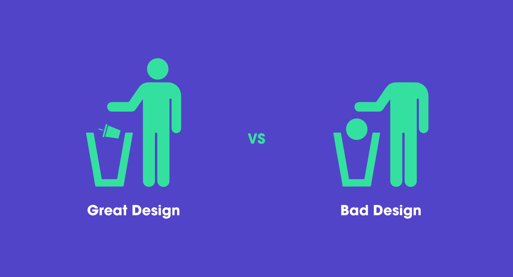
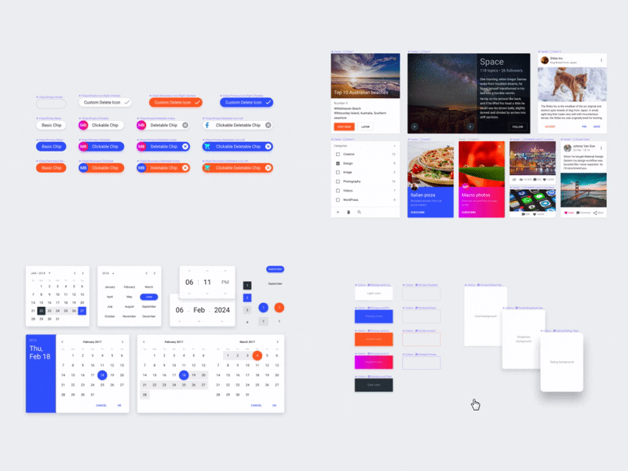
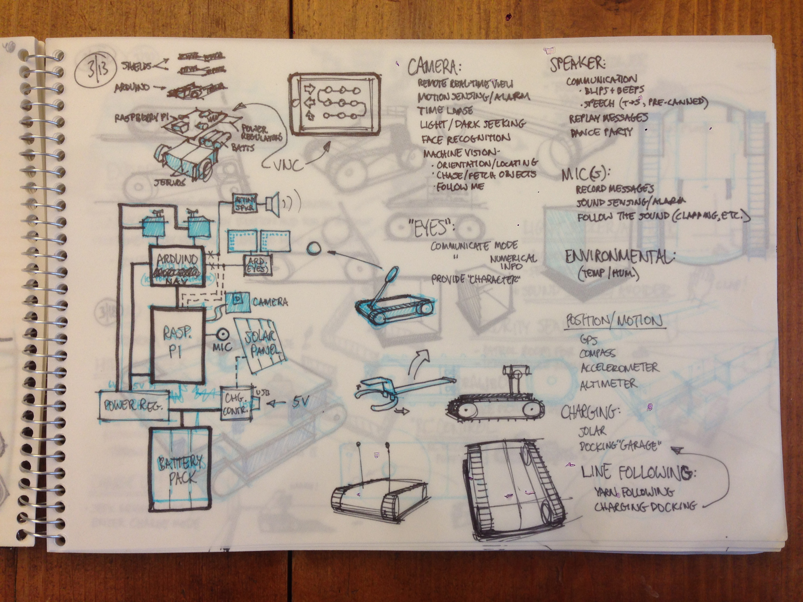
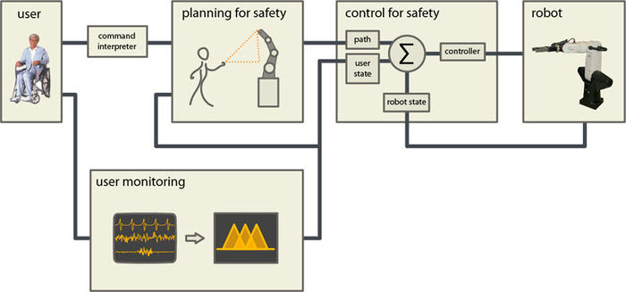
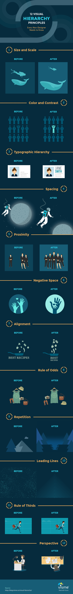
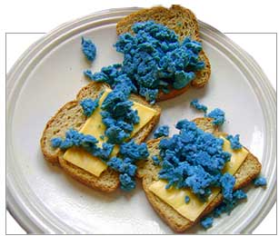
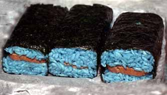
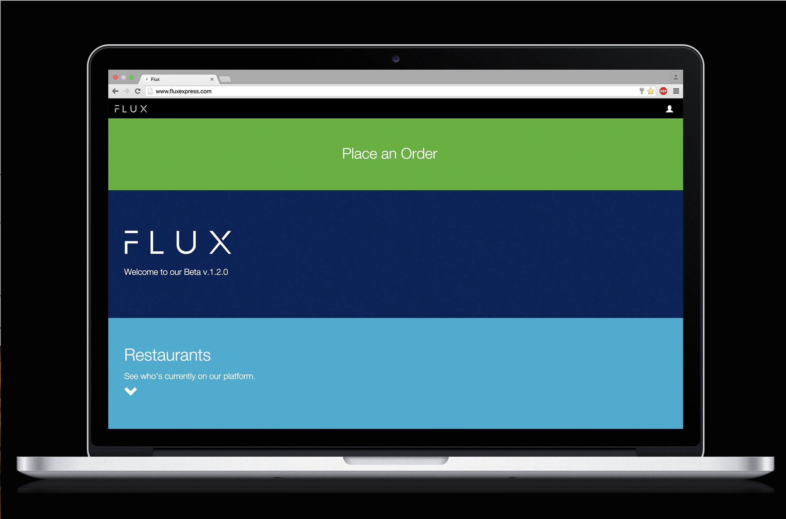
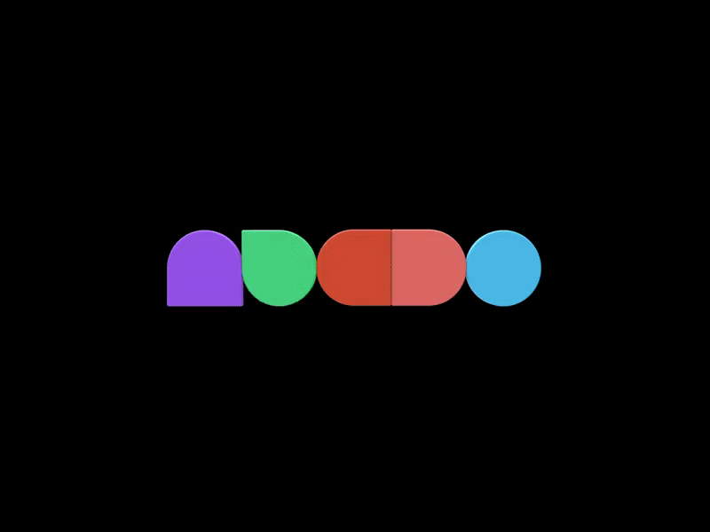
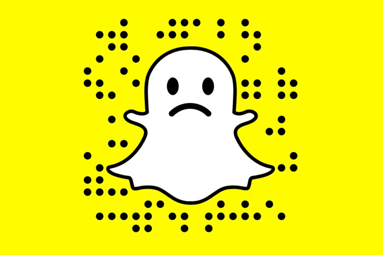

layout: true
class: center, middle
name: pic
background-size: contain

---

layout: true
class: center, top
name: fragment

.title[{{name}}]

---
layout: true
class: center, middle
name: base

.title[{{name}}]

---
name: Design

.fancy.medium_small[]

???
* just some tips
* sorry for the repeat for those of you who have heard this before
* not really a designer (tried to go to graphic design school many years ago though)
* here's what I've learned from hanging around designers
* based on working on hundreds of projects

---
name: But I just want to code!!

.fancy.small[]

*💳credit given for design work* 
*and it'll turn out better*

???
* **cowhand** coding - just leads to manure code
* just jumping in will lead to having a big ol mess of features
* stuff you don't even need to build
* i'm happy to help
* also office hours / open lab hours in DALI have many designers happy to help
* doesn't hurt to learn
* credit given for design work

---
name: Step 0a: Inspiration Board

* find examples of similar products
* take screenshots / save urls
* copy color schemes

.fancy.medium[]

???
* other people have made pretty designs,  look at them, use them for inspiration, copy them as best you can
* you've all been keeping these already right?   
* inspiration boards are the **biggest difference between good designers and pretenders**.  if a designer starts with an inspiration board you can see their thought process and it is obvious in the final product that they thought about what they were making

---
name: Step 0b: Imitate / Steal / Use DesignKits

<!-- .fancy.medium[] -->
.fancy.medium[]
* https://dribbble.com/
* https://blog.prototypr.io/design-for-programmers-d38c56982cd0
* https://www.awwwards.com/web-design-trends-for-2017.html
* https://www.figma.com/resources/assets/

???
* best form of flattery is imitation
* design kits are the best

---
name: Step 1: Sketches

* paper is best
* quickly jot down views and functionalities

<iframe src="//giphy.com/embed/d26EH3VCAHS12?hideSocial=true" width="380" height="284" frameBorder="0" class="giphy-embed" allowFullScreen></iframe>

???
* make them on paper first
* much faster
* we'll try to get to that today

---
name: Step 2: Mockups

* with inspiration and sketches
* start on mockups ([Figma](http://figma.com))
* don't code them yet

.fancy.medium[]

???
* the case for mockups:
* help you remember what needs to be built
* much quicker to play around with different options quickly and easily to determine what works best for your product
* coordinate with your team - keep everybody on track
* Figma is like google docs for design - super

---
name: Importance of User Flow

.fancy.small[]

.medium[]

???
* but also use figma for storyboard - upload sketches - use primative shapes / icons

---
name: Step 3: Functional Mockups

* put mockups together
* build with [Figma](https://help.figma.com/article/199-getting-started-with-prototyping)

.fancy.medium[]

???
* great way to test your interactions
* woop forgot some logic path from one view to another
* can run it by users and see if they can figure it out
* again for the AR or robot projects - can use sketches or shapes and words

---
name: Colors

* Not just random
* Use a color scheme chooser: [color.adobe.com](http://color.adobe.com)
* Steal from other sites

.fancy.medium[]

???
* picking colors
* beg, borrow, steal color schemes

---
name: Hierarchy

* visual hierarchy
* what users see first, order of gaze
* visual saliency

.fancy.medium[]

???

* laying out your page, remember to think about the visual hierarchy
* ordering of what users see based on size/color/movement
* What will users eyes see first, your call to action, or the large user profile button that they never really need to go to
* Try to imagine what you would notice first as a new user and then order your elements in terms of visual saliency appropriately
* Larger and brighter colored things tend to be noticed first
* Positioning also matters, we tend to look at things in a [letter F pattern](https://uxplanet.org/f-shaped-pattern-for-reading-content-80af79cd3394).

---
name: More Visual Design Principles

.fancy.medium[]

* [more principles](http://blog.visme.co/visual-hierarchy/)

???
* pretty good read with lots of examples
* recommend at least some people on the team get excited about design
* is important - makes or breaks a project

---
name: Mindfulness

.fancy.medium[]

UX is like a joke...

???
* famous designer
* every choice you make conveys something
* you chose blue for a restaurant site because you like blue
* but blue is not appetizing, doesn't make people feel hungry - RED does weird.
* think about and defend every choice you make - 'i just like it' doesn't cut it.
* hidden interaction like swiping or hamburger - be careful.
* ux is like a joke - its bad if it needs explaining
* can use this time to test that!

---
name: Appetizing?

.fancy.left[]
.fancy.right[]

???
* but blue is not appetizing, doesn't make people feel hungry - RED does weird.

---
name: Flux Express

.fancy[]

???
* you chose blue for a restaurant site because you like blue
* but blue isn't appetizing - they rebranded multiple times
* it looks clean - until you realize you're supposed to order food

---
name:  Mockups: Figma

.fancy.medium_small[]

* vector drawing
* design kits
* prototyping
* animation
* collaboration
* engineering blog

???
* upload sketches here
* create designs here
* read their engineering blog

---
name: Make or Break

.fancy.medium[]

"Snap CEO Evan Spiegel said that the two percent decline in daily active users was "primarily driven" by a lower frequency of use among the company's user base due to "the disruption caused by our redesign." " 

* [drop in users](https://techcrunch.com/2018/05/01/snapchat-reredesign/)

???
* 1.2 million users signed a petition
* 3 million users lost
* i always found the hidden slides to be confusing but changing things once people get used to it is even worse

---
name: Some Pretty Things

* https://designmodo.com/web-design-trends-2019/
* https://www.awwwards.com/websites/web-interactive/
* https://medium.muz.li/weekly-design-inspiration-200-9951b3d88a2
* https://uxplanet.org/review-of-ui-design-trends-we-start-2019-with-68f128151215
* https://www.checklist.design/
* https://dribbble.com/shots/4249163-Animated-login-form-avatar
* https://koox.co.uk/home

* http://notion.so 

---
name:  more resources

.fancy.medium[]

lots of resources out there

* https://dribbble.com/
* https://blog.prototypr.io/design-for-programmers-d38c56982cd0
* http://www.cssdesignawards.com/
* https://www.awwwards.com/web-design-trends-for-2017.html
* [design trends 2019](img/designtrends2019.pdf)

???
* best form of flattery is imitation

---
name: Let's play!

[cs52.me/workshops/design](/workshops/design)

???
* the next lab is to build a buzzfeed quiz