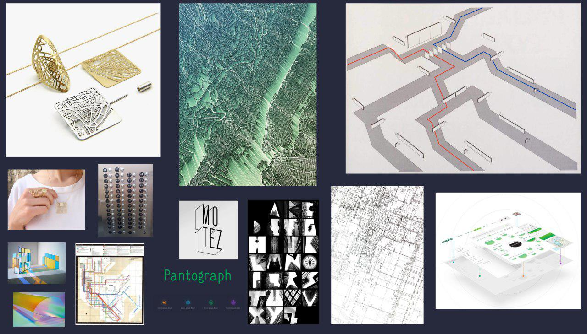
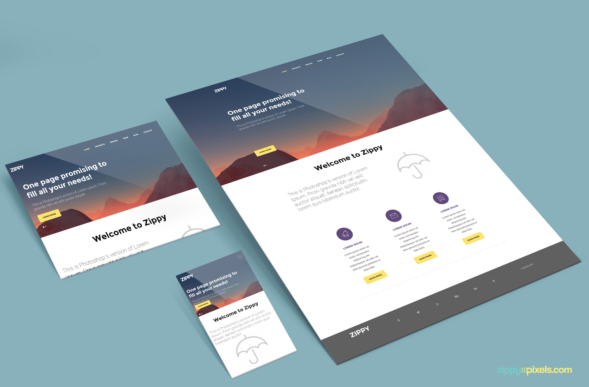
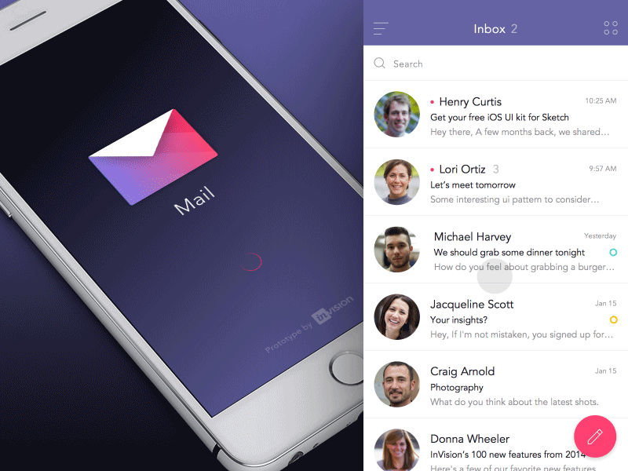
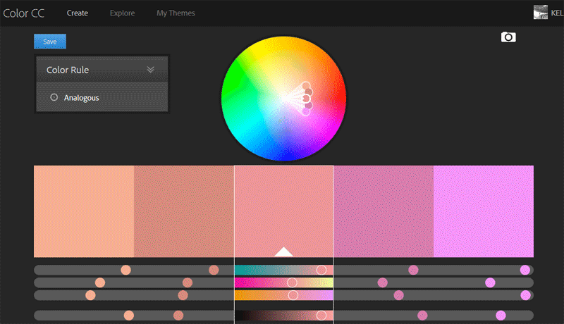
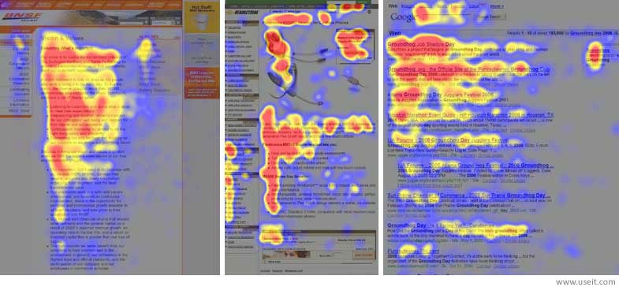
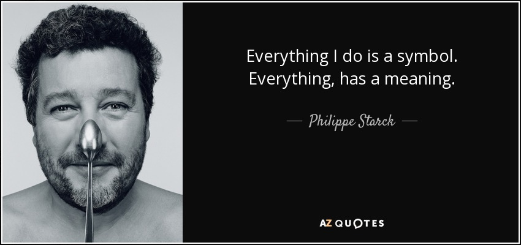

layout: true
class: center, middle
name: pic
background-size: contain

---

layout: true
class: center, top
name: fragment

.title[{{name}}]

---
layout: true
class: center, middle
name: base

.title[{{name}}]

---
name: Design

<iframe width="640" height="360" src="https://www.youtube.com/embed/r-RfH8aKbws?rel=0&amp;showinfo=0" frameborder="0" allowfullscreen></iframe>

???
* just some tips
* not really a designer but here's what I've learned from hanging around designers
* based on working on hundreds of projects

---
name: Step 1: Inspiration Board

* find examples of similar products
* take screenshots
* save urls
* copy color schemes

.fancy.medium[]

???
* other people have made pretty designs,  look at them, use them for inspiration, copy them as best you can

---
name: Step 2: Sketches

* paper is best
* quickly jot down views and functionalities

<iframe src="//giphy.com/embed/d26EH3VCAHS12?hideSocial=true" width="380" height="284" frameBorder="0" class="giphy-embed" allowFullScreen></iframe>

???

---
name: Step 3: Mockups

* with inspiration and sketches
* start on mockups (figma, sketch, etc)
* don't code them yet

.fancy.medium[]

???
* help you remember what needs to be built
* much quicker to play around with different options quickly and easily to determine what works best for your product

---
name: Step 4: Functional Mockups

* put mockups together
* Invision: https://www.invisionapp.com/education-signup
* PopPaper: https://marvelapp.com/pop/

.fancy.medium[]

---
name: Colors

* Not just random
* Use a color scheme chooser: [color.adobe.com](http://color.adobe.com)
* Steal from other sites

.fancy.medium[]

???
* picking colors
* beg, borrow, steal color schemes

---
name: Hierarchy

* visual hierarchy
* what users see first, order of gaze
* visual saliency

.fancy.medium[]

???

* When laying out your page, remember to think about the visual hierarchy
* What will users eyes see first, your call to action, or the large user profile button that they never really need to go to
* Try to imagine what you would notice first as a new user and then order your elements in terms of visual saliency appropriately
* Larger and brighter colored things tend to be noticed first
* Positioning also matters, we tend to look at things in a [letter F pattern](https://uxplanet.org/f-shaped-pattern-for-reading-content-80af79cd3394).

---
name: Mindfullness

.fancy.medium[]

???
* famous designer
* every choice you make conveys something
* you chose blue for a restaurant site because you like blue
* but blue is not appetizing, doesn't make people feel hungry - RED does weird.
* think about and defend every choice you make - 'i just like it' doesn't cut it.

---
name: resources

* lots of resources out there
* https://dribbble.com/
* https://blog.prototypr.io/design-for-programmers-d38c56982cd0
* http://www.cssdesignawards.com/
* https://www.awwwards.com/web-design-trends-for-2017.html

???
* best form of flattery is imitation

---
name: Let's play!

[cs52.me/workshops/design](../workshops/design)

???
