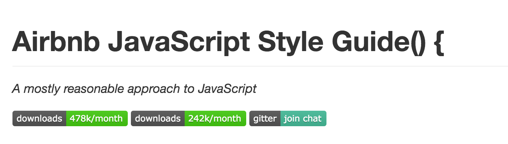

layout: true
class: center, middle
name: pic
background-size: contain

---
layout: true
class: center, top
name: fragment

.title[{{name}}]

---
layout: true
class: center, middle
name: base

.title[{{name}}]

---
name: What is?

.medium_small[]


???
* custom designed jabbascript for cs52 by a friend of mine
* we'll be doing sooo much javascript
* good parts and bad parts (books written)


---
name:

.tiny.fancy[]

* Netscape released in 1995 as a way to add programs to web pages in their browser
* has been evolving, now new annual specs

.medium[]

???


---
name: ECMAScript

* Javascript =>  ECMAScript:
  * high-level, dynamic, untyped, interpreted scripting language
  * prototype-based with first-class functions
  * multi-paradigm: object-oriented, imperative, and functional
  * closer to c than java

???
first-class function: functions are objects


---
name: mixed reviews

JavaScript has mixed reviews — love and hate though it is popular. But from the [2016 stackoverflow developer survey](http://stackoverflow.com/research/developer-survey-2016):


.fancy.medium_small[]

???


---
name: fullstack aside

.medium_small.fancy[]

???


---
name:

* Pros:
  * can be easy
  * first-class functions
  * functional paradigm
  * event loop
* Cons:
  * dynamic typing
  * prototype-based
  * global variables
  * scope
  * == vs === and falsy values
  * event loop

???


---
name: syntax similar to c BUT

.right[```javascript

var i = i * 10 + 3 + (i / 10);

if (i < 3 && i > 0) {
  i = foobar(i);
} else {
  i = i * .02;
}

```]

.left[```javascript
function foobar(i) { return i; }

while (i >= 0) {
    sum += i*i;
    // Comment
}

for (i = 0; i < 10; i++)  {
}
```]


???
* but there's some things here we shouldn't do...
* c style for loop badness
* these are all JS!


---
name: dynamic typing

```javascript
let i;         // typeof i == undefined

i = 32;        // typeof i == typeof 32 == 'number'
i = 'foobar1'; // typeof i == typeof 'foobar' == 'string'
i = true;      // typeof i == 'boolean'
```

* have type of the last thing assigned
* primitive types: undefined, number, string, boolean, function, object


???


---
name: number type

* number type is a double
* MAX_INT = $(2^{53} - 1) = 9007199254740991$
* oddities:
  * NaN, Infinity are numbers
  * 1/0 == Infinity
  * Math.sqrt(-1) == NaN

???


---
name: string type

* string is variable length

```js

const foo = 'bar'; // single quotes preferred but can use double
foo.length // 3

let a = 'The ' + foo + ' is high.'; // es5 'foobar'
//prefer es6:
let a = `The ${foo} is high.`;

// lots of useful string methods:
// match, search, replace, toUpperCase, toLowerCase, slice, substr
```


???
* use the es6 template string constructions!


---
name: boolean type

* `true`, `false`
* *truthy* and *falsy* when converting to bool

```js

//falsy
false == 0 == '' == null == undefined == NaN

//truthy
true == Object == '.+' == (num > 0) == function() {}

```


???
* == vs ===


---
name: undefined and null

* undefined — does not have a value assigned
* null — value to represent whatever coder wants (like a sentinel)

```js
var x;  // value of: undefined
x = undefined //can set to undefined
typeof x == 'undefined'

typeof null == 'object'

null == undefined // true
null === undefined // false
```

???


---
name:  function type

* called with any number of arguments
  * name if specified or `arguments[0]`
* always returns value (default is undefined)
* unspecified args: undefined

```js

// traditional
function useless(x) { console.log(x); }

// variable assigned anonymous function
var useless = function(x) { console.log(x); }

// es6 fat arrow notation
var useless = (x) => { console.log(x); }

typeof useless == 'function'
```

???
* `arguments[0]` (weird and bad)
* also actually is an object will dig in a bit later


---
name: object type

* is a hashmap or dictionary of:
  * name-value pairs called properties
* global scope is just an object (in browser `window`)
* can have functions as properties (called methods)

```js

var foo = {};  //empty object

var bar = {
  name: 'Anna', //no need to quotes for key
  'state': 'nh',
  age: 23,
  sayHi: () => {
    alert(`my name is ${this.name}`);
  }
}

bar.name === bar['name']
```
???
* note es6 arrow function
* note es6 template string builder
* this will be explained


---
name: more properties

```js
// adding
var foo = {};
foo.name = "Fred";  // foo.name returns "Fred"

//removing
var foo = {name: "Fred"};
delete foo.name; // foo is now an empty object

//enumerating
Object.keys({building: "Hop", height: 40}) == ["building", "height"]
```

???
* also functions -- everything is really just a dictionary


---
name: Arrays

* are also special objects!
* polymorphic and sparse
* oddity: can have properties ?!

```js

var list = [1, 2, 'three', null, () => { console.log('hi'); } ];

list[2]; // returns 'three'
list[4]; // returns function
list[4](); // ?

list[500] = 'sparse array';
// useful methods: push(), pop(), sort(), reverse(), splice()
// and properties: length
```

???
* list[4] // returns undefined and prints hi


---
name: date type

* special type of ...
* epoch time (1/1/1970 UTC)
* no timezones
* use [momentjs](http://momentjs.com/) instead

```js
let date = new Date();

typeof date == 'object';

date.valueOf() = 1452359316314
date.toISOString() = '2016-01-09T17:08:36.314Z'
date.toLocaleString() = '1/9/2016, 9:08:36 AM'
```
???


---
name: type coercion

* will automatically convert types!

```js
console.log(8 * null)   // → 0

console.log("5" - 1)    // → 4

console.log("5" + 1)    // → 51

console.log("five" * 2) // → NaN

console.log(false == 0) // → true
```

???


---
name: Logical operators

```js
// and &&
console.log(true && false)   // → false
console.log(true && true)    // → true

// or ||
console.log(false || true)   // → true
console.log(false || false)  // → false

// not !
console.log(!true)           // false

// ternary or conditional operator
console.log(true ? 1 : 2);   // → 1
console.log(false ? 1 : 2);  // → 2
```

???
* i'm a fan of ternary -- dumb python
* ternary would be used in assignment


---
name: short-circuiting

* `||` can be used with values
  * get converted to booleans
  * return whichever is true first, or second, or undefined

```js

var foo = null;
console.log(foo || "user")    // → user
console.log("Karl" || "user") // → Karl

```

???
* useful to set default values if the first thing failed
* say username if exists otherwise "username string"


---
name: Variable Scoping:  Lexical/static

Two scopes: Global and function local

```javascript
var x = "outside";

var f1 = function () {
  var x = "inside f1";
};

f1();
console.log(x);  // → outside

var f2 = function () {
  x = "inside f2";
};

f2();
console.log(x);  // → inside f2
```

???
* everything outside of function is global
* inside of function is function scope
* if declared
* in second example just refers to global
* shadowing is bad (redeclaring locally on purpose)


---
name: Variable Hoisting

* var statements hoisted to top of scope:

.right[
```js
function foo() {
  var x;
  x = 2;
}

// Same as:

function foo() {
  x = 2;
  var x;
}
```
]
.left[
```js
function foo() {
  console.log(x); // → undefined
  var x = 2;
}

// Same as:
function foo() {
  var x;
  console.log(x); // → undefined
  x = 2;
}
```
]


???
* variable declarations only get hoisted
* would log 'undefined'


---
name: Function hoisting

```js

showState1();  // output: Ready
showState2();  // undefined

var showState2 = function() {
  console.log("Idle");
};

function showState1() {
  console.log("Ready");
}

```


???
* all functions are hoisted to the top of their scope
* not just declaration actual stuff
* otherwise you have to define functions in order of use


---
name: Scope

* global variable mucho bad
* hoisting can cause confusion in local scopes
* make things clear, declare at top


```javascript

function() {
  for(var i = 0; i < 10; i++) {  }
  ...
  for(var i = 0; i < 25; i++) {  }
  // Error: i already defined
}
```


???
* why are global vars bad? easy to get conflicts causing bugs


---
name: closures

* ability to reference a specific instance of local variables in an enclosing function
* closure retains references even when outside function has returned

```javascript
function multiplier(factor) {
  // factor is a local var inside multiplier
  return (number) => {
    return number * factor;
  };
}

var double = multiplier(2);
var triple = multiplier(3);

console.log(triple(5));     // → 15
console.log(double(5));     // → 10   
```

???
* function “closes over” some local variables
* A good mental model is to think of the function keyword as “freezing”
  * the code in its body and wrapping it into a package (the function value).


---
name: closure trickiness

<p data-height="435" data-theme-id="24117" data-slug-hash="f2e5b9149a019b953859e6de0af83f54" data-default-tab="js,result" data-user="timofei" data-embed-version="2" data-editable="true" class="codepen">See the Pen <a href="http://codepen.io/timofei/pen/f2e5b9149a019b953859e6de0af83f54/">talking cat var scoping problem</a> by Tim Tregubov (<a href="http://codepen.io/timofei">@timofei</a>) on <a href="http://codepen.io">CodePen</a>.</p>

???
* reference retained to a variable that changes!
* note: easy way to fix this in es6!
* DON"T USE var:
  * i is hoisted above for loop
  * i is available after for loop


---
name:  let

* let variables are block-scoped (not whole function)
* still hoisted
* global let variables are not properties on `window`
* `for (let x...)` create a fresh binding for x in each iteration
* error to use a let variable before its declaration is reached
* redeclaring a variable with let is a SyntaxError

<!-- from https://hacks.mozilla.org/2015/07/es6-in-depth-let-and-const/ -->
???
* all good things
* use let instead of var, kids


---
name:  const

* simple:
  * variables declared with const are just like let
  * except that you can only assign to them when you declare them
  * ie. no reassignment

<!-- from https://hacks.mozilla.org/2015/07/es6-in-depth-let-and-const/ -->
???


---
name: OOP

* Object-oriented programming: methods
  * property of an object can be a function
  * instance variables

```javascript
var o = {
  count: 0,
  increment: function(amount) {
    this.count += amount || 1;
    return this.count;
  }
}

console.log(o.increment());  // 1
console.log(o.increment(2)); // 3
console.log(o.increment(2)); // 5
```


???


---
name: this

* `this` is special keyword for referring to the context
  * when a function is executed not when defined
* in methods (function properties of objects): `this` is bound to object
* in other functions: `this` refers to global object

```javascript
function foo() {  console.log(this); }

// normal function call
foo(); // `this` will refer to `window` in es5 and undefined in es6

// as object method
var obj = {bar: foo};
obj.bar(); // `this` will refer to `object`

// as constructor function
new foo(); // `this` will refer to
           // an object that inherits from `foo.prototype`
```

???
* some examples, confusing yes


---
name: this

```javascript
let LateBloomer = {
  petalCount: Math.ceil(Math.random() * 12) + 1,
  declare: function() {
  	console.log('I am a beautiful flower with '
                + this.petalCount + ' petals!');
  },
  bloom: function() {
  	setTimeout(this.declare, 1000);
  },

}

LateBloomer.bloom();   // undefined number of petals
// after 1 second, triggers the 'declare' method
```

???
* why do we care about `this`?
* this won't run
* setTimeout runs in the context of window
* so when it calls declare that function has no access to this.petalCount
* skip this quickly


---
name: this

```javascript
  bloom: function() {
  	setTimeout(this.declare.bind(this), 1000);
  },
}
```

* bind returns a new function with current `this` tied to the function
* on execute uses the bound `this` instead

???
* setTimeout's "this" refers to window
* neeeds `.bind(this)`
* bind returns a new function with this bound to a value.


---
name: that = this, bind

```javascript

var that = this;
setTimeout( function() {
  console.log(that);
}, 1000);

```

* assigning current `this` to a variable to freeze

???
* sometimes you will see people fix this with a closure
* reassing the current this to another variable
* BAD


---
name: that = this

<p data-height="300" data-theme-id="24117" data-slug-hash="9b0e116d14ee8078c8b86066f0d2ab5f" data-default-tab="js,result" data-user="timofei" data-embed-version="2" data-editable="true" class="codepen">See the Pen <a href="http://codepen.io/timofei/pen/9b0e116d14ee8078c8b86066f0d2ab5f/">9b0e116d14ee8078c8b86066f0d2ab5f</a> by Tim Tregubov (<a href="http://codepen.io/timofei">@timofei</a>) on <a href="http://codepen.io">CodePen</a>.</p>

???
* this is button -- but setTimeout scope is window


---
name: functions have properties

```javascript
function plus1(value) {
  if (!plus1.invocations) {
    plus1.invocations = 0;
  }
  plus1.invocations++;
  return value + 1;
 }

 console.log(plus1(10));   // → 11
 console.log(plus1(20));   // → 21

 console.log(plus1.invocations); // → 2
```
???


---
name: classes (old way)

* Functions are classes in JavaScript:
  * Name the function after the class
  * use the new keyword
  * functions used this way are constructors

```javascript
function Rectangle(width, height) {
  this.width = width;
  this.height = height;
  this.area = function() { return this.width*this.height; }
}
var r = new Rectangle(26, 14);
console.log(r)
// Rectangle { width: 26, height: 14, area: [Function] }
```

???


---
name: inheritance

* prototype based:
  * a prototype object for each object instance
  * can have other prototype objects forming a chain
  * will search up the prototype chain until the property is found


???
* properties of an object are its own property in addition to all the properties up the prototype chain


---
name: adding to prototype

```javascript
function Rectangle(width, height) {
  this.width = width;
  this.height = height;
}

Rectangle.prototype.area = function() {
   return this.width*this.height;
}

let r = new Rectangle(26, 14);  // {width: 26, height: 14}
r.area();  // 364
Object.keys(r) == [ 'width', 'height' ] // own properties
```


???
* changing prototype will cause all instances to change
* this is similar to just adding a property to a function buuut
* adding to prototype will change all instances


---
name: inheritance


```javascript

Rectangle.prototype = new Shape(...);

Square.prototype = new Rectangle();

//without separate constructor
let Rectangle = Object.create(Shape);

```

* If desired property not in Rectangle.prototype
* then look in Shape.prototype and so on


???
* can use Object.create() instead of constructor


---
name: getters and setters

```javascript
var pile = {
  elements: ["eggshell", "orange peel", "book"],
  get height () {
    return this.elements.length;
  },
  set height(value) {
    console.log("Ignoring attempt to set height to", value);
  }
};
console.log(pile.height); // → 3
pile.height = 100; // → Ignoring attempt to set height to 100
```

???
* want to include properties that are not methods but are computed?
* sure we got that


---
name: BUT WAIT!

What about es6?

* es6 has "real" classes
* stop talking about prototypes
* still really just an object / function


???


---
name: es6 class syntax

```javascript
class Bunny {
  constructor(name, favoriteFood){
    this.name = name;
    this.favoriteFood = favoriteFood;
  }
  eatFavFood() {
    console.log(`${this.favoriteFood}, yum!`);
  };
}

let es6Bunny = new Bunny('Brigadier Fluffkins', 'Raspberry Leaves');
es6Bunny.eatFavFood();
// Raspberry Leaves, yum!
```

<!-- from: https://medium.freecodecamp.com/learn-es6-the-dope-way-part-v-classes-browser-compatibility-transpiling-es6-code-47f62267661#.g5wa16op9 -->

???
* has constructor and methods
* much nicer syntax
* note: classes are *not* hoisted!


---
name: es6 inheritance

```javascript
class BelgianHare extends Bunny {
  constructor(favDrink, favoriteFood, name) {
    super(name, favoriteFood);
    this.favDrink = favDrink;
  }

  drinkFavDrink() {
    console.log(`glug glug ${this.favDrink}`)
  }
}
```
???
* as you would expect `extends`
* super to invoke base class constructor *required*


---
name: Regular Expressions

* their own syntax
* define pattern to search for in a string
* String: search(), match(), replace(), and split()
* RegExp: exec(), test()

```javascript
var re1 = new RegExp("abc");
var re2 = /abc/;

console.log(/abc/.test("abcde")); // → true
console.log(/abc/.test("abxde")); // → false

```

???
* test returns bool is regex is found anywhere in string


---
name: regex search and test

```javascript

/HALT/.test("HALT or not");  // true
/halt/i.test('HALT or not'); // true, ignore case
/[Hh]alt [A-Z]/.test('Halt B');

'foo abbbbbbc bar'.search(/ab+c/);// fount at 4 (position of ‘a’)
'foo ac bar'.search(/ab+c/);      // not found,  -1
'foo ac bar'.search(/ab*c/);      // found at 4
'12e34'.search(/[^\d]/);          // found at 2
'foo: bar;'.search(/...\s*:\s*...\s*;/); // found at 0

```

???
* regex are funny, take a while to perfect
* + at least 1
* * 0 or more
* ^ invert
* \d and digit
* \s spaces
* [] are a pattern
* . any character


---
name: match/replace

```javascript
var str = "This has 'quoted' words like 'this'";

str.match(/'[^']*'/g);
// returns ["'quoted'", "'this'"]


str.replace(/'[^']*'/g, 'stuff');
// Returns: 'This has stuff words with stuff.'
```

???
* if people are interested we could dive deeper into regex
* at a later class?


---
name: try/catch

* raise exceptions with throw statement

```javascript
function UserException(message) {
   this.message = message;
   this.name = "UserException";
}

try {
  nonExistentFunction();
  // or manual throw new UserException("user doesn't exit");
} catch (error) {  // errstr === "Help!"
  console.log('Got exception', error.messages);
} finally {
  // This block is executed after try/catch
}

```

???


---
name: JavaScript Object Notation (JSON)

standard interchange format for sending data to and from a browser

```javascript
var person = {
  fullName: 'Jamie Lannister',
  age: 42,
  phoneNumbers: [
    {
      type: 'home', number: '212 555-1234'
    }
  ],
}
var s = JSON.stringify(person);
// '{"fullName":"Jamie Lannister","age":42,
//  "phoneNumbers":[{"type":"home","number":"212 555-1234"}]}'
var backToPerson = JSON.parse(s)
// returns object with same properties
```
???


---
name: Workshop

webpack + babel + eslint dev environment

???


---
name: webpack

.fancy.medium[]

???


---
name: babel

.fancy.medium[]


???


---
name: eslint with airbnb style guide

.fancy.medium[]

???


---
name: Workshop Time!

[http://cs52.me/assignments/sa3](http://cs52.me/assignments/sa3)


???


---
name: Next time!

* Functional / Vector programming
* event loop
* async
* promises
* DOM

ALSO

* SA3 due Thursday
* HW2 goes out today!

???
