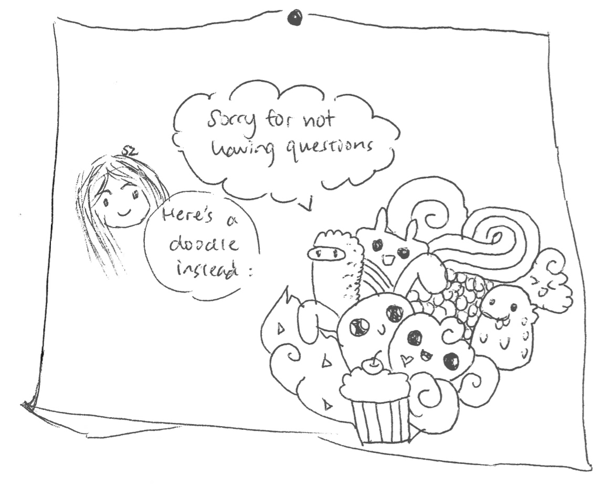
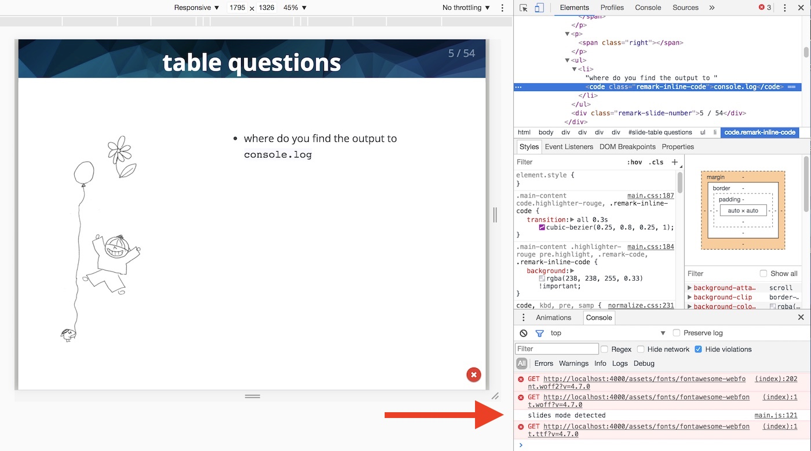
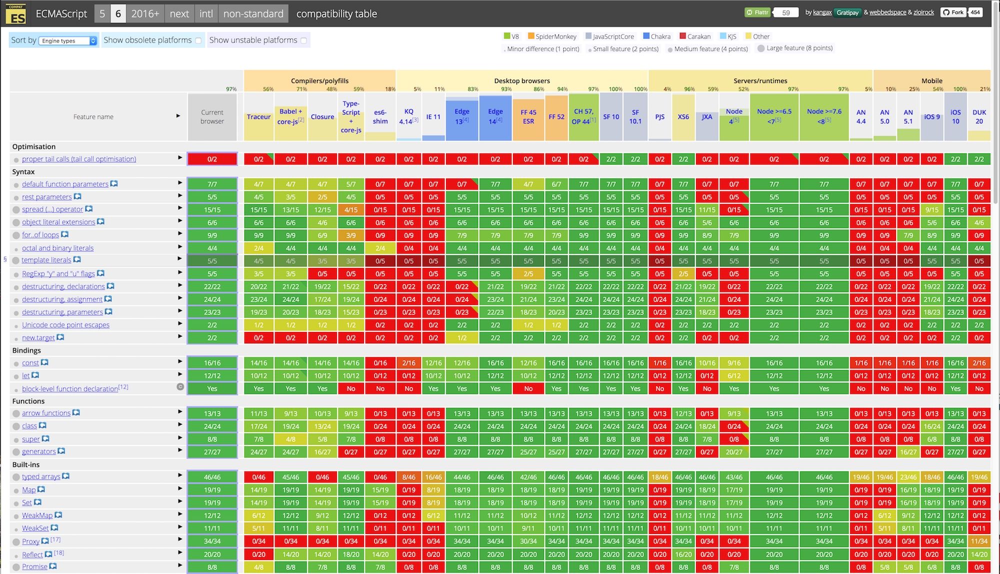
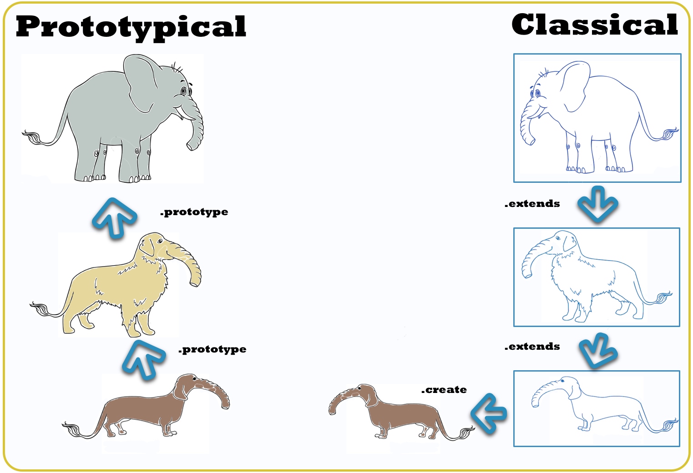
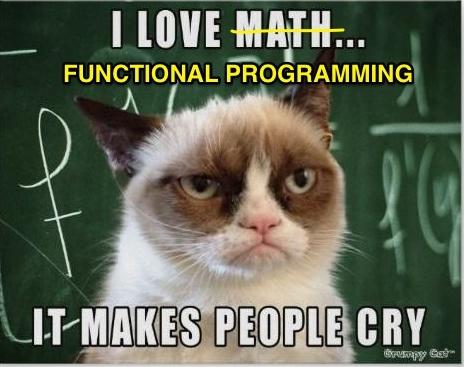
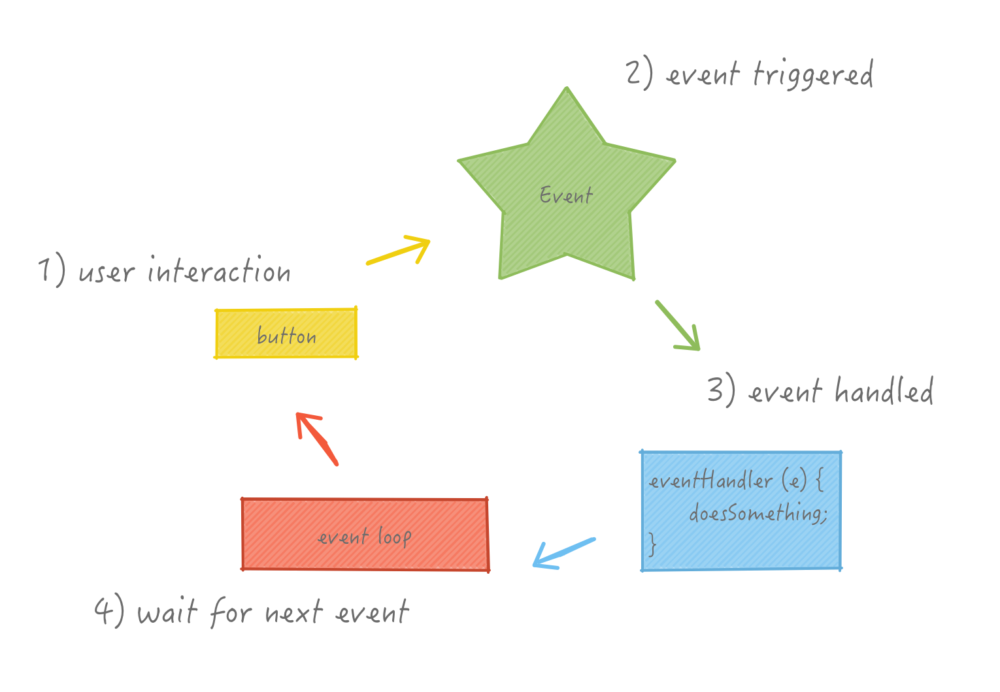
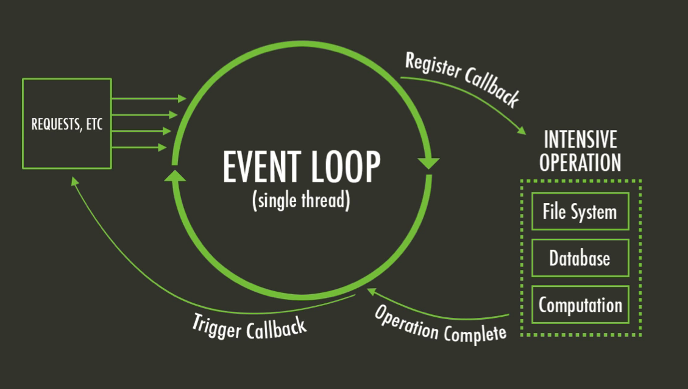

layout: true
class: center, middle
name: pic
background-size: contain

---

layout: true
class: center, top
name: fragment

.title[{{name}}]

---
layout: true
class: center, middle
name: base

.title[{{name}}]


---
name: CS52

* Today:
  * more javascript!
  * newer javascript!
  * tricky javascript!
  * and then our first team workshop!

???

---
name: table questions

* how is processing var / function declarations done / how is efficient?

.medium[]


???
*  efficient hoisting - just means parsing through the code 1x more times. From algos we know that 2x is a constant, thus not really a factor worth worrying about. :-)

---
name: table questions

* was js developed specifically for web browsers

.medium[]


???
* js for web:  yes specifically by netscape to add functionality


---
name: table questions

* when you use chrome inspector to change styles does it make a whole new render tree

.medium[]

???
* yes, although it can be smart about it knowing that you can only down the tree so only that subtree needs to change


---
name: table questions




* Ctrl+Shift+J or Cmd+Opt+J

???
* in [chrome devtools](https://developer.chrome.com/devtools)


---
name: table questions

* can a buzzfeed quiz be made only in html/css

.medium[]


???
* theoretically with real tricky css - long rules where everything is a sibling


---
name: table questions

* can we use both js and jquery for the assignment?
.tiny[]

```js
function html(value) {
  if (value === undefined && elem.nodeType === 1) {
      return elem.innerHTML;
  }
  // See if we can take a shortcut and just use innerHTML
  try { elem.innerHTML = value; } catch(e) {}

  //clean first then append new
  if (elem) {
      this.empty().append(value);
  }
}
```

???
* did you notice we had a guest?!
* jquery is largely just a wrapper for various plain js stuff

---
name: various administrative


.left[
* quizzes start Thursday (don't worry)
* short assignment 3 out today! due Thursday
* short assignment 4 out Thursday! due Tuesday
]

.right.small[]


???
* giving warning but from here on will be weekly after assignments are due
* nothing to worry about, if you understood what you did in the assignment (ie read it and coded it) should be fine
* 2 short assignments out at the same time, both should be doable in one sit down
* js asynch game will hopefully be out thursday!


---
name: but also good news


.left.small[]

.right[* extension on lab2 till Sunday 6pm!]

???


---
name: Where in the Stack?

.medium[]


???
* still in browser only


---
name: what is es6?!?!




???
* a bunch of cool new stuff that makes javascript not crappy
* apologies, but i love programming language coolness and currently js is one of my favorites
* i also kindof love to read code to see what people are doing, i think its an important skill, so please if you have question about any of the codes, just yell at me, or write your question down and give it to a designated yeller at your table!

---
name: what is es6?!?!

<iframe src="//giphy.com/embed/ZtufItCGJM3Vm?hideSocial=true" width="480" height="360" frameBorder="0" class="giphy-embed" allowFullScreen></iframe>


???
* general confusion - don't worry
* the idea is to immerse you in a bunch of stuff but then you go and try it and eventually by trying it it'll make sense
* ask questions, learn good


---
name: es6 template string

```js

const foo = 'bar'; // single quotes preferred but can use double

let a = 'The ' + foo + ' is high.'; // es5 'foobar'
//prefer es6:
let a = `The ${foo} is high.`;
```


???
* use the es6 template string constructions!
* why is string concatenation bad? (array concatenation - each plus allocates a new array and copies each element in)


---
name: closure and scope trickiness

<p data-height="435" data-theme-id="24117" data-slug-hash="f2e5b9149a019b953859e6de0af83f54" data-default-tab="js,result" data-user="timofei" data-embed-version="2" data-editable="true" class="codepen">See the Pen <a href="http://codepen.io/timofei/pen/f2e5b9149a019b953859e6de0af83f54/">talking cat var scoping problem</a> by Tim Tregubov (<a href="http://codepen.io/timofei">@timofei</a>) on <a href="http://codepen.io">CodePen</a>.</p>

???
* reference retained to a variable that changes!
* note: easy way to fix this in es6
* DON"T USE var:
  * i is hoisted above for loop
  * i is available after for loop


---
name:  let

* let variables are block-scoped (not whole function)
* still hoisted
* global let variables are not properties on `window`
* `for (let x...)` create a fresh binding for x in each iteration
* error to use a let variable before its declaration is reached
* redeclaring a variable with let is a SyntaxError

<!-- from https://hacks.mozilla.org/2015/07/es6-in-depth-let-and-const/ -->
???
* all good things
* use let instead of var, kids


---
name:  const

* simple:
  * variables declared with const are just like let
  * except that you can only assign to them when you declare them
  * ie. no reassignment

<!-- from https://hacks.mozilla.org/2015/07/es6-in-depth-let-and-const/ -->
???


---
name: OOP try 1

* Object-oriented programming: methods
  * property of an object can be a function
  * instance variables

```javascript
var o = {
  count: 0,
  increment: function(amount) {
    this.count += amount || 1;
    return this.count;
  }
}

console.log(o.increment());  // 1
console.log(o.increment(2)); // 3
console.log(o.increment(2)); // 5
```


???
* everything is already an object
* everything is a dictionary, hence...
* what is this? anybody?>


---
name: functions are objects

```javascript
function plus1(value) {
  if (!plus1.invocations) {
    plus1.invocations = 0;
  }
  plus1.invocations++;
  return value + 1;
 }

 console.log(plus1(10));   // → 11
 console.log(plus1(20));   // → 21

 console.log(plus1.invocations); // → 2
```
???
* tracks how many times it was called
* does this make sense? How does this work?


---
name: this failures

* `this` is special keyword for referring to the 'owner' of the function / context
  * when a function is executed not when defined
* in methods (function properties of objects): `this` is bound to object
* in other functions: `this` refers to global object

```javascript
function foo() { console.log(this); }

// normal function call
foo(); // `this` will refer to `window` in es5 and undefined in es6

// as object method
var obj = {
  foo:'hi',
  bar: function() {console.log(this.foo)}
};
obj.bar(); // `this` will refer to `object`

```

???
* some examples, confusing yes
* difference in object vs function
* this will come back and haunt you sometimes


---
name: this


```javascript
let flower = {
  petalCount: 10,
  bloom: function(){
  	console.log(`I have ${this.petalCount} petals!`);
  },
  lateBloom: function(){ setTimeout(this.bloom,1000) },
}

flower.lateBloom();
// after 1 second, trigger the 'bloom' method
setTimeout(flower.lateBloom, 1000);
// but WAIT! logs undefined number of petals!
```

???
* why do we care about `this`?
* this won't run
* setTimeout runs in the context of window
* window does not have a petalCount!


---
name: this

```javascript
setTimeout(this.bloom.bind(this),1000)

//or
setTimeout( ()=> {this.bloom() }, 1000);
```

* bind returns a new function with current `this` tied to the function
* on execute uses the bound `this` instead

???
* setTimeout's "this" refers to window
* needs `.bind(this)`
* bind returns a new function where the context includes the variables passed in.
* arrow notation we'll talk about more


---
name: that = this, bind

```javascript

var that = this;
setTimeout( function() {
  console.log(that);
}, 1000);

```

* assigning current `this` to a variable to freeze

???
* anybody want to take a stab at why this works? / what is the name for this?
* sometimes you will see people fix this with a closure
* reassigning the current this to another variable
* BAD


---
name: that = this

<p data-height="300" data-theme-id="24117" data-slug-hash="9b0e116d14ee8078c8b86066f0d2ab5f" data-default-tab="js,result" data-user="timofei" data-embed-version="2" data-editable="true" class="codepen">See the Pen <a href="http://codepen.io/timofei/pen/9b0e116d14ee8078c8b86066f0d2ab5f/">9b0e116d14ee8078c8b86066f0d2ab5f</a> by Tim Tregubov (<a href="http://codepen.io/timofei">@timofei</a>) on <a href="http://codepen.io">CodePen</a>.</p>

???
* this is button -- but setTimeout scope is window
* can .bind on the function inside the setTimeout
* or can alias that above setTimeout


---
name: classes (old way)

* Functions as classes in JavaScript:
  * Name the function after the class
  * use the new keyword
  * functions used this way are constructors

```javascript
function Rectangle(width, height) {
  this.width = width;
  this.height = height;
  this.area = function() { return this.width*this.height; }
}
var r = new Rectangle(26, 14);
console.log(r)
// Rectangle { width: 26, height: 14, area: [Function] }
```

???
* anybody remember constructors in java? what do they do?  (function that returns an instance of the class -> an object)


---
name: inheritance

* prototype based:
  * a prototype object for each object instance
  * can have other prototype objects forming a chain
  * will search up the prototype chain until the property is found

.medium[]


???
* more questions for you!  how is inheritance done in java?
* properties of an object are its own property in addition to all the properties up the prototype chain
* more simply:  searches up the chain,  has the property no, ok lets check your prototype.
* multiple can be done with mixins (copying over properties from one object to another...)
* img from http://yycjs.com/the-weird-parts/#slide19


---
name: adding to prototype

```javascript
function Rectangle(width, height) {
  this.width = width;
  this.height = height;
}

let r = new Rectangle(26, 14);  // {width: 26, height: 14}

Rectangle.prototype.area = function() {
   return this.width*this.height;
}

r.area();  // 364
Object.keys(r) == [ 'width', 'height' ] // own properties
```


???
* changing prototype will cause all instances to change
* this is similar to just adding a property to a function buuut
* adding to prototype will change all instances


---
name: inheritance


```javascript

Rectangle.prototype = new Shape(...);

Square.prototype = new Rectangle();

//without separate constructor
let Square = Object.create(Rectangle);

```

* If desired property not in Rectangle.prototype
* then look in Shape.prototype and so on


???
* can use Object.create() instead of constructor


---
name: getters and setters

```javascript
var pile = {
  elements: ["eggshell", "orange peel", "book"],
  get height () {
    return this.elements.length;
  },
  set height(value) {
    console.log("Ignoring attempt to set height to", value);
  }
};
console.log(pile.height); // → 3
pile.height = 100; // → Ignoring attempt to set height to 100
```

???
* want to include properties that are not methods but are computed?
* sure we got that
* anybody remember why properties are useful?
  * properties are data (even computed properties)
  * methods represent actions
  * also potentially concurrency safety for access to altering data, but we won't need to worry about that so much


---
name: BUT WAIT!

* es6 has "real" classes
* stop talking about prototypes
* still really just an object / function

<iframe src="//giphy.com/embed/CKBuF2Sz3zuOQ?hideSocial=true" width="380" height="260" frameBorder="0" class="giphy-embed" allowFullScreen></iframe>

???
* keep ranting about es6, doesn't it make this better?


---
name: es6 class syntax

```javascript
class Bunny {
  constructor(name, favoriteFood){
    this.name = name;
    this.favoriteFood = favoriteFood;
  }
  eatFavFood() {
    console.log(`${this.favoriteFood}, yum!`);
  };
}

let es6Bunny = new Bunny('Brigadier Fluffkins', 'Raspberry Leaves');
es6Bunny.eatFavFood();
// Raspberry Leaves, yum!
```

<!-- from: https://medium.freecodecamp.com/learn-es6-the-dope-way-part-v-classes-browser-compatibility-transpiling-es6-code-47f62267661#.g5wa16op9 -->

???
* has constructor and methods
* much nicer syntax
* note: classes are *not* hoisted so need to declare class before using it


---
name: es6 inheritance

```javascript
class BelgianHare extends Bunny {
  constructor(favDrink, favoriteFood, name) {
    super(name, favoriteFood);
    this.favDrink = favDrink;
  }

  drinkFavDrink() {
    console.log(`glug glug ${this.favDrink}`)
  }
}
```
???
* as you would expect `extends`
* super to invoke base class constructor *required*


---
name: navigating JS

<iframe src="//giphy.com/embed/13XQ6JKr2jQWRO?hideSocial=true" width="480" height="360" frameBorder="0" class="giphy-embed" allowFullScreen></iframe>

???
* getting into deep waters now
* but we will survive
* on to my favorite topic


---
name: Functional Programming

* everything is a function
* no/minimal mutable objects
* state is in stack vs heap

.fancy.small[]


???
* why i love FP (i don't love math)
  * easy to test a function
  * parallelizable easily
  * shorter but still readable code
  * NO SIDE EFFECTS
  * in fact it will make you happy rather than sad


---
name: imperative vs functional


```javascript
let results = [];
for (let i = 0; i < anArray.length; i++) {
  results[i] = anArray[i] * i;
}

```

```javascript

let results = anArray.map( (value, i) => {
  return value * i;
});

```


???
* no idea why we are multiplying each value by its index but there you have it

* map example, map calls the function with value and index
  * basically a for loop for populating / altering arrays
* pass functions as arguments is key
  * is possible because functions are first-class
* note the array does not have to be mutable
* fp premise 1:  immutable is better
  * functions take in arguments
  * spit out new results
  * no modification of things in place


---
name: functions as arguments

```javascript
function mult(arg1, arg2) { return arg1 * arg2; }

let results = anArray.map(mult);

//CAUTION:
let results = anArray.map(mult());

let results = anArray.map(function (value, i) { //anon function
  return value * i;
});

let results = anArray.map((value, i) => {  //arrow
  return value * i;
});
```

???
* coolest thing about js, passing functions as arguments
* CAUTION: if you put in parens will execute immediately then what???
* setInterval example


---
name: elegance

```javascript
let total = 0, count = 1;
while (count <= 10) {
  total += count;
  count += 1;
}
console.log(total);
```

```javascript
console.log(sum(range(1, 10)));
```

???
* fp is elegant


---
name: higher order functions

* functions that operate on other functions
  * can take functions as arguments
  * can return functions

```javascript
function runLater(seconds) {
  return (func) => {
    setTimeout(func, seconds);
  }
}

const inFive = runLater(5000);
inFive( ()=> {console.log('hi'); } );

```

???
* saw a higherorder function already


---
name: filter, map, reduce

<p data-height="400" data-theme-id="24117" data-slug-hash="74f50559357975493892499683747702" data-default-tab="js,result" data-user="timofei" data-embed-version="2" data-editable="true" class="codepen">See the Pen <a href="http://codepen.io/timofei/pen/74f50559357975493892499683747702/">higher order examples</a> by Tim Tregubov (<a href="http://codepen.io/timofei">@timofei</a>) on <a href="http://codepen.io">CodePen</a>.</p>

???
* things to try:
  * change height (turns out we don't really know height that well)
  * p.mass over 100


---
name: chaining

<p data-height="400" data-theme-id="24117" data-slug-hash="070c691851aba008158126f4ff77556b" data-default-tab="js,result" data-user="timofei" data-embed-version="2" data-editable="true" class="codepen">See the Pen <a href="https://codepen.io/timofei/pen/070c691851aba008158126f4ff77556b/">toTitlecase</a> by Tim Tregubov (<a href="http://codepen.io/timofei">@timofei</a>) on <a href="http://codepen.io">CodePen</a>.</p>


???
* take away toTitleCase()
* demonstrates chaining functions as well as prototype adding a method to string!


---
name: flatten, etc

<p data-height="400" data-theme-id="24117" data-slug-hash="af79914b72dfd8e302c52c3f0a96452e" data-default-tab="js,result" data-user="timofei" data-embed-version="2" data-editable="true" class="codepen">See the Pen <a href="http://codepen.io/timofei/pen/af79914b72dfd8e302c52c3f0a96452e/">flattening</a> by Tim Tregubov (<a href="http://codepen.io/timofei">@timofei</a>) on <a href="http://codepen.io">CodePen</a>.</p>

???
* flattening and extending prototype
* sometimes frowned on to extend native types
  * mostly cause you can wreak havoc if you redefine something
  * just do so thoughtfully


---
name: pure functions

.fancy.medium_small[]


* pure functions:
  * do not rely on external state, only parameters
  * do not change external state, only return values

???
* why is good?
  * easier to combine functions that don't rely on some global state
  * easier to test functions where inputs are all declared
  * more like math
* more cool things --
  * can replace a pure function in memory


---
name: Side Effects

.fancy.medium_small[]

* side effects:
  * when a function changes some state (instance / global var)
  * not always bad (console.log)
  * can be hard to debug and test

???
* how do you test something when a function relies on global state + inputs


---
name: asynchronous js

* some functions take time
  * making network requests
  * any io really
  * or `setInterval / setTimeout`

???
* so far all the functions we have passed in have pretty much run instantly
* this is not always the case!
* setInterval


---
name: non-blocking


* java/python
  * when you run I/O functions
  * they block -- program does nothing while waiting
* javascript is non-blocking!
  * how it do?!

.fancy.medium[]


???
* javascript in your browser is basically single threaded - does one thing at a time
* how can you make that work fast?


---
name: Event Driven Programming

.fancy.medium[]


* application flow control driven by events/changes in state
* central mechanism that listens for events
* calls callback function once event is detected


???
* events trigger changes in state


---
name: Event Loop

.fancy.medium[]

???
*  we register an event listener
* so that on a particular event a function gets executed
* in a particular context (remember this)


---
name: ajax

.left[
* asynchronous javascript and XML
* people no longer really fetch xml/html
* JSON data format
]

.right[]

???
* load js and then fetch data asynchronously into the page
* you click a button to "show more"
* you scroll and more data is loaded
* this is interactive content being loaded into the page
* but also,  your page doesn't stop scrolling just because you are waiting to load content


---
name: Why is this tricky?

```javascript
var data;       
$.ajax({
    url: 'http://api.something.com/all-datas',
    success: function( result ) {
        data = results;
        // But, this will!
        console.log( data );
    }
})
// Oops, this won't work...
console.log( data );
```

???
* this uses jquery ajax for readability
* this is super common mistakes
* what is happening here?  


---
name: now in plain es5

```javascript
var xhttp = new XMLHttpRequest();
xhttp.onreadystatechange = function() {
  if (xhttp.readyState == 4 && xhttp.status == 200) {
   document.getElementById("demo").innerHTML = xhttp.responseText;
  }
};
xhttp.open("GET", "http://api.something.com/all-datas", true);
xhttp.send();
```

???
* oh you wanted to see what it would be like in plain es5 js?
* now what if we needed to make further callbacks and requests based on the response?
