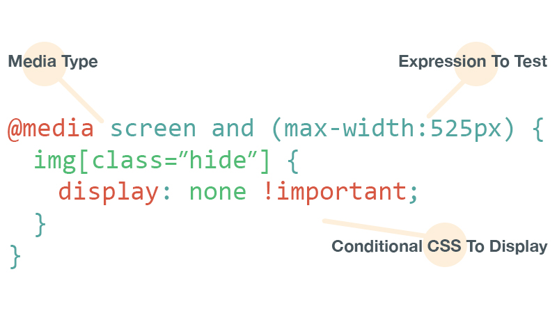
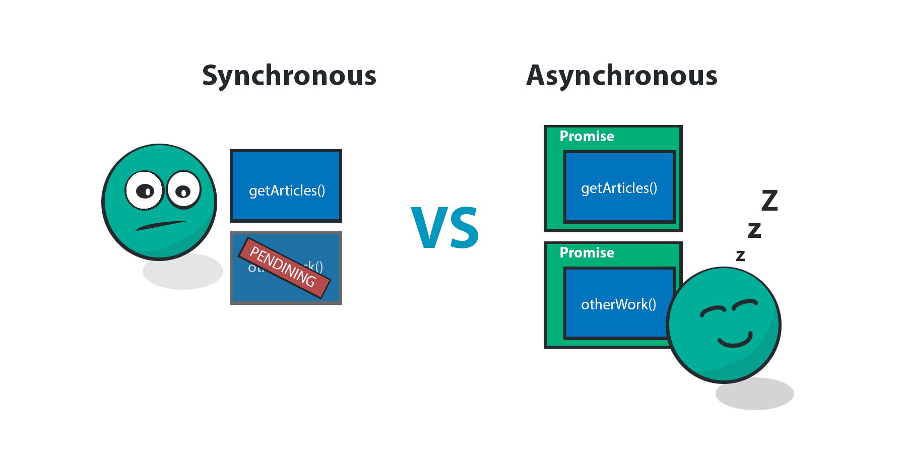

layout: true
class: center, middle
name: pic
background-size: contain

---

layout: true
class: center, top
name: fragment

.title[{{name}}]

---
layout: true
class: center, middle
name: base

.title[{{name}}]

---
name: CS52

* Today:
  * less javascript!
  * what was this starterpack thing?!
  * intro to react!

???


---
name: Sharing is Caring

* multiple:  https://dartmouth-cs52-18s.github.io/lab2-Teddarific/
* animal: https://dartmouth-cs52-18s.github.io/lab2-weilingx46/
* dartmouth:https://dartmouth-cs52-18s.github.io/lab2-thekevhu/
* calories: https://dartmouth-cs52-18s.github.io/lab2-amy-guan/
* sex: https://dartmouth-cs52-18s.github.io/lab2-stevenrchun/
* cheese: https://dartmouth-cs52-18s.github.io/lab2-alexandergbailey/
* blur effect: https://dartmouth-cs52-18s.github.io/lab2-epills/
* sports: https://dartmouth-cs52-18s.github.io/lab2-Jolenepb/
* war: http://war-fighter.surge.sh/
* kittens insta: https://dartmouth-cs52-18s.github.io/lab2-ckim18/
* snek: https://dartmouth-cs52-18s.github.io/lab2-j-mai/
* extra effects: https://dartmouth-cs52-18s.github.io/lab2-Moyo97/
* more puppies: https://dartmouth-cs52-18s.github.io/lab2-alexpetros/
* because tswift: https://dartmouth-cs52-18s.github.io/lab2-stopic13/

???


---
name: table questions

* Is materialUI the same as bootstrap?
* can you go over @media query and how it works

.medium[]

???
* device: print, screen, speech
* too many features to list
* can be very specific but generally best not over do it


---
name: SA3 StartPack


<iframe src='https://gfycat.com/ifr/DearestIllinformedBlackbird' frameborder='0' scrolling='no' width='440' height='520' allowfullscreen></iframe>

???
* questions?


---
name: quiz


???
* how did it go?


---
name: where in the stack


---
name: SASS

.medium[]

.left[
```css

.question {
  background-color: #95c34c;
}

.question h1 {
  font-size: 1.2em;
  color: #658534
}
```
]

.right[
```scss
$theme: #95c34c;

.question {
 background-color: $theme;
 h1 {
  font-size: 1.2em;
  color: darken($theme,10%);
 }
}
```
]


???
* preprocessor/transpiler - takes this better syntax and compiles it down to regular compatible css
* nesting,  variables, imports other stuff


---
name: babel

.fancy[]


???

* transpiles latest and greatest js into compatible old code
* also enables this thing called jsx which we'll be learning soon


---
name: eslint with airbnb style guide

.fancy[]

.fancy[]


???
* checks your bad code and makes it good
* fyi, semicolons are optional although i use them
* https://github.com/airbnb/javascript


---
name: webpack

<iframe src="//giphy.com/embed/3o84U6421OOWegpQhq?hideSocial=true" width="580" height="370" frameBorder="0" class="giphy-embed" allowFullScreen></iframe>

???


---
name:

.medium[]

```bash
babel app -d dist
uglify dist
sass app/sass:dist/css
# reload server / pages
```

???
* es6 transpilation
* sass compilation
* only necessary modules
* builds all the things for you!
* hot reloads modules - you change some js it can reload just that module.  


---
name:

.medium[]

???
* analyzes all import statements
* follows them and includes everything that is actually linked
* can do other stuff like delete unused code - tree shaking


---
name:

.left.fancy[]

.right.fancy[]

???
* nice clean bundle


---
name: webpack-serve

.medium[]

* just a local http server
  * picks up changes and builds
  * with magic reload-only-certain-modules powers
  * injects modules and css into page

???
* what is a potential downside of injecting css with javascript?


---
name: Deployment

.medium[]


???
* what is this deployment thing?
* act it out?


---
name: Deployment

* for production
  * need to build outputs to files
  * host static output files
  * would not be running webpack-serve

* ghpage and surge for static files


.small[]


???


---
name: Node NPM/yarn

* `yarn` is package manager
  * downloads js modules
  * uses `package.json` file to keep track of dependencies
  * can share project with `package.json` file
  * gitignore `node_modules`

.small[]

???
* package.json file allows other devs or Heroku to load your project
* no need to include the giant amounts of dependencies in your actual project git


---
name: node.js

.tiny[]


* Node.js is javascript interpreter without a browser
* used for server side processing
* used for desktop js apps like Atom
* webpack-serve is a Node app


.tiny[]


???
* we'll be using lots of node later for server side stuff


---
name: More event loop

.medium[]

???


---
name: asynchronous js

.fancy.medium[]

* some functions take time
  * making network requests (talking to a server)
  * any io really
  * or `setInterval / setTimeout`

???
* so far all the functions we have passed in have pretty much run instantly
* this is not always the case!
* setInterval


---
name: non-blocking


* java/python
  * when you run I/O functions
  * they block -- program does nothing while waiting
* javascript is non-blocking!
  * how it do?!

.fancy.medium[]


???
* javascript in your browser is basically single threaded - does one thing at a time
* how can you make that work fast?
* non-blocking - majority of functions that take time are asynch


---
name: Event Driven Programming

.fancy.medium[]


* application flow control driven by events/changes in state
* central mechanism that listens for events
* calls callback function once event is detected


???
* event driven programming is used when you have inputs that can come at any time - interrupts if you will
* you may have seen this dealt with as a game while loop - did that happen in 1/10?
* events trigger changes in state
* in js there is a built in event loop


---
name: Event Loop

.fancy.medium[]

???
* you've used this by registering an event with setTimeout/interval (doesn't have to be user input)
* we register an event listener
* so that on a particular event a function gets executed
* in a particular context (remember this)


---
name: ajax

.left[
* asynchronous javascript and XML
* people no longer really fetch xml/html
* JSON data format
]

.right[]

???
* can't load all data in world
* load js and then fetch data asynchronously into the page
* you click a button to "show more"
* you scroll and more data is loaded
* this is interactive content being loaded into the page
* but also,  your page doesn't stop scrolling just because you are waiting to load content


---
name: Why is this tricky?

```javascript
var data;       
$.ajax({
    url: 'http://api.something.com/all-datas',
    success: function( result ) {
        data = results;
        console.log( data );
    }
})
console.log( data );
//

```

???
* this uses jquery ajax for readability
* this is super common mistakes
* what is happening here?  


---
name: Vanilla ES5

```javascript
var xhttp = new XMLHttpRequest();
xhttp.onreadystatechange = function() {
  if (xhttp.readyState == 4 && xhttp.status == 200) {
   document.getElementById("demo").innerHTML = xhttp.responseText;
  }
};
xhttp.open("GET", "http://api.something.com/all-datas", true);
xhttp.send();
```

???

* now what if we needed to make further callbacks and requests based on the response?


---
name: ES6

```js
fetch('http://api.something.com/all-datas').then( data => {
  console.log(data)
})
```

???
* and now in es6 with fetch and promises


---
name: questions?

<iframe src="//giphy.com/embed/7cfBCpzyvkVs4" width="480" height="323" frameBorder="0" class="giphy-embed"></iframe>

???


---
name:


???
* an overview of different web architectures
* we'll go over these more in depth also
* static sites
  * just files, transmitted on the network
  * what we've been doing so far


---
name:


???
* server side rendering
  * server is running code
  * server constructs custom response for every page
  * uses template and results from database


---
name:


???
* single page app
  * 1 index html file that loads javascript
  * javascript then handles all content and urls
  * loads all content asynchronously and inserts into page
  * DOM manipulation + frontend framework
  * largely the architecture we'll be using


---
name:


???
* isomorphic app
  * does both server side rendering
  * AND javascript client side content fetching and display
  * this is useful in a few cases where say you want bots to read your page better or for SEO, so we'll learn about it but not have to inmplement it.


---
name:

.small[]

.medium[]


???
* ajax is how we talk to api's
* process by which a page loads new data via javascript rather than html

<!--http://stackoverflow.com/questions/25336156/how-to-immediately-invoke-jquery-upon-clicking-remote-link-in-rails-->
<!--https://realpython.com/blog/python/django-and-ajax-form-submissions-more-practice/-->


---
name:

.medium[]

???
* javascript modifying the page is powerful
* more ajax
  * page updates happen in background separate from full page loads
  * we will use JSON isntead of XML, but note that new html only happens once the data is fetched


---
name: apis

* http/s requests
  * GET, POST, etc
* return JSON format data
* [https://insomnia.rest/](https://insomnia.rest/)

.medium[]


???
* when people say apis'
* what they mean is:
  * a server that returns/mutates data
  * based on http get/post requests


---
name: brief frameworks history

.medium_small[]

* web v0: static HTML files only
* web v1: Common Gateway Interface (CGI)
  * URLs map to executable programs that return HTML
  * exits after returning page
  * stateless
  * original LAMP stack -- linux+apache+mysql+perl

```bash
perl -e 'print "<html>Hello World</html>"'
```

???
* cgi not computer-generated imagery
* frameworks help
* bash cgi
* server spits out full display html
```
echo "Content-type: text/html"
echo ""
echo '<html>'
```


---
name: 1st gen web frameworks

.tiny[]

* php, asp.net, java
* template: mix code and HTML
* web specific libraries:
  * url handling
  * html generation
  * sessions
  * database interfaces

```
<?php echo '<h1>Hello World</h1>'; ?>
```

???
* server side rendering
* language runtime directly in web server (faster)


---
name: 2nd gen serverside frameworks

.tiny[]

* Ruby on Rails, Django
* Model-View-Controller:
  * abstracted structure
* Object Relational Mapping (ORM):
  * simply database use
  * use objects instead of SQL

```ruby
def home
  @greeting = "howdy"
end
```

???
* note these all fit in to Server Side Rendering


---
name: 3rd gen serverside frameworks

.tiny[]

* Express, Flask, Sinatra
* lightweight
* optional mvc but less rigid
* module based rather than monolothic
  * ex: use any templating engine
* options vs the one way

```js
app.get('/', (req, res) => {
  res.send('hi');
});
```

???
* we'll use express later in the term
* somewhat more geared toward api than templating


---
name: 3rd gen frontend frameworks

.tiny[]


* AngularJS, Backbone
* clientside javascript frameworks
* handle dynamic data on frontend
* templates
* optional mvc
* rise of api architecture

```js
var AppView = Backbone.View.extend({
  template: _.template("<h3>Hello <%= who %></h3>"),
  render: function(){
    this.$el.html(this.template({who: 'world!'}));
  }
});
```


???
* some of these have gone through multiple generations themselves
* and then there is REACT!   4th gen!


---
name: MVC


???
* mvc is common code architecture pattern - specifically for uis
* model stores your datas, objects
* controller operates on the datas, the logic
* view presents it, webpage
* can be both frontend and backend
  * often both!
  * frontend for managing data objects loaded in browsers
  * server for database
  * servers views are JSON api (but very minimal mostly just controller)
* lots of alternatives mvvc mcp etc etc.  


---
name: Templating for Views

.medium[]

* all frameworks — end product html/css
* write html for parts of page that don't change
* code for dynamic parts
* execute template to fill in code parts


???
* benefits of templates
* designer friendly
* easy to test


---
name: mvc popular but

* invented in the 70s
* helps organize architecture
* modern applications need more scalability
* mvc can be heavy, too much data loaded, too many views


???
* we'll keep talking about mvc, more next week!
* BUT we're also going to move on to 4rth more modern tooling!


---
name:


???
* timeline of web frameworks
* you'd think webdev  has been around for a long time, but tooling keeps evolving rapidly


---
name:

.small[]

* enter REACT
* basic render function and virtual dom
* class components
* component state
* smart and dumb components

???
* facebook created
* Facebook (Partially)
* Instagram (Completely)
* Khan Academy (Partially)
* Codecademy (Partially)
* New York Times (Partially)
* Yahoo Mail (Completely)
* Dropbox's Carousel (Completely)


---
name: React

.medium_small.fancy[]

* V in MVC
* but actually more
  * super fast virtual dom
  * no more digging around

???
* tries to optimize the tedious digging around in the dom


---
name: Virtual DOM?

.medium_small.fancy[]


* isn't one DOM already enough?!?!
* DOM is slow
* Virtual DOM allows for faster DOM manipulation
* Virtual DOM simpler and faster
  * React diffs Virtual DOM and DOM
  * only updates what is changed


???
* dom trees are large, react component virtual tree is smaller
* saved unneccessary dom manipulation (state changes but don't need to rerender a lot of stuff)


---
name: tree diffs

* wouldn't comparing trees be expensive?
  * $O(n^{3})$ yes
  * but React does it in $O(n)$
* [reconciliation](https://reactjs.org/docs/reconciliation.html) heuristic

???
* heuristic O(n) algorithm
* assumption1: Two elements of different types will produce different trees.
* 2: developer can hint at which child elements may be stable across different renders with a key prop.
* https://reactjs.org/docs/reconciliation.html


---
name: dirty state

.medium[]


???
* when a components state changes via setState.
* when you run `setstate` it markes a node as dirty
* potentially rerendering the entire subtree but in practice is performant

*(img from [perfplanet](http://calendar.perfplanet.com/2013/diff/))*


---
name: rerendering

.medium[]


???


---
name: components

* React is component based:
  * encapsulated reusable containers
  * logic + rendering
  * no state in the DOM
* components:
  * have `state`
  * take in `props` as args
  * nested
  * can `render`

???
* we'll be talking a lot about component this component that
* everything is a component in react
* each node in virtual DOM is component
* trees on trees on trees


---
name: state old way

```javascript
$("button").on("click", function(button) {
  if(button.value=="OFF") {
      button.value="ON";
  } else {
      button.value="OFF";
  }
});
```

gross

???
* storing state in the DOM
* have to query for it if we want to know anything
* super gross
* slight exaggeration but still


---
name: state new way

```javascript
<button onClick={() => this.setState({ button: !button })} />
```

* prettier?

???
* fp principles
* each component has local state which is an object (dictionary/hashmap)
* has method `setState` to change it
* never mutate state directly without `setState`


---
name: JSX

```javascript
const aDivElement = <div className="foo" />;

const aComponent = <MyComponent someProperty={true} />;
```

* JSX is html-like syntax for defining react tree nodes
* create JS objects


???
* react components rendering is definied in JSX
* this is where babel comes in


---
name: component lifecycle


.medium[]

* `setState` and `setProps` are key
* methods that get called at different times during the life of the page


???
* components have lifecycle methods


---
name: down data flow

.medium_small[]

* parent components send data down as `props`
* children pass up actions in callbacks

???
* this can get a little tricky as you'll see
* but i believe in you, you'll practice and this will all become second nature to you - i know.
* buuut next week we'll learn how to manage that in larger apps
* need to refresh what a callback is?


---
name: dumb component

<p data-height="400" data-theme-id="24117" data-slug-hash="2a117cd9e89d119ff929e921eb280df1" data-default-tab="js,result" data-user="timofei" data-embed-version="2" data-editable="true" class="codepen">See the Pen <a href="http://codepen.io/timofei/pen/2a117cd9e89d119ff929e921eb280df1/">dumb component</a> by Tim Tregubov (<a href="http://codepen.io/timofei">@timofei</a>) on <a href="http://codepen.io">CodePen</a>.</p>


???
* also called functional
* just a function, takes props, spits back JSX


---
name: smart component

<p data-height="400" data-theme-id="24117" data-slug-hash="9cdfb283082fadae6152944f1f3ac506" data-default-tab="js,result" data-user="timofei" data-embed-version="2" data-editable="true" class="codepen">See the Pen <a href="http://codepen.io/timofei/pen/9cdfb283082fadae6152944f1f3ac506/">9cdfb283082fadae6152944f1f3ac506</a> by Tim Tregubov (<a href="http://codepen.io/timofei">@timofei</a>) on <a href="http://codepen.io">CodePen</a>.</p>

???
* es6 class based (doesn't have to be but better this way)
* knows state
* note, no poking of the DOM at all
* no selectors, no getlementbyanything, no setting html or css
* just state changes
* and outputs


---
name: tiny todo

<p data-height="400" data-theme-id="24117" data-slug-hash="4940f261bfe4feb77de31981597c4201" data-default-tab="js,result" data-user="timofei" data-embed-version="2" data-editable="true" class="codepen">See the Pen <a href="http://codepen.io/timofei/pen/4940f261bfe4feb77de31981597c4201/">mini todo</a> by Tim Tregubov (<a href="http://codepen.io/timofei">@timofei</a>) on <a href="http://codepen.io">CodePen</a>.</p>


???
* putting it all together


---
name:


???


---
name: Nexttime

* SA4 out
* More REACT!
* State management

???
