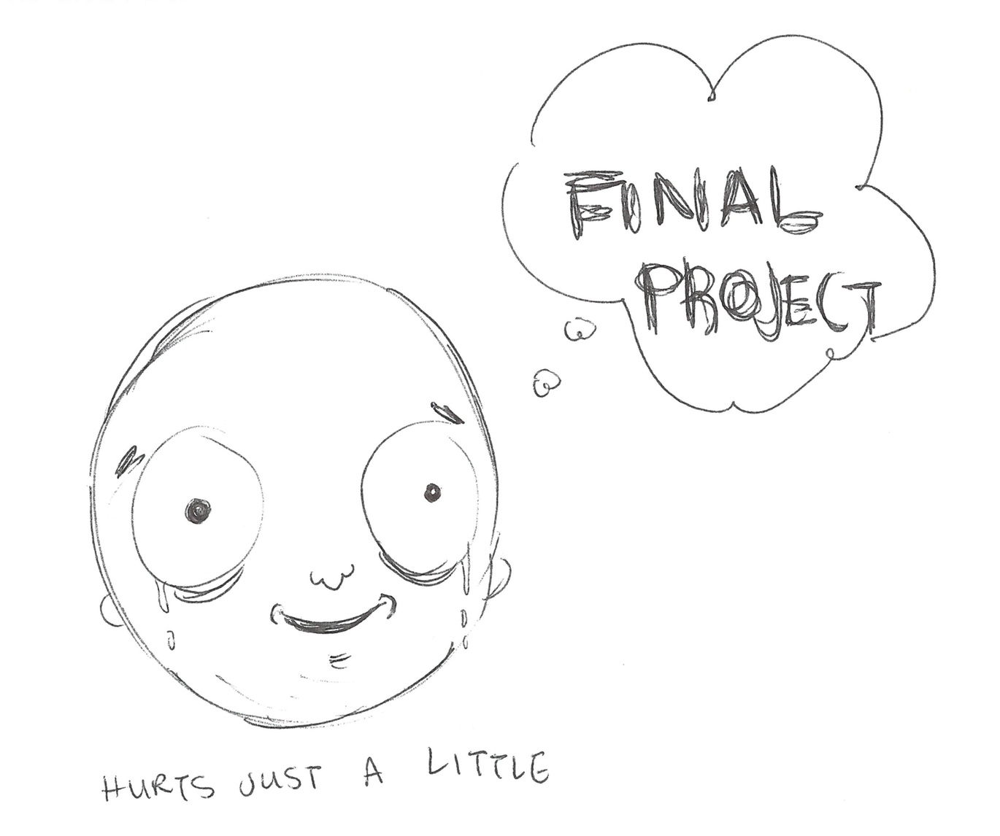
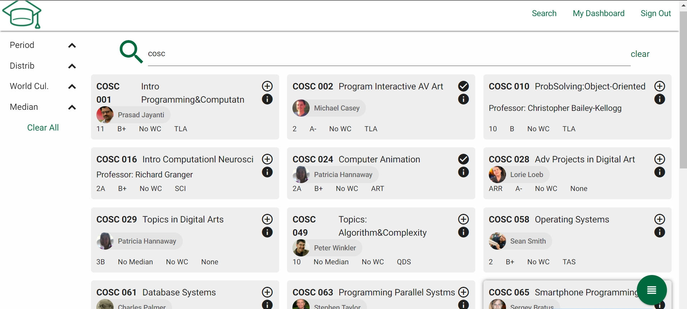
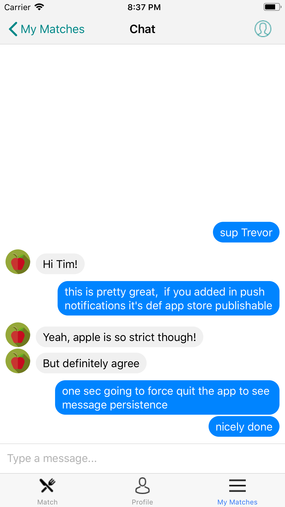

layout: true
class: center, middle
name: pic
background-size: contain

---

layout: true
class: center, top
name: fragment

.title[{{name}}]

---
layout: true
class: center, middle
name: base

.title[{{name}}]

---
name: Final Projects!

.medium_small[]

* last 3 weeks of class
* projects from scratch
  * libraries, frameworks, apis of course
* required components

???
* required components:
  * client and server
  * data persistence - basic create retrieve update delete
  * some reasonable complexity

---
name: Final Projects!

* previous final projects:
  * snapchat desktop clone
  * group.me realtime event planner
  * pong game finder/planner
  * virtual tour guide (mobile, fb messenger, admin portal)
  * lost and found app
  * airbnb for parking spaces
  * hackathon communication and planning platform

???
* a couple groups went all out and build both a react-native app and a web app

---
name: YipYip

<iframe style="transform: scale(0.5) translateY(-500px)" width="494" height="1010" src="//invis.io/HABOKZQRZ" frameborder="0" allowfullscreen></iframe>

---
name: full stack music

<iframe style="transform: scale(0.5) translateX(-850px) translateY(-500px) " width="1600" height="1000" src="http://prettymusicmaker.io/" frameborder="0" allowfullscreen></iframe>

---
name: mychef

<iframe style="transform: scale(0.8) translateX(-150px) translateY(-125px) " width="1000" height="700" src="http://mychef.surge.sh/" frameborder="0" allowfullscreen></iframe>

---
name: dart courses

---
name: dart courses

---
name: dart courses

---
name: dart courses

---
name: munch buddy

.left[]

.right[]

---
name: munch buddy

.left[]

.right[]

---
name: mafia

<iframe style="transform: scale(0.8) translateX(-150px) translateY(-125px) " width="1000" height="700" src="http://mafia.surge.sh/" frameborder="0" allowfullscreen></iframe>

---
name: lyfeontrack

<iframe style="transform: scale(0.8) translateX(-150px) translateY(-125px) " width="1000" height="700" src="http://lyfeontrack.surge.sh/" frameborder="0" allowfullscreen></iframe>

---
name: grouprr

<iframe style="transform: scale(0.8) translateX(-150px) translateY(-125px) " width="1000" height="700" src="http://grouprr.surge.sh/" frameborder="0" allowfullscreen></iframe>

???
* better splitwise

---
name: roommate finder

<iframe style="transform: scale(0.8) translateX(-150px) translateY(-125px) " width="1000" height="700" src="http://roommate-finder.surge.sh/" frameborder="0" allowfullscreen></iframe>

???
* better splitwise

---
name: Dates:

* Pitches (5/1, 5/2, 5)
* Groups Formed (5/4)
* Feature Spec + Mockups (5/8)
* Scaffolding (5/14)
* Dev Site Up (client+server) (5/17)
* Pre-demo Bug Hug (5/24)
* Final Project Demos (5/30)
* Final Submission (6/5)

???
* trying so that we have plenty of time for This
* start thinking about ideas,  talk to me about scope

---
name: Pitches

 .fancy.medium[]

* submit idea to pitch, individually or in pairs

???
* This will be your chance to submit an idea that you would like to pitch.  As the person submitting the idea you'll need to think a little bit about scope and feasibility.
* just need to know how many so we can have enough time for it

---
name: Pitch Presentations

 .fancy.medium[]

* 2 minute MAX presentation with 2 minutes Q&A
* can do in pairs if you want
* groups (of 5) formed by ranking favorite ideas
* also who you prefer working with

???
* A 2 minute presentation with 2 minutes of Q&A to pitch your idea to the class
* Everybody will rank their top choices and groups will be formed that way.
* group dynamics matter - will try to help make sure your groups are all a success
* last time no group was left behind!

---
name: Feature Spec + Mockups

 .fancy.medium[]

* terse walk-though of project
* from users perspective
* terse listing of features
* terse+memorable user personas
* mockups/sketches

???
* A walk-though of your project from the users perspective listing out every feature that it should have
* a few user stories attached
* mockups of user experience.

---
name: Scaffolding

 .fancy.medium[]

* initial code scaffolding
* tools and frameworks chosen
* team has local dev environment set up

???
* Initial code scaffolding started
* component plan
* tools and frameworks chosen
* everybody has local dev environment set up

---
name: Dev Site Up (client+server)

 .fancy.medium[]

* dev site up
* basic flow in place:
  * db ⇆ server api ⇆ frontend

???
* Dev site goes live allowing people to see basic flow (components hitting api endpoints pulling data from database).
* initial wiring is in place so things are talking to each other

---
name: Pre-Demo Bug Hunt

<iframe src="//giphy.com/embed/VBVY9IJKDxwHK?hideSocial=true" width="242.8571428571429" height="380" frameBorder="0" class="giphy-embed" allowFullScreen></iframe>

* week prior to final demos!
* bug bounty!
* git issues
* PRs

???
* In class session of breaking each others projects to reveal bugs and give last minute feedback.
*  We'll offer bug rewards in the form of snacks!
* Bugs will need to be submitted in the form of git issues on each others repositories
* PR's are extra credit!

---
name: Final Project Demos

 .fancy.medium[]

* open to public!
* motivate idea, show in action, discuss challenges
* user testing

???
* Final presentation of project. Open to public.
* Motivate the idea, show it in action, discuss challenges
* will be in hanover inn ballroom!
