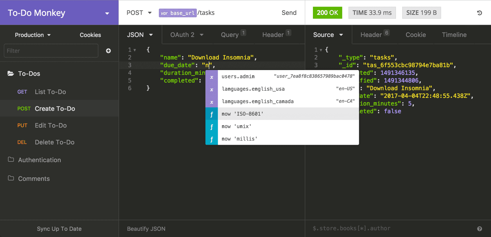
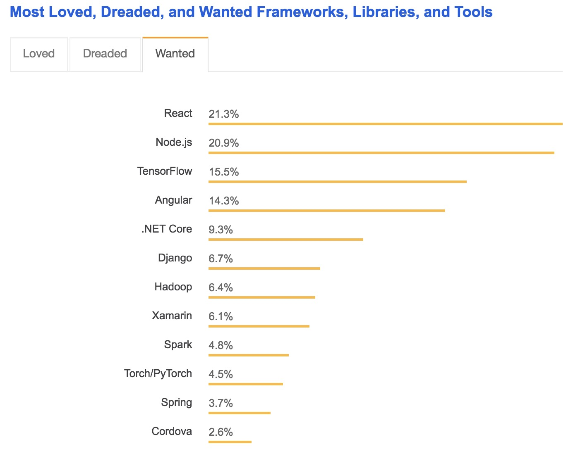

name: pic
layout: true
class: center, middle
background-size: contain

---
name: fragment
layout: true
class: center, top

.title[{{name}}]

---
name: base
layout: true
class: center, middle

.title[{{name}}]


---
name: CS52 Today's Menu


* Site Architecture Basics
* All the React


.medium[]

???
* heading into week 4 yaaay
* questioons commments concerns?


---
name: static sites


???
* an overview of different web architectures
* we'll go over these more in depth also
* static sites
  * just files, transmitted on the network
  * what we've been doing so far


---
name: server side rendered


???
* server side rendering
  * server is running code
  * server constructs custom response for every page
  * uses template and results from database


---
name: spa


???
* single page app
  * 1 index html file that loads javascript
  * javascript then handles all content and urls
  * loads all content asynchronously and inserts into page
  * DOM manipulation + frontend framework
  * largely the architecture we'll be using


---
name: isomorphic


???
* isomorphic app
  * does both server side rendering
  * AND javascript client side content fetching and display
  * this is useful in a few cases where say you want bots to read your page better or for SEO, so we'll learn about it but not have to inmplement it.


---
name:

.small[]

.medium[]


???
* ajax is the concept of how we talk to api's
* process by which a page loads new data via javascript rather than html

<!--http://stackoverflow.com/questions/25336156/how-to-immediately-invoke-jquery-upon-clicking-remote-link-in-rails-->
<!--https://realpython.com/blog/python/django-and-ajax-form-submissions-more-practice/-->


---
name:

.medium[]

???
* javascript modifying the page is powerful
* more ajax
  * page updates happen in background separate from full page loads
  * we will use JSON isntead of XML, but note that new html only happens once the data is fetched


---
name: apis

* http/s requests
  * GET, POST, etc
* return JSON format data
* [https://insomnia.rest/](https://insomnia.rest/)

.medium[]


???
* what does api mean?  application programming interface
* when people say apis'
* what they mean is:
  * a server that returns/mutates data
  * based on http get/post requests
* often companies have public apis - allowing developers to interact with their datas
* but also private apis whereby their own data is available to an ecosystem of own apps etc


---
name: React.js


.medium[]

.medium[]

???
* wait backup - we're still in frontend mode
* course description said: how to make powerful - extensible - modern web apps
* used by everyone
* made by facebook
* large open source community


---
name: why react?


.medium[]


* https://insights.stackoverflow.com/survey/2018/


---
name: why react?


.medium[]


* https://insights.stackoverflow.com/survey/2018/


---
name: why react?


.medium[]


* https://stateofjs.com/


---
name: React Onwards and Upwards

.small[]


* `fn(data) = View`
* UI is a function of your state
* props are to components what arguments are to functions


???
* why revolutionary?
* view as a pure function of data
* we'll be talking a lot about component this component that
* everything is a component in react
* each node in virtual DOM is component
* trees on trees on trees


---
name: old way

```javascript
$("button").on("click", function(button) {
  if(button.value=="OFF") {
      button.value="ON";
  } else {
      button.value="OFF";
  }
});
```

gross

???
* gross and a gross exaggeration
* storing state in the DOM
* or a slew of global variables
* have to query for it if we want to know anything
* super gross


---
name: new way

.small[]


```js
<button enabled={this.state.button} onClick={
  () => this.setState({ button: !button })
} />
```

* prettier?

???
* ok not yet mind blowing - bad example
* fp principles
* each component has local state which is an object (dictionary/hashmap)
* has method `setState` to change it
* never mutate state directly without `setState`


---
name: More React

```html
<div className="red">let's talk SA4 and React!</div>
```
```js
React.createElement("div", { className: "red" },
  "let's talk SA4 and React!"
);
```

.tiny[]


???
* confused is good, we're going to go over everything
* this can be react - well jsx
* who's confused about JSX?
* javascript XML
* syntax for defining views in render


---
name: JSX

```js
const aDivElement = <div className="foo" />hi</div>;
//or
React.createElement("div", { className: "foo" }, "hi");

const aComponent = <MyComponent someProperty={true} />;
//or
React.createElement(MyComponent, { someProperty: true });

```

* JSX is html-like syntax for defining react tree nodes
* instantiate your components for fun and profit!


???
* react components rendering is defined in JSX
* what enables us to use this nice syntax?  babel


---
name:

.medium[]

???
* now that you are all jquery masters
* with jquery you can change stuff on the page but your code logic doesn't necessarily know anything about it
* lab2 vs lab3
* react simplifies things
* we'll build like 5 react apps in the coming weeks so don't worry if its all a bit confusing
* state isn't hidden in many components requiring you to read state and then change stuff
* change state -> render, repeat
* not a render loop


---
name: Data Binding


 * connection between application UI and business logic
 * when data changes value the elements that are bound to the data reflect changes
 * most UI frameworks have some form of data binding

```html
<input type="text" value={username}>
```
↕️ ↕️ ↕️
```js
var username = '';
```

???
* concept evolved in more complex frameworks than jquery (angular say)
* you have some data - and you have some display - how to make it easier to work together
* idea was what if a UI display could be directly tied to the persistent value in your code
* if one changes so does the other
* at least two types


---
name: Two Way


???
* two way data binding
* data model changes so does view
* view changes so does data model
* ember and angular have 2-way data binding


---
name: One Way


???
* driven by state
* an event updates the state
* not automatic


---
name: Nope

.medium_small[]


???
* ok maybe not


---
name: Bindings

.medium_small[]


???
* here's another view of this
* critical difference is that with two-way - there is no explicit event, it just updates the value
* boom value is different, did you happen to notice? no? ok bye.
* theoretically you could code the 'watchers' to trigger events, but it does add complexity
* since each variable that is bound is independent, then have to manually remember to update dependent stuff if necessary


---
name:


???

* from https://docs.google.com/presentation/d/1afMLTCpRxhJpurQ97VBHCZkLbR1TEsRnd3yyxuSQ5YY/edit#slide=id.g380053cce_125
* here' we'll illustrate another difference between the react way and others


---
name:


???


---
name:


???


---
name:


???


---
name:


???
* this is all to say that 2 way data binding
* is like globals and sideffects. shit can get messed up


---
name: Some React Postulates

1. Managing state is treacherous
1. Two-way bindings are evil
1. Data mutations can be tricky


???
* state:
  * what radio button was clicked
  * what is being displayed etc
* transparency: effects of a code change should be limited/local
  * or at least **easy to reason about**
  * Also a useful concept regarding state change
  * Two-way bindings open Pandora’s box:
    * No easy way of knowing how far-reaching a change in the reverse direction is going to be
* **mutable state and sideeffects are not transparent**
* hard to test
* what if you needed to compute somethings or validate something on that data


---
name:


???
* react's solution - all state changes are events
* you run setState and it only affects shit downriver


---
name:


???
* so drink the koolaid that is react and know that the river of data is clean


---
name: What is this I hear about Virtual DOM?

.medium_small.fancy[]


* isn't one DOM already enough?!?!
* normal DOM traversal is slow
* Virtual DOM allows for faster DOM manipulation
* Virtual DOM simpler and faster
  * React diffs Virtual DOM and DOM
  * only updates what is changed


???
* what is the DOM again? document object model - a tree of html elements
* to be able to efficiently manage the display of your complex view
* react builds up a virtual DOM tree
* dom trees are large, react component virtual tree is smaller
* saved unneccessary dom manipulation (state changes but don't need to rerender a lot of stuff)


---
name: tree diffs

* wouldn't comparing trees be expensive?
  * $O(n^{3})$ yes
  * but React does it in $O(n)$
* [reconciliation](https://reactjs.org/docs/reconciliation.html) heuristic

???
* heuristic O(n) algorithm
* assumption1: Two elements of different types will produce different trees.
* 2: developer can hint at which child elements may be stable across different renders with a key prop.
* https://reactjs.org/docs/reconciliation.html


---
name: dirty state

.medium[]


???
* when a components state changes via setState.
* when you run `setstate` it markes a node as dirty
* potentially rerendering the entire subtree but in practice is performant

*(img from [perfplanet](http://calendar.perfplanet.com/2013/diff/))*


---
name: rerendering

.medium[]


???
* actually a bit better than shown here
* you can indicate that nodes are stable and unchanged via the codes


---
name: Thinking In React

.medium[]

1. Start with a mock
???
1. mock: features + data
--
name: Thinking In React
1. Break the UI into a component hierarchy
???
1. components: single responsibility
--
name: Thinking In React
1. Build a static version in React
???
1. static version: render methods with data (props, no state)
--
name: Thinking In React
1. Identify the minimal (but complete) representation of UI state
???
1. state:  minimal set of mutable state that your app needs
--
name: Thinking In React
1. Identify where your state should live: renders by state,  common owner / or create one
???
1. which component mutates/owns the state
--
name: Thinking In React
1. Add inverse data flow
???
1. Add inverse data flow: explicit events for changing state
--
name: Thinking In React
1. Style it
--
name: Thinking In React
1. Ship it
???
1. profit


---
name:

.medium[]


???
* sa4 yay
* components are:
   * composable (nestable)
   * reusable (cause props)
* unidirectional (rerenders everything in component)
* hint: think reusable: generic input bar vs youtube searchbar


---
name:

.medium[]


???
* lets talk components
* searchbar is smart because its driven, doesn't have to be but better when it is
* data flows down
* events are passed up


---
name: local state


.medium[]

???
* state internal to a component
* can be passed down to children as props


---
name: local state


???
* we had local state somewhere else in sa4?
* yeah top level app component


---
name: props


.medium[]

???
* pass an event up to change state in parent

---
name: parent state


???
* create function that runs setState in parent smart container
* pass function down to children who can run it


---
name: state summary


.medium[]


???
* props
  * are passed in
  * defined on initialization
  * immutable inside component
* state
  * internal to component
  * modified only through setState
  * where modified is really set to new state
  * we'll see later why this is important


---
name:

```javascript
const SmallComponent = (props) => {
  return (
    <li onClick={props.onClick}>
      <div>{props.person.display_name}</div>
    </li>
  );
};
```

```javascript
class ParentComponent extends Component {
  handleClick = () => {console.log('clicked')}

  const list = this.props.people.map( person => {
    return <SmallComponent person={person} onClick={this.handleClick}/>
  });

  render() {\
    return <ul> {list} </ul>;
  }
};
```


???
* simplified example, why is parentComponent a bad example?
* doesnt' do anything useful with click event
* should run setState


---
name: component lifecycle

.medium[]


???

* *from: http://code.tutsplus.com/tutorials/intro-to-the-react-framework--net-35660*


---
name: React Drawbacks

* NONE
  * long props chains
  * component separation
  * input fields a little annoying

???
* but we'll fix most of this next week with Redux
* the answer to state management everywhere
* more and more framework are adopting the state first reactive approach


---
name: State Details

```javascript
//initialize State
this.state = {video: null}
```

```javascript
//set new state once video fetched
this.setState({video: new_video});
```

```javascript
render() {
  if (!this.state.video) { return <div>loading</div>; }

  return (
    <div>this.state.video.name</div>
  );
}
```


???
* react state is internal to component
* should be modified only through setState
* where modified is really set to new state
* we'll see later why this is important
* but generally if you modify it otherwise react won't know about it and won't update


---
name: expanded component lifecycle


.medium[]


???
* you'll find this helpful later i promise


---
name: dumb component

<p data-height="400" data-theme-id="24117" data-slug-hash="2a117cd9e89d119ff929e921eb280df1" data-default-tab="js,result" data-user="timofei" data-embed-version="2" data-editable="true" class="codepen">See the Pen <a href="http://codepen.io/timofei/pen/2a117cd9e89d119ff929e921eb280df1/">dumb component</a> by Tim Tregubov (<a href="http://codepen.io/timofei">@timofei</a>) on <a href="http://codepen.io">CodePen</a>.</p>


???
* also called functional
* just a function, takes props, spits back JSX


---
name: smart component

<p data-height="400" data-theme-id="24117" data-slug-hash="9cdfb283082fadae6152944f1f3ac506" data-default-tab="js,result" data-user="timofei" data-embed-version="2" data-editable="true" class="codepen">See the Pen <a href="http://codepen.io/timofei/pen/9cdfb283082fadae6152944f1f3ac506/">9cdfb283082fadae6152944f1f3ac506</a> by Tim Tregubov (<a href="http://codepen.io/timofei">@timofei</a>) on <a href="http://codepen.io">CodePen</a>.</p>

???
* es6 class based (doesn't have to be but better this way)
* knows state
* note, no poking of the DOM at all
* no selectors, no getlementbyanything, no setting html or css
* just state changes
* and outputs


---
name: tiny todo

<p data-height="400" data-theme-id="24117" data-slug-hash="4940f261bfe4feb77de31981597c4201" data-default-tab="js,result" data-user="timofei" data-embed-version="2" data-editable="true" class="codepen">See the Pen <a href="http://codepen.io/timofei/pen/4940f261bfe4feb77de31981597c4201/">mini todo</a> by Tim Tregubov (<a href="http://codepen.io/timofei">@timofei</a>) on <a href="http://codepen.io">CodePen</a>.</p>


???
* putting it all together
