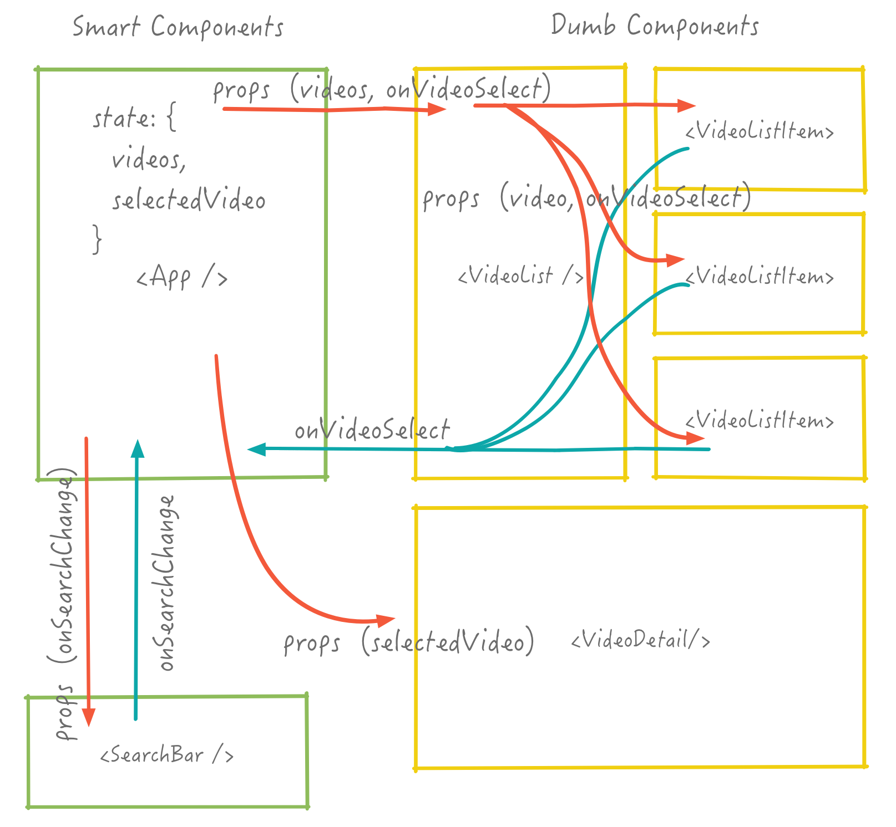
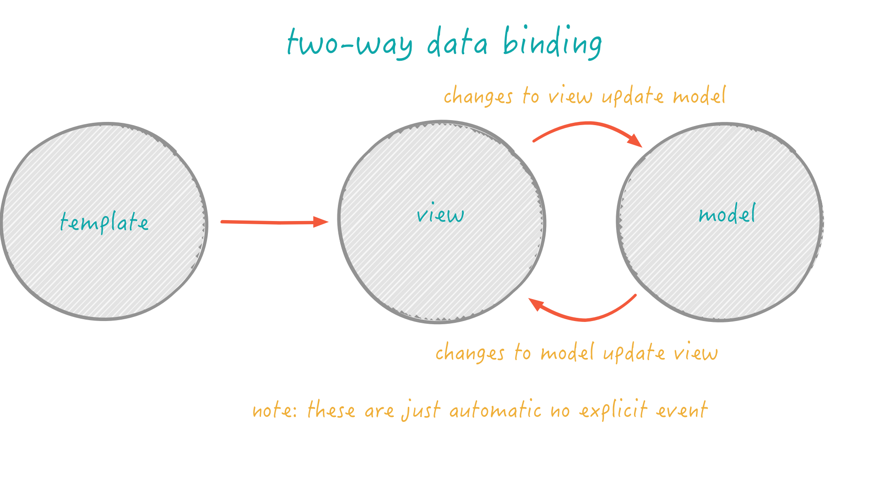
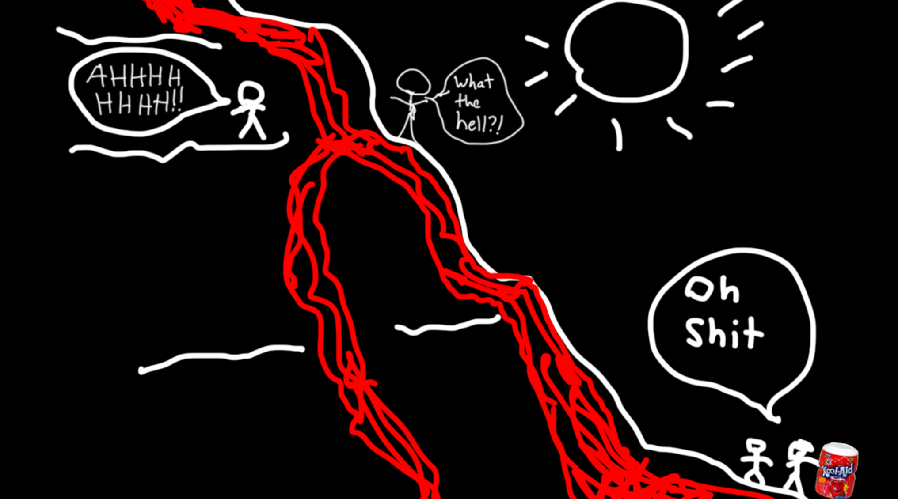

name: pic
layout: true
class: center, middle
background-size: contain

---
name: fragment
layout: true
class: center, top

.title[{{name}}]

---
name: base
layout: true
class: center, middle

.title[{{name}}]

---
name:  More React

---
name: On the Menu


* More React
* Canvas


???


---
name: Administrivia

* quizzes

???
* don't be worry


---
name: More React

* let's talk SA4!

???
* confused is good, we're going to go over everything


---
name:

{: .medium}


???
* based on state and props
* composable (nestable)
* reusable (cause props)
* unidirectional (rerenders everything in component)
* youtube searchbar vs generic reusable


---
name:

{: .medium .white-background}


???
* lets talk components
* searchbar is smart because its driven, doesn't have to be


---
name: component


{:  .white-background}

???
* based on state and props
* composable (nestable)
* reusable (cause props)
* unidirectional (rerenders everything in component)


---
name: component


{:  .white-background}

???
* based on state and props
* composable (nestable)
* reusable (cause props)
* unidirectional (rerenders everything in component)


---
name: Props

{: .medium .white-background}


???
* props
  * are passed in
  * defined on initialization
  * immutable
* state
  * internal to component
  * modified only through setState
  * where modified is really set to new state
  * we'll see later why this is important


---
name:

```javascript
const SmallComponent = (props) => {
  return (
    <li>
      <div>props.person.display_name</div>
      <div>props.person.phone</div>
    </li>
  );
};
```

```javascript
const ParentComponent = (props) => {
  const list = props.people.map( person => {
    return <SmallComponent person={person} />
  });

  return (
      <ul>
        {list}
      </ul>
    );
};
```


???
* props are passed in
* defined on initialization
* immutable
* can be callbacks


---
name: component lifecycle

{: .medium .white-background}


???

* *from: http://code.tutsplus.com/tutorials/intro-to-the-react-framework--net-35660*


---
name: State

```javascript
//initialize State
this.state = {video: null}
```

```javascript
//set new state once video fetched
this.setState({video: new_video});
```

```javascript
render() {
  if (!this.state.video) { return <div>loading</div>; }

  return (
    <div>this.state.video.name</div>
  );
}
```


???
* internal to component
* modified only through setState
* where modified is really set to new state
* we'll see later why this is important


---
name: expanded component lifecycle


{: .hfit}


???


---
name:

{: .hfit}

???
* i know we havne't done much jquery
* but here's a little bit of why react simplifies things
* we'll build like 5 react apps in the coming weeks so don't worry if its all a bit confusing
* it'll get worse before it gets better with Redux


---
name: Data Binding


 * establishes a connection between the application UI and business logic
 * when data changes value the elements that are bound to the data reflect changes
 * most UI frameworks have some form of data binding


???


---
name:

{: .hfit .white-background}


???
* two way data binding
* data model changes so does view
* view changes so does data model
* ember and angular have 2-way data binding


---
name:

{: .hfit .white-background}


???


---
name:

{: .hfit .white-background}


???
* *img from stackoverflow*


---
name:

{: .hfit }

???

* from https://docs.google.com/presentation/d/1afMLTCpRxhJpurQ97VBHCZkLbR1TEsRnd3yyxuSQ5YY/edit#slide=id.g380053cce_125


---
name:

{: .hfit }

???


---
name:

{: .hfit }

???


---
name:

{: .hfit }

???


---
name:

{: .hfit }

???
* this is all to say that 2 way data binding
* is like globals and sideffects. shit can get messed up


---
name: Some React Postulates

1. Managing state is treacherous
1. Two-way bindings are evil
1. Data mutations can be tricky


???
* state: what radio button was clicked, what is being displayed etc
* transparency: effects of a code change should be limited/local, or at least easy to reason about
  * Also a useful concept regarding state change
  * Two-way bindings open Pandora’s box:
    * No easy way of knowing how far-reaching a change in the reverse direction is going to be
* mutable state and sideeffects are not transparen
* hard to test


---
name:

{: .hfit }


???


---
name:

{: .hfit }

???


---
name: React Drawbacks

* long props chains
* component separation
* input fields a little annoying

???
* but we'll fix most of this next week with Redux
* the answer to state management everywhere


---
name: Thinking In React


<ol>
    <li class="fragment">Start with a mock</li>
    <li class="fragment">Break the UI into a component hierarchy</li>
    <li class="fragment">Build a static version in React</li>
    <li class="fragment">Identify the minimal (but complete) representation of UI state</li>
    <li class="fragment">Identify where your state should live</li>
    <li class="fragment">Add inverse data flow</li>
    <li class="fragment">Style it</li>
    <li class="fragment">Ship it</li>
</ol>


???
1. mock: features + data
  * mock objects
1. components: single responsibility
1. static version: render methods with data (props, no state)
1. state:  minimal set of mutable state that your app needs
1. which component mutates/owns the state:
  * renders by state
  * common owner / or create one
1. Add inverse data flow: explicit events for changing state
1. profit


---
name: Canvas and SVG

* direct drawing control
* in browser games
* complex visualizations

???


---
name: Scalable Vector Graphics (SVG)


* vectors
* Text, lines, curves, filled shapes
* Rotations, transparency, gradients
* DOM objects, js modifiable
* create in Illustrator, Inkscape, etc

```html
<svg height="100" width="100">
  <circle cx="25" cy="25" r="15" stroke="green" fill="white" stroke-width="5"/>
</svg>
```

???
* https://css-tricks.com/using-svg/


---
name: SVG

<p data-height="378" data-theme-id="24117" data-slug-hash="bGyoz" data-default-tab="html,result" data-user="chriscoyier" data-embed-version="2" data-editable="true" class="codepen">See the Pen <a href="http://codepen.io/chriscoyier/pen/bGyoz/">Basic Example of SVG Line Drawing, Backward and Forward</a> by Chris Coyier (<a href="http://codepen.io/chriscoyier">@chriscoyier</a>) on <a href="http://codepen.io">CodePen</a>.</p>


???


---
name: SVG


<p data-height="305" data-theme-id="24117" data-slug-hash="evcBu" data-default-tab="html,result" data-user="chriscoyier" data-embed-version="2" data-editable="true" class="codepen">See the Pen <a href="http://codepen.io/chriscoyier/pen/evcBu/">SVG with Filters</a> by Chris Coyier (<a href="http://codepen.io/chriscoyier">@chriscoyier</a>) on <a href="http://codepen.io">CodePen</a>.</p>

???


---
name: Canvas

* pixel output
* alternative to SVG
* drawing in JS
* 3D support - webGL


???


---
name: Canvas

<p data-height="300" data-theme-id="24117" data-slug-hash="EApqr" data-default-tab="html,result" data-user="SitePoint" data-embed-version="2" data-editable="true" class="codepen">See the Pen <a href="http://codepen.io/SitePoint/pen/EApqr/">Canvas Line Example</a> by SitePoint (<a href="http://codepen.io/SitePoint">@SitePoint</a>) on <a href="http://codepen.io">CodePen</a>.</p>

???


---
name: Canvas

<p data-height="370" data-theme-id="24117" data-slug-hash="zvZaNE" data-default-tab="js,result" data-user="jurbank" data-embed-version="2" data-editable="true" class="codepen">See the Pen <a href="http://codepen.io/jurbank/pen/zvZaNE/">Basic motion with JavaScript</a> by John Urbank (<a href="http://codepen.io/jurbank">@jurbank</a>) on <a href="http://codepen.io">CodePen</a>.</p>

???


---
name: Canvas

<p data-height="300" data-theme-id="24117" data-slug-hash="bdwvMo" data-default-tab="js,result" data-user="jackrugile" data-embed-version="2" data-editable="true" class="codepen">See the Pen <a href="http://codepen.io/jackrugile/pen/bdwvMo/">Rainbow Grid</a> by Jack Rugile (<a href="http://codepen.io/jackrugile">@jackrugile</a>) on <a href="http://codepen.io">CodePen</a>.</p>

???
* canvas example


---
name: Canvas with webGL

<p data-height="429" data-theme-id="24117" data-slug-hash="BNNGBq" data-default-tab="result" data-user="Yakudoo" data-embed-version="2" data-editable="true" class="codepen">See the Pen <a href="http://codepen.io/Yakudoo/pen/BNNGBq/">Mighty fish</a> by Karim Maaloul (<a href="http://codepen.io/Yakudoo">@Yakudoo</a>) on <a href="http://codepen.io">CodePen</a>.</p>

???


---
name: Workshop!

[cs52.me/assignments/sa4](/assignments/sa4)


???


---
name: Nexttime

* SA4 out, due Thurs!
* More REACT!
* State management

???
