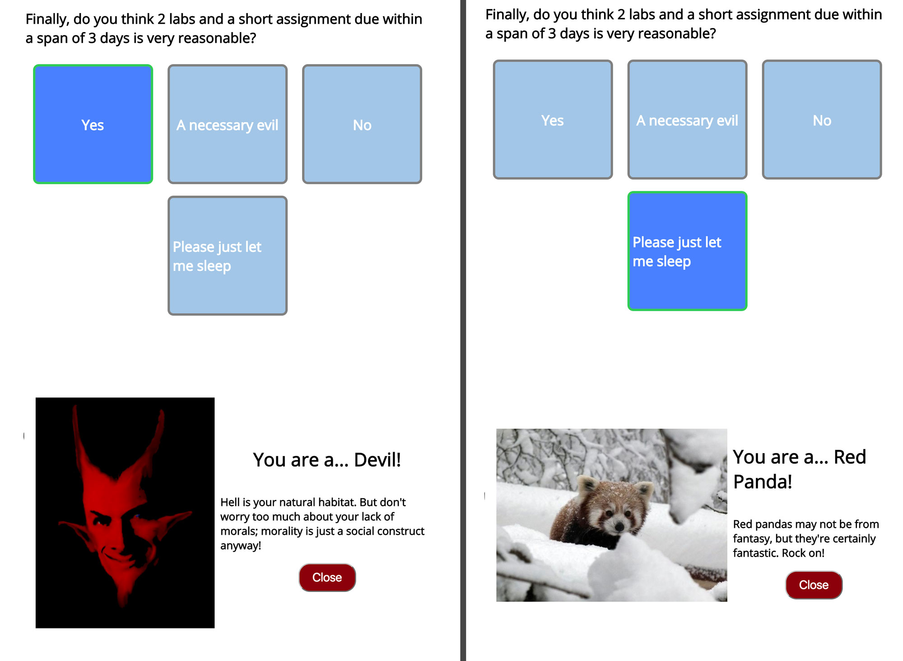
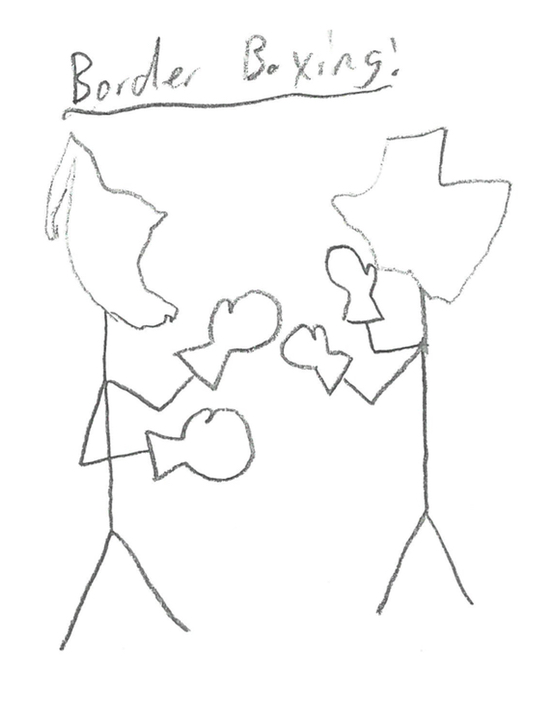
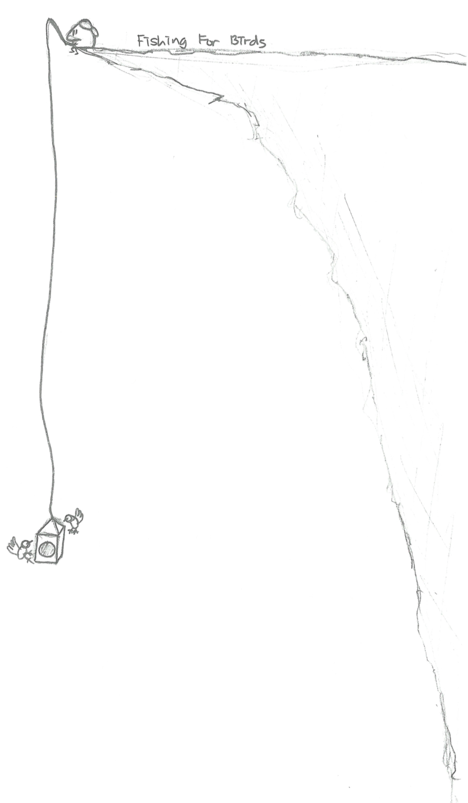
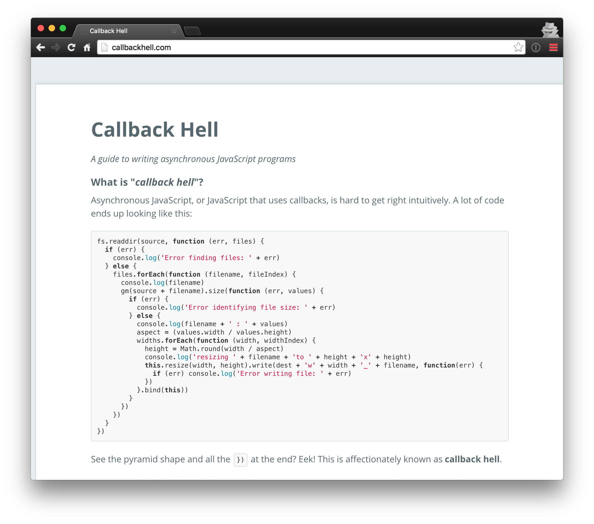
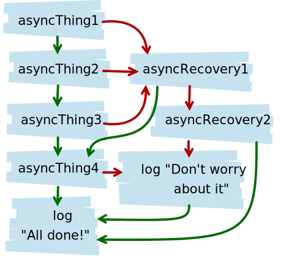

layout: true
class: center, middle
name: pic
background-size: contain

---

layout: true
class: center, top
name: fragment

.title[{{name}}]

---
layout: true
class: center, middle
name: base

.title[{{name}}]


---
name: CS52 A Little More JS!

* callbacks
* promises
* immutable data structures


<iframe width="540" height="380" src="https://www.youtube.com/embed/otCpCn0l4Wo?start=15&amp;controls=0&amp;showinfo=0" frameborder="0" allowfullscreen></iframe><br>

???
* callbacks
* promises
* immutable data structures
* once created can't be touched
  * ie modified  


---
name: Javascript Fatigue

[](https://medium.com/@pistacchio/i-m-a-web-developer-and-i-ve-been-stuck-with-the-simplest-app-for-the-last-10-days-fb5c50917df#.imprd0m6d)

.medium[]

???
* so if you are confused, thats ok, the whole world is confused about webdev!
* proliferation of technologies
* everybody trying to fix the problem different ways
* new standards coming out all the time
* but we've got the worlds most desired stack
  * best practices as of this year


---
name: Too much? NEVER

.medium[]


???
*


---
name: Table Questions

* how do you decide how many components there should be?

.medium[]

???
* anything reussable
* anything that stores data
* anything that encapsultes other things


---
name: Drawing On Point

.left[
.tiny[]
.tiny[]
.tiny[]
.tiny[]
]

.right[
.medium_small[]
.medium[]
]


???
* drawing game has stepped up
* useful illustrations!
* i think maybe there should be some tiny extra credit associated with this - please sign your artwork from now on
* as they come in i'll illustrate more and more, you are contributing to the future of the class


---
name: Callbacks


.medium[]

???
* what is this callback thing


---
name: Callbacks Are Like Minions

<iframe src="//giphy.com/embed/iUOzkJmvnFfqM?hideSocial=true" width="480" height="270" frameBorder="0" class="giphy-embed" allowFullScreen></iframe>

```js
minionHandleClick = (event) {
  this.setState({lastclicked: event.target })
}
<Component onClick=(minionHandleClick) />
```
???
* fyi in a class this is an experimental syntax you can [enable](http://babeljs.io/docs/plugins/transform-class-properties/)
* you give them a task and they run off to do it

---
name: Callbacks?Asynchronous?Non-blocking?

* Minions
  * tell them what to do
  * they do it and come back later
  * you don't wait for them

<iframe src="//giphy.com/embed/uBuzWfwVcadRC?hideSocial=true" width="480" height="307.2" frameBorder="0" class="giphy-embed" allowFullScreen></iframe>

???

---
name: Minions Can Call A Friend

<iframe src="//giphy.com/embed/PskgQUtRwqggg?hideSocial=true" width="410" height="200" frameBorder="0" class="giphy-embed" allowFullScreen></iframe>

```js
kevin = (error, results) => {
  if (error) { return console.log(error) }
  // want to do folloup
  someOtherFollowupTask((error, results) => {
    if (error) { return console.log(error) }
    //Do something with Results here
  });
}
someTask(kevin);

```

???
* minions can call other Minions
* here we have a named minion and an anonymous minion
* where are error and results coming from?

---
name: Tasks that only a minion can do

<iframe src="//giphy.com/embed/13FznCEnWSiUfK?hideSocial=true" width="480" height="259.9384615384615" frameBorder="0" class="giphy-embed" allowFullScreen></iframe>

```js
fetchMeBeer = (minion) => {
  // do something that takes a long time
  fetch(beer).then( beer => {
    minion(null, beer)
  }).catch(error => {
    minion(`sorry boss, ${error}`, null)
  });
}
```

???
* oooh some new notation here, promises


---
name: A world without Minions/Callbacks

<iframe src="//giphy.com/embed/sgmmPgR8C1O2A?hideSocial=true" width="480" height="270.42253521126764" frameBorder="0" class="giphy-embed" allowFullScreen></iframe>

* nothing would happen in the right order
* or everything would block

???

* lot of syntax but remember the concepts too


---
name: Callback Hell!

.left[

* lots of nested callbacks
* unwieldy
]
.right[<iframe src="//giphy.com/embed/mGTI0rm6QpyQE?hideSocial=true" width="320" height="480" frameBorder="0" class="giphy-embed" allowFullScreen></iframe>]

???
* callback hell is when you have lots of nested callbacks
* functions that call other anonymous functions when they are done.


---
name: How to Fix?

.left[
* goal: keep code shallow
* some solutions for nested callbacks:
  * use named functions
  * use modules
  * promises
  * async (later)
]

.right[
<iframe src="//giphy.com/embed/DfzVdbj45WcU0?hideSocial=true" width="380" height="169.76" frameBorder="0" class="giphy-embed" allowFullScreen></iframe>
]

???
* fewer levels is easier to read


---
name: promises?

* rather than passing a callback:
  * return a promise that will be filled when done
* promise represents result of asynchronous operation:
  * pending - initial state of a promise
  * fulfilled - successful operation
  * rejected - failed operation

```javascript
doSomething(args, doneCallback);
//vs
doSomething(args).then(doneStuff);
```

???
*


---
name:

```javascript
fetch('http://api.something.com/all-datas"').then( response => {
	// do something with response, check for fields etc
}).then( returnedValue => {
	// ...
}).catch( err => {
	// Error :(
});
```

[http://davidwalsh.name/fetch](http://davidwalsh.name/fetch)

???
* fetch is a new api that babel will do the right thing with
  * don't need jquery ajax
* returns a promise


---
name: Make a Promise

.fancy.tiny[]

```javascript
const cherishAndHonor = new Promise( (resolve, reject) => {
  // do a thing that takes a long time async, then…
  goDoSomethingAsynchronous( (error, result) => {
    if (error) { reject(Error('It broke')) }
    else { resolve(`Stuff worked!`) }
  });
});
```

???
* construct a promise
* return resolve if it worked
* reject if not
* you made a youtube promise already


---
name:

.left[
```javascript
asyncThing1().then(function() {
  return asyncThing2();
}).then(function() {
  return asyncThing3();
}).catch(function(err) {
  return asyncRecovery1();
}).then(function() {
  return asyncThing4();
}, function(err) {
  return asyncRecovery2();
}).catch(function(err) {
  console.log("Don't worry about it");
}).then(function() {
  console.log("All done!");
});
```
]
.right[

]


???
* more at http://www.html5rocks.com/en/tutorials/es6/promises/
* go to nearest catch


---
name: Callback and Promises

<iframe src="//giphy.com/embed/FKi8xl7OAreCI" width="480" height="269" frameBorder="0" class="giphy-embed" allowFullScreen></iframe>

* Understand Callbacks
* Use Promises

???
* i promise you'll  like it


---
name: Promises


.medium[]


???
* here is how promises work


---
name: Callback Simulation

<p data-height="400" data-theme-id="24117" data-slug-hash="7695b67d77d1282779bfb48e0d3ab863" data-default-tab="js,result" data-user="timofei" data-embed-version="2" data-editable="true" class="codepen">See the Pen <a href="http://codepen.io/timofei/pen/7695b67d77d1282779bfb48e0d3ab863/">callback hell playground</a> by Tim Tregubov (<a href="http://codepen.io/timofei">@timofei</a>) on <a href="http://codepen.io">CodePen</a>.</p>


???


---
name: Promises Simulation

<p data-height="403" data-theme-id="24117" data-slug-hash="67475ea03f33ac4ca0469c9c2ee14552" data-default-tab="js,result" data-user="timofei" data-embed-version="2" class="codepen">See the Pen <a href="http://codepen.io/timofei/pen/67475ea03f33ac4ca0469c9c2ee14552/">promise playground</a> by Tim Tregubov (<a href="http://codepen.io/timofei">@timofei</a>) on <a href="http://codepen.io">CodePen</a>.</p>

???


---
name: Game

Practice your asynch:

.medium[]

http://boomsync.surge.sh/

by: Irene Feng, Ben Packer, Byrne Hollander, Jenny Seong

???
* a react app
* won hackday a couple weeks back


---
name: Question Time


<iframe src="//giphy.com/embed/jTZVegIrdLCCY" width="480" height="360" frameBorder="0" class="giphy-embed" allowFullScreen></iframe>

???


---
name: Immutable Data Structures

<iframe src="//giphy.com/embed/zxxXYJqTlpBnO?hideSocial=true" width="480" height="259.2" frameBorder="0" class="giphy-embed" allowFullScreen></iframe>

* Randall mutates
* Randall is bad
* thus mutation is bad
* $\blacksquare$

???


---
name: but why?

```javascript
// first problem
let identity;
identity = 'one thing';
identity = 'another thing';
identity = 0;
identity = ['what will identity be in the future?'];
```

???
* you're trying to use it, but its a global and you don't know what it is


---
name: time and value


<iframe src="//giphy.com/embed/xsF1FSDbjguis" width="480" height="250" frameBorder="0" class="giphy-embed" allowFullScreen></iframe>

* when values change over time
* how do you track?

???
* have reference to only the newest
* how do you track when something changes
* when you go back in time and try to change stuff, bad shit happens


---
name: side effects

```javascript

function obtuse(value) {
  const data = someFunc(value, instanceVar1);
  instanceVar2 *= data;
  console.log(instanceVar2);
}

obtuse(0);
```


???
* so much leakage in this example you have no idea what is happening
* hard to test, have multiple dependent variables -- as with science, too many dependent variables is bad
* TDD


---
name: what changed

```javascript
videos = ['video1', 'video2'];

$('.video li').forEach( (el, i) => {
  el.text(videos[i]);
});

fetch(url, (newVideos) => {
  videos += newVideos;
  // now what?
})

```

???
* we don't know which videos updated or added
* counter somewhere else on the page
* maybe a delete function elsewhere on page
* react immutable state is the answer here
* does this make sense


---
name: other solutions

* create complex models that keep track of dirty data
* re-run render often manually (backbonejs)
* chaos

???
* well or there is reacts nice state first views


---
name: State -> Render

```javascript
this.state.setState({foo:'bar'});


render() {
  <div>this.state.foo</div>
}
```

```javascript
// mutating, data loss and unpredictable behavior
this.state.foo = 'not bar';
this.state.setState(this.state);

// vs shallow clone of object
const newState = Object.assign({}, this.state, {foo: 'not bar'});
this.state.setState(newState);

// neither looks good
```


???
* react to the rescue
* trick to state:
  * render is pure function
  * state is updated to new state not mutated


---
name: String

* strings are typically immutable in most languages!

```javascript
let foo = 'I am a string';
let bar = foo.toUpperCase();

bar == 'I AM A STRING';
foo == 'I am a string';
```

???
* great, you've all already worked with immutable data structures!


---
name: But not so array

```javascript
let v1 = [1];
let v2 = v1.push(2);

v2 == [1,2];
v1 == [1,2];
```

???
* original array is gonezo
* what if you needed it?


---
name:


```javascript
let v1 = Immutable.Array([1]);
let v2 = v1.push(2);

v2 == [1,2];
v1 = [1]
```

???
* no data loss


---
name: Inefficient you ask?

.left[]

.right[]

$O(log32 N)$

???
* Structural Sharing
* Directed Acyclic Graph
* ok so its efficient $O(log32 N)$
* https://www.youtube.com/watch?v=YFP8lbdZ0cs


---
name: Immutable Objects

```javascript
let note = Immutable.Map({
  title: 'hi',
  content: 'stuff',
});

let updatedNote = note.update({title: 'bye'});
```

???
* update is easy


---
name: Efficient Undo

```javascript
const history = [];
let note = Immutable.Map({
  title: 'hi',
  content: 'stuff',
});

// updating note
history.push(note);
note = note.update({content: 'real import stuff'});

// voila you has undo!
```


???
* easiest undo in the world
* remember this could be your whole app state for instance
* because render only relies on state...


---
name: React and Immutable

* made for each other
* no need for cloning objects or copying arrays
* Immutable has simple nice api

```javascript
//init
this.state.whatever = Immutable.Map();

//add something in
this.setState(this.state.whatever.push({foo: 'hello'}));

```


???
* literally made for each other at facebook


---
name:

.medium[]

* BAAS
  * realtime data store
  * nice api
  * notifications
  * admin portal
  * scalability

???
* and it isn't even made by facebook?!
* backend as a service
* json storage -- who remembers JSON?


---
name: Firebase -> BAAS

.medium[]

???
* provides data persistence for us


---
name: json data structures

```json
{
  "noteboard list": {
    "1": { "id":"notes from cs52", "author": "Ada Lovelace" },
    "2": { "id": "travel ideas", "author": "tim" }
  },
  "notes from cs52": {
    "1": {
      "title": "such great class",
      "content": "lectures are too fast!"
    },
    "2": { ... }
  },
  "travel ideas": { ... }
}
```

???
* more here: https://firebase.google.com/docs/database/web/structure-data
* don't nest too far
* document types (mongo will be similar)
* users
* notes


---
name: realtime database api

```javascript
//push()
const userId = firebase.database().ref('users').push({username: name}).key()

//set()
firebase.database().ref(`users/${userId}`).set({
  username: name,
  email: email
});

//update()
firebase.database().ref('users').update({id: userId, email: newEmail});

//remove()
firebase.database().ref('users').child(userId).remove();
```

???
* push appends data to dictionary
* set overwrites if exists
* updates


---
name: writing


<p data-height="450" data-theme-id="24117" data-slug-hash="bfb7e2fcd1f8f4d3816e20160faf8648" data-default-tab="js,result" data-user="timofei" data-embed-version="2" data-editable="true" class="codepen">See the Pen <a href="https://codepen.io/timofei/pen/bfb7e2fcd1f8f4d3816e20160faf8648/">React Comment Box with Firebase</a> by Tim Tregubov (<a href="http://codepen.io/timofei">@timofei</a>) on <a href="http://codepen.io">CodePen</a>.</p>

[reading](#reading)

???


---
name: reading

<p data-height="450" data-theme-id="24117" data-slug-hash="bab1c926da57c4136b409b49ec364c8d" data-default-tab="js,result" data-user="timofei" data-embed-version="2" data-editable="true" class="codepen">See the Pen <a href="http://codepen.io/timofei/pen/bab1c926da57c4136b409b49ec364c8d/">React Firebase Comments Only</a> by Tim Tregubov (<a href="http://codepen.io/timofei">@timofei</a>) on <a href="http://codepen.io">CodePen</a>.</p>

[writing](#writing)

???


---
name: one last thing: modules

* what if multiple js files and modularized code?
* es6 modules:
  * import
  * export
  * have own scope

???
*


---
name:

```javascript
// create in new file myModule.js
function someCoolFunction() {
    return coolStuff;
}
function boringFunction(a, b) {
    return a + b;
}

export { someCoolFunction, boringFunction }
```

```javascript
// import
import { someCoolFunction, boringFunction } from 'myModule';
someCoolFunction();
// or
import * as cool from "myModule";
cool.someCoolFunction();
```

???


---
name:

```javascript
// what if we want to export an object in a file myModule?
var coolCode = {
  function someCoolFunction() { return coolStuff; }
  function boringFunction(a, b) { return a + b; }
};

export default coolCode;
```

```javascript
// import
import coolCode from 'myModule';
```


???
* more variations


---
name: Next Time


* Lab3 due Tuesday
* Redux to help us with state management
* Project Pitch Signups due 26th!
* Come get Quizzes
